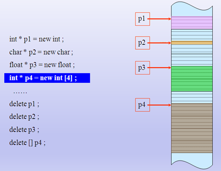

## 动态分配内存

1）在软件开发过程中，常常需要动态地分配和撤销内存空间，例如对动态链表中结点的插入与删除。在C语言中是利用库函数malloc和free来分配和撤销内存空间的。C++提供了较简便而功能较强的运算符new和delete来取代malloc和free函数。

注意： new和delete是运算符，不是函数，因此执行效率高。

2）虽然为了与C语言兼容，C++仍保留malloc和free函数，但建议用户不用malloc和free函数，而用new和delete运算符。new运算符的例子：

```C++
new int;  //开辟一个存放整数的存储空间，返回一个指向该存储空间的地址(即指针)
new int(100);  //开辟一个存放整数的空间，并指定该整数的初值为100，返回一个指向该存储空间的地址
new char[10];  //开辟一个存放字符数组(包括10个元素)的空间，返回首元素的地址
new int[5][4];  //开辟一个存放二维整型数组(大小为5*4)的空间，返回首元素的地址
//开辟一个存放单精度数的空间，并指定该实数的初值为//3.14159，将返回的该空间的地址赋给指针变量p
float *p=new float (3.14159);  
```
3）new和delete运算符使用的一般格式为：


用new分配数组空间时不能指定初值。如果由于内存不足等原因而无法正常分配空间，则new会返回一个空指针NULL，用户可以根据该指针的值判断分配空间是否成功。



- new一个对象。new 创建对象时返回的是直接带类型信息的指针，会自动执行构造函数进行初始化，从自由存储区（free store）分配内存。

```C++
char *c = new char;
int *p = new int(10);
double *d = new double();
// new 创建对象数组
int *pi = new int[10]();
char *pc = new char[10];
```

- delete 会自动执行析构函数

```C++
delete p;
delete []arr;
```

- malloc() 返回的是void *类型的指针，从堆区（heap）分配内存
- free()

## 类对象的动态建立和释放

使用类名定义的对象都是静态的，在程序运行过程中，对象所占的空间是不能随时释放的。但有时人们希望在需要用到对象时才建立对象，在不需要用该对象时就撤销它，释放它所占的内存空间以供别的数据使用。这样可提高内存空间的利用率。

C++中，可以用new运算符动态建立对象，用delete运算符撤销对象。比如：
```C++
Box *pt;  //定义一个指向Box类对象的指针变量pt
pt = new Box;  //在pt中存放了新建对象的起始地址
```
在程序中就可以通过pt访问这个新建的对象。如
```C++
cout<<pt->height;  //输出该对象的height成员
cout<<pt->volume( );  //调用该对象的volume函数，计算并输出体积
```
C++还允许在执行new时，对新建立的对象进行初始化。如
```C++
Box *pt=new Box(12,15,18);
```
这种写法是把上面两个语句(定义指针变量和用new建立新对象)合并为一个语句，并指定初值。这样更精炼。 

新对象中的height，width和length分别获得初值12,15,18。调用对象既可以通过对象名，也可以通过指针。

在执行new运算时，如果内存量不足，无法开辟所需的内存空间，目前大多数C++编译系统都使new返回一个0指针值。只要检测返回值是否为0，就可判断分配内存是否成功。

ANSI C++标准提出，在执行new出现故障时，就“抛出”一个“异常”，用户可根据异常进行有关处理。但C++标准仍然允许在出现new故障时返回0指针值。当前，不同的编译系统对new故障的处理方法是不同的。

在不再需要使用由new建立的对象时，可以用delete运算符予以释放。如
```C++
delete pt; //释放pt指向的内存空间
```
这就撤销了pt指向的对象。此后程序不能再使用该对象。

如果用一个指针变量pt先后指向不同的动态对象，应注意指针变量的当前指向，以免删错了对象。在执行delete运算符时，在释放内存空间之前，自动调用析构函数，完成有关善后清理工作。

```C++
#include <iostream>
using namespace std;

//分配基础类型
void main01()
{
	int *p = (int *)malloc(sizeof(int));
	*p = 10;
	//free(p);
	delete p;

	int *p2 = new int; //分配基础类型
	*p2 = 20;
	free(p2);
	
	int *p3 = new int(30);
	printf("*p3:%d \n", *p3);
	//delete p3;
	free(p3);

	cout<<"hello..."<<endl;
	system("pause");
	return ;
}

//分配数组变量
void main02()
{
	//c语言分配数组
	int *p = (int *)malloc(sizeof(int) * 10);  //int array[10];
	p[0] = 1;
	//free(p);
	delete[] p;

	//c++分配数组 
	int *pArray = new int[10] ;
	pArray[1] = 2;
	//delete [] pArray; //数组不要把[] 忘记
	free(pArray);

	char *pArray2 = new char[25] ; //char buf[25]
	delete [] pArray2;

	system("pause");
	return ;
}

class Test
{
public:
	Test(int _a)
	{
		a = _a;
		cout<<"构造函数执行" <<endl;
	}

	~Test()
	{
		cout<<"析构函数执行" <<endl;
	}

protected:
private:
	int a;
};

//分配对象new delete
//相同和不同的地方 new能执行类型构造函数 delete操作符能执行类的析构函数

void main()
{
	//c 
	Test *pT1 = (Test *)malloc(sizeof(Test));
	//free(pT1);
	delete pT1;

	//c++
	Test *pT2 = new Test(10);
	//delete pT2;
	free(pT2);
  
	system("pause");
}
```
malloc不会调用类的构造函数，Free不会调用类的析构函数。