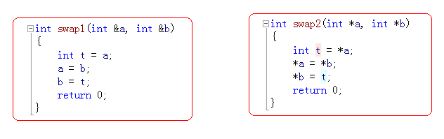
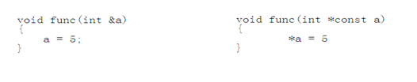
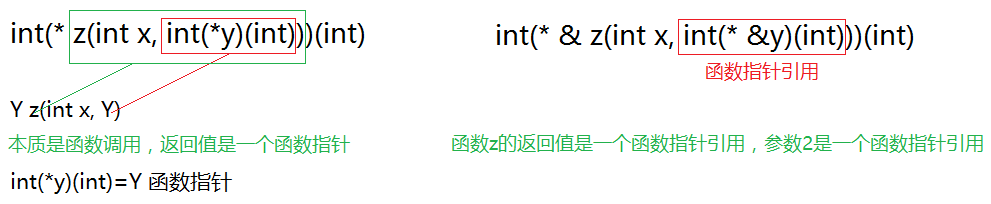

引用是隐式的指针，引用就是给一个变量起一个别名，用“&”标识符来标识。使用引用就是直接操作变量。引用作为函数参数时，实参不必用变量的地址，而直接用变量名。

```c
const int &b = a; // const引用
```

变量名回顾

- 变量名实质上是一段连续存储空间的别名，是一个标号(门牌号) 
- 程序中通过变量来申请并命名内存空间   
- 通过变量的名字可以使用存储空间

## 引用概念

- 在C++中新增加了引用的概念
- 引用可以看作一个已定义变量的别名
- 引用的语法：`Type& name = var;`
- 引用做函数参数那？（引用作为函数参数声明时不进行初始化）

```C++
void main01()
{
	int a = 10; // c编译器分配4个字节内存，a内存空间的别名
	int &b = a;  // b就是a的别名
	a =11; // 直接赋值
	{
		int *p = &a;
		*p = 12;
		printf("a %d \n",a);
	}
	b  = 14; 
	printf("a:%d b:%d", a, b);
	system("pause");
}
```

## 引用是C++的概念

属于C++编译器对C的扩展

```c
// 问题：C中可以编译通过吗？
int main()
{
	int a = 0;
	int &b = a; //int * const b = &a 
     b = 11;  //*b = 11;

	return 0;
}
```

结论：请不要用C的语法考虑 b=11

## 引用做函数参数

普通引用在声明时必须用其它的变量进行初始化，引用作为函数参数声明时不进行初始化

## 引用的意义

- 引用作为其它变量的别名而存在，因此在一些场合可以代替指针
- 引用相对于指针来说具有更好的可读性和实用性



## 引用本质思考

## 引用的本质

引用在C++中的内部实现是一个常指针：`Type& name`  ↔ `Type* const name`
C++编译器在编译过程中使用常指针作为引用的内部实现，因此引用所占用的空间大小与指针相同。
从使用的角度，引用会让人误会其只是一个别名，没有自己的存储空间。这是C++为了实用性而做出的细节隐藏。



## 引用结论

（1）引用在实现上，只不过是把：间接赋值成立的三个条件的后两步和二为一

当实参传给形参引用的时候，只不过是c++编译器帮我们程序员手工取了一个实参地址，传给了形参引用（常量指针）

（2）当我们使用引用语法的时，我们不去关心编译器引用是怎么做的

当我们分析奇怪的语法现象时，我们才去考虑c++编译器是怎么做的

## 函数返回值是引用(引用当左值)

C++引用使用时的难点：

当函数返回值为引用时

- 若返回栈变量
- 不能成为其它引用的初始值
- 不能作为左值使用

若返回静态变量或全局变量

- 可以成为其他引用的初始值
- 即可作为右值使用，也可作为左值使用

C++链式编程中，经常用到引用，运算符重载专题

## 数组的引用

```C++
#include<iostream>
#include<stdlib.h>
//	int a[10]
//  int (&ra)[10]
//  int a[2][5]
//  int (&ra)[2][5]

void main1()
{
	int a[10] = { 1, 2, 3, 4, 5, 6, 7, 8, 9, 10 };
	int(&ra)[10](a);//引用就是给原来的变量有一个别名同一个地址
	int  i = 0;
	for (auto data: ra)//C++11的循环
	{
		data = i + 5;
		std::cout << data << std::endl;
	}
	std::cout << a << ra << std::endl;
	std::cout << &a << &ra << std::endl;

	system("pause");
}

void main2()
{
	int a[2][5] = { 1, 2, 3, 4, 5, 6, 7, 8, 9, 10 };
	int(&ra)[2][5](a);//引用二维数组
	for (int i = 0; i < 2; i++)
	{
		for (int j = 0; j < 5; j++)
		{
			std::cout << " " << ra[i][j];
		}
		std::cout << "\n";
	}
  
	std::cout << a << ra << std::endl;
	std::cout << &a << &ra << std::endl;

	system("pause");
}
```

引用数组是非法的

```C++
void main()
{
	//int *p[4];
	int a = 1, b = 2, c = 3;
	int *px[3] = { &a, &b, &c };
	//int && p [4] = {a,b,c };
	//引用数组是非法的
}
```

## 指针的引用

```C++
#include "iostream"
using namespace std;

struct Teacher
{
	char name[64];
	int age ;
};

//在被调用函数获取资源 
int getTeacher(Teacher **p)
{
	Teacher *tmp = NULL;
	if (p == NULL)
	{
		return -1;
	}
	tmp = (Teacher *)malloc(sizeof(Teacher));
	if (tmp == NULL)
	{
		return -2;
	}
	tmp->age = 33;
	// p是实参的地址  *实参的地址 去间接的修改实参的值
	*p = tmp; 
 	 return 0;
}


//指针的引用做函数参数
int getTeacher2(Teacher* &myp)
{
	//给myp赋值相当于给main函数中的pT1赋值
	myp = (Teacher *)malloc(sizeof(Teacher));
	if (myp == NULL)
	{
		return -1;
	}
	myp->age = 36;
  	return 0;
}

void FreeTeacher(Teacher *pT1)
{
	if (pT1 == NULL)
	{
		return ;
	}
	free(pT1);
}

void main()
{
	Teacher *pT1 = NULL;

	//1 c语言中的二级指针
	getTeacher(&pT1);
	cout<<"age:"<<pT1->age<<endl;
	FreeTeacher(pT1);

	//2 c++中的引用 （指针的引用）
	//引用的本质 间接赋值后2个条件 让c++编译器帮我们程序员做了。
	getTeacher2(pT1);

	cout<<"age:"<<pT1->age<<endl;
	FreeTeacher(pT1);

	system("pause");
}
```

## 函数指针的引用



```C++
int jia(int a, int b)
{
	return a + b;
}
int jian(int a, int b)
{
	return a - b;
}

void change(int(* & rp)(int,int))
{
	rp = jian;
}

void main3()
{
	int(* p)(int a, int b)(jia);
	std::cout << p(1, 2) << std::endl;
	//int(*&rp)(int a, int b)(p);//引用函数指针
  	//C语言中用指向函数指针的函数指针实现函数指针引用
	//rp=jian;//()仅仅适用于初始化

	change(p);
  
	std::cout << p(1, 2) << std::endl;
	system("pause");
}

// 函数changep的返回值是一个函数指针的引用
int(*& changep(int (*&rp)(int,int)))(int, int)
{
	rp = jian;
	return rp;
}

void main4()
{
	int(*p)(int a, int b)(jia);
	std::cout << p(1, 2) << std::endl;
	
	p = changep(p);

	std::cout << p(1, 2) << std::endl;
	system("pause");
}
```

## 右值引用

右值要么在cache，要么在寄存器，不能取地址

```C++
int  getdata(int && num)//右值引用，节约内存拷贝，内存优化所必须
{
	std::cout << num << std::endl;
	num += 10;
	return num;
}

void  main7()
{
	int a = 5;
	int b = 4;

	std::cout << getdata(a+1) << std::endl;
	system("pause");
}
```

左值和右值的转换move()

```C++
//左值，一般可以取地址就是左值
//右值某些情况可以，某些情况不可以
void main8()
{
	int a = 3;
	int b = a + 1;//右值->左值
	std::cout << getdata(std::move(a) ) << std::endl;
	//std::move将左值转换为右值，C++11
}
```

## 常引用

### 使用变量初始化const引用

在C++中可以声明const引用：`const Type& name = var;`const引用让变量拥有只读属性 

```C++
#include <iostream>
using namespace std;

//常引用的知识架构
void main1301()
{
	//普通引用
	int  a = 10;
	int &b = a;
	printf("b:%d \n", b);

	//常引用
	int  x = 20;
	const int &y = x;  //常引用 是 让变量 引用只读属性 不能通过y去修改x了
	//y = 21;

	//常引用 初始化 分为2种情况
	//1> 用变量 初始化 常引用
	{
		int x1 = 30;
		const int &y1 = x1; //用x1变量去初始化 常引用
	}
	//2> 用字面量 初始化 常量引用
	{
		const int a = 40;  //c++编译器把a放在符号表中
		int &m = 41; //普通引用 引用一个字面量 请问字面量有没有内存地址
		//引用 就是给内存取多个门牌号 (多个别名)
		//printf("&40:%d \n", &40);
		const int &m = 43;  //c++编译器 会 分配内存空间 
	}
	
	system("pause");
	return ;
}

struct Teacher
{
	char name[64];
	int age ;
};

//void printTeacher(const Teacher  * const myt)
void printTeacher(const Teacher &myt)
{
	//常引用 让 实参变量 拥有只读属性 
	//myt.age = 33;
	printf("myt.age:%d \n", myt.age);
}

void main()
{
	Teacher  t1;
	t1.age = 36;
	printTeacher(t1);

	system("pause");
	return ;
}
```

```C++
void main9()
{
	//const int num(6);
	char str[10]("hello");//限定字符串不被修改
	const char *pc(str);//指向常量的指针限定了指向的数据无法修改,+1，+2，+3
	str[3] = 'x';//可以，
	//pc[3] = 'y';
	//*(pc + 3) = 'y';
	pc = "world";
	system("pause");
}

void main10()
{
	char str[10]("hello"); 
	const char(&rstr)[10](str);//常量引用
	const char(&rrstr)[10](rstr);//引用可以给另一个引用初始化
	str[4] = 'X';
	//rstr[4] = 'Y';
}

void  main11()
{
	int(*p)(int a, int b)(jia);
	std::cout << p(1, 2) << std::endl;
	int(* const &rp)(int a, int b)(p);//引用函数指针
	//rp=jian;//（）仅仅适用于初始化
}
```

案例1：

```c++
int main()
{
	int a = 10;
	const int &b = a; 

	//int *p = (int *)&b;
	b = 11; //err
	//*p = 11; //只能用指针来改变了

	cout<<"b--->"<<a<<endl;
	printf("a:%d\n", a);
	printf("b:%d\n", b);
	printf("&a:%d\n", &a);
	printf("&b:%d\n", &b);
	system("pause");
	return 0;
}
```
案例2：

```C++
void main41()
{
	int a = 10;

	const int &b = a; //const引用 使用变量a初始化
	a = 11;
	//b = 12; //通过引用修改a,对不起修改不了
	system("pause");
}


struct Teacher1
{
	char name[64];
	int age;
};

void printTe2(const Teacher1 *const pt)
{

}

//const引用让变量(所指内存空间)拥有只读属性
void printTe(const Teacher1 &t)
{
	//t.age  = 11;
}
void main42()
{
	Teacher1 t1;
	t1.age = 33;
	printTe(t1);
	system("pause");
}
```
### 使用字面量常量初始化const引用

```C++
void main()
{
	//普通引用
	int a = 10;
	int &b = a;
	//常量引用 ：让变量引用只读属性
	const int &c = a;  

	//常量引用初始化 分为两种
	//1 用变量 初始化 常量引用
	{
		int x = 20;
		const int& y = x;
		printf("y:%d \n", y);
	}

	//2 用常量 初始化 常量引用
	{
		//int &m = 10; //引用是内存空间的别名 字面量10没有内存空间 没有方法做引用
		const int &m = 10; 
	}
	
	system("pause");
	return ;
}
```

## const引用结论  

1）`Const & int e`  相当于 `const int * const e`
2）普通引用 相当于 `int *const e1`
3）当使用常量（字面量）对const引用进行初始化时，C++编译器会为常量值分配空间，并将引用名作为这段空间的别名
4）使用字面量对const引用初始化后，将生成一个只读变量

## const修饰类