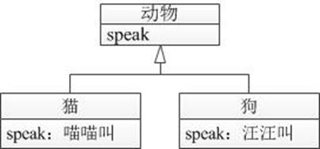
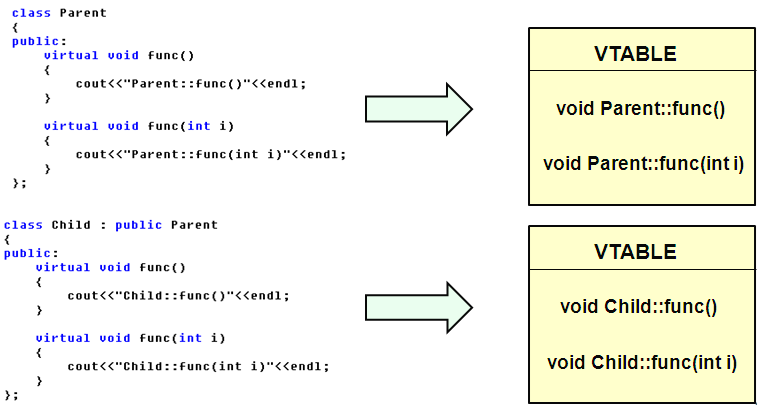
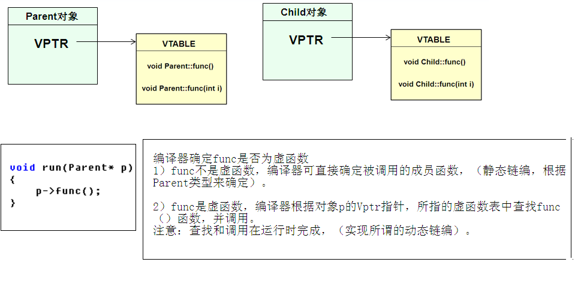
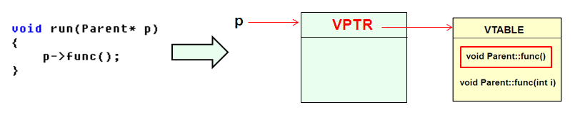
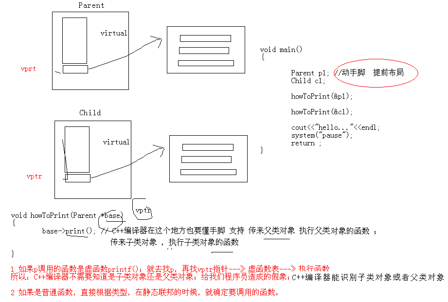
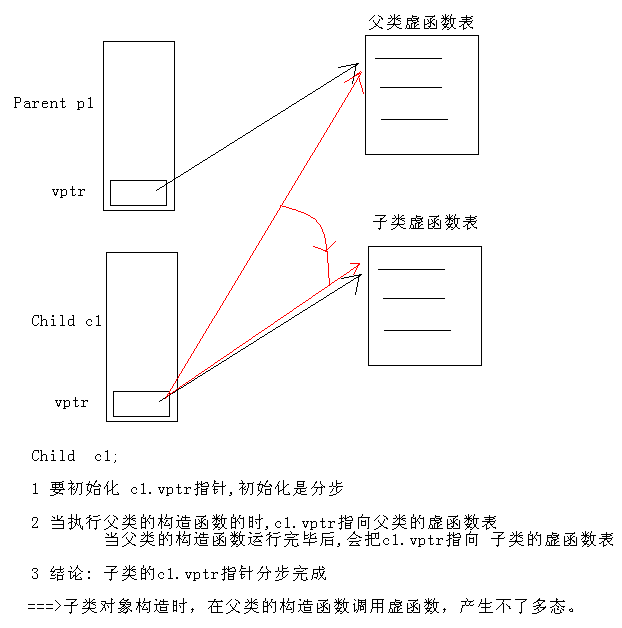
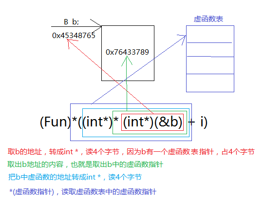

## 多态性概念

多态是面向对象程序设计的重要特征之一，它与封装、继承共同构成了面向对象程序设计的三大特征。多态是指不同的对象接收到相同的操作指令时，产生不同的动作。在程序中表现为，不同功能的函数在不同的类中具有相同的函数名，相应的类对象在调用同名函数时会执行不同的动作。



在面向对象程序设计中，多态性主要体现在：向不同的对象发送同一个消息，不同对象接收到消息时会产生不同的行为，即每个对象以自己的方式响应同样的消息。

C++程序设计中，消息即对类的成员函数的调用，不同的行为是指不同的实现，也就是调用不同的函数。因此，多态的本质是指同一个函数的多种形态。

C++语言支持的多态可以按照实现的时机分为编译时多态和运行时多态两种：

- 编译时多态又称静态联编，是指程序在编译时就可确定的多态性，通过重载机制实现。
- 运行时多态称为动态联编，是指必须在运行中才可确定的多态性，通过继承和虚函数实现。

## 虚函数

虚函数是运行时多态，若某个基类函数声明为虚函数，则其公有派生类将定义与其基类虚函数原型相同的函数，这时，当使用基类指针或基类引用操作派生类对象时，系统会自动用派生类中的同名函数代替基类虚函数。

```c++
#include <iostream>
using namespace std;

class Animal //定义基类Animal
{
public:
	//基类speak()函数
	void speak(){ cout << "animal language!" << endl; }
};
class Cat :public Animal //定义派生类Cat
{
public:
	//定义与基类同名的函数speak()
	void speak(){ cout << "cat language: miaomiao!" << endl; }
};
int main()
{
	Cat cat;                //定义派生类对象cat
	Animal *panimal = &cat; //定义基类指针并指向派生类对象
	panimal->speak();       //通过指针调用speak()函数
	system("pause");
	return 0;
}
```

对于普通成员函数，派生类可以重新定义从基类继承下来的虚函数，从而形成该函数在派生类中的专门版本。派生类对基类虚函数重新定义后，仍作为虚函数可在更下层派生类中被重新定义。通常，在派生类中重新定义虚函数时，virtual可以不出现，但最好保留，以增强程序的可读性。

有了虚函数后，通过基类指针或基类引用调用派生类对象的虚函数时，会实际调用指针或引用指向的派生类对象中那个重定义版本，即操作派生类的虚函数。

```c++
#include <iostream>
using namespace std;

class Animal //定义基类Animal
{
public:
	//定义虚函数speak()
	virtual void speak(){ cout << "animal language!" << endl; }
};
class Cat :public Animal //定义派生类Cat
{
public:
	//定义Cat类自己的虚函数speak()
	virtual void speak(){ cout << "cat language: miaomiao!" << endl; }
};
int main()
{
	Cat cat;                //定义派生类对象cat
	Animal *panimal = &cat; //定义基类指针并初始化为cat地址
	Animal &ref = cat;      //定义基类引用，初始化为cat
	panimal->speak();       //通过panimal指针调用speak()函数
	ref.speak();            //通过引用ref调用speak()函数
	system("pause");
	return 0;
}
```

带有虚函数时，C++编译器的操作步骤：

- 为各个类建立虚函数表，若无虚函数则不操作。
- 暂不连接虚函数，只是将各个虚函数地址放入虚函数表。
- 连接各静态函数。

## 虚析构函数

在C++中，不能声明虚构造函数，因为构造函数执行时，对象还没有构造好，不可按虚函数方式进行调用，但可以声明虚析构函数。

虚析构函数是为了解决基类的指针指向派生类对象，并用基类的指针销毁派生类对象的应用产生的。通常，使用基类指针指向一个new生成的派生对象，通过delete销毁基类指针指向的派生类对象时，有以下两种情况：

- 如果基类析构函数不是虚析构函数，则只会调用基类的析构函数，派生类的析构函数不被调用，此时派生类中申请的资源不被回收。
- 如果基类析构函数为虚析构函数，则释放基类指针指向的对象时会调用基类及派生类析构函数，派生类对象中的所有资源被回收。

虚析构函数的声明形式也是在析构函数名前使用virtual关键字，具体声明形式如下所示：

```c++
#include <iostream>
using namespace std;

class Animal  //定义基类Animal
{
public:
	Animal(char *name);                  //声明基类构造函数
	void print_name();                   //声明print_name()函数
	virtual void print_color();          //声明虚函数print_color()
	virtual void speak();                //声明虚函数speak()
	virtual ~Animal();                   //声明析构函数
private:
	char *m_pAnimalName;                 //存放动物名称的数据成员
};
Animal::Animal(char *name)               //Animal类构造函数的定义
{
	int len = strlen(name) + 1;
	m_pAnimalName = new char[len];      //为m_pAnimalName指针开辟空间
	strcpy_s(m_pAnimalName, len, name); //存入动物名称
}
Animal::~Animal()                       //Animal类析构函数
{
	cout << "Animal destructor!" << endl;
	if (m_pAnimalName){
		delete[] m_pAnimalName;         //释放空间
	}
}
void Animal::print_name()               //显示动物名称
{
	cout << "name:" << m_pAnimalName << endl;
}
//定义虚函数print_color()，本函数在基类中为空函数，需要在派生类中重定义
void Animal::print_color()
{

}
void Animal::speak()
{
	cout << "animal language!" << endl;
}

class Cat :public Animal                //定义派生类Cat
{
public:
	Cat(char* name, char *catcolor);
	virtual void print_color();         //声明虚函数print_color()
	virtual void speak();               //声明虚函数speak()
	virtual ~Cat();
private:
	char *m_pCatColor;                  //存放猫的颜色的数据成员
};
Cat::Cat(char* name, char *color) :Animal(name) //Cat类构造函数的定义
{
	cout << "Cat constructor!" << endl;
	m_pCatColor = new char[strlen(color) + 1];  //为m_pCatcolor指针开辟空间
	strcpy_s(m_pCatColor, strlen(color) + 1, color); //存入描述猫颜色自的字符串
}
Cat::~Cat() //Cat类析构函数的定义
{
	cout << "Cat destructor!" << endl;
	if (m_pCatColor){
		delete[] m_pCatColor; //释放m_pCatcolor指向的空间
	}
}
void Cat::print_color()       //print_color()虚函数的实现
{
	cout << "cat color :" << m_pCatColor << endl;
}
void Cat::speak()             //speak()虚函数的实现
{
	cout << "cat language: miaomiao!" << endl;
}
int main()
{
	Animal *p[2]; //定义基类Animal指针数组
	int i;
	p[0] = new Cat("short_haired_cat", "white");//通过new生成派生类Cat对象
	p[0]->print_name();
	p[0]->print_color();
	p[0]->speak();
	p[1] = new Cat("persian_cat", "brown");    //通过new生成派生类Cat对象
	p[1]->print_name();
	p[1]->print_color();

	for (i = 0; i < 2; i++)
		delete p[i]; //通过delete释放派生类对象
	system("pause");
	return 0;
}
```

## 纯虚函数

在定义一个表示抽象概念的基类时，有时无法或者不需要给出某些成员函数的具体实现，函数的实现在派生类中完成，基类中这样的函数声明为纯虚函数。

与虚函数相比，纯虚函数没有函数体，其作用是在基类中为派生类保留一个函数接口，方便派生类根据需要对它实现，实现多态。

C++中纯虚函数的声明形式如下所示：

```c++
virtual 函数返回值类型 函数名（参数表） =  0;
```

若在一个类中声明了纯虚函数，但是在其派生类中没有实现该函数，则该函数在派生类中仍为纯虚函数。

```c++
#include <iostream>
using namespace std;

class Animal //定义基类Animal
{
public:
	Animal(char *name);                  //声明基类构造函数
	void print_name();                   //声明print_name()函数
	virtual void print_color() = 0;      //声明纯虚函数print_color()
	virtual ~Animal();                   //声明虚析构函数
private:
	char *m_pAnimalName;                 //存放动物名称的数据成员
};

Animal::Animal(char *name)                //Animal类构造函数的定义
{
	int len = strlen(name) + 1;
	m_pAnimalName = new char[len];       //为m_pAnimalName指针开辟空间
	strcpy_s(m_pAnimalName, len, name);  //存入动物名称
}
Animal::~Animal()                        //Animal类析构函数
{
	cout << "Animal destructor!" << endl;
	if (m_pAnimalName){
		delete[]m_pAnimalName;           //释放空间
	}
}
void Animal::print_name()                //定义print_name()函数
{
	cout << "name:" << m_pAnimalName << endl;
}
class Cat :public Animal                //定义派生类Cat
{
public:
	Cat(char* name, char *catcolor);
	virtual void print_color();                 //声明虚函数print_color()
	virtual ~Cat();                             //声明虚析构函数
private:
	char *m_pCatColor;                          //存放猫颜色的数据成员
};
Cat::Cat(char* name, char *color) :Animal(name) //Cat类构造函数的定义
{
	cout << "Cat constructor!" << endl;
	m_pCatColor = new char[strlen(color) + 1];    //为m_pCatColor指针开辟空间
	strcpy_s(m_pCatColor, strlen(color) + 1, color);  //存入描述猫颜色的字符串
}
Cat::~Cat()                                       //Cat类析构函数的定义
{
	cout << "Cat destructor!" << endl;
	if (m_pCatColor){
		delete[]m_pCatColor;                      //释放m_pCatColor指向的空间
	}
}
void Cat::print_color()                           //print_color()虚函数的实现
{
	cout << "cat color :" << m_pCatColor << endl;
}
int main()
{
	Animal *p;   //定义基类Animal指针数组

	p = new Cat("short_haired_cat", "white");   //通过new生成派生类Cat对象
	p->print_name();
	p->print_color();
	cout << "--------------------" << endl;
	delete p; //通过delete释放派生类对象
	system("pause");
	return 0;
}
```

## 抽象类

如果一个类中至少包含一个纯虚函数，则该类称为抽象类，因此抽象类是随着纯虚函数出现的。抽象类的主要作用是建立公共接口，在各派生类中完成各自的实现，更好地发挥多态的特性。抽象类的定义形式如下所示：

对于纯虚函数和抽象类，使用时应注意以下情况：

- 抽象类只能做基类来派生新类，不能声明抽象类对象，但可以声明抽象类指针或引用，通过指针或引用操作派生类对象。
- 抽象类中可以有多个纯虚函数，在派生类中应该实现这些纯虚函数，使得派生类不再是抽象类。派生类中若没有实现所有纯虚函数，则未重新定义的函数仍为纯虚函数，派生类也是抽象类。

```c++
#include<iostream>  
using namespace std;
const double PI = 3.14159;
class Shapes //定义表示形状的抽象类  
{
public:
	Shapes(int x, int y = 0);
	virtual ~Shapes();
	virtual void disp() = 0;  //声明纯虚函数，显示形状面积  
protected:
	int m_nX, m_nY;
};
Shapes::Shapes(int x, int y) //定义Shapes类的构造函数
{
	m_nX = x;
	m_nY = y;
}
Shapes::~Shapes()  //定义Shapes类的析构函数
{
	cout << "Shapes destructor!" << endl;
}
class Square :public Shapes  //矩形派生类
{
public:
	Square(int square_x, int square_y);
	~Square();
	void disp();
};
//矩形类Square构造函数的实现
Square::Square(int square_x, int square_y) :Shapes(square_x, square_y)
{
}
Square::~Square() //矩形类Square析构函数的实现
{
	cout << "Square destructor!" << endl;
}
void Square::disp() //对基类纯虚函数的实现
{
	cout << "square area:" << m_nX * m_nY << endl;
}
class Circle :public Shapes //圆形派生类
{
public:
	Circle(int radius);
	~Circle();
	void disp();  //与基类纯虚函数同名的函数
};
Circle::Circle(int radius) :Shapes(radius) //派生类Circle构造函数的实现
{
}
Circle::~Circle() //派生类Circle析构函数的实现
{
	cout << "Circle destructor!" << endl;
}
void Circle::disp() //对基类纯虚函数的实现
{
	cout << "circle area:" << PI * m_nX * m_nX << endl;
}
int main()
{
	Shapes *ptr[2]; //定义基类指针数组  

	ptr[0] = new Square(10, 5); //通过new创建派生类Square对象
	ptr[0]->disp();
	ptr[1] = new Circle(10);    //通过new创建派生类Circle对象
	ptr[1]->disp();
	for (int i = 0; i < 2; i++)
		delete ptr[i];
	system("pause");
	return 0;
}
```

## 内部类

在C++中允许在类内部定义类，这样的类称为内部类，这个内部类所在的类称为外部类。内部类可以作为外部类的基础，外部类在内部类基础上扩充新的功能并且不会相互影响。

```c++
#include <iostream>
using namespace std;

class Outer  //定义外部类Outer
{
public:
	class  Inner{  //定义内部类Inner
	private:
		int inner_n;
	public:
		//内部类成员函数set_outer_n()通过外部类引用参数访问外部类私有成员outer_n
		void set_outer_n(Outer &ref_outer)	{ ref_outer.outer_n = 10; }
		void set_inner_n() { inner_n = 100; }
		//内部类成员函数show()通过外部类引用参数访问外部类成员函数show()
		void show(Outer &ref_outer)
		{
			ref_outer.show();
			cout << "inner_n = " << inner_n << endl;
		}
	};                                   //内部类定义结束
	//Inner inner_obj;                   //定义内部类对象inner
	//外部类成员函数
	void show() { cout << "outer_n = " << outer_n << endl; }
private:
	int outer_n;
};

int main()
{
	Outer outer_obj;                  //定义外部类对象
	Outer::Inner inner_obj;           //使用作用域限定符定义内部类对象

	inner_obj.set_inner_n();          //调用内部类函数set_inner_n()
	inner_obj.set_outer_n(outer_obj); //调用内部类函数set_outer_n()
	inner_obj.show(outer_obj);        //调用内部类函数show()

	system("pause");
	return 0;
}
```

## 多态原理探究

理论知识：

- 当类中声明虚函数时，编译器会在类中生成一个虚函数表
- 虚函数表是一个存储类成员函数指针的数据结构，即函数指针数组
- 虚函数表是由编译器自动生成与维护的
- virtual成员函数会被编译器放入虚函数表中
- 当存在虚函数时，每个对象中都有一个指向虚函数表的指针（C++编译器给父类对象、子类对象提前布局vptr指针；当进行`howToPrint(Parent *base)`函数时，C++编译器不需要区分子类对象或者父类对象，只需要在base指针中，找vptr指针即可。）
- VPTR一般作为类对象的第一个成员 

## 多态的实现原理

C++中多态的实现原理

- 当类中声明虚函数时，编译器会在类中生成一个虚函数表
- 虚函数表是一个存储类成员函数指针的数据结构，即函数指针数组
- 虚函数表是由编译器自动生成与维护的
- virtual成员函数会被编译器放入虚函数表中
- 存在虚函数时，每个对象中都有一个指向虚函数表的指针(vptr指针)
- 动态绑定/动态联编
- 提前布局vptr指针







说明1：通过虚函数表指针VPTR调用重写函数是在程序运行时进行的，因此需要通过寻址操作才能确定真正应该调用的函数。而普通成员函数是在编译时就确定了调用的函数。在效率上，虚函数的效率要低很多。

说明2：出于效率考虑，没有必要将所有成员函数都声明为虚函数

说明3 ：C++编译器，执行HowToPrint函数，不需要区分是子类对象还是父类对象



## 如何证明vptr指针的存在

```c++
#include <iostream>
using namespace std;

class Parent1
{
public:
	Parent1(int a=0)
	{
		this->a = a;
	}

	void print() 
	{
		cout<<"我是Parent1"<<endl;
	}
private:
	int a;
};

class Parent2
{
public:
	Parent2(int a=0)
	{
		this->a = a;
	}

	virtual void print()  
	{
		cout<<"我是Parent2"<<endl;
	}
private:
	int a;
};

void main()
{
	printf("sizeof(Parent):%d sizeof(Parent2):%d \n", sizeof(Parent1), sizeof(Parent2));
	cout<<"hello..."<<endl;
	system("pause");
	return ;
}
```

## 构造函数中能调用虚函数，实现多态吗？

对象中的VPTR指针什么时候被初始化？

- 对象在创建时，由编译器对VPTR指针进行初始化 
- 只有当对象的构造完全结束后VPTR的指向才最终确定
- 父类对象的VPTR指向父类虚函数表
- 子类对象的VPTR指向子类虚函数表



## 虚函数表的调用

虚函数比较容易出问题，在大型项目中，需要经常调试虚函数。

虚函数表一般在类的开头，父类的按照顺序在前，子类在后



```C++
#include <iostream>
using namespace std;

class H
{
	virtual void M()
	{
		cout << "H::M" << endl;
	}
};

class A
{
	//int num;
	virtual void g()
	{
		cout << "A::g" << endl;
	}
  
private:
	virtual void f()
	{
		cout << "A::f" << endl;
	}
  
	virtual void j()
	{
		cout << "A::j" << endl;
	}
};

class B : public A,public H
{
	void g()
	{
		cout << "B::g" << endl;
	}
  
	virtual void o()
	{
		cout << "B::o" << endl;
	}
  
	virtual void h()
	{
		cout << "B::h" << endl;
	}
};

typedef void(*Fun)(void);

void main()
{
	cout << sizeof(A) << endl; // 4个字节，有一个指向虚函数表的指针
	cout << sizeof(H) << endl; // 4
	cout << sizeof(B) << endl; // 8 两个虚函数表

	B b;
	Fun pFun;

	for (int i = 0; i < 5; i++)
	{
		pFun = (Fun)*((int*)* (int*)(&b) + i);
		pFun();
	}
	Fun pFun1 = (Fun)*((int *)*((int*)(&b) + 1));
	pFun1(); // H::M

	cin.get();
}
```

运行结果

```
4
4
8
B::g
A::f
A::j
B::o
B::h
H::M
```