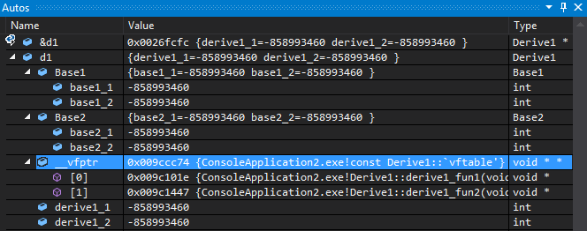

## 前言

大家都应该知道C++的精髓是虚函数吧? 虚函数带来的好处就是: 可以定义一个基类的指针，其指向一个继承类，当通过基类的指针去调用函数时，可以在运行时决定该调用基类的函数还是继承类的函数。 虚函数是实现多态(动态绑定)/接口函数的基础。 可以说: 没有虚函数，C++将变得一无是处!

既然是C++的精髓，那么我们有必要了解一下它的实现方式吗? 有必要! 既然C++是从C语言的基础上发展而来的，那么我们可以尝试用C语言来模拟实现吗? 有可能! 接下来，就是我一步一步地来解析C++的虚函数的实现方式，以及用C语言对其进行的模拟。

## C++对象的内存布局

要想知道C++对象的内存布局，可以有多种方式，比如：

1. 输出成员变量的偏移，通过offsetof宏来得到
2. 通过调试器查看，比如常用的VS

### 只有数据成员的对象

类实现如下：

```c++
class Base1
{
public:
    int base1_1;
    int base1_2;
};
```

对象大小及偏移：

| sizeof(Base1)            | 8    |
| ------------------------ | ---- |
| offsetof(Base1, base1_1) | 0    |
| offsetof(Base1, base1_2) | 4    |

可知对象布局：


可以看到，成员变量是按照定义的顺序来保存的，最先声明的在最上边，然后依次保存!

类对象的大小就是所有成员变量大小之和。

### 没有虚函数的对象

类实现如下：

```c++
class Base1
{
public:
    int base1_1;
    int base1_2;

    void foo(){}
};
```

结果如下：

| sizeof(Base1)            | 8    |
| ------------------------ | ---- |
| offsetof(Base1, base1_1) | 0    |
| offsetof(Base1, base1_2) | 4    |

和前面的结果是一样的? 不需要有什么疑问对吧?		

因为如果一个函数不是虚函数，那么他就不可能会发生动态绑定，也就不会对对象的布局造成任何影响。		

当调用一个非虚函数时，那么调用的一定就是当前指针类型拥有的那个成员函数。 这种调用机制在编译时期就确定下来了。

### 拥有仅一个虚函数的类对象

类实现如下：

```c++
class Base1
{
public:
    int base1_1;
    int base1_2;

    virtual void base1_fun1() {}
};
```

结果如下：

| sizeof(Base1)            | 12   |
| ------------------------ | ---- |
| offsetof(Base1, base1_1) | 4    |
| offsetof(Base1, base1_2) | 8    |

咦? 多了4个字节? 且 `base1_1` 和 `base1_2` 的偏移都各自向后多了4个字节!

说明类对象的最前面被多加了4个字节的"东东"，what's it?

现在，我们通过VS2013来瞧瞧类Base1的变量b1的内存布局情况：

(由于我没有写构造函数，所以变量的数据没有根据，但虚函数是编译器为我们构造的，数据正确!)

(Debug模式下，未初始化的变量值为 0xCCCCCCCC，即：-858983460)


看到没? base1_1前面多了一个变量 __vfptr(常说的虚函数表vtable指针)，其类型为`void**`，这说明它是一个`void*`指针(注意:不是数组)。

再看看[0]元素，其类型为`void*`，其值为 `ConsoleApplication2.exe!Base1::base1_fun1(void)`，这是什么意思呢? 

如果对WinDbg比较熟悉，那么应该知道这是一种惯用表示手法，它就是指 `Base1::base1_fun1()` 函数的地址。

可得，__vfptr的定义伪代码大概如下：

```c++
void*   __fun[1] = { &Base1::base1_fun1 };
const void**  __vfptr = &__fun[0];
```

值得注意的是：

1. 上面只是一种伪代码方式，语法不一定能通过。

2. 该类的对象大小为12个字节，大小及偏移信息如下：

   | sizeof(Base1)     | 12   |
   | ----------------- | ---- |
   | offsetof(__vfptr) | 0    |
   | offsetof(base1_1) | 4    |
   | offsetof(base1_2) | 8    |

3. 大家有没有留意这个`__vfptr`? 为什么它被定义成一个指向指针数组的指针，而不是直接定义成一个指针数组呢?我为什么要提这样一个问题? 因为如果仅是一个指针的情况，您就无法轻易地修改那个数组里面的内容，因为它并不属于类对象的一部分。属于类对象的，仅是一个指向虚函数表的一个指针`__vfptr`而已，下一节我们将继续讨论这个问题。

4. 注意到`__vfptr`前面的const修饰。 它修饰的是那个虚函数表，而不是`__vfptr`。

现在的对象布局如下：


虚函数指针__vfptr位于所有的成员变量之前定义。

注意到: 我并未在此说明__vfptr的具体指向，只是说明了现在类对象的布局情况。

接下来看一个稍微复杂一点的情况，我将清楚地描述虚函数表的构成。

### 拥有多个虚函数的类对象

和前面一个例子差不多，只是再加了一个虚函数。 定义如下：

```c++
class Base1
{
public:
    int base1_1;
    int base1_2;

    virtual void base1_fun1() {}
    virtual void base1_fun2() {}
};
```

大小以及偏移信息如下：


有情况，多了一个虚函数，类对象大小却依然是12个字节!

再来看看VS形象的表现：


呀，`__vfptr`所指向的函数指针数组中出现了第2个元素，其值为Base1类的第2个虚函数`base1_fun2()`的函数地址。

现在，虚函数指针以及虚函数表的伪定义大概如下：

```c++
void* __fun[] = { &Base1::base1_fun1, &Base1::base1_fun2 };
const void** __vfptr = &__fun[0];
```

通过上面两张图表，我们可以得到如下结论：

- 更加肯定前面我们所描述的: __vfptr只是一个指针，它指向一个函数指针数组(即: 虚函数表)
- 增加一个虚函数，只是简单地向该类对应的虚函数表中增加一项而已，并不会影响到类对象的大小以及布局情况

前面已经提到过: __vfptr只是一个指针，它指向一个数组，并且: 这个数组没有包含到类定义内部，那么它们之间是怎样一个关系呢?

不妨，我们再定义一个类的变量b2，现在再来看看__vfptr的指向:


通过Watch 1窗口我们看到:

- b1和b2是类的两个变量，理所当然，它们的地址是不同的(见 &b1 和 &b2)
- 虽然b1和b2是类的两个变量，但是: 它们的__vfptr的指向却是同一个虚函数表

由此我们可以总结出：

同一个类的不同实例共用同一份虚函数表，它们都通过一个所谓的虚函数表指针__vfptr(定义为void**类型)指向该虚函数表。

是时候该展示一下类对象的内存布局情况了：


不出意外，很清晰明了地展示出来了吧?

那么问题就来了! 这个虚函数表保存在哪里呢? 其实，我们无需过分追究它位于哪里，重点是：

- 它是编译器在**编译时期**为我们创建好的，只存在一份
- 定义类对象时，编译器自动将类对象的__vfptr指向这个虚函数表

### 单继承且本身不存在虚函数的继承类的内存布局

前面研究了那么多啦，终于该到研究继承类了! 先研究单继承!

依然，简单地定义一个继承类，如下：

```c++
class Base1
{
public:
    int base1_1;
    int base1_2;

    virtual void base1_fun1() {}
    virtual void base1_fun2() {}
};

class Derive1 : public Base1
{
public:
    int derive1_1;
    int derive1_2;
};
```

我们再来看看现在的内存布局(定义为Derive1 d1)：


没错! 基类在上边，继承类的成员在下边依次定义! 展开来看看:


经展开后来看，前面部分完全就是Base1的东西: 虚函数表指针+成员变量定义。

并且，Base1的虚函数表的\[0][1]两项还是其本身就拥有的函数: `base1_fun1()` 和 `base1_fun2()`

现在类的布局情况应该是下面这样:


### 本身不存在虚函数(不严谨)但存在基类虚函数覆盖的单继承类的内存布局

标题`本身不存在虚函数`的说法有些不严谨，我的意思是说: 除经过继承而得来的基类虚函数以外，自身没有再定义其它的虚函数。

Ok，既然存在基类虚函数覆盖，那么来看看接下来的代码会产生何种影响:

```c++
class Base1
{
public:
    int base1_1;
    int base1_2;

    virtual void base1_fun1() {}
    virtual void base1_fun2() {}
};

class Derive1 : public Base1
{
public:
    int derive1_1;
    int derive1_2;

    // 覆盖基类函数
    virtual void base1_fun1() {}
};
```

可以看到，Derive1类 重写了Base1类的base1_fun1()函数，也就是常说的虚函数覆盖。现在是怎样布局的呢?


特别注意我高亮的那一行: 原本是`Base1::base1_fun1()`，但由于**继承类重写**了基类Base1的此方法，所以现在变成了`Derive1::base1_fun1()`

那么，无论是通过Derive1的指针还是Base1的指针来调用此方法，调用的都将是被继承类重写后的那个方法(函数)，多态发生了。

那么新的布局图:


### 定义了基类没有的虚函数的单继承的类对象布局

说明一下: 由于前面一种情况只会造成覆盖基类虚函数表的指针，所以接下来我不再同时讨论虚函数覆盖的情况。

继续贴代码:

```c++
class Base1
{
public:
    int base1_1;
    int base1_2;

    virtual void base1_fun1() {}
    virtual void base1_fun2() {}
};

class Derive1 : public Base1
{
public:
    int derive1_1;
    int derive1_2;

    virtual void derive1_fun1() {}
};
```

和第5类不同的是多了一个自身定义的虚函数。 和第6类不同的是没有基类虚函数的覆盖。


咦，有没有发现问题? 表面上看来几乎和第5种情况完全一样? 为嘛呢?

现在继承类明明定义了自身的虚函数，但不见了?

那么，来看看类对象的大小，以及成员偏移情况吧:


居然没有变化! 前面12个字节是Base1的，有没有觉得很奇怪?

好吧，既然表面上没办法了，我们就只能从汇编入手了，来看看调用derive1_fun1()时的代码:

```c++
Derive1 d1;
Derive1* pd1 = &d1;
pd1->derive1_fun1();
```

要注意: 我为什么使用指针的方式调用? 说明一下: 

因为如果不使用指针调用，虚函数调用是不会发生动态绑定的哦! 你若直接`d1.derive1_fun1();` ，是不可能会发生动态绑定的，但如果使用指针: `pd1->derive1_fun1();` ，那么 pd1就无从知道它所指向的对象到底是Derive1 还是继承于Derive1的对象，虽然这里我们并没有对象继承于Derive1，但是它不得不这样做，毕竟继承类不管你如何继承，都不会影响到基类，对吧?

```
; pd1->derive1_fun1();
00825466  mov         eax,dword ptr [pd1]  
00825469  mov         edx,dword ptr [eax]  
0082546B  mov         esi,esp  
0082546D  mov         ecx,dword ptr [pd1]  
00825470  mov         eax,dword ptr [edx+8]  
00825473  call        eax
```

汇编代码解释:

- 第2行: 由于pd1是指向d1的指针，所以执行此句后 eax 就是**d1的地址**
- 第3行: 又因为`Base1::__vfptr`是Base1的第1个成员，同时也是Derive1的第1个成员，那么: `&__vfptr == &d1`, clear? 所以当执行完 `mov edx, dword ptr[eax]` 后，edx就得到了__vfptr的值，也就是**虚函数表的地址**.
- 第5行: 由于是__thiscall调用，所以把this保存到ecx中。
- 第6行: 一定要注意到那个 edx+8，由于edx是虚函数表的地址，那么 edx+8将是虚函数表的第3个元素，也就是__vftable[2]!!!
- 第7行: 调用虚函数。

结果:

- 现在我们应该知道内幕了! 继承类Derive1的虚函数表被加在基类的后面! 事实的确就是这样!
- 由于Base1只知道自己的两个虚函数索引\[0][1]，所以就算在后面加上了[2]，Base1根本不知情，不会对它造成任何影响。
- 如果**基类没有虚函数**呢? 这个问题我们留到第9小节再来讨论!

最新的类对象布局表示:


### 多继承且存在虚函数覆盖同时又存在自身定义的虚函数的类对象布局

真快，该看看多继承了，多继承很常见，特别是接口类中!

依然写点小类玩玩:

```c++
class Base1
{
public:
    int base1_1;
    int base1_2;

    virtual void base1_fun1() {}
    virtual void base1_fun2() {}
};

class Base2
{
public:
    int base2_1;
    int base2_2;

    virtual void base2_fun1() {}
    virtual void base2_fun2() {}
};

// 多继承
class Derive1 : public Base1, public Base2
{
public:
    int derive1_1;
    int derive1_2;

    // 基类虚函数覆盖
    virtual void base1_fun1() {}
    virtual void base2_fun2() {}

    // 自身定义的虚函数
    virtual void derive1_fun1() {}
    virtual void derive1_fun2() {}
};
```

代码变得越来越长啦! 为了代码结构清晰，我尽量简化定义。

初步了解一下对象大小及偏移信息:


貌似，若有所思? 不管，来看看VS再想:


哇，不摆了! 一丝不挂啊! 

结论:

- 按照基类的声明顺序，基类的成员依次分布在继承中。
- 注意被我高亮的那两行，已经发生了虚函数覆盖!
- 我们自己定义的虚函数呢? 怎么还是看不见?

好吧，继承反汇编，这次的调用代码如下:

```c++
Derive1 d1;
Derive1* pd1 = &d1;
pd1->derive1_fun2();
```

反汇编代码如下:

```
; pd1->derive1_fun2();
00995306  mov         eax,dword ptr [pd1]  
00995309  mov         edx,dword ptr [eax]  
0099530B  mov         esi,esp  
0099530D  mov         ecx,dword ptr [pd1]  
00995310  mov         eax,dword ptr [edx+0Ch]  
00995313  call        eax
```

解释下，其实差不多:

- 第2行: 取d1的地址
- 第3行: 取Base1::__vfptr的值
- 第6行: 0x0C，也就是第4个元素(下标为[3])

结论:

Derive1的虚函数表依然是保存到第1个拥有虚函数表的那个基类的后面的。

看看现在的类对象布局图:


如果第1个基类没有虚函数表呢? 进入第9节!

### 如果第1个直接基类没有虚函数(表)

这次的代码应该比上一个要稍微简单一些，因为把第1个类的虚函数给去掉了!

```c++
class Base1
{
public:
    int base1_1;
    int base1_2;
};

class Base2
{
public:
    int base2_1;
    int base2_2;

    virtual void base2_fun1() {}
    virtual void base2_fun2() {}
};

// 多继承
class Derive1 : public Base1, public Base2
{
public:
    int derive1_1;
    int derive1_2;

    // 自身定义的虚函数
    virtual void derive1_fun1() {}
    virtual void derive1_fun2() {}
};
```

来看看VS的布局:


这次相对前面一次的图来说还要简单啦! Base1已经没有虚函数表了! (真实情况并非完全这样，请继续往下看!)

现在的大小及偏移情况，注意: `sizeof(Base1) == 8;`


重点是看虚函数的位置，进入函数调用(和前一次是一样的):

```c++
Derive1 d1;
Derive1* pd1 = &d1;
pd1->derive1_fun2();
```

反汇编调用代码:

```
; pd1->derive1_fun2();
012E4BA6  mov         eax,dword ptr [pd1]  
012E4BA9  mov         edx,dword ptr [eax]  
012E4BAB  mov         esi,esp  
012E4BAD  mov         ecx,dword ptr [pd1]  
012E4BB0  mov         eax,dword ptr [edx+0Ch]  
012E4BB3  call        eax
```

这段汇编代码和前面一个完全一样!，那么问题就来了! Base1 已经没有虚函数表了，为什么还是把b1的第1个元素当作__vfptr呢?

不难猜测: 当前的布局已经发生了变化，有虚函数表的基类放在对象内存前面!? ，不过事实是否属实? 需要仔细斟酌。

我们可以通过对基类成员变量求偏移来观察:


可以看到:

```
&d1==0x~d4
&d1.Base1::__vfptr==0x~d4
&d1.base2_1==0x~d8
&d1.base2_2==0x~dc
&d1.base1_1==0x~e0
&d1.base1_2==0x~e4
```

所以不难验证: 我们前面的推断是正确的，谁有虚函数表，谁就放在前面!

现在类的布局情况:


那么，如果两个基类都没有虚函数表呢?

### What if 两个基类都没有虚函数表

代码如下:

```c++
class Base1
{
public:
    int base1_1;
    int base1_2;
};

class Base2
{
public:
    int base2_1;
    int base2_2;
};

// 多继承
class Derive1 : public Base1, public Base2
{
public:
    int derive1_1;
    int derive1_2;

    // 自身定义的虚函数
    virtual void derive1_fun1() {}
    virtual void derive1_fun2() {}
};
```

前面吃了个亏，现在先来看看VS的基本布局:



可以看到，现在__vfptr已经独立出来了，不再属于Base1和Base2!

看看求偏移情况:


Ok，问题解决! 注意高亮的那两行，`&d1==&d1.__vfptr`，说明虚函数始终在最前面!

不用再废话，相信大家对这种情况已经有底了.

对象布局:


### 如果有三个基类: 虚函数表分别是有，没有，有!

这种情况其实已经无需再讨论了，作为一个完结篇...

上代码:

```c++
class Base1
{
public:
    int base1_1;
    int base1_2;

    virtual void base1_fun1() {}
    virtual void base1_fun2() {}
};

class Base2
{
public:
    int base2_1;
    int base2_2;
};

class Base3
{
public:
    int base3_1;
    int base3_2;

    virtual void base3_fun1() {}
    virtual void base3_fun2() {}
};

// 多继承
class Derive1 : public Base1, public Base2, public Base3
{
public:
    int derive1_1;
    int derive1_2;

    // 自身定义的虚函数
    virtual void derive1_fun1() {}
    virtual void derive1_fun2() {}
};
```

只需要看看偏移就行了:


只需知道: 谁有虚函数表，谁就往前靠!

## C++中父子对象指针间的转换与函数调用

讲了那么多布局方面的东东，终于到了尾声，好累呀!

通过前面的讲解内容，大家至少应该明白了各类情况下类对象的内存布局了. 如果还不会.....呃..... !

进入正题

由于继承完全拥有父类的所有，包括数据成员与虚函数表，所以：**把一个继承类强制转换为一个基类**是完全可行的.

如果有一个Derive1的指针，那么:

- 得到Base1的指针: Base1* pb1 = pd1;
- 得到Base2的指针: Base2* pb2 = pd1;
- 得到Base3的指针: Base3* pb3 = pd1;

非常值得注意的是:

这是在基类与继承类之间的转换，这种转换会自动计算偏移! 按照前面的布局方式!

也就是说，在这里极有可能: pb1 != pb2 != pb3，不要以为它们都等于 pd1

至于函数调用，我想，不用说大家应该知道了:

- 如果不是虚函数，直接调用指针对应的基本类的那个函数
- 如果是虚函数，则查找虚函数表，并进行后续的调用。虚函数表在定义时，编译器就为我们创建好了的. 所有的，同一个类，共用同一份虚函数表。