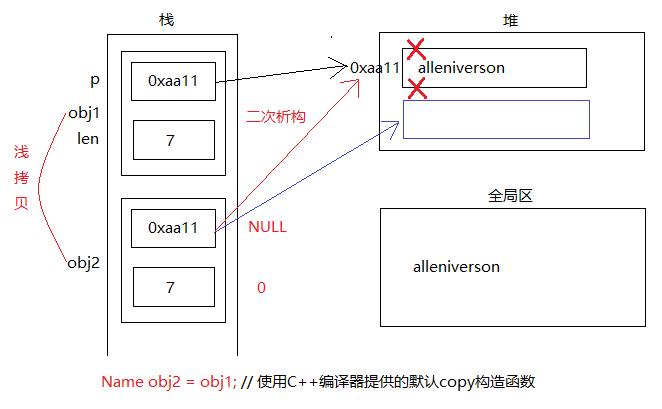
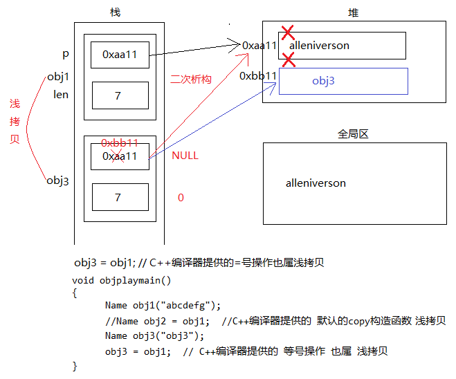

## 浅拷贝和深拷贝

- 拷贝构造函数是使用类对象的引用作为参数的构造函数，它能够将参数的属性值拷贝给新的对象，完成新对象的初始化。
- 默认复制构造函数可以完成对象的数据成员值简单的复制
- 对象的数据资源是由指针指示的堆时，默认复制构造函数仅作指针值复制

使用场景：

- 使用一个对象初始化另一个对象
- 对象作为实参传递给函数参数
- 函数返回值为类对象，创建临时对象作为返回值

浅拷贝：拷贝构造函数中只完成数据成员本身的赋值

浅拷贝程序C++提供的解决方法：显式提供copy构造函数，显式操作重载=号操作，不使用编译器提供的浅copy

```C++
#define _CRT_SECURE_NO_WARNINGS  
#include<stdio.h>  
#include<stdlib.h>  
#include<string.h>  
  
struct string  
{  
    char *p;  
    int length;  
};  
  
void main1()  
{  
    struct string str1;  
    str1.length = 10;  
    str1.p =(char *) malloc(sizeof(char)* 10);  
    strcpy(str1.p, "hello");  
    printf("\nstr1.p=%s", str1.p);//输出结果  
    struct string str2;  
    str2.length = str1.length;  
    str2.p = str1.p;  
    *(str1.p) = 'k';//浅拷贝，共享内存  
    printf("\nstr2.p=%s", str2.p);//输出结果  
    system("pause");  
}  
  
void main2()  
{  
    struct string str1;  
    str1.length = 10;  
    str1.p = (char *)malloc(sizeof(char)* 10);  
    strcpy(str1.p, "hello");  
    printf("\nstr1.p=%s", str1.p);//输出结果  
    struct string str2;  
    str2.length = str1.length;  
    str2.p =(char *) malloc(sizeof(char)* 10);  
    strcpy(str2.p, str1.p);//拷贝内存内容  
    *(str1.p) = 'k'; //深拷贝是拷贝内存的内容
    printf("\nstr2.p=%s", str2.p);//输出结果  
    system("pause");  
}  
```





```C++
#define  _CRT_SECURE_NO_WARNINGS 
#include <iostream>
using namespace std;

class  Name
{
public:
	Name(const char *myp)
	{
		m_len = strlen(myp);
		m_p =(char *) malloc(m_len + 1);
		strcpy(m_p, myp);
	}

	//Name obj2 = obj1;
	//解决方案: 手工的编写拷贝构造函数 使用深copy
	Name(const Name& obj1)
	{
		m_len = obj1.m_len;
		m_p = (char *)malloc(m_len + 1);
		strcpy(m_p, obj1.m_p);
	}

	~Name()
	{
		if (m_p != NULL)
		{
			free(m_p);
			m_p = NULL;
			m_len = 0;
		}
	}
private:
	char *m_p ;
	int m_len; 
};

//对象析构的时候 出现coredump
//对象的初始化和对象之间=号操作是两个不同的概念
void objplaymain()
{
	Name obj1("abcdefg");
	//Name obj2 = obj1;  //C++编译器提供的默认的copy构造函数，浅拷贝
	Name obj3("obj3");
	obj3 = obj1;  // C++编译器提供的等号操作也属浅拷贝
}

void main()
{
	objplaymain();
	system("pause");
	return ;
}
```