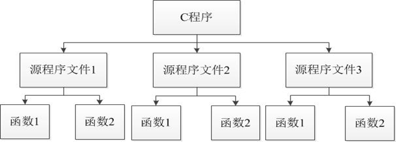
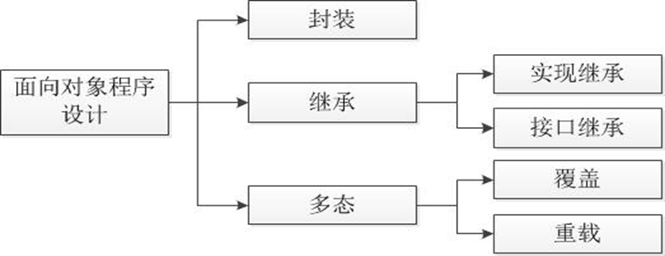

## 类与对象

C++相比于C语言最重要的发展，就是采用面向对象思想进行程序设计。

对于面向对象程序设计而言，最重要的一个特征就是数据封装。

所谓数据封装，就是通过类来实现信息的抽象及隐藏。学习了类的相关知识，才能真正走进面向对象程序设计的世界。

面向对象是相对于面向过程而言的，因此在学习面向对象之前，先要了解一下什么是面向过程？

## 面向过程程序设计

面向过程程序设计就是分析出解决问题所需要的步骤，然后用函数把这些步骤一步一步实现，使用的时候一个一个依次调用即可。

面向过程程序设计的基本设计结构如图：



面向过程程序设计的劣势：面向过程程序设计对于较为简单的需求通常能够很好地满足。如果问题比较复杂，在项目开始之初就完成模块的合理划分，往往比较困难。当数据结构改变时，所有相关的处理过程都要进行相应的修改，程序的可用性极差。

## 面向对象程序设计

面向对象程序设计描述的是客观世界中的事物，以对象代表一个具体的事物，把数据和数据的操作方法放在一起而形成的一个相互依存又不可分割的整体。

由此可见，面向对象程序设计所强调的基本原则就是直接面对客观存在的事物，将人们在日常生活中习惯的思维方式和表达方式应用在软件开发中，使软件开发从过分专业化的方法、规则中回到客观世界，回到人们通常的思维方式。面向对象的思想更适用于大型系统项目的开发。

## 面向对象的基本概念

### 对象

对象是现实世界中实际存在的事物，是构成世界的一个独立单位，它由数据（描述事物的属性）和作用于数据的操作（体现事物的行为）构成一个独立整体。

对象既可以是具体的物理实体的对象，也可以是人为的概念，或者是任何有明确边界和意义的东西。

### 类

在面向对象的方法中，类是具有相同属性和行为的一组对象的集合，它提供一个抽象的描述，其内部包括属性和行为两个主要部分。

对象描述的是现实生活中的事物，而类描述的是一系列对象的共同属性和方法。如果将汽车比作对象，那么汽车模型就相当于类。

 类是对某一类事物的抽象描述，是对象的模板；对象用于表示现实中事物的个体，是类的实例。

### 抽象

抽象是通过特定的实例抽取共同特征以后形成概念的过程。抽象化主要是为了使复杂度降低，是面向对象编程思想的本质。

## 面向对象的基本特征

### 封装

是面向对象的核心思想，将对象的属性和行为封装起来，不需要让外界知道具体实现细节，这就是封装思想。

封装就是隐藏对象的属性和实现细节，仅对外提供公开接口。

### 继承

主要描述的是类与类之间的关系，通过继承，可以在无需重新编写原有类的情况下，对原有类的功能进行扩展。

继承描述的不同类型之间的一种关系，它可以扩展不同类型的功能

### 多态

指在一个类中定义的属性和方法被其它类继承后，它们可以具有不同的数据类型或表现出不同的行为。

多态指的是同一个操作作用于不同的对象，可以产生不同的效果。

### 封装、继承、多态的简单关系



## this指针

this指针是C++实现封装的一种机制，它将对象和该对象调用的成员函数连接在一起，使得从外部看来，每个对象都拥有自己的成员函数，因此，我们可以在函数中使用this指针访问成员变量或调用成员函数。

```c++
(*this).成员变量或函数
this->成员变量或函数
```

## 访问限定符

类的定义形式中指出，描述成员需要使用相应的访问限定符。

### public

被public修饰的成员也称为公有成员，具有与类外交互的能力，可以被该类的其他成员函数及类外的其他函数使用。

### private

被private修饰的成员称为私有成员，只能由类中的函数访问，不可通过该类的对象进行访问。

### protected

被protected修饰的成员称为保护成员，其访问权限介于私有和公有之间，本类的成员和该类的派生类可以访问，类外的其他函数不可以访问。

### 三个访问限定符的作用权限

| 访问限定符     | 属性说明 | 本类   | 派生类  | 其他   |
| --------- | ---- | ---- | ---- | ---- |
| public    | 公有成员 | Yes  | Yes  | Yes  |
| protected | 保护成员 | Yes  | Yes  | No   |
| private   | 私有成员 | Yes  | No   | No   |

## 构造函数和析构函数

在C++中，如何自动进行对象初始化，并在对象撤销时，自动执行清理任务？

若想在实例化对象的同时就为对象的数据成员进行赋值，可以通过调用构造函数的方法来实现。与之对应的，如果想在操作完对象之后，回收对象资源，可以通过调用析构函数来实现。

### 什么是构造函数？什么是析构函数？

构造函数和析构函数是类的特殊成员，它们分别在对象创建和撤销时被自动调用。

构造函数是类中特殊的成员函数，用于初始化对象的数据成员。