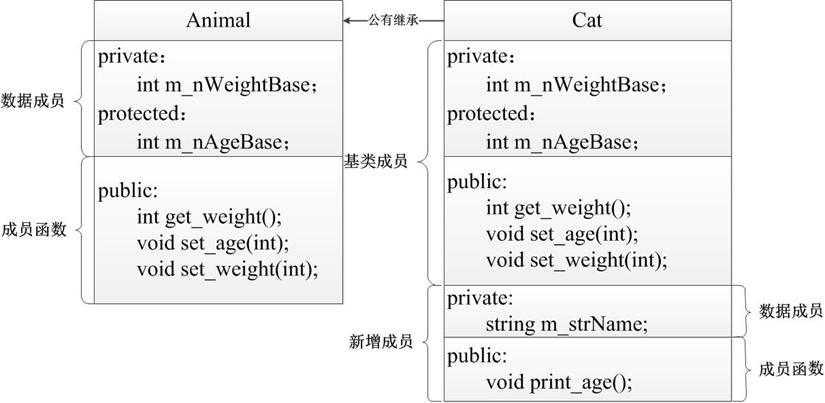

## 什么是继承？

C++中，继承就是在现有类的基础上建立新类，即新类从已有类中得到属性和行为，并可以在新类中添加新的属性及方法，新构建的类称为子类或派生类，现有类称为父类或基类。


## 继承权限

### 公有继承

公有继承对基类成员的访问属性控制


```c++
#include <iostream>                                   
#include <string>
using namespace std;

class Animal //定义基类Animal
{
public:
	//设置m_nWeightBase属性的成员函数
	void set_weight(int weight){ m_nWeightBase = weight; }
	//获取m_nWeightBase 值的成员函数
	int get_weight(){ return m_nWeightBase; }
	//设置m_nAgeBase属性的成员函数
	void set_age(int age){ m_nAgeBase = age; }
protected:
	int m_nAgeBase;       //定义保护成员m_nAgeBase
private:
	int m_nWeightBase;    //定义私有成员m_nWeightBase
};
class Cat :public Animal  //通过公有继承，定义派生类Cat
{
public:
	Cat(string con_name) :m_strName(con_name){}
	//定义函数print_age()，该函数访问基类成员m_nAgeBase
	void print_age(){ cout << m_strName << ", age = " << m_nAgeBase << endl; }
private:
	string m_strName;//派生类的私有成员
};
int main()
{
	Cat cat("Persian"); //定义派生类对象cat
	cat.set_age(5);     //派生类对象调用从基类继承的公有成员函数
	cat.set_weight(6);  //派生类对象调用从基类继承的公有成员函数
	cat.print_age();    //派生类对象调用自己的公有函数
	cout << "cat weight = " << cat.get_weight() << endl;
	system("pause");
	return 0;
}
```

派生类Cat与基类Animal的继承关系



### 私有继承

私有继承对基类成员的访问属性控制


```c++
#include <iostream>                                   
#include <string>
using namespace std;

class Animal //定义基类Animal
{
public:
	//设置m_nWeightBase属性的成员函数
	void set_weight(int weight){ m_nWeightBase = weight; }
	//获取m_nWeightBase值的成员函数
	int get_weight(){ return m_nWeightBase; }
	//设置m_nAgeBase属性的成员函数
	void set_age(int age){ m_nAgeBase = age; }
protected:
	int m_nAgeBase;       //定义保护成员m_nAgeBase
private:
	int m_nWeightBase;    //定义私有成员m_nWeightBase
};
class Cat :private Animal //通过私有继承，定义派生类Cat
{
public:
	Cat(string con_name) :m_strName(con_name){}
	//定义函数set_print_age()，该函数访问基类公有成员函数set_age()和保护成员m_nAgeBase
	void set_print_age()
	{
		set_age(5);                           //调用基类的成员函数
		cout << m_strName << " age = " << m_nAgeBase << endl;
	}
	//定义函数set_print_weight()，该函数访问基类公有成员函数set_weight()、get_weight()
	void set_print_weight()
	{
		set_weight(6); //调用基类的成员函数   
		cout << m_strName << ", weight = " << get_weight() << endl;
	}
private:
	string m_strName;       //派生类的私有成员
};
int main()
{
	Cat cat("Persian");     //定义派生类对象cat
	cat.set_print_age();
	cat.set_print_weight(); //派生类对象调用自己的公有函数
	system("pause");
	return 0;
}
```

私有继承方式下派生类各成员属性


### 保护继承

保护继承对基类成员的访问属性控制


```c++
#include <iostream>                                   
#include <string>
using namespace std;

class Animal //定义基类Animal
{
public:
	//设置m_nWeightBase属性的成员函数
	void set_weight(int weight){ m_nWeightBase = weight; }
	//获取m_nWeightBase值的成员函数
	int get_weight(){ return m_nWeightBase; }
	//设置m_nAgeBase属性的成员函数
	void set_age(int age){ m_nAgeBase = age; }
protected:
	int m_nAgeBase;          //定义保护成员m_nAgeBase
private:
	int m_nWeightBase;      //定义私有成员m_nWeightBase
};

class Cat :protected Animal //通过保护继承，定义派生类Cat
{
public:
	Cat(string con_name) :m_strName(con_name){}
	//定义函数set_print_weight()，该函数访问基类成员函数set_weight()、get_weight()
	void set_print_weight()
	{
		set_weight(6);
		cout << m_strName << " weight = " << get_weight() << endl;
	}
private:
	string m_strName;                     //派生类的私有成员
};

class PersianCat :protected Cat          //保护继承的派生类PersianCat
{
public:
	PersianCat() :Cat("persian cat"){  } //定义构造函数
	//函数persian_set_print_age()访问Animal类中的数据成员m_nAgeBase和set_age()函数
	void persian_set_print_age()
	{
		set_age(5);  //直接调用从基类中保护继承的函数
		cout << "PersianCat, age = " << m_nAgeBase << endl;
	}
};
int main()
{
	PersianCat persian_cat; //定义PersianCat对象
	persian_cat.persian_set_print_age(); //调用显示m_nAgeBase值的成员函数
	system("pause");
	return 0;
}
```

### 类的继承方式对基类成员的访问属性控制


## 多重继承

前面介绍的继承方式都是单继承，即派生类的基类只有一个。现实世界中，一个派生类往往会有多个基类。


### 多重继承引起的二义性

1、调用不同基类中的同名成员时产生二义性

多个基类出现同名成员时，派生类对象访问该成员时会出现二义性。

```c++
#include <iostream>
using namespace std;

class Bird //定义鸟类
{
public:
	//定义鸟呼吸的成员函数
	void breath()   { cout << "bird breath!" << endl; }
};
class Fish //定义鱼类
{
public:
	//定义鱼呼吸的成员函数
	void breath()   { cout << "fish breath!" << endl; }
};
class WaterBird :public Bird, public Fish //定义水鸟类
{
public:
	//定义水鸟行为的成员函数
	void fly_swim() { cout << "waterbird cat fly and swim!" << endl; }
};

int main()
{
	WaterBird waterbird; //定义水鸟对象
	//错误，由于WaterBird继承自两个基类，两个基类中存在同名函数breath()
	//水鸟类对象调用breath()函数时产生调用基类同名函数的二义性
	waterbird.breath();
	system("pause");
	return 0;
}
```

2、派生类中访问公有成员时产生二义性

多重继承中派生类有多个基类，多个基类又可能由同一个基类派生，则在派生类中访问公共基类成员时会出现二义性。

```c++
#include <iostream>
using namespace std;

class Animal //定义类Animal
{
public:
	//定义类Animal的构造函数
	Animal(int age) :m_nAge(age)  { cout << "Animal constructor!" << endl; }
protected:
	int m_nAge; //成员m_nAge记录动物年龄
};
class Bird :public Animal //定义类Bird继承自Animal
{
public:
	Bird(int age, int fh) :Animal(age) //定义类Bird的构造函数
	{
		cout << "Bird constructor!" << endl;
		m_nFlightAltitude = fh;
	}
	//定义获取鸟飞行高度的函数
	int get_flightaltitude() { return m_nFlightAltitude; }
private:
	int m_nFlightAltitude;
};

class Fish :public Animal //定义类Fish继承自Animal
{
public:
	Fish(int age, int speed) :Animal(age) //定义类Fish的构造函数
	{
		cout << "Fish constructor!" << endl;
		m_nSwimSpeed = speed;
	}
	//定义获取鱼游速的函数
	int get_swimspeed() { return m_nSwimSpeed; }
private:
	int m_nSwimSpeed;
};

class WaterBird :public Bird, public Fish //定义水鸟类
{
public:
	//定义水鸟类带参数的构造函数
	WaterBird(int b_age, int f_age, int fh, int speed) :Bird(b_age, fh),
		Fish(f_age, speed)
	{
		cout << "WaterBird constructor!" << endl;
	}
	void print_animalage() //定义打印动物年龄的函数
	{
		cout << "age = " << Bird::m_nAge << endl;
		cout << "age = " << Fish::m_nAge << endl;
	}
};

int main()
{
	WaterBird waterbird(5, 6, 20, 30); //定义水鸟对象

	cout << "waterbird flight altitude: " << waterbird.get_flightaltitude()
		<< ", swimming speed:" << waterbird.get_swimspeed() << endl;

	waterbird.print_animalage();
	system("pause");
	return 0;
}
```

### 虚基类

在多重继承中，若一个类声明为虚基类，则能保证一个派生类间接地多次继承该类时，派生类中只继承该基类的一份成员，避免了派生类中访问公共基类公有属性多份拷贝的二义性。

虚基类的定义形式是在派生类定义时基类名称前加virtual关键字，具体形式如下所示：

```c++
#include <iostream>
using namespace std;

class Animal //定义类Animal
{
public:
	//定义类Animal的构造函数
	Animal(int age) :m_nAge(age) { cout << "Animal constructor!" << endl; }
protected:
	int m_nAge; //成员m_nAge记录动物年龄
};

class Bird :virtual public Animal //定义类Bird继承自虚基类Animal
{
public:
	//定义类Bird的构造函数
	Bird(int age, int fh) :Animal(age)
	{
		cout << "Bird constructor!" << endl;
		m_nFlightAltitude = fh;
	}
	//定义获取鸟飞行高度的函数
	int get_flightaltitude()  { return m_nFlightAltitude; }
private:
	int m_nFlightAltitude;
};

class Fish :virtual public Animal //定义类Fish继承自虚基类Animal
{
public:
	Fish(int age, int speed) :Animal(age) //定义类Fish的构造函数
	{
		cout << "Fish constructor!" << endl;
		m_nSwimSpeed = speed;
	}
	//定义获取鱼游速的函数
	int get_swimspeed()  { return m_nSwimSpeed; }
private:
	int m_nSwimSpeed;;
};

class WaterBird :public Bird, public Fish //定义水鸟类
{
public:
	WaterBird(int b_age, int f_age, int fh, int speed) :Bird(b_age, fh),
		Fish(f_age, speed), Animal(b_age)   //定义水鸟类带参数的构造函数
	{
		cout << "WaterBird constructor!" << endl;
	}
	//定义打印动物年龄的成员函数
	void print_animalage() { cout << "age = " << m_nAge << endl; }
};

int main()
{
	WaterBird waterbird(5, 6, 20, 30); //定义水鸟对象
	cout << "waterbird flight altitude: " << waterbird.get_flightaltitude()
		<< ", swimming speed:" << waterbird.get_swimspeed() << endl;
	waterbird.print_animalage();
	system("pause");
	return 0;
}
```