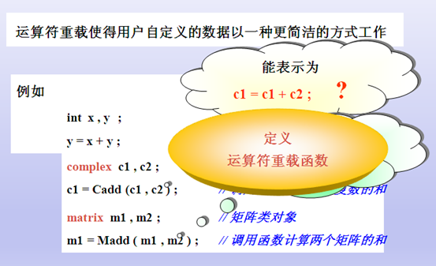
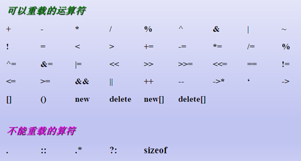
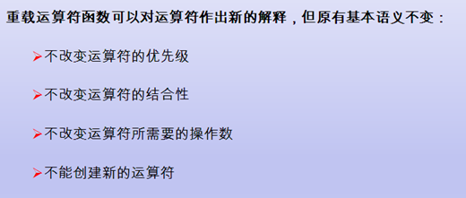
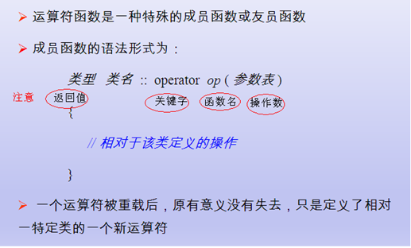
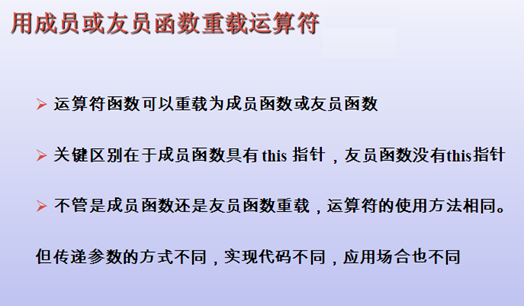
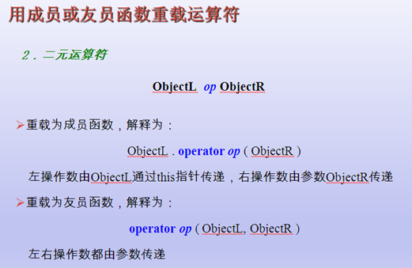
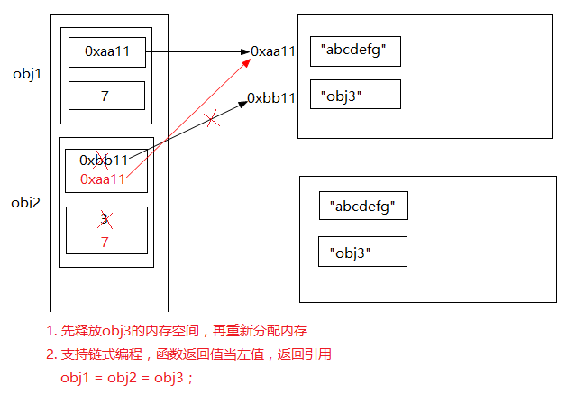

## 什么是运算符重载



所谓重载，就是重新赋予新的含义。函数重载就是对一个已有的函数赋予新的含义，使之实现新功能，因此，一个函数名就可以用来代表不同功能的函数，也就是”一名多用”。

运算符也可以重载。实际上，我们已经在不知不觉之中使用了运算符重载。例如，大 家都已习惯于用加法运算符”+”对整数、单精度数和双精度数进行加法运算，如5+8， 5.8 +3.67等，其实计算机对整数、单精度数和双精度数的加法操作过程是很不相同的， 但由于C++已经对运算符”+”进行了重载，所以就能适用于int, float, doUble类型的运算。

又如”<<“是C++的位运算中的位移运算符（左移），但在输出操作中又是与流对 象cout 配合使用的流插入运算符，”>>“也是位移运算符(右移），但在输入操作中又是与流对象 cin 配合使用的流提取运算符。这就是运算符重载(operator overloading)。C++系统对”<<“和”>>“进行了重载，用户在不同的场合下使用它们时，作用是不同 的。对”<<“和”>>“的重载处理是放在头文件stream中的。因此，如果要在程序中用”<< “和”>>”作流插入运算符和流提取运算符，必须在本文件模块中包含头文件stream(当然还应当包括”using namespace std“)。

现在要讨论的问题是：用户能否根据自己的需要对C++已提供的运算符进行重载，赋予它们新的含义，使之一名多用？

## 运算符重载入门基础推演

1.为什么会用运算符重载机制

用复数类举例：`Complex c3 = c1 + c2;`，原因 Complex是用户自定义类型，编译器根本不知道如何进行加减，编译器给提供了一种机制，让用户自己去完成，自定义类型的加减操作，这个机制就是运算符重载机制

2 .运算符重载的本质是一个函数

```C++
#include <iostream>
using namespace std;

class Complex
{
public:
	int a;
	int b;
public:
	Complex(int a=0, int b=0)
	{
		this->a = a;
		this->b = b;
	}
	void printCom()
	{
		cout<<a<<" + " << b << "i" <<endl;
	}
};

//1 定义了全局函数
Complex myAdd(Complex &c1, Complex &c2)
{
	Complex tmp(c1.a + c2.a, c1.b+ c2.b);
	return tmp;
}

//2 函数名 升级
Complex operator+(Complex &c1, Complex &c2)
{
	cout<<"12345上山 打老虎"<<endl;
	Complex tmp(c1.a + c2.a, c1.b+ c2.b);
	return tmp;
}

void main()
{
	int a = 0, b = 0;
	int c;
	c = a + b; //1 基础数据类型 编译器已经知道了. 如何运算

	// a + bi 复数运算规则
	Complex c1(1, 2), c2(3, 4);
	Complex c3; //2 类 也是一种数据类型  用户自定义数据类型 C++编译器 是不知道如何进行运算
	//c3 = c1 + c2 ;
	//c1--; --c1

	//3 c++编译器应该给我们程序员提供一种机制 ... 
	//让自定义数据类型 有机会 进行 运算符操作 ====> 运算符重载机制 

	//4 运算符重载机制

	//步骤1 
	//Complex c4 = myAdd(c1, c2);
	//c4.printCom();

	//步骤2  //Complex c4  = c1 + c2
	//Complex c4 = operator+(c1, c2);
	//c4.printCom();

	//步骤3 
	Complex c4 = c1 + c2;
	c4.printCom();
	
	//步骤3 
	Complex c4 = c1 / c2;
	c4.printCom();

	//总结: 1 运算符重载的本质 是 函数调用 
  
	cout<<"hello..."<<endl;
	system("pause");
	return ;
}
```
## 运算符重载的限制





## 运算符重载编程基础



例如:

```C++
//全局函数 完成 +操作符 重载
Complex operator+(Complex &c1, Complex &c2)
//类成员函数 完成 -操作符 重载
Complex operator-(Complex &c2)
```

## 运算符重载的两种方法





例如1:
```C++
//通过类成员函数完成-操作符重载
//函数声明 Complex operator-(Complex &c2)
//函数调用分析
//用类成员函数实现-运算符重载
Complex c4 = c1 - c2;
c4.printCom();
//c1.operator-(c2);
```
例如2:
```C++
//通过全局函数方法完成+操作符重载
//函数声明 Complex operator+(Complex &c1, Complex &c2) 
//函数调用分析
int main()
{
	Complex c1(1, 2), c2(3, 4);
	//Complex c31 = operator+(c1, c2);
	Complex c3 = c1 + c2; 
	c3.printCom();
}
```
例如3: 学员自己练习 实现 * /

## 运算符重载的两种方法

```C++
#include <iostream>
using namespace std;

class Complex
{
private:
	int a;
	int b;
	//全局函数 重载+运算符
	friend Complex operator+(Complex &c1, Complex &c2);
	//重载 前置++
	friend Complex& operator++(Complex &c1);
	friend Complex operator++(Complex &c1, int); // 占位符
public:
	Complex(int a=0, int b=0)
	{
		this->a = a;
		this->b = b;
	}
	void printCom()
	{
		cout<<a<<" + " << b << "i" <<endl;
	}
public:
	
	//成员函数法 实现 -运算符重载
	 Complex operator-(Complex &c2)
	{
		Complex tmp(this->a - c2.a, this->b - c2.b);
		return tmp;
	}

	 //前置--
	Complex& operator--()
	{
		this->a --;
		this->b --;
		return *this;
	}

	//后置--
	Complex operator--(int)
	{
		Complex tmp = *this;
		this->a--;
		this->b--;
		return tmp;
	}
};

//全局函数法 实现 + 运算符重载
Complex operator+(Complex &c1, Complex &c2)
{
	Complex tmp(c1.a + c2.a, c1.b + c2.b);
	return tmp;
}

//前置++
Complex& operator++(Complex &c1)
{
	c1.a++;
	c1.b++;
	return c1;
}

//后置++
Complex operator++(Complex &c1, int)
{
	//先使用 在让c1加加
	Complex tmp = c1;
	//return c1;
	c1.a ++;
	c1.b ++;
	return tmp;
}

/*
全局函数、类成员函数方法实现运算符重载步骤
	1）要承认操作符重载是一个函数，写出函数名称
	2）根据操作数，写出函数参数 
	3）根据业务，完善函数返回值(看函数是返回引用 还是指针 元素)，及实现函数业务
*/
void main()
{
	Complex c1(1, 2), c2(3, 4);

	//1	全局函数法 实现 + 运算符重载
	// Complex operator+(Complex &c1, Complex &c2);
	Complex c3 = c1 + c2;
	c3.printCom();

	//2 成员函数 法 实现 -运算符重载
	//c1.operator-(c2);
	//Complex operator-(Complex &c2)
	Complex c4 = c1 - c2;
	c4.printCom();

	//前置++操作符 用全局函数实现
	++c1;
	c1.printCom();

	//前置--操作符 成员函数方法
	--c1;
	c1.printCom();
	//Complex& operator++(Complex &c1)
	//c1.operator--();

	//后置++操作符 用全局函数实现
	c1++;
	c1.printCom();

	//后置--操作符 用成员函数实现
	c1--;
	c1.printCom();
	//c1.operator--()
	
	cout<<"hello..."<<endl;
	system("pause");
	return ;
}
```

## 运算符重载正规的写法

```C++
#include <iostream>
using namespace std;

/*
class ostream
{

};
*/

class Complex
{
private:
	int a;
	int b;
	//friend void operator<<(ostream &out, Complex &c1);
	friend ostream& operator<<(ostream &out, Complex &c1);

public:
	Complex(int a=0, int b=0)
	{
		this->a = a;
		this->b = b;
	}
	void printCom()
	{
		cout<<a<<" + " << b << "i" <<endl;
	}
public:

	//实现 + 运算符重载
	Complex operator+(Complex &c2)
	{
		Complex tmp(a + c2.a, b + c2.b);
		return tmp;
	}

	//前置++
	Complex& operator++()
	{
		a++;
		b++;
		return *this;
	}

	//后置++
	Complex operator++(int)
	{
		//先使用 在让c1加加
		Complex tmp = *this;
		//return c1;
		this->a ++;
		this->b ++;
		return tmp;
	}
	//成员函数法 实现 -运算符重载
	 Complex operator-(Complex &c2)
	{
		Complex tmp(this->a - c2.a, this->b - c2.b);
		return tmp;
	}

	 //前置--
	Complex& operator--()
	{
		this->a --;
		this->b --;
		return *this;
	}

	//后置--
	Complex operator--(int)
	{
		Complex tmp = *this;
		this->a--;
		this->b--;
		return tmp;
	}
};

void main31()
{
	Complex c1(1, 2), c2(3, 4);

	//1	全局函数法 实现 + 运算符重载
	// Complex operator+(Complex &c1, Complex &c2);
	Complex c3 = c1 + c2;
	c3.printCom();

	//2 成员函数 法 实现 -运算符重载
	//c1.operator-(c2);
	//Complex operator-(Complex &c2)
	Complex c4 = c1 - c2;
	c4.printCom();

	//前置++操作符 用全局函数实现
	++c1;
	c1.printCom();

	//前置--操作符 成员函数方法
	--c1;
	c1.printCom();
	//Complex& operator++(Complex &c1)
	//c1.operator--();

	//后置++操作符 用全局函数实现
	c1++;
	c1.printCom();

	//后置--操作符 用成员函数实现
	c1--;
	c1.printCom();
	//c1.operator--()
	
	cout<<"hello..."<<endl;
	system("pause");
	return ;
}

/*
void operator<<(ostream &out, Complex &c1)
{
	out<<"12345 生活真是苦"<<endl;
	out<<c1.a << " + " << c1.b << "i" << endl;
}
*/

ostream& operator<<(ostream &out, Complex &c1)
{
	out<<"12345 生活真是苦"<<endl;
	out<<c1.a << " + " << c1.b << "i" << endl;
	return out;
}

void main()
{
	int a = 10;
	Complex c1(1, 2), c2(3, 4);
	cout<<a<<endl; //按照数据类型 

	//1
	cout << c1 ;
	//2 ostream 类中 添加 成员函数 .operator<<
	//ostream
	//cout.operator<<(c1);

	//2 函数返回值当左值 需要返回一个引用
	cout << c1  << "aaddddd";
	//cout.operator<<(c1) .operator<<("aaddddd");
	//void.operator<<("aaddddd");

	system("pause");
}
```

## 重载=操作符



会造成`abcdefg`内存的二次析构

```C++
#define  _CRT_SECURE_NO_WARNINGS 
#include <iostream>
using namespace std;

class  Name
{
public:
	Name(const char *myp)
	{
		m_len = strlen(myp);
		m_p =(char *) malloc(m_len + 1);
		strcpy(m_p, myp);
	}

	//Name obj2 = obj1;
	//解决方案: 手工的编写拷贝构造函数 使用深copy
	Name(const Name& obj1)
	{
		m_len = obj1.m_len;
		m_p = (char *)malloc(m_len + 1);
		strcpy(m_p, obj1.m_p);
	}

	//obj3 = obj1;  // C++编译器提供的 等号操作 也属 浅拷贝
	//obj3.operator=(obj1)

	Name& operator=(Name &obj1)
	{
		//先释放旧的内存
		if (this->m_p != NULL)
		{
			delete[] m_p;
			m_len = 0;
		}
		//2 根据obj1分配内存大小
		this->m_len = obj1.m_len;
		this->m_p = new char [m_len+1];
		
		//把obj1赋值
		strcpy(m_p, obj1.m_p);
		return *this;
	}
	
	~Name()
	{
		if (m_p != NULL)
		{
			free(m_p);
			m_p = NULL;
			m_len = 0;
		}
	}
protected:
private:
	char *m_p ;
	int m_len; 
};

//对象析构的时候 出现coredump
void objplaymain()
{
	Name obj1("abcdefg");
	Name obj2 = obj1;  //C++编译器提供的 默认的copy构造函数  浅拷贝
	Name obj3("obj3");

	obj3 = obj1;  // C++编译器提供的 等号操作 也属 浅拷贝
	//obj3.operator=(obj1)
	//operato=(Name &obj1)

	obj1 = obj2 = obj3;
	//obj2.operator=(obj3);
	//obj1 = void;
}

void main()
{
	objplaymain();
	cout<<"hello..."<<endl;
	system("pause");
	return ;
}
```

## 重载括号

```C++
#include <iostream>
using namespace std;

class F
{
public:
	int operator() (int a, int b)
	{
		return a*a + b*b;
	}
};

class F2
{
public:
	int MemFunc(int a, int b)
	{
		return a*a + b*b;
	}
};

void main()
{
	F f;
	f(2, 4);

	F2 f2;
	f2.MemFunc(2, 4);
	//operator() (int a, int b)

	cout<<"hello..."<<endl;
	system("pause");
	return ;
}
```

## 逻辑与和逻辑或运算符重载说明

为什么不要重载&&和||操作符

1）&&和||是C++中非常特殊的操作符 
2）&&和||内置实现了短路规则 
3）操作符重载是靠函数重载来完成的 
4）操作数作为函数参数传递 
5）C++的函数参数都会被求值，无法实现短路规则 

```C++
#include <cstdlib>
#include <iostream>

using namespace std;

class Test
{
	int i;
public:
	Test(int i)
	{
		this->i = i;
	}

	Test operator+ (const Test& obj)
	{
		Test ret(0);

		cout<<"执行+号重载函数"<<endl;
		ret.i = i + obj.i;
		return ret;
	}

	bool operator&& (const Test& obj)
	{
		cout<<"执行&&重载函数"<<endl;
		return i && obj.i;
	}
};

// && 从左向右
void main()
{
	int a1 = 0;
	int a2 = 1;

	cout<<"注意：&&操作符的结合顺序是从左向右"<<endl;

	if( a1 && (a1 + a2) )
	{
		cout<<"有一个是假，则不在执行下一个表达式的计算"<<endl;
	}

	Test t1 = 0;
	Test t2 = 1;

	//if( t1 && (t1 + t2)  )
	//t1  && t1.operator+(t2)
	// t1.operator&&(  t1.operator+(t2) )   

	//1 && || 重载他们 不会产生短路效果
	if(  (t1 + t2) && t1)
	{
		//t1.operator+(t2) && t1;
		//(t1.operator+(t2)).operator&&(t1);
		cout<<"两个函数都被执行了，而且是先执行了+"<<endl;
	}

	//2 && 运算符的结合性
	// 两个逻辑与运算符  在一块的时候, 采去谈 运算符的结合性
	// 从左到右    (t1 + t2) && t1 ; 运算结果 && t2)
	//if(  (t1 + t2) && t1 && t2)
	{
		//t1.operator+(t2) && t1;
		//(t1.operator+(t2)).operator&&(t1);
		cout<<"两个函数都被执行了，而且是先执行了+"<<endl;
	}

	system("pause");
	return ;
}
```