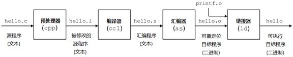

## C++编译器模板机制剖析

思考：为什么函数模板可以和函数重载放在一块。C++编译器是如何提供函数模板机制的？

## 编译器编译原理

### 什么是gcc 

gcc（GNU C Compiler）编译器的作者是Richard Stallman，也是GNU项目的奠基者。

什么是gcc：gcc是GNU Compiler Collection的缩写。最初是作为C语言的编译器（GNU C Compiler），现在已经支持多种语言了，如C、C++、Java、Pascal、Ada、COBOL语言等。

gcc支持多种硬件平台，甚至对Don Knuth 设计的 MMIX 这类不常见的计算机都提供了完善的支持

### gcc主要特征 

1）gcc是一个可移植的编译器，支持多种硬件平台
2）gcc不仅仅是个本地编译器，它还能跨平台交叉编译。
3）gcc有多种语言前端，用于解析不同的语言。
4）gcc是按模块化设计的，可以加入新语言和新CPU架构的支持
5）gcc是自由软件

### gcc编译过程 

预处理（Pre-Processing）
编译（Compiling）
汇编（Assembling）
链接（Linking）

```bash
# 总的编译步骤
Gcc *.c –o 1exe
# 宏定义 宏展开
Gcc –E 1.c –o 1.i
Gcc –S 1.i –o 1.s 
Gcc –c 1.s –o 1.o  
Gcc 1.o –o 1exe
```


结论：gcc编译工具是一个工具链



hello程序是一个高级Ｃ语言程序，这种形式容易被人读懂。为了在系统上运行hello.c程序，每条Ｃ语句都必须转化为低级机器指令。然后将这些指令打包成可执行目标文件格式，并以二进制形式存储器于磁盘中。

### gcc常用编译选项

| 选项    | 作用                                 |
| ----- | ---------------------------------- |
| -o    | 产生目标（.i、.s、.o、可执行文件等）              |
| -c    | 通知gcc取消链接步骤，即编译源码并在最后生成目标文件        |
| -E    | 只运行C预编译器                           |
| -S    | 告诉编译器产生汇编语言文件后停止编译，产生的汇编语言文件扩展名为.s |
| -Wall | 使gcc对源文件的代码有问题的地方发出警告              |
| -Idir | 将dir目录加入搜索头文件的目录路径                 |
| -Ldir | 将dir目录加入搜索库的目录路径                   |
| -llib | 链接lib库                             |
| -g    | 在目标文件中嵌入调试信息，以便gdb之类的调试程序调试        |

## 练习

```bash
gcc -E hello.c -o hello.i（预处理）
gcc -S hello.i -o hello.s（编译）
gcc -c hello.s -o hello.o（汇编）
gcc hello.o -o hello（链接）
# 以上四个步骤，可合成一个步骤
gcc hello.c -o hello（直接编译链接成可执行目标文件）
gcc -c hello.c或gcc -c hello.c -o hello.o（编译生成可重定位目标文件）
```

建议初学都加这个选项。下面这个例子如果不加-Wall选项编译器不报任何错误，但是得到的结果却不是预期的。
```c
#include <stdio.h>
int main(void)
{
        printf("2+1 is %f", 3);
        return 0;
}
```
Gcc编译多个.c

```bash
hello_1.h
hello_1.c
main.c
# 一次性编译
gcc  hello_1.c main.c –o newhello
# 独立编译
gcc -Wall -c main.c -o main.o
gcc -Wall -c hello_1.c -o hello_fn.o
gcc -Wall main.o hello_1.o -o newhello
```

## 模板函数反汇编观察

命令：g++ -S 7.cpp -o 7.s

```C++
#include <iostream>
using namespace std;
// 1.cpp
// g++ -S 1.cpp  -o 1.s
template <typename T>
void myswap(T &a, T &b)
{
	T c = 0;
	c = a;
	a = b;
	b = c;
	cout << "hello ....我是模板函数 欢迎 calll 我" << endl;
}

int main()
{
	{
		int x = 10; 
		int y = 20;
		myswap<int>(x, y); //1 函数模板 显示类型 调用
		printf("x:%d y:%d \n", x, y);
	}

	{
		char a = 'a'; 
		char b = 'b';
		myswap<char>(a, b); //1 函数模板 显示类型 调用
		printf("a:%c b:%c \n", a, b);
	}
	return 0;
}
```

```
.file	"7.cpp"
	.text
	.def	__ZL6printfPKcz;	.scl	3;	.type	32;	.endef
__ZL6printfPKcz:
LFB264:
	.cfi_startproc
	pushl	%ebp
	.cfi_def_cfa_offset 8
	.cfi_offset 5, -8
	movl	%esp, %ebp
	.cfi_def_cfa_register 5
	pushl	%ebx
	subl	$36, %esp
	.cfi_offset 3, -12
	leal	12(%ebp), %eax
	movl	%eax, -12(%ebp)
	movl	-12(%ebp), %eax
	movl	%eax, 4(%esp)
	movl	8(%ebp), %eax
	movl	%eax, (%esp)
	call	___mingw_vprintf
	movl	%eax, %ebx
	movl	%ebx, %eax
	addl	$36, %esp
	popl	%ebx
	.cfi_restore 3
	popl	%ebp
	.cfi_restore 5
	.cfi_def_cfa 4, 4
	ret
	.cfi_endproc
LFE264:
.lcomm __ZStL8__ioinit,1,1
	.def	___main;	.scl	2;	.type	32;	.endef
	.section .rdata,"dr"
LC0:
	.ascii "a:%d b:%d \12\0"
LC1:
	.ascii "c1:%c c2:%c \12\0"
LC2:
	.ascii "pause\0"
	.text
	.globl	_main
	.def	_main;	.scl	2;	.type	32;	.endef
_main:
LFB1023:
	.cfi_startproc
	.cfi_personality 0,___gxx_personality_v0
	.cfi_lsda 0,LLSDA1023
	pushl	%ebp
	.cfi_def_cfa_offset 8
	.cfi_offset 5, -8
	movl	%esp, %ebp
	.cfi_def_cfa_register 5
	andl	$-16, %esp
	subl	$32, %esp
	call	___main
	movl	$0, 28(%esp)
	movl	$10, 24(%esp)
	movb	$97, 23(%esp)
	movb	$98, 22(%esp)
	leal	24(%esp), %eax
	movl	%eax, 4(%esp)
	leal	28(%esp), %eax
	movl	%eax, (%esp)
	call	__Z6myswapIiEvRT_S1_  //66  ===>126 
	movl	24(%esp), %edx
	movl	28(%esp), %eax
	movl	%edx, 8(%esp)
	movl	%eax, 4(%esp)
	movl	$LC0, (%esp)
	call	__ZL6printfPKcz
	leal	22(%esp), %eax
	movl	%eax, 4(%esp)
	leal	23(%esp), %eax
	movl	%eax, (%esp)
	call	__Z6myswapIcEvRT_S1_ //77 ===>155 
	movzbl	22(%esp), %eax
	movsbl	%al, %edx
	movzbl	23(%esp), %eax
	movsbl	%al, %eax
	movl	%edx, 8(%esp)
	movl	%eax, 4(%esp)
	movl	$LC1, (%esp)
	call	__ZL6printfPKcz
	movl	$LC2, (%esp)
LEHB0:
	call	_system
LEHE0:
	movl	$0, %eax
	jmp	L7
L6:
	movl	%eax, (%esp)
LEHB1:
	call	__Unwind_Resume
LEHE1:
L7:
	leave
	.cfi_restore 5
	.cfi_def_cfa 4, 4
	ret
	.cfi_endproc
LFE1023:
	.def	___gxx_personality_v0;	.scl	2;	.type	32;	.endef
	.section	.gcc_except_table,"w"
LLSDA1023:
	.byte	0xff
	.byte	0xff
	.byte	0x1
	.uleb128 LLSDACSE1023-LLSDACSB1023
LLSDACSB1023:
	.uleb128 LEHB0-LFB1023
	.uleb128 LEHE0-LEHB0
	.uleb128 L6-LFB1023
	.uleb128 0
	.uleb128 LEHB1-LFB1023
	.uleb128 LEHE1-LEHB1
	.uleb128 0
	.uleb128 0
LLSDACSE1023:
	.text
	.section	.text$_Z6myswapIiEvRT_S1_,"x"
	.linkonce discard
	.globl	__Z6myswapIiEvRT_S1_
	.def	__Z6myswapIiEvRT_S1_;	.scl	2;	.type	32;	.endef
__Z6myswapIiEvRT_S1_:  //126 
LFB1024:
	.cfi_startproc
	pushl	%ebp
	.cfi_def_cfa_offset 8
	.cfi_offset 5, -8
	movl	%esp, %ebp
	.cfi_def_cfa_register 5
	subl	$16, %esp
	movl	8(%ebp), %eax
	movl	(%eax), %eax
	movl	%eax, -4(%ebp)
	movl	12(%ebp), %eax
	movl	(%eax), %edx
	movl	8(%ebp), %eax
	movl	%edx, (%eax)
	movl	12(%ebp), %eax
	movl	-4(%ebp), %edx
	movl	%edx, (%eax)
	leave
	.cfi_restore 5
	.cfi_def_cfa 4, 4
	ret
	.cfi_endproc
LFE1024:
	.section	.text$_Z6myswapIcEvRT_S1_,"x"
	.linkonce discard
	.globl	__Z6myswapIcEvRT_S1_
	.def	__Z6myswapIcEvRT_S1_;	.scl	2;	.type	32;	.endef
__Z6myswapIcEvRT_S1_: //155 
LFB1025:
	.cfi_startproc
	pushl	%ebp
	.cfi_def_cfa_offset 8
	.cfi_offset 5, -8
	movl	%esp, %ebp
	.cfi_def_cfa_register 5
	subl	$16, %esp
	movl	8(%ebp), %eax
	movzbl	(%eax), %eax
	movb	%al, -1(%ebp)
	movl	12(%ebp), %eax
	movzbl	(%eax), %edx
	movl	8(%ebp), %eax
	movb	%dl, (%eax)
	movl	12(%ebp), %eax
	movzbl	-1(%ebp), %edx
	movb	%dl, (%eax)
	leave
	.cfi_restore 5
	.cfi_def_cfa 4, 4
	ret
	.cfi_endproc
LFE1025:
	.text
	.def	___tcf_0;	.scl	3;	.type	32;	.endef
___tcf_0:
LFB1027:
	.cfi_startproc
	pushl	%ebp
	.cfi_def_cfa_offset 8
	.cfi_offset 5, -8
	movl	%esp, %ebp
	.cfi_def_cfa_register 5
	subl	$8, %esp
	movl	$__ZStL8__ioinit, %ecx
	call	__ZNSt8ios_base4InitD1Ev
	leave
	.cfi_restore 5
	.cfi_def_cfa 4, 4
	ret
	.cfi_endproc
LFE1027:
	.def	__Z41__static_initialization_and_destruction_0ii;	.scl	3;	.type	32;	.endef
__Z41__static_initialization_and_destruction_0ii:
LFB1026:
	.cfi_startproc
	pushl	%ebp
	.cfi_def_cfa_offset 8
	.cfi_offset 5, -8
	movl	%esp, %ebp
	.cfi_def_cfa_register 5
	subl	$24, %esp
	cmpl	$1, 8(%ebp)
	jne	L11
	cmpl	$65535, 12(%ebp)
	jne	L11
	movl	$__ZStL8__ioinit, %ecx
	call	__ZNSt8ios_base4InitC1Ev
	movl	$___tcf_0, (%esp)
	call	_atexit
L11:
	leave
	.cfi_restore 5
	.cfi_def_cfa 4, 4
	ret
	.cfi_endproc
LFE1026:
	.def	__GLOBAL__sub_I_main;	.scl	3;	.type	32;	.endef
__GLOBAL__sub_I_main:
LFB1028:
	.cfi_startproc
	pushl	%ebp
	.cfi_def_cfa_offset 8
	.cfi_offset 5, -8
	movl	%esp, %ebp
	.cfi_def_cfa_register 5
	subl	$24, %esp
	movl	$65535, 4(%esp)
	movl	$1, (%esp)
	call	__Z41__static_initialization_and_destruction_0ii
	leave
	.cfi_restore 5
	.cfi_def_cfa 4, 4
	ret
	.cfi_endproc
LFE1028:
	.section	.ctors,"w"
	.align 4
	.long	__GLOBAL__sub_I_main
	.ident	"GCC: (rev2, Built by MinGW-builds project) 4.8.0"
	.def	___mingw_vprintf;	.scl	2;	.type	32;	.endef
	.def	_system;	.scl	2;	.type	32;	.endef
	.def	__Unwind_Resume;	.scl	2;	.type	32;	.endef
	.def	__ZNSt8ios_base4InitD1Ev;	.scl	2;	.type	32;	.endef
	.def	__ZNSt8ios_base4InitC1Ev;	.scl	2;	.type	32;	.endef
	.def	_atexit;	.scl	2;	.type	32;	.endef
```

## 函数模板机制结论

- 编译器并不是把函数模板处理成能够处理任意类的函数
- 编译器从函数模板通过具体类型产生不同的函数
- 编译器会对函数模板进行两次编译
- 在声明的地方对模板代码本身进行编译；在调用的地方对参数替换后的代码进行编译。
- 函数模板 → 模板函数