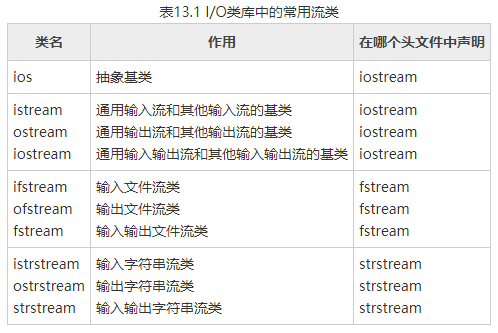

输入和输出是数据传送的过程，数据如流水一样从一处流向另一处。C++形象地将此过程称为流(Stream)。C++的输入输出流是指由若干字节组成的宇节序列，这些宇节中的数据按顺序从一个对象传送到另一对象。流表示了信息从源到目的端的流动。在输入操作时，字节流从输入设备（如键盘、磁盘）流向内存，在输出操作时，字节流从内存流向输出设备(如屏幕、打印机、磁盘等)。流中的内容可以是ASCII字符、二进制形式的数据、图形图像、数字音频视频或其他形式的信息。

实际上，在内存中为每一个数据流开辟一个内存缓冲区，用来存放流中的数据。当用cout和插入运算符“<<”向显示器输出数据时，先将这些数据送到程序中的输出缓冲区保存，直到缓冲区满了或遇到endl，就将缓冲区中的全部数据送到显示器显示出来。在输入时，从键盘输入的数据先放在键盘的缓冲区中，当按回车键时，键盘缓冲区中的数据输入到程序中的输入缓冲区，形成cin流，然后用提取运算符“ >>”从输入缓冲区中提取数据送给程序中的有关变量。总之，流是与内存缓冲区相对应的，或者说，缓冲区中的数据就是流。

在C++中，输入输出流被定义为类。C++的I/O库中的类称为流类(stream class)。 用流类定义的对象称为流对象。

其实，cout和cin并不是C++语言中提供的语句，它们是iostream类的对象，在不了解类和对象时，在不致引起误解的前提下，为叙述方便，把它们称为cout语句和cin语句。正如C++并未提供赋值语句，只提供赋值表达式，在赋值表达式后面加分号就成了C++的语句，为方便起见，我们习惯称之为赋值语句。又如，在C语言中常用 printf和scanf进行输出和输入，printf和scanf是C语言库函数中的输入输出函数，一般也习惯地将由printf和scanf函数构成的语句称为printf语句和scanf语句。在使用它们时，对其本来的概念应该有准确的理解。

了解了类和对象后，我们对C++的输入输出应当有更深刻的认识。

C++编译系统提供了用于输入输出的iostream类库。iostream这个单词是由3个部 分组成的，即i-o-stream，意为输入输出流。在iostream类库中包含许多用于输入输出的 类。常用的见表13.1。


图 13.1
表13.1 I/O类库中的常用流类



| 类名   | 作用   | 在哪个头文件中声明       |
| ---- | ---- | --------------- |
| ios  | 抽象基类 | iostreamistream |
|      |      |                 |
|      |      |                 |
|      |      |                 |
|      |      |                 |
|      |      |                 |
|      |      |                 |
|      |      |                 |
|      |      |                 |

ostream
iostream通用输入流和其他输入流的基类
通用输出流和其他输出流的基类
通用输入输出流和其他输入输出流的基类iostream
iostream
iostreamifstream
ofstream
fstream输入文件流类
输出文件流类
输入输出文件流类fstream
fstream
fstreamistrstream
ostrstream
strstream输入字符串流类
输出字符串流类
输入输出字符串流类strstream
strstream
strstream
ios是抽象基类，由它派生出istream类和ostream类，两个类名中第1个字母i和o分别代表输入(input)和输出(output)。istream类支持输入操作，ostream类支持输出操作， iostream类支持输入输出操作。iostream类是从istream类和ostream类通过多重继承而派生的类。其继承层次见图13.1表示。

C++对文件的输入输出需要用ifstrcam和ofstream类，两个类名中第1个字母i和o分别代表输入和输出，第2个字母f代表文件(file)。ifstream支持对文件的输入操作， ofstream支持对文件的输出操作。类ifstream继承了类istream，类ofstream继承了类ostream，类fstream继承了类iostream。见图 13.2。


图 13.2
I/O类库中还有其他一些类，但是对于一般用户来说，以上这些已能满足需要了。如果想深入了解类库的内容和使用，可参阅所用的C++系统的类库手册。

## 与iostream类库有关的头文件

iostream类库中不同的类的声明被放在不同的头文件中，用户在自己的程序中用#include命令包含了有关的头文件就相当于在本程序中声明了所需要用到的类。可以换 —种说法：头文件是程序与类库的接口，iostream类库的接口分别由不同的头文件来实现。常用的有

- iostream  包含了对输入输出流进行操作所需的基本信息。
- fstream  用于用户管理的文件的I/O操作。strstream  用于字符串流I/O。
- stdiostream  用于混合使用C和C + +的I/O机制时，例如想将C程序转变为C++程序。
- iomanip  在使用格式化I/O时应包含此头文件。

## 在iostream头文件中定义的流对象

在 iostream 头文件中定义的类有 ios，istream，ostream，iostream，istream _withassign， ostream_withassign，iostream_withassign 等。

iostream.h包含了对输入输出流进行操作所需的基本信息。因此大多数C++程序都包括iostream.h。在iostream.h头文件中不仅定义了有关的类，还定义了4种流对象， 见表13.2。


表13.2 文件中定义的4种流对象对象含义对应设备对应的类c语言中相应的标准文件cin标准输入流键盘istream_withassignstdincout标准输出流屏幕ostream_withassignstdoutcerr标准错误流屏幕ostream_withassignstderrclog标准错误流屏幕ostream_withassignstderr
在iostream头文件中定义以上4个流对象用以下的形式（以cout为例）：
    ostream cout ( stdout);
在定义cout为ostream流类对象时，把标准输出设备stdout作为参数，这样它就与标准输出设备(显示器)联系起来，如果有
    cout <<3;
就会在显示器的屏幕上输出3。

## 在iostream头文件中重载运算符

“<<”和“>>”本来在C++中是被定义为左位移运算符和右位移运算符的，由于在iostream头文件中对它们进行了重载，使它们能用作标准类型数据的输入和输出运算符。所以，在用它们的程序中必须用#include命令把iostream包含到程序中。

`#include <iostream>`

在istream和ostream类（这两个类都是在iostream中声明的）中分别有一组成员函数对位移运算符“<<”和“>>”进行重载，以便能用它输入或输出各种标准数据类型的数据。对于不同的标准数据类型要分别进行重载，如：
```
ostream operator << (im );  //用于向输出流插入一个int数据
ostream operator << (float );  //用于向输出流插入一个float数据
ostream operator << (char);  //用于向输出流插入一个char数据
ostream operator << (char * );  //用于向输出流插入一个字符串数据
```
等。如果在程序中有下面的表达式：
```
cout<<"C++";
```
实际上相当于：
```
cout.operator <<("C++")
```
"C ++"的值是其首字节地址，是字符型指针(char * )类型，因此选择调用上面最后一个运算符重载函数，通过重载函数的函数体，将字符串插入到cout流中，函数返回流对象cout。

在istream类中已将运算符“>> ”重载为对以下标准类型的提取运算符：char, signed char, unsigned char, short, unsigned short, int, unsigned int，long, unsigned long, float, double, long double, char * , signed char *, unsigned char * 等。

在ostream类中将“<<”重载为插入运算符，其适用类型除了以上的标准类型外，还增加了一个 void * 类型。

如果想将“<<”和“>>”用于自己声明的类型的数据，就不能简单地采用包含 iostream头文件来解决，必须自己对“<<”和“>>”进行重载。

怎样理解运算符“<<”和“>>”的作用呢？有一个简单而形象的方法：它们指出了数据移动的方向，例如
    >>a
箭头方向表示把数据放人a中。而
    <<a
箭头方向表示从a中拿出数据。