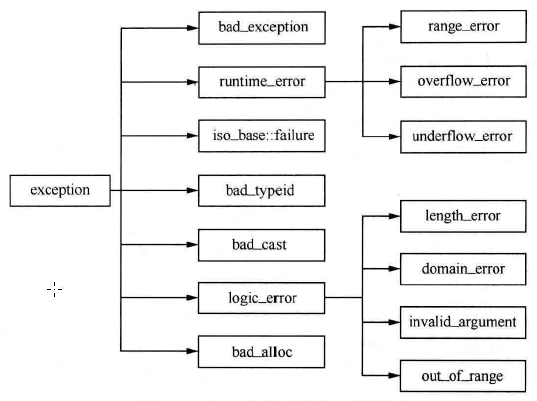
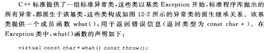
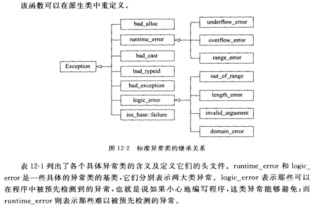
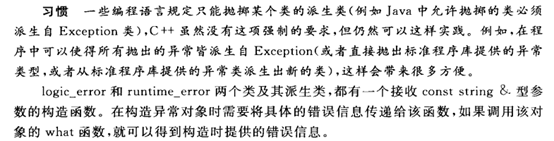
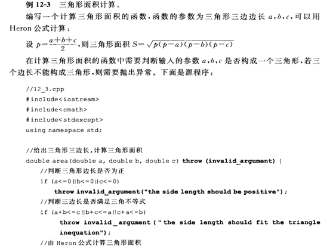
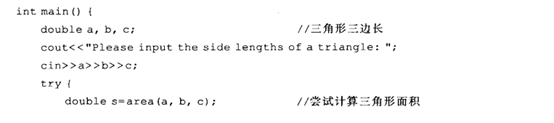
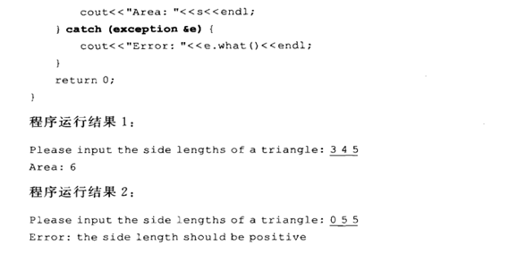

## 标准程序库异常










## 案例1

```C++
// out_of_range
#include "iostream"
using namespace std;
#include <stdexcept>  
 
class Teacher
{
public:
	Teacher(int age)  //构造函数, 通过异常机制 处理错误
	{
		if (age > 100)
		{
			throw out_of_range("年龄太大");
		}
		this->age = age;
	}
protected:
private:
	int age;
};

void mainxx()
{
	try
	{
		Teacher t1(102);
	}
	catch (out_of_range e)
	{
		
		cout << e.what() << endl;
	}

	exception e;
	system("pause");
}
```

## 案例2

```C++
class Dog
{
public:
	Dog()
	{
		parr = new int[1024*1024*100]; //4MB
	}
private:
	int *parr;
};

int main31()
{
	Dog *pDog;
	try{
		for(int i=1; i<1024; i++) //40GB!
		{
			pDog = new Dog();
			cout << i << ": new Dog 成功." << endl;
		}
	}
	catch(bad_alloc err)
	{
		cout << "new Dog 失败: " << err.what() << endl;
	}

	return 0;
}
```

## 案例3







## 案例4

```C++
// out_of_range
#include "iostream"
using namespace std;
#include <stdexcept> 
#include "string"

// out_of_range
class Teacher
{
public:
	Teacher(int age)
	{
		if (age > 100)
		{
			string  s = "年龄太大";
			throw out_of_range(s);
		}
		this->age = age;
	}
protected:
private:
	int age;
};

void main61()
{
	try
	{
		Teacher t1(102);
	}
	catch (out_of_range e)
	{

		cout << e.what() << endl;
	}

	exception e;
	system("pause");
}

class MyException : public exception
{
public:
	MyException(const char *p)
	{
		this->m_p = p;
	}

	virtual const char *  what()
	{
		cout << "MyException: 类型" << m_p << endl;
		return m_p;
	}
protected:
private:
	const char *m_p;
};

void testMyExcept()
{
	throw MyException("函数异常");
}
void main()
{

	try
	{
		testMyExcept();
	}
	catch (MyException & e)
	{
		e.what();
	}
	catch (...)
	{
		cout << "未知 类型 " << endl;
	}
	
	system("pause");
}
```