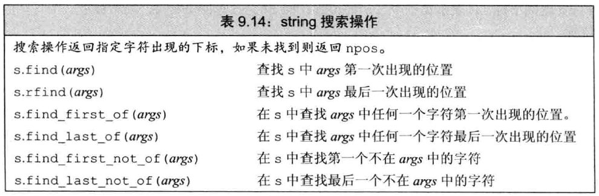
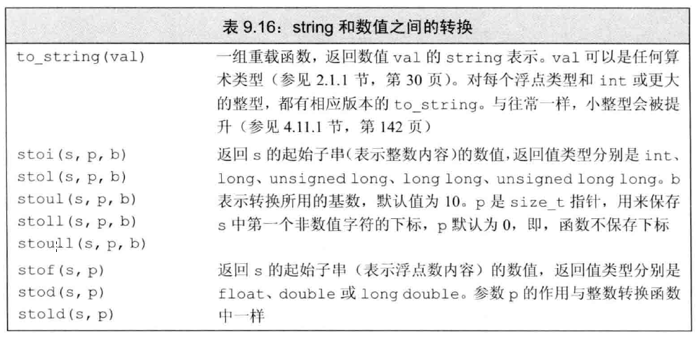
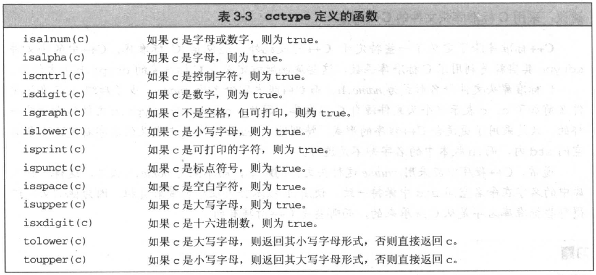

### string概念

string是STL的字符串类型，通常用来表示字符串。而在使用string之前，字符串通常是用`char*`表示的。string与`char*`都可以用来表示字符串，那么二者有什么区别呢。

string和`char*`的比较

- string是一个类, `char*`是一个指向字符的指针。string封装了`char*`，管理这个字符串，是一个`char*`型的容器。


- string不用考虑内存释放和越界。string管理`char*`所分配的内存。每一次string的复制，取值都由string类负责维护，不用担心复制越界和取值越界等。


- string提供了一系列的字符串操作函数：查找find()，拷贝copy，删除erase()，替换replace()，插入insert()

### string的构造函数

```c++
// 默认构造函数
string();//构造一个空的字符串string s1

// 拷贝构造函数
string(const string &str); //构造一个与str一样的string。如strings1(s2)

// 带参数的构造函数
string(const char *s);    //用字符串s初始化
string(int n,char c);     //用n个字符c初始化
```
### string的存取字符操作
string类的字符操作：

```c++
const char &operator[] (int n) const;
const char &at(int n) const;
char &operator[] (int n);
char &at(int n);
```
operator[]和at()均返回当前字符串中第n个字符，但二者是有区别的。

主要区别在于at()在越界时会抛出异常，[]在刚好越界时会返回(char)0，再继续越界时，编译器直接出错。如果你的程序希望可以通过try,catch捕获异常，建议采用at()。

### 从string取得const char*的操作

```c++
const char *c_str() const;  //返回一个以'\0'结尾的字符串的首地址
```
### 把string拷贝到char*指向的内存空间的操作
```c++
int copy(char *s, int n, int pos=0) const;  
```
把当前串中以pos开始的n个字符拷贝到以s为起始位置的字符数组中，返回实际拷贝的数目。注意要保证s所指向的空间足够大以容纳当前字符串，不然会越界。
### string的长度
```c++
int length() const;   //返回当前字符串的长度，长度不包括字符串结尾的'\0'
bool empty() const;   //当前字符串是否为空
```
### string的赋值
```c++
//把字符串s赋给当前的字符串
string &operator=(const string&s);
//把字符串s赋给当前的字符串
string &assign(const char *s); 
//把字符串s的前n个字符赋给当前的字符串
string &assign(const char *s, int n);
//把字符串s赋给当前字符串
string &assign(const string&s);  
//用n个字符c赋给当前字符串
string &assign(int n,char c);
//把字符串s中从start开始的n个字符赋给当前字符串
string &assign(const string &s,intstart, int n);
```

### string字符串连接

```c++
//把字符串s连接到当前字符串结尾
string &operator+=(const string&s);  
//把字符串s连接到当前字符串结尾
string &operator+=(const char *s);
//把字符串s连接到当前字符串结尾
string &append(const char *s);    
//把字符串s的前n个字符连接到当前字符串结尾
string &append(const char *s,intn);  
//同operator+=()
string &append(const string&s);   
//把字符串s中从pos开始的n个字符连接到当前字符串结尾
string &append(const string &s,intpos, int n);
//在当前字符串结尾添加n个字符c
string &append(int n, char c);   
```

### string的比较

```c++
int compare(const string &s)const;  //与字符串s比较
int compare(const char *s) const;   //与字符串s比较
```
compare函数在>时返回 1，<时返回 -1，==时返回 0。比较区分大小写，比较时参考字典顺序，排越前面的越小。大写的A比小写的a小。

### string的子串

```c++
string substr(int pos=0, int n=npos)const;    //返回由pos开始的n个字符组成的子字符串
```

### string的查找和替换



查找
```c++
//从pos开始查找字符c在当前字符串的位置
int find(char c,int pos=0) const;   
//从pos开始查找字符串s在当前字符串的位置
int find(const char *s, int pos=0)const;  
//从pos开始查找字符串s在当前字符串中的位置
int find(const string &s, int pos=0)const;  
// find函数如果查找不到，就返回-1
//从pos开始从后向前查找字符c在当前字符串中的位置
int rfind(char c, int pos=npos) const;    
int rfind(const char *s, int pos=npos)const;
int rfind(const string &s, intpos=npos) const;
//rfind是反向查找的意思，如果查找不到， 返回-1
```
替换
```c++
string &replace(int pos, int n, constchar *s);//删除从pos开始的n个字符，然后在pos处插入串s
string &replace(int pos, int n, conststring &s);  //删除从pos开始的n个字符，然后在pos处插入串s
void swap(string &s2);    //交换当前字符串与s2的值
```
```c++
//4 字符串的查找和替换
void main()
{
	strings1 = "wbm hello wbm 111 wbm 222 wbm 333";
	size_tindex = s1.find("wbm", 0);
	cout<< "index: " << index; 
	//求itcast出现的次数
	size_toffindex = s1.find("wbm", 0);
	while(offindex != string::npos)
	{
	      cout<< "在下标index: " << offindex << "找到wbm\n";
	      offindex= offindex + 1;
	      offindex= s1.find("wbm", offindex);
	}
	//替换 
	strings2 = "wbm hello wbm 111 wbm 222 wbm 333";
	s2.replace(0,3, "wbm");
	cout<< s2 << endl;
	//求itcast出现的次数
	offindex= s2.find("wbm", 0);
	while(offindex != string::npos)
	{
	     cout<< "在下标index: " << offindex << "找到wbm\n";
	     s2.replace(offindex,3, "WBM");
	     offindex= offindex + 1;
	     offindex= s1.find("wbm", offindex);
	}
	cout<< "替换以后的s2：" << s2 << endl; 
}
```

### String的区间删除和插入

```c++
string &insert(int pos, const char *s);
string &insert(int pos, const string&s);
//前两个函数在pos位置插入字符串s
string &insert(int pos, int n, charc);  //在pos位置 插入n个字符c
string &erase(int pos=0, intn=npos);  //删除pos开始的n个字符，返回修改后的字符串
```

### 数值转换

| 函数声明        | 功能描述         |
| ----------- | ------------ |
| to_string() | 将整数转换为字符表示形式 |
| stod()      | 将字符串转换为浮点数   |



### string算法相关

```c++
void main()
{
   strings2 = "AAAbbb";
   transform(s2.begin(),s2.end(), s2.begin(), toupper);
   cout<< s2 << endl;
   strings3 = "AAAbbb";
   transform(s3.begin(),s3.end(), s3.begin(), tolower);
   cout<< s3 << endl;
}
```
### string常用函数

| 函数声明            | 功能描述                            |
| --------------- | ------------------------------- |
| assign()        | 给字符串赋值                          |
| =               | 给字符串赋值                          |
| size()/length() | 获取字符串的字符数量，返回值string::size_type |
| capacity()      | 获取字符串容量                         |
| empty()         | 判断一个字符串是否为空                     |
| resize()        | 重新分配字符串的内存大小                    |
| begin()         | 获取字符串开头位置                       |
| end()           | 获取字符串最后字符的下一个位置                 |
| rbegin()        | 获取字符串最后字符的位置                    |
| rend()          | 获取字符串开头字符的上一个位置                 |
| insert()        | 插入字符或字符串                        |
| erase()         | 删除字符串中的字符或字符串                   |
| clear()         | 删除全部字符                          |
| replace()       | 替换字符串的字符                        |
| find()          | 查找                              |
| rfind()         | 反向查找                            |
| substr()        | 返回某个子串                          |
| at(index)       | 访问某个角标上的字符                      |
| [index]         | 与at()功能相同                       |
| +               | 连接两个字符串                         |
| ==、!=、<、<=、>、>= | 比较字符串                           |
| compare()       | 比较字符串                           |
| append()        | 追加字符或字符串                        |
| push_back()     | 追加字符或字符串                        |
| swap()          | 交换两个字符串的值                       |
| copy()          | 把string拷贝到char*指向的内存空间的操作       |
| c_str()         | 从string取得const char*的操作         |

### 字符操作函数



```c++
#include <iostream>
#include "string"
#include "algorithm"
using namespace std;

//string的初始化
void main21()
{
	string s1 = "aaaa";
	string s2("bbbb");
	string s3 = s2; //通过拷贝构造函数来初始化对象s3
	string s4(10, 'a');

	cout << "s1:" << s1 << endl;
	cout << "s2:" << s2 << endl;
	cout << "s3:" << s3 << endl;
	cout << "s4:" << s4 << endl;
}

//string的遍历
void main22()
{
	string s1 = "abcdefg";

	//1 数组方式
	for (int i=0; i<s1.length(); i++)
	{
		cout << s1[i] << " ";
	}
	cout << endl;

	//2 迭代器
	for (string::iterator it = s1.begin(); it != s1.end(); it++ )
	{
		cout << *it << " ";
	}
	cout << endl;

	try
	{
		for (int i=0; i<s1.length() + 3; i++)
		{
			cout << s1.at(i) << " ";  //抛出异常
		}
	}
	catch ( ... )
	{
		cout << "发生异常\n" ;
	}

	cout << "at之后" << endl;
	/*
	try
	{
		for (int i=0; i<s1.length() + 3; i++)
		{
			cout << s1[i] << " "; //出现错误 不向外面抛出异常 引起程序的中断
		}
	}
	catch ( ... )
	{
		cout << "发生异常\n" ;
	}
	*/
}

//字符指针和string的转换
void main23()
{
	string s1 = "aaabbbb";

	//1 s1-->char *
	//printf("s1:%s \n", s1.c_str());

	//2 char *-->sting 

	//3 s1的内容 copy buf中
	//char buf1[128] = {0};
	//s1.copy(buf1, 3, 0);  //注意 只给你copy3个字符 不会变成C风格的字符串
	//cout << "buf1:" << buf1 << endl; 
}

//字符串的连接
void main24()
{
	string s1 = "aaa";
	string s2 = "bbb";
	s1 = s1 + s2;
	cout << "s1:" << s1 << endl;

	string s3 = "333";
	string s4 = "444";
	s3.append(s4);
	cout << "s3:" << s3 << endl;
}


//字符串的查找和替换
void main25()
{
	string s1 = "wbm hello wbm 111  wbm 222  wbm 333 ";
	
  	//第一次 出现wbm index
	int index = s1.find("wbm", 0); //位置下标 从0开始
	cout << "index: " << index << endl;

	//案例1 求wbm出现的次数 每一次出现的数组下标
	int offindex = s1.find("wbm", 0);
	while (offindex != string::npos)
	{
		cout << "offindex:" << offindex << endl;
		offindex = offindex + 1;
		offindex = s1.find("wbm", offindex); //wang bao ming 
	}

	//案例2  把小写wbm===>WBM
	string s3 = "aaa  bbb ccc";
	s3.replace(0, 3, "AAA");
	cout << "s3" << s3 << endl;

	offindex = s1.find("wbm", 0);
	while (offindex != string::npos)
	{
		cout << "offindex:" << offindex << endl;
		s1.replace(offindex,3, "WBM");
		offindex = offindex + 1;
		offindex = s1.find("wbm", offindex); //
	}

	cout << "s1替换后的结果: " << s1 << endl;
}

//截断（区间删除）和插入
void main26()
{
	string s1 = "hello1 hello2 hello1";
	string::iterator it = find(s1.begin(), s1.end(), 'l');
	if (it != s1.end() )
	{
		s1.erase(it);
	}
	cout << "s1删除l以后的结果:" << s1 << endl;

	s1.erase(s1.begin(), s1.end() );
	cout << "s1全部删除:" << s1 << endl;
	cout << "s1长度 " << s1.length() << endl;

	string s2 = "BBB";

	s2.insert(0, "AAA"); // 头插法
	s2.insert(s2.length(), "CCC");

	cout << s2 << endl;
}

void main27()
{
	string s1 = "AAAbbb";
	//1函数的入口地址 2函数对象 3预定义的函数对象
	transform(s1.begin(), s1.end(),s1.begin(), toupper);
	cout << "s1" << s1 << endl;

	string s2 = "AAAbbb";
	transform(s2.begin(), s2.end(), s2.begin(), tolower);
	cout << "s2:" << s2 << endl;
}


void main2222()
{
	//main21();
	//main22();
	//main23();
	//main24();
	//main25();
	//main26();
	main27();
	system("pause");
	return ;
}
```