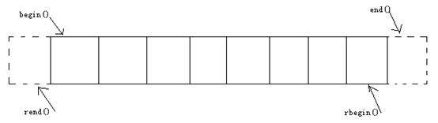

### Vector容器简介

- vector是将元素置于一个动态数组中加以管理的容器
- vector可以随机存取元素，支持索引值直接存取，用[]操作符或at()方法
- vector尾部添加或移除元素非常快速。但是在中部或头部插入元素或移除元素比较费时

### vector对象的默认构造

vector采用模板类实现，vector对象的默认构造形式

```c++
vector<T> vecT; 
vector<int> vecInt;          //一个存放int的vector容器。
vector<float> vecFloat;      //一个存放float的vector容器。
vector<string> vecString;    //一个存放string的vector容器。
...   //尖括号内还可以设置指针类型或自定义类型。
Class CA{};
vector<CA*> vecpCA; //用于存放CA对象的指针的vector容器。
vector<CA> vecCA; //用于存放CA对象的vector容器。由于容器元素的存放是按值复制的方式进行的，所以此时CA必须提供CA的拷贝构造函数，以保证CA对象间拷贝正常。
```

### vector对象的带参数构造

理论知识

| 函数声明                      | 功能描述                                    |
| ------------------------- | --------------------------------------- |
| vector(beg,end)           | 构造函数将[beg,end)区间中的元素拷贝给本身。注意该区间是左闭右开的区间 |
| vector(n,elem)            | 构造函数将n个elem拷贝给本身                        |
| vector(const vector &vec) | 拷贝构造函数                                  |

```c++
int iArray[] = {0,1,2,3,4};
vector<int>  vecIntA( iArray,  iArray+5 );
vector<int> vecIntB (  vecIntA.begin() , vecIntA.end()  );   //用构造函数初始化容器vecIntB
vector<int> vecIntB (  vecIntA.begin() , vecIntA.begin()+3  );  
vector<int> vecIntC(3,9); //此代码运行后，容器vecIntB就存放3个元素，每个元素的值是9。
vector<int> vecIntD(vecIntA);
```
### vector的赋值
理论知识

| 函数声明                                 | 功能描述                                   |
| ------------------------------------ | -------------------------------------- |
| vector.assign(beg,end)               | 将[beg, end)区间中的数据拷贝赋值给本身。注意该区间是左闭右开的区间 |
| vector.assign(n,elem)                | 将n个elem拷贝赋值给本身                         |
| vector& operator=(const vector &vec) | 重载等号操作符                                |
| vector.swap(vec)                     | 将vec与本身的元素互换                           |

```c++
vector<int> vecIntA, vecIntB, vecIntC,vecIntD;
int iArray[] = {0,1,2,3,4};
vecIntA.assign(iArray,iArray+5);
vecIntB.assign( vecIntA.begin(),  vecIntA.end() );//用其它容器的迭代器作参数。
vecIntC.assign(3,9);
vector<int> vecIntD;
vecIntD = vecIntA;
vecIntA.swap(vecIntD);
```

### vector的大小

理论知识

- vector.size();  //返回容器中元素的个数
- vector.empty(); //判断容器是否为空
- vector.resize(num); //重新指定容器的长度为num，若容器变长，则以默认值填充新位置。如果容器变短，则末尾超出容器长度的元素被删除。
- vector.resize(num, elem);  //重新指定容器的长度为num，若容器变长，则以elem值填充新位置。如果容器变短，则末尾超出容器长度的元素被删除。
  例如  

```c++
// vecInt是vector<int>  声明的容器，现已包含1,2,3元素。
int iSize = vecInt.size();           //iSize == 3;
bool bEmpty = vecInt.empty();        // bEmpty == false;
执行 vecInt.resize(5);                //此时里面包含1,2,3,0,0元素。
再执行 vecInt.resize(8,3);            //此时里面包含1,2,3,0,0,3,3,3元素。
再执行 vecInt.resize(2);              //此时里面包含1,2元素。
```

### vector末尾的添加移除操作  

```c++
vector<int> vecInt;
vecInt.push_back(1);  //在容器尾部加入一个元素
vecInt.push_back(3);  //移除容器中最后一个元素
vecInt.push_back(5);  
vecInt.push_back(7); 
vecInt.push_back(9); 
vecInt.pop_back();    
vecInt.pop_back();
//{5 ,7 ,9} 
```

### vector的数据存取

理论知识

```c++
vec.at(idx); //返回索引idx所指的数据，如果idx越界，抛出out_of_range异常。
vec[idx]; //返回索引idx所指的数据，越界时，运行直接报错
vector<int> vecInt;    //假设包含1 ,3 ,5 ,7 ,9
vecInt.at(2) == vecInt[2];  //5
vecInt.at(2) = 8;  或  vecInt[2] = 8;
vecInt 就包含 1, 3, 8, 7, 9值
int iF = vector.front();       //iF==1
int iB = vector.back();       //iB==9
vector.front() = 11;  //vecInt包含{11,3,8,7,9}
vector.back() = 19;   //vecInt包含{11,3,8,7,19}
```

### 迭代器基本原理

- 迭代器是一个“可遍历STL容器内全部或部分元素”的对象。
- 迭代器指出容器中的一个特定位置。
- 迭代器就如同一个指针。
- 迭代器提供对一个容器中的对象的访问方法，并且可以定义了容器中对象的范围。
- 这里大概介绍一下迭代器的类别。

**输入迭代器**：也有叫法称之为“只读迭代器”，它从容器中读取元素，只能一次读入一个元素向前移动，只支持一遍算法，同一个输入迭代器不能两遍遍历一个序列。

**输出迭代器**：也有叫法称之为“只写迭代器”，它往容器中写入元素，只能一次写入一个元素向前移动，只支持一遍算法，同一个输出迭代器不能两遍遍历一个序列。

**正向迭代器**：组合输入迭代器和输出迭代器的功能，还可以多次解析一个迭代器指定的位置，可以对一个值进行多次读/写。

**双向迭代器**：组合正向迭代器的功能，还可以通过--操作符向后移动位置。

**随机访问迭代器**：组合双向迭代器的功能，还可以向前向后跳过任意个位置，可以直接访问容器中任何位置的元素。

目前本系列教程所用到的容器，都支持双向迭代器或随机访问迭代器，下面将会详细介绍这两个类别的迭代器。

- iterator
- const_iterator 只读迭代器
- reverse_iterator 逆向迭代器
- const_reverse_iterator 只读逆向迭代器

### 双向迭代器与随机访问迭代器

双向迭代器支持的操作：it++, ++it, it--, --it，*it, itA = itB, itA == itB, itA != itB
其中list,set,multiset,map,multimap支持双向迭代器。

随机访问迭代器支持的操作：
在双向迭代器的操作基础上添加
it+=i， it-=i， it+i(或it=it+i)，it[i],
itA&lt;itB, itA<=itB, itA>itB,  itA>=itB  的功能。

其中vector，deque支持随机访问迭代器。

### vector与迭代器的配合使用



```c++
vector<int>  vecInt; //假设包含1,3,5,7,9元素
vector<int>::iterator it; //声明容器vector<int>的迭代器。
it = vecInt.begin(); // *it == 1
++it; //或者it++;  *it == 3 ，前++的效率比后++的效率高，前++返回引用，后++返回值。
it += 2; //*it== 7
it = it+1; //*it== 9
++it;  //it == vecInt.end();  此时不能再执行*it,会出错!
```
正向遍历：
```c++
for(vector<int>::iterator it=vecInt.begin(); it!=vecInt.end(); ++it)
{
     int iItem = *it; 
     cout << iItem; //或直接使用  cout << *it;
}
```
这样子便打印出1 3 5 7 9
逆向遍历：
```c++
//注意，小括号内仍是++rit
for(vector<int>::reverse_iterator rit=vecInt.rbegin(); rit!=vecInt.rend(); ++rit)    
{
    intiItem  = *rit;
     cout << iItem;      //或直接使用cout<< *rit;
}
```
此时将打印出9,7,5,3,1
注意，这里迭代器的声明采用vector<int>::reverse_iterator，而非vector<int>::iterator。
迭代器还有其它两种声明方法：

```c++
vector<int>::const_iterator 与 vector<int>::const_reverse_iterator
```
以上两种分别是vector<int>::iterator 与vector<int>::reverse_iterator的只读形式，使用这两种迭代器时，不会修改到容器中的值。

备注：不过容器中的insert和erase方法仅接受这四种类型中的iterator，其它三种不支持。《Effective STL》建议我们尽量使用iterator取代const_iterator、reverse_iterator和const_reverse_iterator。

### vector的插入

理论知识

- vector.insert(pos,elem);   //在pos位置插入一个elem元素的拷贝，返回新数据的位置。
- vector.insert(pos,n,elem);  //在pos位置插入n个elem数据，无返回值。
- vector.insert(pos,beg,end);  //在pos位置插入[beg,end)区间的数据，无返回值
  简单案例
```c++
vector<int>vecA;
vector<int>vecB;
vecA.push_back(1);
vecA.push_back(3);
vecA.push_back(5);
vecA.push_back(7);
vecA.push_back(9);
vecB.push_back(2);
vecB.push_back(4);
vecB.push_back(6);
vecB.push_back(8);
vecA.insert(vecA.begin(),11); //{11, 1, 3, 5, 7, 9}
vecA.insert(vecA.begin()+1,2,33);  //{11,33,33,1,3,5,7,9}
//{2,4,6,8,11,33,33,1,3,5,7,9}
vecA.insert(vecA.begin(), vecB.begin() , vecB.end() ); 
```

### vector的删除

理论知识

- vector.clear(); //移除容器的所有数据
- vec.erase(beg,end);  //删除[beg,end)区间的数据，返回下一个数据的位置。
- vec.erase(pos);    //删除pos位置的数据，返回下一个数据的位置。

简单案例:删除区间内的元素

```c++
// vecInt是用vector<int>声明的容器，现已包含按顺序的1,3,5,6,9元素。
vector<int>::iterator itBegin=vecInt.begin()+1;
vector<int>::iterator itEnd=vecInt.begin()+2;
vecInt.erase(itBegin,itEnd);
//此时容器vecInt包含按顺序的1,6,9三个元素。
```
假设 vecInt 包含1,3,2,3,3,3,4,3,5,3，删除容器中等于3的元素
```c++
for(vector<int>::iterator it=vecInt.being(); it!=vecInt.end(); )   //小括号里不需写++it
{
  if(*it == 3)
   {    //以迭代器为参数，删除元素3，并把数据删除后的下一个元素位置返回给迭代器。
       it  =  vecInt.erase(it);       
        //此时，不执行++it；  
   }
  else
   {
      ++it;
   }
}
//删除vecInt的所有元素
vecInt.clear(); //容器为空
```
### vector小结

这一讲，主要讲解如下要点：

- 容器的简介
- 容器的分类
- 各个容器的数据结构：vector,deque,list,set,multiset,map,multimap
- 容器vector的具体用法（包括迭代器的具体用法）。

vertor简介，vector使用之前的准备，vector对象的默认构造，vector末尾的添加移除操作，vector的数据存取，迭代器的简介，双向迭代器与随机访问迭代器

vector与迭代器的配合使用，vector对象的带参数构造，vector的赋值，vector的大小，vector的插入，vector的删除。

| 方法声明        | 功能描述                                     |
| ----------- | ---------------------------------------- |
| capacity()  | 容量                                       |
| size()      | 大小                                       |
| resize()    | 重新设置大小                                   |
| empty()     | 判断vector是否为空                             |
| assign()    | 赋值                                       |
| =           | 重载等号操作符                                  |
| at()        | 访问元素                                     |
| [index]     | 通过角标访问元素                                 |
| push_back() | 尾部插入                                     |
| pop_back()  | 尾部删除                                     |
| front()     | 获取头部元素                                   |
| back()      | 获取尾部元素                                   |
| begin()     | 获取头部迭代器                                  |
| rbegin()    | 获取vector的最后一个位置                          |
| rend()      | 获取第0个位置的上一个位置                            |
| end()       | 获取尾部迭代器                                  |
| insert()    | 插入元素                                     |
| erase()     | 删除元素，当删除迭代器所指向的元素的时候，erase删除函数会让it自动下移动，返回新的位置 |
| clear()     | 清空vector                                 |
| swap()      | 交换元素                                     |