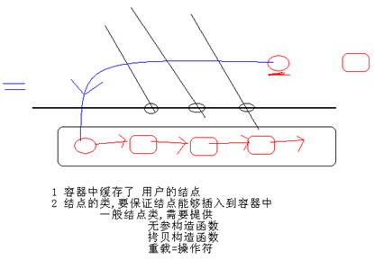
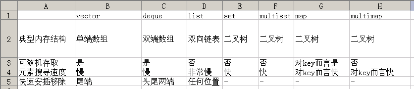

### 容器的共通能力



C++模板是容器的概念。

理论提高：所有容器提供的都是值（value）语意，而非引用（reference）语意。容器执行插入元素的操作时，内部实施拷贝动作。所以STL容器内存储的元素必须能够被拷贝（必须提供拷贝构造函数）。

- 除了queue与stack外，每个容器都提供可返回迭代器的函数，运用返回的迭代器就可以访问元素。
- 通常STL不会丢出异常。要求使用者确保传入正确的参数。
- 每个容器都提供了一个默认构造函数跟一个默认拷贝构造函数。
- 如已有容器vecIntA。 
- `vector<int> vecIntB(vecIntA);` //调用拷贝构造函数，复制vecIntA到vecIntB中。
- 与大小相关的操作方法(c代表容器)：
  c.size();   //返回容器中元素的个数
  c.empty();   //判断容器是否为空
- 比较操作(c1,c2代表容器)：
  c1 == c2     判断c1是否等于c2
  c1 != c2      判断c1是否不等于c2
  c1 = c2        把c2的所有元素指派给c1
###  各个容器的使用时机



- Vector的使用场景：比如软件历史操作记录的存储，我们经常要查看历史记录，比如上一次的记录，上上次的记录，但却不会去删除记录，因为记录是事实的描述。
- deque的使用场景：比如排队购票系统，对排队者的存储可以采用deque，支持头端的快速移除，尾端的快速添加。如果采用vector，则头端移除时，会移动大量的数据，速度慢。

vector与deque的比较：

- vector.at()比deque.at()效率高，比如vector.at(0)是固定的，deque的开始位置却是不固定的。
- 如果有大量释放操作的话，vector花的时间更少，这跟二者的内部实现有关。
- deque支持头部的快速插入与快速移除，这是deque的优点。
- list的使用场景：比如公交车乘客的存储，随时可能有乘客下车，支持频繁的不确实位置元素的移除插入。
- set的使用场景：比如对手机游戏的个人得分记录的存储，存储要求从高分到低分的顺序排列。 
- map的使用场景：比如按ID号存储十万个用户，想要快速要通过ID查找对应的用户。二叉树的查找效率，这时就体现出来了。如果是vector容器，最坏的情况下可能要遍历完整个容器才能找到该用户。

```c++
#define _CRT_SECURE_NO_WARNINGS
#include <iostream>
#include "vector"
using namespace std;

class Teacher
{
public:
	Teacher(char *name, int age)
	{
		m_pname = new char[strlen(name) + 1];
		strcpy(m_pname, name);
		m_age = age;
	}
	~Teacher()
	{
		if (m_pname != NULL)
		{
			delete[] m_pname;
			m_pname = NULL;
			m_age = 0;
		}
	}

	//Teacher t2 = t1;
	Teacher(const Teacher &obj)
	{
		m_pname = new char[strlen(obj.m_pname)+1];
		strcpy(m_pname, obj.m_pname);
		m_age = obj.m_age;
	}

	//重载 = 号操作符
	//t3 = t2 = t1
	Teacher& operator=(const Teacher &obj)
	{
		//先把t2的旧的内存释放掉
		if (m_pname != NULL)
		{
			delete[] m_pname;
			m_pname = NULL;
			m_age = 0;
		}

		//根据t1的大小分配内存 
		m_pname = new char[strlen(obj.m_pname) +1 ];
		//copy t1的数据
		strcpy(m_pname, obj.m_pname);
		m_age = obj.m_age;
		return *this;
	}

public:
	void printT()
	{
		cout << m_pname << "\t" << m_age << endl;
	}
private:
	char	*m_pname;
	int		m_age;
};

void main1301()
{
	Teacher t1("t1", 31);
	t1.printT();
	vector<Teacher> v1;
	v1.push_back(t1); //把t1拷贝了一份 存入到容器中了
}
void main()
{
	main1301();
	system("pause");
	return ;
}
```