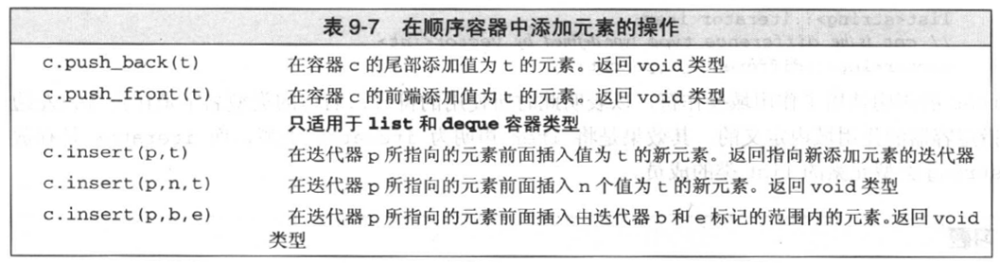

## STL(标准模板库)理论基础

### 基本概念

STL（Standard Template Library，标准模板库)是惠普实验室开发的一系列软件的统称。现然主要出现在C++中，但在被引入C++之前该技术就已经存在了很长的一段时间。

STL的从广义上讲分为三类：algorithm（算法）、container（容器）和iterator（迭代器），容器和算法通过迭代器可以进行无缝地连接。几乎所有的代码都采 用了模板类和模板函数的方式，这相比于传统的由函数和类组成的库来说提供了更好的代码重用机会。在C++标准中，STL被组织为下面的13个头文 件：&lt;algorithm>、&lt;deque>、&lt;functional>、&lt;iterator>、&lt;vector>、&lt;list>、&lt;map>、&lt;memory>、&lt;numeric>、&lt;queue>、&lt;set>、&lt;stack> 和&lt;utility>。


STL详细的说六大组件

- 容器（Container）
- 算法（Algorithm）
- 迭代器（Iterator）
- 仿函数（Function object）
- 适配器（Adaptor）
- 空间配制器（allocator）

使用STL的好处

（1）STL是C++的一部分，因此不用额外安装什么，它被内建在你的编译器之内。

（2）STL的一个重要特点是数据结构和算法的分离。尽管这是个简单的概念，但是这种分离确实使得STL变得非常通用。

例如，在STL的vector容器中，可以放入元素、基础数据类型变量、元素的地址；STL的sort()函数可以用来操作vector,list等容器。

（3）程序员可以不用思考STL具体的实现过程，只要能够熟练使用STL就OK了。这样他们就可以把精力放在程序开发的别的方面。

（4）STL具有高可重用性，高性能，高移植性，跨平台的优点。

高可重用性：STL中几乎所有的代码都采用了模板类和模版函数的方式实现，这相比于传统的由函数和类组成的库来说提供了更好的代码重用机会。关于模板的知识，已经给大家介绍了。

高性能：如map可以高效地从十万条记录里面查找出指定的记录，因为map是采用红黑树的变体实现的。(红黑树是平衡二叉树的一种)

高移植性：如在项目A上用STL编写的模块，可以直接移植到项目B上。

跨平台：如用windows的VisualStudio编写的代码可以在Mac OS的XCode上直接编译。

（5）程序员可以不用思考STL具体的实现过程，只要能够熟练使用STL就OK了。这样他们就可以把精力放在程序开发的别的方面。

（6）了解到STL的这些好处，我们知道STL无疑是最值得C++程序员骄傲的一部分。每一个C＋＋程序员都应该好好学习STL。只有能够熟练使用STL的程序员，才是好的C++程序员。

（7）总之：招聘工作中，经常遇到C++程序员对STL不是非常了解。大多是有一个大致的映像，而对于在什么情况下应该使用哪个容器和算法都感到比较茫然。STL是C++程序员的一项不可或缺的基本技能，掌握它对提升C++编程大有裨益。

### 容器

在实际的开发过程中，数据结构本身的重要性不会逊于操作于数据结构的算法的重要性，当程序中存在着对时间要求很高的部分时，数据结构的选择就显得更加重要。

经典的数据结构数量有限，但是我们常常重复着一些为了实现向量、链表等结构而编写的代码，这些代码都十分相似，只是为了适应不同数据的变化而在细节上有所出入。STL容器就为我们提供了这样的方便，它允许我们重复利用已有的实现构造自己的特定类型下的数据结构，通过设置一些模板，STL容器对最常用的数据结构提供了支持，这些模板的参数允许我们指定容器中元素的数据类型，可以将我们许多重复而乏味的工作简化。

容器部分主要由头文 件&lt;vector>,&lt;list>,&lt;deque>,&lt;set>,&lt;map>,&lt;stack>和&lt;queue>组成。对于常用的一些容器和容器适配器（可以看作由其它容器实现的容器），可以通过下表总结一下它们和相应头文件的对应关系。

#### 容器的概念

用来管理一组元素 


#### 容器的分类

- 序列式容器（Sequence containers）

每个元素都有固定位置，取决于插入时机和地点，和元素值无关。vector、deque、list 


- 关联式容器（Associated containers）

元素位置取决于特定的排序准则，和插入顺序无关，set、multiset、map、multimap

| 数据结构                 | 描述                                       | 实现头文件       |
| -------------------- | ---------------------------------------- | ----------- |
| 向量(vector)           | 连续存储的元素                                  | &lt;vector> |
| 列表(list)             | 由节点组成的双向链表，每个结点包含着一个元素                   | &lt;list>   |
| 双队列(deque)           | 连续存储的指向不同元素的指针所组成的数组                     | &lt;deque>  |
| 集合(set)              | 由节点组成的红黑树，每个节点都包含着一个元素，节点之间以某种作用于元素对的谓词排列，没有两个不同的元素能够拥有相同的次序 | &lt;set>    |
| 多重集合(multiset)       | 允许存在两个次序相等的元素的集合                         | &lt;set>    |
| 栈(stack)             | 后进先出的值的排列                                | &lt;stack>  |
| 队列(queue)            | 先进先出的执的排列                                | &lt;queue>  |
| 优先队列(priority_queue) | 元素的次序是由作用于所存储的值对上的某种谓词决定的的一种队列           | &lt;queue>  |
| 映射(map)              | 由{键，值}对组成的集合，以某种作用于键对上的谓词排列              | &lt;map>    |
| 多重映射(multimap)       | 允许键对有相等的次序的映射                            | &lt;map>    |

### 顺序容器的操作


#### 容器定义的类型别名


#### 容器的begin和end操作


#### 顺序容器添加元素



#### 顺序容器的大小操作


#### 顺序容器的访问操作


#### 顺序容器的删除操作

| 函数声明        | 功能描述     |
| ----------- | -------- |
| clear()     | 清空容器     |
| erase()     | 删除元素     |
| pop_front() | 删除第一个元素  |
| pop_back()  | 删除最后一个元素 |

#### 顺序容器的复制操作

| 函数声明     | 功能描述    |
| -------- | ------- |
| =        | c1 = c2 |
| swap()   | 交换容器的内容 |
| assign() |         |
|          |         |

### 迭代器

迭代器从作用上来说是最基本的部分，可是理解起来比前两者都要费力一些。软件设计有一个基本原则，所有的问题都可以通过引进一个间接层来简化，这种简化在STL中就是用迭代器来完成的。概括来说，迭代器在STL中用来将算法和容器联系起来，起着一种黏和剂的作用。几乎STL提供的所有算法都是通过迭代器存取元素序列进行工作的，每一个容器都定义了其本身所专有的迭代器，用以存取容器中的元素。

迭代器部分主要由头文件<utility>,<iterator>和<memory>组 成。<utility>是一个很小的头文件，它包括了贯穿使用在STL中的几个模板的声明，<iterator>中提供了迭代器使用的许多方法，而对于<memory>的描述则十分的困难，它以不同寻常的方式为容器中的元素分配存储空间，同时也为某些算法执行期间产生的临时对象提供机制,<memory>中的主要部分是模板类allocator，它负责产生所有容器中的默认分配器。

### 算法

函数库对数据类型的选择对其可重用性起着至关重要的作用。举例来说，一个求方根的函数，在使用浮点数作为其参数类型的情况下的可重用性肯定比使用整型作为它的参数类性要高。而C++通过模板的机制允许推迟对某些类型的选择，直到真正想使用模板或者说对模板进行特化的时候，STL就利用了这一点提供了相当多的有用算法。它是在一个有效的框架中完成这些算法的——可以将所有的类型划分为少数的几类，然后就可以在模版的参数中使用一种类型替换掉同一种类中的其他类型。

STL提供了大约100个实现算法的模版函数，比如算法for_each将为指定序列中的每一个元素调用指定的函数，stable_sort以你所指定的规则对序列进行稳定性排序等等。这样一来，只要熟悉了STL之后，许多代码可以被大大的化简，只需要通过调用一两个算法模板，就可以完成所需要的功能并大大地提升效率。

算法部分主要由头文件&lt;algorithm>，&lt;numeric>和&lt;functional>组 成。&lt;algorithm>是所有STL头文件中最大的一个（尽管它很好理解），它是由一大堆模版函数组成的，可以认为每个函数在很大程度上都是独立的，其中常用到的功能范围涉及到比较、交换、查找、遍历操作、复制、修改、移除、反转、排序、合并等等。&lt;numeric>体积很小，只包括几个在序列上面进行简单数学运算的模板函数，包括加法和乘法在序列上的一些操作。&lt;functional>中则定义了一些模板类，用以声明函数对象。

### C++标准库

C++强大的功能来源于其丰富的类库及库函数资源。C++标准库的内容总共在50个标准头文件中定义。在C++开发中，要尽可能地利用标准库完成。这样做的直接好处包括：

（1）成本：已经作为标准提供，何苦再花费时间、人力重新开发呢；
（2）质量：标准库的都是经过严格测试的，正确性有保证；
（3）效率：关于人的效率已经体现在成本中了，关于代码的执行效率要相信实现标准库的大牛们的水平；
（4）良好的编程风格：采用行业中普遍的做法进行开发。

在C++程序设计课程中，尤其是作为第一门程序设计课程，我们注重了语法、语言的机制等方面的内容。程序设计能力的培养有个过程，跨过基本的原理性知识直接进入到工程中的普遍做法，由于跨度决定了其难度。再者，在掌握了基本原理的基础上，在认识标准库的问题上完全可以凭借实践，逐步地掌握。标准库的学习不需要认认真真地读书，需要的是在了解概貌的情况下，在实践中深入。

这个任务就是要知道C++程序设计课程中不讲的，但对程序设计又很重要的这部分内容。至少我们要能先回答出“有什么”的问题。

C++标准库的内容分为10类，分别是（建议在阅读中，将你已经用过或听说过的头文件划出来）：　　

C1. 标准库中与语言支持功能相关的头文件

| 头文件            | 描述                                       |
| -------------- | ---------------------------------------- |
| &lt;cstddef>   | 定义宏NULL和offsetof，以及其他标准类型size_t和ptrdiff_t。与对应的标准C头文件的区别是，NULL是C++空指针常量的补充定义，宏offsetof接受结构或者联合类型参数，只要他们没有成员指针类型的非静态成员即可。 |
| &lt;limits>    | 提供与基本数据类型相关的定义。例如，对于每个数值数据类型，它定义了可以表示出来的最大值和最小值以及二进制数字的位数。 |
| &lt;climits>   | 提供与基本整数数据类型相关的C样式定义。这些信息的C++样式定义在&lt;limits>中 |
| &lt;cfloat>    | 提供与基本浮点型数据类型相关的C样式定义。这些信息的C++样式定义在&lt;limits>中 |
| &lt;cstdlib>   | 提供支持程序启动和终止的宏和函数。这个头文件还声明了许多其他杂项函数，例如搜索和排序函数，从字符串转换为数值等函数。它与对应的标准C头文件 stdlib.h不同，定义了abort(void)。abort()函数还有额外的功能，它不为静态或自动对象调用析构函数，也不调用传给 atexit()函数的函数。它还定义了exit()函数的额外功能，可以释放静态对象，以注册的逆序调用用atexit()注册的函数。清除并关闭所有 打开的C流，把控制权返回给主机环境。 |
| &lt;new>       | 支持动态内存分配                                 |
| &lt;typeinfo>  | 支持变量在运行期间的类型标识                           |
| &lt;exception> | 支持异常处理，这是处理程序中可能发生的错误的一种方式               |
| &lt;cstdarg>   | 支持接受数量可变的参数的函数。即在调用函数时，可以给函数传送数量不等的数据项。它定义了宏va_arg、va_end、va_start以及va_list类型 |
| &lt;csetjmp>   | 为C样式的非本地跳跃提供函数。这些函数在C++中不常用              |
| &lt;csignal>   | 为中断处理提供C样式支持                             |

C2. 支持流输入/输出的头文件 

| 头文件            | 描述                                       |
| -------------- | ---------------------------------------- |
| &lt;iostream>  | 支持标准流cin、cout、cerr和clog的输入和输出，它还支持多字节字符标准流wcin、wcout、wcerr和wclog。 |
| &lt;iomanip>   | 提供操纵程序，允许改变流的状态，从而改变输出的格式。               |
| &lt;ios>       | 定义iostream的基类                            |
| &lt;istream>   | 为管理输出流缓存区的输入定义模板类                        |
| &lt;ostream>   | 为管理输出流缓存区的输出定义模板类                        |
| &lt;sstream>   | 支持字符串的流输入输出                              |
| &lt;fstream>   | 支持文件的流输入输出                               |
| &lt;iosfwd>    | 为输入输出对象提供向前的声明                           |
| &lt;streambuf> | 支持流输入和输出的缓存                              |
| &lt;cstdio>    | 为标准流提供C样式的输入和输出                          |
| &lt;cwchar>    | 支持多字节字符的C样式输入输出                          |

C3. 与诊断功能相关的头文件 

| 头文件            | 描述                |
| -------------- | ----------------- |
| &lt;stdexcept> | 定义标准异常。异常是处理错误的方式 |
| &lt;cassert>   | 定义断言宏，用于检查运行期间的情形 |
| &lt;cerrno>    | 支持C样式的错误信息        |

C4. 定义工具函数的头文件 

| 头文件             | 描述                                       |
| --------------- | ---------------------------------------- |
| &lt;utility>    | 定义重载的关系运算符，简化关系运算符的写入，它还定义了pair类型，该类型是一种模板类型，可以存储一对值。这些功能在库的其他地方使用 |
| &lt;functional> | 定义了许多函数对象类型和支持函数对象的功能，函数对象是支持operator()()函数调用运算符的任意对象 |
| &lt;memory>     | 给容器、管理内存的函数和auto_ptr模板类定义标准内存分配器         |
| &lt;ctime>      | 支持系统时钟函数                                 |

C5. 支持字符串处理的头文件   

| 头文件          | 描述                                       |
| ------------ | ---------------------------------------- |
| &lt;string>  | 为字符串类型提供支持和定义，包括单字节字符串(由char组成)的string和多字节字符串(由wchar_t组成) |
| <cctype>     | 单字节字符类别                                  |
| &lt;cwctype> | 多字节字符类别                                  |
| &lt;cstring> | 为处理非空字节序列和内存块提供函数。这不同于对应的标准C库头文件，几个C样式字符串的一般C库函数被返回值为const和非const的函数对替代了 |
| &lt;cwchar>  | 为处理、执行I/O和转换多字节字符序列提供函数，这不同于对应的标准C库头文件，几个多字节C样式字符串操作的一般C库函数被返回值为const和非const的函数对替代了。 |
| &lt;cstdlib> | 为把单字节字符串转换为数值、在多字节字符和多字节字符串之间转换提供函数      |

C6. 定义容器类的模板的头文件  

| 头文件         | 描述                                       |
| ----------- | ---------------------------------------- |
| &lt;vector> | 定义vector序列模板，这是一个大小可以重新设置的数组类型，比普通数组更安全、更灵活 |
| &lt;list>   | 定义list序列模板，这是一个序列的链表，常常在任意位置插入和删除元素      |
| &lt;deque>  | 定义deque序列模板，支持在开始和结尾的高效插入和删除操作           |
| &lt;queue>  | 为队列(先进先出)数据结构定义序列适配器queue和priority_queue |
| &lt;stack>  | 为堆栈(后进先出)数据结构定义序列适配器stack                |
| &lt;map>    | map是一个关联容器类型，允许根据键值是唯一的，且按照升序存储。multimap类似于map，但键不是唯一的。 |
| &lt;set>    | set是一个关联容器类型，用于以升序方式存储唯一值。multiset类似于set，但是值不必是唯一的。 |
| &lt;bitset> | 为固定长度的位序列定义bitset模板，它可以看作固定长度的紧凑型bool数组  |

C7. 支持迭代器的头文件  

| 头文件           | 描述          |
| ------------- | ----------- |
| &lt;iterator> | 给迭代器提供定义和支持 |

C8. 有关算法的头文件  

| 头文件            | 描述                                |
| -------------- | --------------------------------- |
| &lt;algorithm> | 提供一组基于算法的函数，包括置换、排序、合并和搜索         |
| &lt;cstdlib>   | 声明C标准库函数bsearch()和qsort()，进行搜索和排序 |
| &lt;ciso646>   | 允许在代码中使用and代替&&                   |

C9. 有关数值操作的头文件  

| 头文件           | 描述                                       |
| ------------- | ---------------------------------------- |
| &lt;complex>  | 支持复杂数值的定义和操作                             |
| &lt;valarray> | 支持数值矢量的操作                                |
| &lt;numeric>  | 在数值序列上定义一组一般数学操作，例如accumulate和inner_product |
| &lt;cmath>    | 这是C数学库，其中还附加了重载函数，以支持C++约定               |
| &lt;cstdlib>  | 提供的函数可以提取整数的绝对值，对整数进行取余数操作               |

C10. 有关本地化的头文件  

| 头文件          | 描述                          |
| ------------ | --------------------------- |
| &lt;locale>  | 提供的本地化包括字符类别、排序序列以及货币和日期表示。 |
| &lt;clocale> | 对本地化提供C样式支持                 |

C++标准库的所有头文件都没有扩展名。C++标准库以<cname>形式的标准头文件提供。在 <cname>形式标准的头文件中，与宏相关的名称在全局作用域中定义，其他名称在std命名空间中声明。在C++中还可以使用name.h 形式的标准C库头文件名 

C11. 其他头文件

| 头文件    | 描述     |
| ------ | ------ |
| cctype | 字符操作函数 |
|        |        |
|        |        |

### 模板简要回顾

模板是实现代码重用机制的一种工具，实质就是实现类型参数化，即把类型定义为参数。C++提供两种模板：函数模板，类模板。

函数模板的简介

- 函数模板就是建立一个通用的函数，其函数返回类型和形参类型不具体指定，而是用虚拟的类型来代表。
- 凡是函数体相同的函数都可以用函数模板来代替，不必定义多个函数，只需在模板中定义一次即可。
- 在调用函数时系统会根据实参的类型来取代模板中的虚拟类型，从而实现了不同函数的功能。

类模板的简介

- 我们先来看一下下面这个类，求最大值的类
- 和函数模板一样，类模板就是建立一个通用类，其数据成员的类型、成员函数的返回类型和参数类形都可以不具体指定，而用虚拟的类型来代表。
- 当使用类模板建立对象时，系统会根据实参的类型取代类模板中的虚拟类型，从而实现不同类的功能。

### 案例

```C++
#include <iostream>
using namespace std;

#include "vector"
#include "algorithm"

//容器中装基础数据类型变量
void main11()
{
	vector<int>  v1; // 1. 容器: 把你的元素copy到容器中 
	v1.push_back(-1);
	v1.push_back(1);
	v1.push_back(3);
	v1.push_back(5);
	v1.push_back(3);

	//2. 迭代器: 相当于一个指针分类
	for (vector<int>::iterator it = v1.begin();it != v1.end(); it++)
	{
		cout << *it << " ";
	}

	//3. 算法，算法和迭代器进行无缝的连接 
	int num1 = count(v1.begin(), v1.end(), 3);
	cout << "num1: " << num1 <<endl;
}

class  Teacher
{
public:
	int		age;
	char	name[64];
public:
	void printT()
	{
		cout << "age: " << age << endl;
	}
};

//容器中装元素
void main12()
{
	Teacher  t1, t2, t3;
	t1.age = 31;
	t2.age = 32;
	t3.age = 33;

  	// 1. 容器: 把你的元素copy到容器中
  	// 容器实现了数据类型和算法的有效分离
	vector<Teacher>  v1;
	v1.push_back(t1);
	v1.push_back(t2);
	v1.push_back(t3);

	//2迭代器: 相当于一个指针分类
	for (vector<Teacher>::iterator it = v1.begin();it != v1.end(); it++)
	{
		cout << it->age << " ";
	}

	//3算法  算法和迭代器 进行无缝的连接 
	//int num1 = count(v1.begin(), v1.end(), 3);
	//cout << "num1: " << num1 <<endl;
	//抛砖: 如何求 容器 中 老师结点的 年龄=33 个数....
}

//容器中 装 元素
void main13()
{
	Teacher  t1, t2, t3;
	t1.age = 31;
	t2.age = 32;
	t3.age = 33;
	Teacher *p1, *p2, *p3 ;
	p1 = &t1;
	p2 = &t2;
	p3 = &t3;

	vector<Teacher *>  v1; // 1容器: 把t1 t2 t3内存首地址 放入到了容器
	v1.push_back(p1);
	v1.push_back(p2);
	v1.push_back(p3);

	//2迭代器: 相当于一个指针 分类
	for (vector<Teacher *>::iterator it = v1.begin();it != v1.end(); it++)
	{
		cout << (*it)->age << endl;
	}

	//3算法  算法和迭代器 进行无缝的连接 
	//int num1 = count(v1.begin(), v1.end(), 3);
	//cout << "num1: " << num1 <<endl;
}

void main111()
{
	//main11();
	//main12();
	main13();
	system("pause");
	return ;
}
```