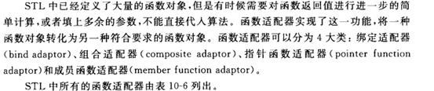
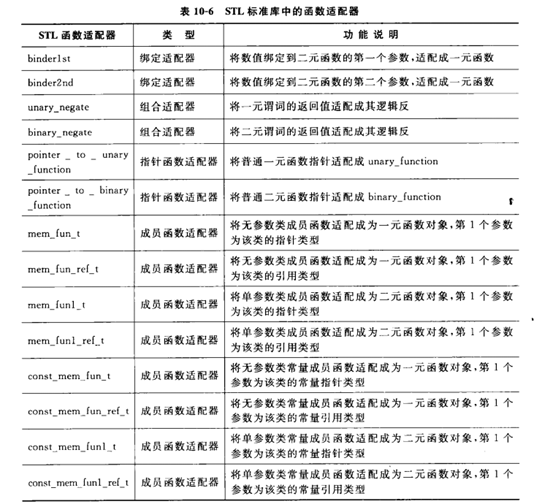
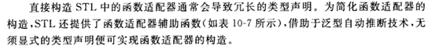
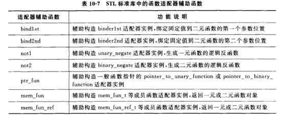
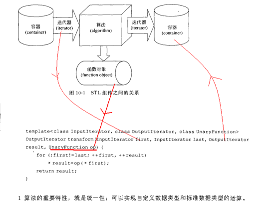

### 函数对象和谓词定义

函数对象（仿函数）：

重载函数调用操作符的类，其对象常称为函数对象（functionobject），即它们是行为类似函数的对象。一个类对象，表现出一个函数的特征，就是通过“对象名+(参数列表)”的方式使用一个类对象，如果没有上下文，完全可以把它看作一个函数对待。

这是通过重载类的operator()来实现的。

“在标准库中，函数对象被广泛地使用以获得弹性”，标准库中的很多算法都可以使用函数对象或者函数来作为自定的回调行为；

谓词(predicate)：

一元函数对象：函数参数1个；
二元函数对象：函数参数2个；
一元谓词，函数参数1个，函数返回值是bool类型，可以作为一个判断式。
谓词可以是一个仿函数，也可以是一个回调函数。
二元谓词，函数参数2个，函数返回值是bool类型。

一元谓词函数举例如下

1、判断给出的string对象的长度是否小于6

```C++
bool GT6(const string &s)
{
	return s.size()>= 6;
}
```

2、判断给出的int是否在3到8之间
```C++
bool Compare( int i )
{
	return ( i >=3 && i <= 8 );
}
```

二元谓词举例如下

1、比较两个string对象，返回一个bool值，指出第一个string是否比第二个短

```C++
bool isShorter(const string &s1, conststring &s2)
{
	return s1.size()< s2.size();
}
```

### 一元函数对象案例

```C++
//1普通类 重载 函数调用操作符
template <typename T>
void FuncShowElemt(T &t)  //普通函数 不能像 仿函数那样记录状态
{
    cout<< t << " ";
};
void showChar(char &t)
{
    cout<< t << " ";
}
//函数模板 重载 函数调用操作符
template <typename T>
class ShowElemt
{
public:
    ShowElemt()
    {
         n= 0;
    }
    voidoperator()(T &t)
    {
         n++;
         cout<< t << " ";
    }
    voidprintCount()
    {
         cout<< n << endl;
    }
public:
    intn;
};
//1 函数对象 基本使用
void main11()
{
    inta = 100;
    FuncShowElemt<int>(a);//普通的函数调用
    ShowElemt<int>showElemt; //函数对象
    showElemt(a);//函数对象调用 
}
```

### 一元谓词案例

```C++
//1元谓词 例子
template <typename T>
class Isdiv
{
public:
    Isdiv(constT &divisor)
    {
         this->divisor= divisor;
    }
    booloperator()(T &t)
    {
         return(t%divisor == 0);
    }
protected:
private:
    Tdivisor;
};
void main13()
{
    vector<int>v2;
    for(int i=10; i<33; i++)
    {
         v2.push_back(i);
    }
    vector<int>::iteratorit;
    inta = 4;
    Isdiv<int>mydiv(a);
    //_InIt find_if(_InIt _First, _InIt _Last, _Pr _Pred)   //返回的是迭代器
    it= find_if(v2.begin(), v2.end(), Isdiv<int>(4));
    if(it != v2.end())
    {
         cout<< "第一个被4整除的数是：" << *it << endl;
    }
}
```

```C++
template<typename T>
class IsDiv
{
public:
	IsDiv(const T &divisor)
	{
		this->divisor = divisor;
	}
	bool operator()(T  &t)
	{
		return (t%divisor == 0);
	}
private:
	T divisor;
};

void main()
{
	vector<int> v2;
	for (int i=10; i<33; i++)
	{
		v2.push_back(i);
	}
	int a = 4;
	IsDiv<int> myDiv(a);

	//find_if(v2.begin(), v2.end(), myDiv );

	/*
	template<class _InIt,
	class _Pr> inline
		_InIt find_if(_InIt _First, _InIt _Last, _Pr _Pred)
	{	// find first satisfying _Pred
		_DEBUG_RANGE(_First, _Last);
		_DEBUG_POINTER(_Pred);
		return (_Rechecked(_First,
			_Find_if(_Unchecked(_First), _Unchecked(_Last), _Pred)));
	} 
	//要点: 分清楚 stl算法返回的值是迭代器 还是 谓词（函数对象） 是stl算法入门的重要点
	*/
	
	vector<int>::iterator it;
  	//find_if返回值是一个迭代器
	it = find_if(v2.begin(), v2.end(), IsDiv<int>(a) );
	if (it == v2.end())
	{
		cout << "容器中没有被4整除的元素" << endl;
	}
	else
	{
		cout <<"第一个是被4整除的元素是:" << *it << endl;
	}
}
```

### 二元函数对象案例

```C++
template <typename T>
struct SumAdd
{
    Toperator()(T &t1, T &t2)
    {
         returnt1 + t2;
    }
};
template <typename T>
void printE(T &t)
{
    for(vector<int>::iterator it = t.begin(); it!=t.end(); it++ )
    {
         cout<< *it << " ";
    }
}
void printVector(vector<int> &v)
{
    for(vector<int>::iterator it = v.begin(); it!=v.end(); it++ )
    {
         cout<< *it << " ";
    }
}
void main14()
{
    vector<int>v1, v2 ;
    vector<int>v3;
    v1.push_back(1);
    v1.push_back(2);
    v1.push_back(3);
    v2.push_back(4);
    v2.push_back(5);
    v2.push_back(6);
    v3.resize(10);
    //transform(v1.begin(),v1.end(), v2.begin(),v3.begin(), SumAdd<int>());
    /*
    template<class_InIt1,
    class_InIt2,
    class_OutIt,
    class_Fn2> inline
         _OutIttransform(_InIt1 _First1, _InIt1 _Last1,
         _InIt2_First2, _OutIt _Dest, _Fn2 _Func)
    */
    vector<int>::iteratorit = 
      transform(v1.begin(), v1.end(), v2.begin(),v3.begin(),SumAdd<int>());
    cout<< *it << endl;
    printE(v3);        
}
```

```C++
//二元函数对象
template <typename T>
class SumAdd
{
public:
	T operator()(T t1, T t2)
	{
		return t1 + t2;
	}
};

void main()
{
	//v1 v2 ==> v3
	vector<int> v1, v2;
	vector<int> v3;
	v1.push_back(1);
	v1.push_back(3);
	v1.push_back(5);

	v2.push_back(2);
	v2.push_back(4);
	v2.push_back(6);

	v3.resize(10);

	/*
	template<class _InIt1,
	class _InIt2,
	class _OutIt,
	class _Fn2> inline
		_OutIt transform(_InIt1 _First1, _InIt1 _Last1,
		_InIt2 _First2, _OutIt _Dest, _Fn2 _Func)
	{	// transform [_First1, _Last1) and [_First2, ...) with _Func
		_DEBUG_RANGE(_First1, _Last1);
		_DEBUG_POINTER(_Dest);
		_DEBUG_POINTER(_Func);
		if (_First1 != _Last1)
			return (_Transform2(_Unchecked(_First1), _Unchecked(_Last1),
			_First2, _Dest, _Func,
			_Is_checked(_Dest)));
		return (_Dest);
	}
	*/
	//transform 把运算结果的 迭代器的开始位置 返回出来 
	transform(v1.begin(), v1.end(), v2.begin(), v3. (), SumAdd<int>() );

	for (vector<int>::iterator it=v3.begin(); it!=v3.end(); it++ )
	{
		cout << *it << " ";
	}
	cout << endl;
}
```

### 二元谓词案例

```C++
void current(int &v)
{
    cout<< v << " ";
}
bool MyCompare(const int &a, const int&b)
{
    returna < b;
}
void main15()
{
    vector<int>v(10);
    for(int i=0; i<10; i++)
    {
         v[i]= rand() % 100;
    }
    for_each(v.begin(),v.end(), current);
    printf("\n");
    sort(v.begin(),v.end(), MyCompare );
    printf("\n");
    for(int i=0; i<10; i++)
    {
         printf("%d", v[i]);
    }
    printf("\n");
}
```

```C++
bool MyCompare(const int &a, const int &b)
{
	return a < b; //从小到大
}

//普通函数
void FuncShowElemt2(int &t)
{
	cout << t << " ";
}

void main()
{
	vector<int> v1(10);

	for (int i=0; i<10; i++)
	{
		int tmp = rand() %100;
		v1[i] = tmp;
	}

	for (vector<int>::iterator it=v1.begin(); it!=v1.end(); it++ )
	{
		cout << *it <<" ";
	}
	cout << endl;
	for_each(v1.begin(), v1.end(), FuncShowElemt2);
	cout << endl;

	sort(v1.begin(), v1.end(), MyCompare);
	for_each(v1.begin(), v1.end(), FuncShowElemt2);
	cout << endl;
}
```

二元谓词在set集合中的应用

```C++
struct CompareNoCase
{
	bool operator()(const string &str1, const string &str2)
	{
		string str1_ ;
		str1_.resize(str1.size() );
		transform(str1.begin(), str1.end(), str1_.begin(), tolower ); //预定义函数对象 

		string str2_ ;
		str2_.resize(str2.size() );
		transform(str2.begin(), str2.end(), str2_.begin(), tolower ); //预定义函数对象 

		return (str1_ < str2_); // 从小到大进行排序
	}
};

void  main()
{
	set<string> set1;
	set1.insert("bbb");
	set1.insert("aaa");
	set1.insert("ccc");
	set<string>::iterator it = set1.find("aAa"); //find函数 默认 区分大小写
	if (it == set1.end())
	{
		cout << " 没有 查找到 aaa " << endl;
	}
	else
	{
		cout << " 查找到 aaa " << endl;
	}

	set<string, CompareNoCase> set2;
	set2.insert("bbb");
	set2.insert("aaa");
	set2.insert("ccc");

	set<string, CompareNoCase>::iterator it2 = set2.find("aAa");
	if (it2 == set2.end())
	{
		cout << " 没有 查找到 aaa " << endl;
	}
	else
	{
		cout << " 不区分大小的的查找  查找到 aaa " << endl;
	}
}
```

### 预定义函数对象和函数适配器

1）预定义函数对象基本概念：标准模板库STL提前定义了很多预定义函数对象，`#include <functional>` 必须包含。

```C++
//1使用预定义函数对象
//类模板plus<> 的实现了： 不同类型的数据进行加法运算
void main41()
{
    plus<int>intAdd;
    intx = 10;
    inty = 20;
    intz = intAdd(x, y); //等价于 x + y 
    cout<< z << endl;
    plus<string>stringAdd;
    stringmyc = stringAdd("aaa", "bbb");
    cout<< myc << endl;
    vector<string>v1;
    v1.push_back("bbb");
    v1.push_back("aaa");
    v1.push_back("ccc");
    v1.push_back("zzzz");
    //缺省情况下，sort()用底层元素类型的小于操作符以升序排列容器的元素。
    //为了降序，可以传递预定义的类模板greater,它调用底层元素类型的大于操作符：
    cout<< "sort()函数排序" << endl;;
    sort(v1.begin(),v1.end(), greater<string>() ); //从大到小
    for(vector<string>::iterator it=v1.begin(); it!=v1.end(); it++ )
    {
         cout<< *it << endl;
    }
}
```

2）算术函数对象
预定义的函数对象支持加、减、乘、除、求余和取反。调用的操作符是与type相关联的实例

| 函数对象                 | 功能描述 |
| -------------------- | ---- |
| plus&lt;Types>       | 加法   |
| minus&lt;Types>      | 减法   |
| multiplies&lt;Types> | 乘法   |
| divides&lt;Tpye>     | 除法   |
| modulus&lt;Tpye>     | 求余   |
| negate&lt;Type>      | 取反   |

```C++
void main()
{
	/*
	template<class _Ty>
	struct plus
		: public binary_function<_Ty, _Ty, _Ty>
	{	// functor for operator+
		_Ty operator()(const _Ty& _Left, const _Ty& _Right) const
		{	// apply operator+ to operands
			return (_Left + _Right);
		}
	};
	*/
	plus<int> intAdd;
	int x = 10; 
	int y = 20;
	int z = intAdd(x, y); // x + y 
	cout << "z:" << z << endl;

	plus<string> stringAdd;

	string s1 = "aaa";
	string s2 = "bbb";
	string s3 = stringAdd(s1, s2);
	cout << "s3:" << s3 << endl;

	vector<string> v1;
	v1.push_back("bbb");
	v1.push_back("aaa");
	v1.push_back("ccc");
	v1.push_back("zzz");
	v1.push_back("ccc");
	v1.push_back("ccc");

	/*
	template<class _Ty>
	struct greater
		: public binary_function<_Ty, _Ty, bool>
	{	// functor for operator>
		bool operator()(const _Ty& _Left, const _Ty& _Right) const
		{	// apply operator> to operands
			return (_Left > _Right);
		}
	};
	*/
	sort(v1.begin(), v1.end(), greater<string>() );

	for (vector<string>::iterator it=v1.begin(); it!=v1.end(); it++)
	{
		cout << *it << endl;
	}

	//求 ccc 出现的个数
	string sc = "ccc";

	//equal_to<string>() 有两个参数 left参数来自容器，right参数来自sc
	//bind2nd函数适配器 ：把预定义函数对象 和 第二个参数进行绑定
	int num = count_if(v1.begin(), v1.end(), bind2nd(equal_to<string>(), sc) );
	cout << "num: " << num << endl;
}

negate<int> intNegate;
ires = intNegate(ires);
Ires= UnaryFunc(negate<int>(),Ival1);
```

3）关系函数对象

| 函数对象                   | 功能描述 |
| ---------------------- | ---- |
| equal_to&lt;Tpye>      | 等于   |
| not_equal_to&lt;Type>  | 不等于  |
| greater&lt;Type>       | 大于   |
| greater_equal&lt;Type> | 大于等于 |
| less&lt;Type>          | 小于   |
| less_equal&lt;Type>    | 小于等于 |

```C++
void main42()
{
		equal_to<string> stringEqual;
		sres = stringEqual(sval1,sval2);
		
    vector<string>v1;
    v1.push_back("bbb");
    v1.push_back("aaa");
    v1.push_back("ccc");
    v1.push_back("zzzz");
    v1.push_back("ccc");
    strings1 = "ccc";
    //intnum = count_if(v1.begin(),v1.end(), equal_to<string>(),s1);
    intnum = count_if(v1.begin(),v1.end(),bind2nd(equal_to<string>(), s1));
    cout<< num << endl;
} 
```

4）逻辑函数对象

| 函数对象                 | 功能描述 |
| -------------------- | ---- |
| logical_and&lt;Type> | 逻辑与  |
| logical_or<Type>     | 逻辑或  |
| logical_not&lt;Type> | 逻辑非  |

```
logical_and<int> indAnd;
ires = intAnd(ival1,ival2);
dres=BinaryFunc( logical_and<double>(),dval1,dval2);

logical_not<int> IntNot;
Ires = IntNot(ival1);
Dres=UnaryFunc( logical_not<double>,dval1);
```

### 函数适配器

1）函数适配器的理论知识









2）常用函数函数适配器

标准库提供一组函数适配器，用来特殊化或者扩展一元和二元函数对象。常用适配器是：

绑定器（binder）: binder通过把二元函数对象的一个实参绑定到一个特殊的值上，将其转换成一元函数对象。C＋＋标准库提供两种预定义的binder适配器：bind1st和bind2nd，前者把值绑定到二元函数对象的第一个实参上，后者绑定在第二个实参上。

取反器(negator) :negator是一个将函数对象的值翻转的函数适配器。标准库提供两个预定义的ngeator适配器：not1翻转一元预定义函数对象的真值,而not2翻转二元谓词函数的真值。

常用函数适配器列表如下：

| 函数适配器              | 功能描述              |
| ------------------ | ----------------- |
| bind1st(op, value) | 绑定固定值到二元函数的第一参数位置 |
| bind2nd(op, value) | 绑定固定值到二元函数的第二参数位置 |
| not1(op)           | 生成一元函数的逻辑反函数      |
| not2(op)           | 生成二元函数的逻辑反函数      |
| mem_fun_ref(op)    | 返回一元或二元函数对象       |
| mem_fun(op)        | 返回一元或二元函数对象       |
| ptr_fun(op)        |                   |

3）常用函数适配器案例

```C++
class IsGreat
{
public:
    IsGreat(inti)
    {
         m_num= i;
    }
    booloperator()(int &num)
    {
         if(num > m_num)
         {
                  returntrue;
         }
         returnfalse;
    }
private:
    intm_num;
};
void main43()
{
    vector<int>  v1;
    for(int i=0; i<5; i++)
    {
         v1.push_back(i+1);
    }
    for(vector<int>::iterator it = v1.begin(); it!=v1.end(); it ++)
    {
         cout<< *it << " " ;
    }
    intnum1 = count(v1.begin(), v1.end(), 3);
    cout<< "num1:" << num1 << endl;
    //通过谓词求大于2的个数
    intnum2 = count_if(v1.begin(), v1.end(), IsGreat(2)); 
    cout<< "num2:" << num2 << endl;
    // 通过预定义函数对象求大于2的个数   greater<int>() 有2个参数 
    // param> 2
    intnum3 = count_if(v1.begin(), v1.end(), bind2nd(greater<int>(), 2 ) );
    cout<< "num3:" << num3 << endl;
    //取模 能被2整除的数 求奇数
    intnum4 = count_if(v1.begin(), v1.end(), bind2nd(modulus <int>(), 2 ) ); 
    cout<< "奇数num4:" << num4 << endl;
    intnum5 = count_if(v1.begin(), v1.end(), not1( bind2nd(modulus <int>(), 2 )) ); 
    cout<< "偶数num5:" << num5 << endl;
    return;
}
```
```C++
class IsGreat
{
public:
	IsGreat(int i)
	{
		m_num = i;
	}
	bool operator()(int &num)
	{
		if (num > m_num)
		{
			return true;
		}
		return false;
	}
private:
	int m_num;
};

void main()
{
	vector<int> v1;
	for (int i=0; i<10; i++)
	{
		v1.push_back(i+1);
	}
	for (vector<int>::iterator it=v1.begin(); it!=v1.end(); it++ )
	{
		cout << *it << " ";
	}
	cout << endl;

	int num1 = count(v1.begin(), v1.end(), 3);
	cout << "num1:" << num1 <<endl;

	//通过 谓词 求大于2 的个数
	int num2 = count_if(v1.begin(), v1.end(),  IsGreat(2));
	cout << "num2:" << num2 <<endl;

	/*
	template<class _Ty>
	struct greater
		: public binary_function<_Ty, _Ty, bool>
	{	// functor for operator>
		bool operator()(const _Ty& _Left, const _Ty& _Right) const
		{	// apply operator> to operands
			return (_Left > _Right);
		}
	};
	*/
	//通过 预定义的函数对象 求大于2 的个数
	//greater<int>() 有两个参数 左参数来自容器的元素 ，右参数固定成2 （通过bind2nd做的）
	int num3 = count_if(v1.begin(), v1.end(), bind2nd (greater<int>(), 2) );
	cout << "num3:" << num3 <<endl;

	//求 奇数的个数
	int num4 = count_if(v1.begin(), v1.end(), bind2nd (modulus<int>(), 2) );
	cout << "奇数的个数num4:" << num4 <<endl;

	//求 偶数的个数 取反器(negator) 
	int num5 = count_if(v1.begin(), v1.end(), not1( bind2nd (modulus<int>(), 2) ) );
	cout << "偶数的个数 num5:" << num5 <<endl;
}
```

### STL的容器算法迭代器的设计理念



- STL的容器通过类模板技术，实现数据类型和容器模型的分离
- STL的迭代器技术实现了遍历容器的统一方法；也为STL的算法提供了统一性奠定了基础
- STL的算法，通过函数对象实现了自定义数据类型的算法运算；所以说：STL的算法也提供了统一性。
- 核心思想：其实函数对象本质就是回调函数，回调函数的思想：就是任务的编写者和任务的调用者有效解耦合。函数指针做函数参数。
- 具体例子：transform算法的输入，通过迭代器first和last指向的元算作为输入；通过result作为输出；通过函数对象来做自定义数据类型的运算。
- 分清楚 stl 算法返回的值是迭代器还是谓词（函数对象）是stl算法入门的重要点

### 函数对象和普通函数的异同

- 函数对象是属于类对象,能突破函数的概念,能保持调用状态信息
- 函数对象的好处：函数对象做函数参数；函数对象当返回值