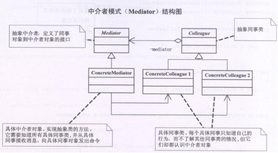

## 中介者模式

Mediator模式也叫中介者模式，是由GoF提出的23种软件设计模式的一种。Mediator模式是行为模式之一，在Mediator模式中，类之间的交互行为被统一放在Mediator的对象中，对象通过Mediator对象同其他对象交互，Mediator对象起着控制器的作用。

Mediator 调停者模式 

调停者模式：调停者模式包装了一系列对象相互作用的方式，使得这些对象不必相互明显作用。从而使他们可以松散偶合。  

当某些对象之间的作用发生改变时，不会立即影响其他的一些对象之间的作用。  

保证这些作用可以彼此独立的变化。调停者模式将多对多的相互作用转化为一对多的相互作用。调停者模式将对象的行为和协作抽象化，把对象在小尺度的行为上与其他对象的相互作用分开处理。

四个MM打麻将，相互之间谁应该给谁多少钱算不清楚了，幸亏当时我在旁边，按照各自的筹码数算钱，赚了钱的从我这里拿，赔了钱的也付给我，一切就OK啦，俺得到了四个MM的电话。

中介者模式，找不到老婆可以相亲靠婚介 

## 类图角色和职责

GOOD：用一个中介对象来封装一系列的对象交互，中介者使各对象不需要显示的相互引用，从而降低耦合；而且可以独立地改变它们之间的交互。



- Mediator抽象中介者：中介者类的抽象父类
- concreteMediator：具体的中介者类
- Colleague：关联类的抽象父类
- concreteColleague：具体的关联类

适用于：用一个中介对象，封装一些列对象（同事）的交换，中介者是各个对象不需要显示的相互作用，从而实现了耦合松散，而且可以独立的改变他们之间的交换。

## 优点

- 将系统按功能分割成更小的对象，符合类的最小设计原则
- 对关联对象的集中控制
- 减小类的耦合程度，明确类之间的相互关系：当类之间的关系过于复杂时，其中任何一个类的修改都会影响到其他类，不符合类的设计的开闭原则 ，而Mediator模式将原来相互依存的多对多的类之间的关系简化为Mediator控制类与其他关联类的一对多的关系，当其中一个类修改时，可以对其他关联类不产生影响（即使有修改，也集中在Mediator控制类）。
- 有利于提高类的重用性

## 示例代码

```C++
#include <iostream>
#include "string"
using namespace std;

class Person
{
public:
	Person(string name, int sex, int condi)
	{
		m_name = name;
		m_sex = sex;
		m_condi = condi;
	}
  
	string getName()
	{
		return m_name;
	}
  
	int getSex()
	{
		return m_sex;
	}
  
	int getCondi()
	{
		return m_condi;
	}
  
	virtual void getParter(Person *p) = 0;

protected:
	string	m_name;
	int		m_sex;
	int		m_condi;
};

class Woman : public Person
{
public:
	Woman(string name, int sex, int condi) : Person(name, sex, condi)
	{

	}
  
	virtual void getParter(Person *p)
	{
		if (this->m_sex == p->getSex())
		{
			cout << "我不是同性恋..." << endl;
		}
      
		if (this->getCondi() == p->getCondi() )
		{
			cout << this->getName() << " 和 " << p->getName() << "绝配 " <<endl;
		}
		else
		{
			cout << this->getName() << " 和 " << p->getName() << "不配 " <<endl;
		}
	}
};

class Man : public Person
{
public:
	Man(string name, int sex, int condi) : Person(name, sex, condi)
	{

	}
	virtual void getParter(Person *p)
	{
		if (this->m_sex == p->getSex())
		{
			cout << "我不是同性恋..." << endl;
		}
      
		if (this->getCondi() == p->getCondi() )
		{
			cout << this->getName() << " 和 " << p->getName() << "绝配 " <<endl;
		}
		else
		{
			cout << this->getName() << " 和 " << p->getName() << "不配 " <<endl;
		}
	}
};

void main()
{
	//string name, int sex, int condi
	Person *xiaofang = new Woman("小芳", 2, 5);

	Person *zhangsan = new Man("张三", 1, 4);

	Person *lisi = new Man("李四", 1, 5);
	xiaofang->getParter(zhangsan);

	xiaofang->getParter(lisi);

	system("pause");
	return ;
}
```
以上 Woman  Man 类的太紧密，需要解耦合

```C++
#include <iostream>
#include "string"
using namespace std;

class Mediator;

class Person
{
public:
	Person(string name, int sex, int condi, Mediator *m)
	{
		m_name = name;
		m_sex = sex;
		m_condi = condi;
		mediator = m;
	}
  
	string getName()
	{
		return m_name;
	}
  
	int getSex()
	{
		return m_sex;
	}
  
	int getCondi()
	{
		return m_condi;
	}
  
	virtual void getParter(Person *p) = 0;

protected:
	string	m_name;
	int		m_sex;
	int		m_condi;
	 Mediator *mediator;
};

class Mediator
{
public:
	void setMan(Person *man)
	{
		pMan = man;
	}
  
	void setWoman(Person *woman)
	{
		pWoman = woman;
	}

public:
	virtual void getParter() 
	{
		if (pWoman->getSex() == pMan->getSex())
		{
			cout << "同性恋 之间 不能找对象 " << endl;
		}
      
		if (pWoman->getCondi() == pMan->getCondi() )
		{
			cout << pWoman->getName() << " 和 " << pMan->getName() << "绝配 " <<endl;
		}
		else
		{
			cout << pWoman->getName() << " 和 " << pMan->getName() << "不配 " <<endl;
		}
	}
  
private:
	Person	*pMan; 
	//list<Person *> m_list;
	Person	*pWoman;
};

class Woman : public Person
{
public:
	Woman(string name, int sex, int condi, Mediator *m) : Person(name, sex, condi, m)
	{

	}
  
	virtual void getParter(Person *p)
	{
		mediator->setMan(p);
		mediator->setWoman(this);
		mediator->getParter(); //找对象 
	}
};

class Man : public Person
{
public:
	Man(string name, int sex, int condi, Mediator *m) : Person(name, sex, condi, m)
	{

	}
  
	virtual void getParter(Person *p)
	{
		mediator->setMan(this);
		mediator->setWoman(p);
		mediator->getParter(); //找对象 
	}
};

void main()
{
	//string name, int sex, int condi
	Mediator *m = new Mediator;
	Person *xiaofang = new Woman("小芳", 2, 5, m);

	Person *zhangsan = new Man("张三", 1, 4, m);

	Person *lisi = new Man("李四", 1, 5, m);
	xiaofang->getParter(zhangsan);

	xiaofang->getParter(lisi);

	system("pause");
	return ;
}
```

```C++
#include<iostream>  
#include <string>  
using namespace std; 
  
class Country;  
  
class UniteNations  
{  
public:  
    virtual void declare(string message, Country *colleague) = 0;  
};  
  
class Country  
{  
protected:  
    UniteNations *mediator;  
public:  
    Country(UniteNations *mediator)  
    {  
        this->mediator = mediator;  
    }  
};  
  
class USA :public Country  
{  
public:  
    USA(UniteNations *mediator) :Country(mediator)  
    {}  
    void declare(string message)  
    {  
        cout << "美发布信息: " << message << endl;  
        mediator->declare(message, this);  
    }  
    void getMessage(string message)  
    {  
        cout << "美国获得对方信息: " << message << endl;  
    }  
};  
  
class Iraq :public Country  
{  
public:  
    Iraq(UniteNations *mediator) :Country(mediator)  
    {}  
    void declare(string message)  
    {  
        cout << "伊拉克发布信息: " << message << endl;  
        mediator->declare(message, this);  
    }  
    void getMessage(string message)  
    {  
        cout << "伊拉克获得对方信息: " << message << endl;  
    }  
};  
  
class UnitedNationsSecurityCouncil :public UniteNations  
{  
public:  
    USA *usa;  
    Iraq *iraq;  
    void declare(string message, Country *colleague)  
    {  
        if (colleague == usa)  
        {  
            iraq->getMessage(message);  
        }  
        else  
        {  
            usa->getMessage(message);  
        }  
    }  
};  
  
int main()  
{  
    UnitedNationsSecurityCouncil *unsc = new UnitedNationsSecurityCouncil();  
  
    USA *c1 = new USA(unsc);  
    Iraq *c2 = new Iraq(unsc);  
  
    unsc->usa = c1;  
    unsc->iraq = c2;  
  
    c1->declare("不准开发核武器，否则打你！");  
    c2->declare("他妈的美国去死！");  
  
    cin.get();  
    return 0;  
}  
```
```c++
#include <iostream>
#include <string>
#include <vector>
using namespace std;

class Colleague;
//中介者类
class Mediator
{
public:
	virtual void Send(string message,Colleague* col) = 0;
};
//抽象同事类
class Colleague
{
protected:
	Mediator* mediator;
public:
	Colleague(Mediator* temp)
	{
		mediator = temp;
	}
};
//同事一
class Colleague1 : public Colleague
{
public:
	Colleague1(Mediator* media) : Colleague(media){}

	void Send(string strMessage)
	{
		mediator->Send(strMessage,this);
	}

	void Notify(string strMessage)
	{
		cout<<"同事一获得了消息"<<strMessage<<endl;
	}
};

//同事二
class Colleague2 : public Colleague
{
public:
	Colleague2(Mediator* media) : Colleague(media){}

	void Send(string strMessage)
	{
		mediator->Send(strMessage,this);
	}

	void Notify(string strMessage)
	{
		cout<<"同事二获得了消息"<<strMessage<<endl;
	}
};

//具体中介者类
class ConcreteMediator : public Mediator
{
public:
	Colleague1 * col1;
	Colleague2 * col2;
	virtual void Send(string message,Colleague* col)
	{
		if(col == col1)
			col2->Notify(message);
		else 
			col1->Notify(message);
	}
};

//客户端：
int main()
{
	ConcreteMediator * m = new ConcreteMediator();

	//让同事认识中介
	Colleague1* col1 = new Colleague1(m);
	Colleague2* col2 = new Colleague2(m);

	//让中介认识具体的同事类
	m->col1 = col1;
	m->col2 = col2;

	col1->Send("吃饭了吗？");
	col2->Send("还没吃，你请吗？");
	return 0;
}
```