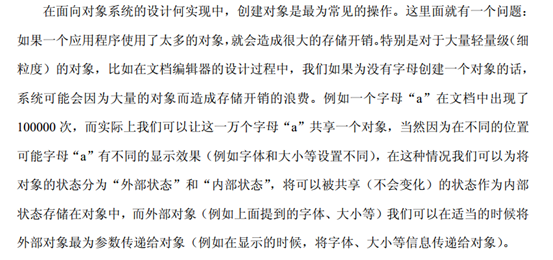

## 享元模式

Flyweight模式也叫享元模式，是构造型模式之一，它通过与其他类似对象共享数据来减小内存占用。



享元模式：FLYWEIGHT在拳击比赛中指最轻量级。  

享元模式以共享的方式高效的支持大量的细粒度对象。  

享元模式能做到共享的关键是区分内蕴状态和外蕴状态。  

内蕴状态存储在享元内部，不会随环境的改变而有所不同。  

外蕴状态是随环境的改变而改变的。外蕴状态不能影响内蕴状态，它们是相互独立的。将可以共享的状态和不可以共享的状态从常规类中区分开来，将不可以共享的状态从类里剔除出去。客户端不可以直接创建被共享的对象，而应当使用一个工厂对象负责创建被共享的对象。  

享元模式大幅度的降低内存中对象的数量。 

每天跟MM发短信，手指都累死了，最近买了个新手机，可以把一些常用的句子存在手机里，要用的时候，直接拿出来，在前面加上MM的名字就可以发送了，再不用一个字一个字敲了。 

共享的句子就是Flyweight，MM的名字就是提取出来的外部特征，根据上下文情况使用。  

## 类图角色和职责


- 抽象享元角色：所有具体享元类的父类，规定一些需要实现的公共接口。
- 具体享元角色：抽象享元角色的具体实现类，并实现了抽象享元角色规定的方法。
- 享元工厂角色：负责创建和管理享元角色。
- 使用场景：是以共享的方式，高效的支持大量的细粒度的对象。

GOOD：运用共享技术有效地支持大量细粒度的对象（对于C++来说就是共用一个内存块啦，对象指针指向同一个地方）。

如果一个应用程序使用了大量的对象，而这些对象造成了很大的存储开销就应该考虑使用。

还有就是对象的大多数状态可以外部状态，如果删除对象的外部状态，那么可以用较少的共享对象取代多组对象，此时可以考虑使用享元。

## 示例代码

```C++
#include <iostream>
#include "string"
#include "map"
using namespace std;

class Person
{
public:
	Person(string name, int age)
	{
		this->m_name = name;
		this->age = age;
	}
	virtual void printT() = 0;

protected:
	string	m_name;
	int		age;
};

class Teacher : public Person
{
public:
	Teacher(string name, int age, string id) : Person(name, age)
	{
		this->m_id = id;
	}
  
	void printT()
	{
		cout << "name:" << m_name << " age:" << age << " m_id:" << m_id << endl;
 	}
private:
	string	m_id;
};

//完成老师结点存储
class FlyWeightTeacherFactory 
{
public:
	FlyWeightTeacherFactory()
	{
		map1.clear();
	}

	~FlyWeightTeacherFactory()
	{
		while ( !map1.empty())
		{
			Person *tmp = NULL;
			map<string, Person *>::iterator it = map1.begin();
			tmp = it->second;
			map1.erase(it); //把第一个结点从容器中删除
			delete tmp;
		}
	}

	Person * GetTeacher(string id)
	{
		Person *tmp = NULL;
		map<string, Person *>::iterator it ;
		it = map1.find(id);
		if (it == map1.end()) //没有找到
		{
			string	tmpname;
			int		tmpage;
			cout << "\n请输入老师name:";
			cin >> tmpname;

			cout << "\n请输入老师age:";
			cin >> tmpage;

			tmp = new Teacher(tmpname, tmpage, id);
			map1.insert(pair<string, Person*>(id, tmp) );
		}
		else
		{
			tmp = it->second;
		}
		return tmp;
	}
private:
	map<string, Person *> map1;
};

void main()
{
	Person *p1 = NULL;
	Person *p2 = NULL;
	FlyWeightTeacherFactory *fwtf = new FlyWeightTeacherFactory;
	p1 = fwtf->GetTeacher("001");
	p1->printT();

	p2 = fwtf->GetTeacher("001");
	p2->printT();

	delete fwtf;
	
	system("pause");
	return ;
}
```

```C++
#include <iostream>  
#include <list>  
#include <string>  
#include <map>  
using namespace std;
  
class WebSite  //抽象的网站
{  
public:  
    virtual void use() = 0;//预留接口实现功能  
};  
  
class ConcreteWebSite :public WebSite  //具体的共享网站
{  
private:  
    string name;  
public:  
    ConcreteWebSite(string name)//实例化  
    {  
        this->name = name;  
    }  
    void use()  
    {  
        cout << "网站分类: " << name << endl;  
    }  
};  

//不共享的网站
class UnShareWebSite : public WebSite
{
private:
	string name;
public:
	UnShareWebSite(string strName)
	{
		name = strName;
	}
	virtual void Use()
	{
		cout<<"不共享的网站："<<name<<endl;
	}
};
  
class WebSiteFactory  //网站工厂类，用于存放共享的WebSite对象
{  
private:  
    map<string, WebSite*> wf;  
public:  
  
    WebSite *getWebSiteCategory(string key)  
    {  
  
        if (wf.find(key) == wf.end())  
        {  
            wf[key] = new ConcreteWebSite(key);  
        }  
  
        return wf[key];  
    }  
  
    int getWebSiteCount()  
    {  
        return wf.size();  
    }  
};  
  
int main()  
{  
    WebSiteFactory *wf = new WebSiteFactory();  
  
    WebSite *fx = wf->getWebSiteCategory("good");  
    fx->use();  
  
    WebSite *fy = wf->getWebSiteCategory("产品展示");  
    fy->use();  
  
    WebSite *fz = wf->getWebSiteCategory("产品展示");  
    fz->use();  
  
  
    WebSite *f1 = wf->getWebSiteCategory("博客");  
    f1->use();  
  
    WebSite *f2 = wf->getWebSiteCategory("博客");  
    f2->use();  
  
    cout << wf->getWebSiteCount() << endl;  
  
  	//不共享的类
	WebSite* ws3 = new UnShareWebSite("测试");
	ws3->Use();
  
    cin.get();  
    return 0;  
} 
```