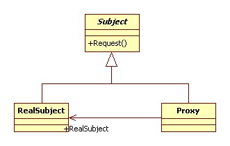
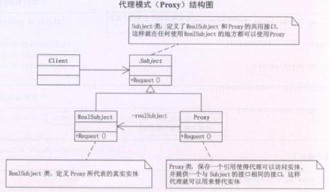
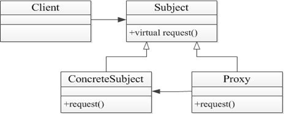

## 代理模式

Proxy模式又叫做代理模式，是构造型的设计模式之一，它可以为其他对象提供一种代理（Proxy）以控制对这个对象的访问。	

所谓代理，是指具有与代理元（被代理的对象）具有相同的接口的类，客户端必须通过代理与被代理的目标类交互，而代理一般在交互的过程中（交互前后），进行某些特别的处理。

让类与类进行组合，获取更大的结构

代理模式：代理模式给某一个对象提供一个代理对象，并由代理对象控制对源对象的引用。  

代理就是一个人或一个机构代表另一个人或者一个机构采取行动。  

某些情况下，客户不想或者不能够直接引用一个对象，代理对象可以在客户和目标对象直接起到中介的作用。  

客户端分辨不出代理主题对象与真实主题对象。  

代理模式可以并不知道真正的被代理对象，而仅仅持有一个被代理对象的接口，这时候代理对象不能够创建被代理对象，  
被代理对象必须有系统的其他角色代为创建并传入。  

跟MM在网上聊天，一开头总是“hi, 你好”,   “你从哪儿来呀？”“你多大了？”“身高多少呀？”  这些话，真烦人，写个程序做为我的Proxy吧，凡是接收到这些话都设置好了自己的回答，接收到其他的话时再通知我回答，怎么样，酷吧。  

## 类图角色和职责

- subject（抽象主题角色）：真实主题与代理主题的共同接口。


- RealSubject（真实主题角色）：定义了代理角色所代表的真实对象。 
- Proxy（代理主题角色）：含有对真实主题角色的引用，代理角色通常在将客户端调用传递给真是主题对象之前或者之后执行某些操作，而不是单纯返回真实的对象。

适合于：为其他对象提供一种代理以控制对这个对象的访问。

提示：a中包含b类；a、b类实现协议类protocol 






## 示例代码

理论模型

```C++
#include <string>
#include <iostream>
using namespace std;

//定义接口
class Interface
{
public:
	virtual void Request()=0;
};

//真实类
class RealClass : public Interface
{
public:
	virtual void Request()
	{
		cout<<"真实的请求"<<endl;
	}
};

//代理类
class ProxyClass : public Interface
{
private:
	RealClass* m_realClass;
public:
	virtual void Request()
	{
	    m_realClass= new RealClass();
		m_realClass->Request();
		delete m_realClass;
	}
};

// 客户端
int main()
{
	ProxyClass* test=new ProxyClass();
	test->Request();
	return 0;
}
```
cocos2d-x中应用程序代理类

```C++
#include "iostream"
using namespace std;

//a包含了一个类b，类b实现了某一个协议（一套接口）
class AppProtocol
{
public:
	virtual int ApplicationDidFinsh() = 0;
};

//协议实现类
class AppDelegate : public AppProtocol
{
public:
	AppDelegate() { }
	virtual int ApplicationDidFinsh()  //cocos2dx函数的入口点
	{
		cout<<"ApplicationDidFinsh do...\n";
		return 0;
	}
};

//Application是代理类，在代理类中包含一个真正的实体类
class Application
{
public:
	Application()
	{
		ap = NULL;
	}
public:
	void run()
	{
		ap = new AppDelegate();
		ap->ApplicationDidFinsh();
		delete ap;
	}
private:
	AppDelegate *ap;
};

//好处：main函数不需要修改了。只需要修改协议实现类
void main31()
{
	Application *app = new Application();
	app->run();

	if (app == NULL)
	{
		free(app);
	}

	system("pause");
}
```

```C++
#include <iostream>
using namespace std;

class Subject
{
public:
	virtual void sailbook() = 0;
};

class RealSubjectBook : public Subject
{
public:
	virtual void sailbook()
	{
		cout << "卖书" << endl;
	}
};

//a中包含b类；a、b类实现协议类protocol 
class dangdangProxy : public Subject
{
public:
	virtual void sailbook()
	{
		RealSubjectBook *rsb = new RealSubjectBook;
		dazhe();
		rsb->sailbook();
		dazhe();
	}
public:
	void dazhe()
	{
		cout << "双十一打折" << endl;
	}
private:
	Subject *m_subject;
};

void main()
{
	Subject *s = new dangdangProxy;
	s->sailbook();
	delete s;
	system("pause");
	return ;
}
```

```C++
#include <iostream>  
#include <string>  
using namespace std;
  
class SchoolGirl  
{  
public:  
    string name;  
};  
  
class IGiveGift  
{  
public:  
    virtual void giveDolls() = 0;  
    virtual void giveFlowers() = 0;  
};  
  
class Pursuit :public IGiveGift  
{  
private:  
    SchoolGirl mm;  
public:  
    Pursuit(SchoolGirl m)  
    {  
        mm = m;  
    }  
    void giveDolls()  
    {  
        cout << mm.name << " 送你娃娃" << endl;  
    }  
    void giveFlowers()  
    {  
        cout << mm.name << " 送你鲜花" << endl;  
    }  
};  
  
class Proxy :public IGiveGift  
{  
private:  
    Pursuit gg;  
public:  
    Proxy(SchoolGirl mm) :gg(mm)  
    {  
        //gg=g;  
    }  
    void giveDolls()  
    {  
        gg.giveDolls();  
    }  
    void giveFlowers()  
    {  
        gg.giveFlowers();  
    }  
};  
  
int main()  
{  
    SchoolGirl lijiaojiao;  
    lijiaojiao.name = "李娇娇";  
    Pursuit zhuojiayi(lijiaojiao);  
    Proxy daili(lijiaojiao);  
  
    daili.giveDolls();  
    cin.get();  
    return 0;  
}  
```


- 抽象主体：声明了真实主体和代理主体的共同接口
- 真实主体：定义了代理所代表的真实对象
- 代理主体：通过在其中定义真实主体的引用，实现对真实主体的操作

```c++
//proxy.h
#ifndef PROXY_H
#define PROXY_H

class Subject{ //定义抽象主体类
public:
	virtual ~Subject();
	virtual void request() = 0;
protected:
	Subject();
};

//定义抽象主体类的派生类，描述一个具体的主体
class ConcreteSubject :public Subject{
public:
	ConcreteSubject();
	~ConcreteSubject();
	void request();
};
class Proxy :public Subject{ //定义代理类
public:
	Proxy();
	Proxy(Subject *sub);
	~Proxy();
	void request();
private:
	Subject *m_sub; //定义一个指向主体的指针
};
#endif
```

```c++
//proxy.cpp
#include <iostream>
#include "proxy.h"
using namespace std;

Subject::Subject() //定义抽象主体类的构造函数
{
}
Subject::~Subject() //定义抽象主体类的析构函数
{
}
ConcreteSubject::ConcreteSubject() //定义真实主体类的构造函数
{
}
ConcreteSubject::~ConcreteSubject() //定义真实主体类的析构函数
{
}
void ConcreteSubject::request() //真实主体类要完成的操作
{
	cout << "ConcreteSubject request!" << endl;
}

Proxy::Proxy() //定义代理类构造函数
{
}
//代理类构造函数，参数为某个主体的指针
Proxy::Proxy(Subject *sub)
{
	m_sub = sub;
}
Proxy::~Proxy() //定义代理类析构函数
{
}
void Proxy::request() //通过代理实现主体需要完成的操作
{
	cout << "Proxy request!" << endl;
	m_sub->request();
}
```

```c++
#include <iostream>
#include "proxy.h"
using namespace std;

int main()
{
	//sub指针指向一个真实主体对象
	Subject *sub = new ConcreteSubject();
	Proxy *p = new Proxy(sub); //定义代理对象
	p->request();//通过代理完成主体需要的操作
	system("pause");
	return 0;
}
```