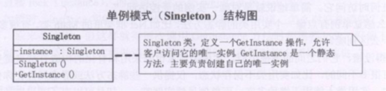

## 单例模式

单例模式是一种对象创建型模式，使用单例模式，可以保证为一个类只生成唯一的实例对象。也就是说，在整个程序空间中，该类只存在一个实例对象。    

GoF对单例模式的定义是：保证一个类、只有一个实例存在，同时提供能对该实例加以访问的全局访问方法。

单例模式：单例模式确保某一个类只有一个实例，而且自行实例化并向整个系统提供这个实例单例模式  。单例模式只应在有真正的“单一实例”的需求时才可使用。  

俺有6个漂亮的老婆，她们的老公都是我，我就是我们家里的老公Sigleton，她们只要说道“老公”，都是指的同一个人，那就是我(刚才做了个梦啦，哪有这么好的事)。



## 为什么使用单例模式

在应用系统开发中，我们常常有以下需求：

- 在多个线程之间，比如初始化一次socket资源；比如servlet环境，共享同一个资源或者操作同一个对象
- 在整个程序空间使用全局变量，共享资源
- 大规模系统中，为了性能的考虑，需要节省对象的创建时间等等。

因为Singleton模式可以保证为一个类只生成唯一的实例对象，所以这些情况，Singleton模式就派上用场了。

## 饿汉式

```C++
#include <iostream>
using namespace std;

class Singelton
{
private:
	Singelton()
	{
		cout << "Singelton 构造函数执行" << endl;
	}
public:
	static Singelton *getInstance()
	{
		return m_psl;
	}

	static void FreeInstance()
	{
		if (m_psl != NULL)
		{
			delete m_psl;
			m_psl = NULL; 
		}
	}
private:
	static Singelton *m_psl;
};

Singelton *Singelton::m_psl = new Singelton;

void main2()
{
	printf("\n");
	Singelton *p1 = Singelton::getInstance();
	Singelton *p2 = Singelton::getInstance();

	if (p1 == p2)
	{
		cout << "是同一个对象" << endl;
	}
	else
	{
		cout << "不是同一个对象" << endl;
	}
	Singelton::FreeInstance();

	return ;
}

void main()
{
	main2();
	system("pause");
}
```
## 懒汉式

```C++
#include <iostream>
using namespace std;

class Singelton
{
private:
	Singelton()
	{
		cout << "Singelton 构造函数执行" << endl;
	}
public:
	static Singelton *getInstance()
	{
		if (m_psl == NULL)
		{
			m_psl = new Singelton;
		}
		return m_psl;
	}

	static void FreeInstance()
	{
		if (m_psl != NULL)
		{
			delete m_psl;
			m_psl = NULL; 
		}
	}

private:
	static Singelton *m_psl;
};

Singelton *Singelton::m_psl = NULL;

void main2()
{
	Singelton *p1 = Singelton::getInstance();
	Singelton *p2 = Singelton::getInstance();

	if (p1 == p2)
	{
		cout << "是同一个对象" << endl;
	}
	else
	{
		cout << "不是同一个对象" << endl;
	}
	Singelton::FreeInstance();

	return ;
}

void main()
{
	main2();
	system("pause");
}
```
## 懒汉式多线程问题

- 懒汉"模式虽然有优点，但是每次调用GetInstance()静态方法时，必须判断 NULL == m_instance，使程序相对开销增大。
- 多线程中会导致多个实例的产生，从而导致运行代码不正确以及内存的泄露。
- 提供释放资源的函数

这是因为C++中构造函数并不是线程安全的。C++中的构造函数简单来说分两步：

- 第一步：内存分配
- 第二步：初始化成员变量

由于多线程的关系，可能当我们在分配内存好了以后，还没来得急初始化成员变量，就进行线程切换，另外一个线程拿到所有权后，由于内存已经分配了，但是变量初始化还        没进行，因此打印成员变量的相关值会发生不一致现象。

```C++
#include "stdafx.h"
#include "windows.h"
#include "winbase.h"
#include <process.h>
#include "iostream"
using namespace std;

// 构造函数不是线程安全函数
class Singelton
{
private:
	Singelton()
	{
		cout<<"Singelton构造函数begin"<<endl;
		Sleep(1000);
		cout<<"Singelton构造函数end"<<endl;
	}

public:
	static Singelton *getSingelton()
	{
		if (single == NULL) //需要判断
		{
			count ++; 
			single = new Singelton();
		}
		return single;
	}

	static Singelton *releaseSingelton()
	{
		if (single != NULL) //需要判断
		{
			delete single;
			single = NULL;
		}
		return single;
	}
	static void pirntS() //测试函数
	{
		cout<<"Singelton printS test"<<endl;
	}

private:
	static Singelton *single;
	static int count ;
};

//note 静态变量类外初始化  //懒汉式
Singelton *Singelton::single = NULL;
int Singelton::count = 0;

void main2()
{
	Singelton *s1 = Singelton::getSingelton();
	Singelton *s2 = Singelton::getSingelton();
	if (s1 == s2)
	{
		cout<<"ok....equal"<<endl;
	}
	else
	{
		cout<<"not.equal"<<endl;
	}
	cout <<"hello...."<<endl;
	system("pause");
}

void MyThreadFunc (void *)
{
	//cout << "我是线程体 ...." << endl;
	cout << "我是线程体 ....\n";
	Singelton::getSingelton()->pirntS();
}

int _tmain(int argc, _TCHAR* argv[])
{
	//main2();
	HANDLE hThread[10];

	for (int i=0; i<3; i++)
	{
		hThread[i] = (HANDLE)_beginthread (MyThreadFunc, 0, NULL);
	}

	for (int i=0; i<3; i++)
	{
		WaitForSingleObject( hThread[i], INFINITE );	
	}
		
	cout << "hello" << endl;
	system("pause");
	return 0;
}
```
## 懒汉式线程同步

```C++
#include <iostream>  
#include <string>  
using namespace std;  
// #define  public private 
  
class   
{  
public:  
protected:  
private:  
}a1;  
  
class Singleton  
{  
private:  
    int i;  
    static Singleton *instance;  
    Singleton(int i)  
    {  
        this->i = i;  
    }  
public:  
    static Singleton *getInstance()  
    {  
        return instance;  
    }  
    void show()  
    {  
        cout << i << endl;  
    }  
};  
Singleton* Singleton::instance = new Singleton(8899);  
  
class A :public Singleton  
{  
  
};  
  
int mainJ()  
{  
    Singleton *s = Singleton::getInstance();  
    Singleton *s2 = A::getInstance();  
    cout << (s == s2) << endl;  
    cin.get();  
    return 0;  
}  
```
## 总结

在很多人印象中，单例模式可能是23个设计模式中最简单的一个。如果不考虑多线程，的确如此，但是一旦要在多线程中运用，那么从我们的教程中可以了解到，它涉及到很多编译器，多线程，C++语言标准等方面的内容。本专题参考的资料如下：

- C++ Primer (Stanley B.Lippman),主要参考的是模板静态变量的初始化以及实例化。
- MSDN,有关线程同步interlocked相关的知识。
- Effective C++ 04条款(Scott Meyers) Non-Local-Static对象初始化顺序以及Meyers单例模式的实现。
- Double-Checked Locking,Threads,Compiler Optimizations,and More（Scott Meyers），解释了由于编译器的优化，导致auto_ptr.reset函数不安全，shared_ptr有类似情况。我们避免使用reset函数。
- C++全局和静态变量初始化顺序的研究(CSDN)。
- 四人帮的经典之作：设计模式
- windows 核心编程(Jeffrey Richter) 