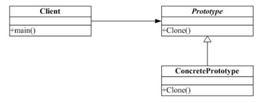

## 原型模式

Prototype模式是一种对象创建型模式，它采取复制原型对象的方法来创建对象的实例。使用Prototype模式创建的实例，具有与原型一样的数据。

- 由原型对象自身创建目标对象。也就是说，对象创建这一动作发自原型对象本身。
- 目标对象是原型对象的一个克隆。也就是说，通过Prototype模式创建的对象，不仅仅与原型对象具有相同的结构，还与原型对象具有相同的值。
- 根据对象克隆深度层次的不同，有浅度克隆与深度克隆。

原型模式允许动态的增加或减少产品类，产品类不需要非得有任何事先确定的等级结构，原始模型模式适用于任何的等级结构。缺点是每一个类都必须配备一个克隆方法。  

跟MM用QQ聊天，一定要说些深情的话语了，我搜集了好多肉麻的情话，需要时只要copy出来放到QQ里面就行了，这就是我的情话prototype了。

原型模式：通过给出一个原型对象来指明所要创建的对象的类型，然后用复制这个原型对象的方法创建出更多同类型的对象。 

## 角色和职责



Prototype 模式提供了一个通过已存在对象创建新对象的接口（clone），clone()的实现和具体的编程语言相关，在C++中我们通过拷贝构造函数实现之。

原型模式主要面对的问题是：“某些结构复杂的对象”的创建工作；由于需求的变化，这些对象经常面临着剧烈的变化，但是他们却拥有比较稳定一致的接口。

适用情况：一个复杂对象，具有自我复制功能，统一一套接口。

## 示例代码

```C++
#define _CRT_SECURE_NO_WARNINGS 
#include <iostream>
#include "string"
using namespace std;

class Person
{
public:
	virtual Person* clone() = 0;
	virtual void printT() = 0;
};

class  CPlusPlusProgrammer : public Person
{
public:
	CPlusPlusProgrammer()
	{
		m_name = "";
		m_age = 0;
		m_resume = NULL;
		setResume("aaaa");
	}
  
	CPlusPlusProgrammer(string name, int age)
	{
		m_name = name;
		m_age = age;
		m_resume = NULL;
		setResume("aaaa");
	}
  
	void setResume(char *p)
	{
		if (m_resume != NULL)
		{
			delete m_resume;
		}
		m_resume = new char[strlen(p) + 1];
		strcpy(m_resume, p);
	}

	virtual void printT()
	{
		cout << "m_name" << m_name << " m_age" << m_age << "m_resume:" << m_resume <<  endl;
	}
  
	virtual Person* clone()
	{
		CPlusPlusProgrammer *tmp = new CPlusPlusProgrammer;
		//tmp->m_name = this->m_name;
		*tmp = *this; // = 浅拷贝
		return tmp;
	}

private:
	string	m_name;
	int		m_age ;
	char	*m_resume;	
};

void main()
{
	Person *c1 = new CPlusPlusProgrammer("张三", 32);
	c1->printT();

	Person *c2 = c1->clone();
	c2->printT();

	system("pause");
	return ;
}
```

```C++
#include <iostream>  
#include <string>  
using namespace std; 
  
class Resume  
{  
private:  
    string name, sex, age, timeArea, company;  
public:  
    Resume(string s)  
    {  
        name = s;  
    }  
    void setPersonalInfo(string s, string a)  
    {  
        sex = s;  
        age = a;  
    }  
    void setWorkExperience(string t, string c)  
    {  
        timeArea = t;  
        company = c;  
    }  
    void display()  
    {  
        cout << name << "  " << sex << "  " << age << endl;  
        cout << "工作经历:  " << timeArea << "  " << company << endl << endl;  
  
    }  
    Resume *clone()  
    {  
        Resume *b;  
        b = new Resume(name);  
        b->setPersonalInfo(sex, age);  
        b->setWorkExperience(timeArea, company);  
        return b;  
    }  
};  
  
  
int main()  
{  
    Resume *r = new Resume("李彦宏");  
    r->setPersonalInfo("男", "30");  
    r->setWorkExperience("2007-2010", "读研究生");  
    r->display();  
  
    Resume *r2 = r->clone();  
    r2->setWorkExperience("2003-2007", "读本科");  
  
    r->display();  
    r2->display();  
  
    cin.get();  
    return 0;  
}  
```