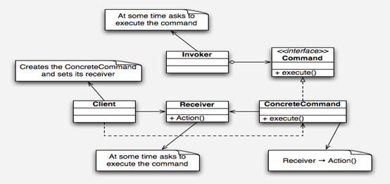
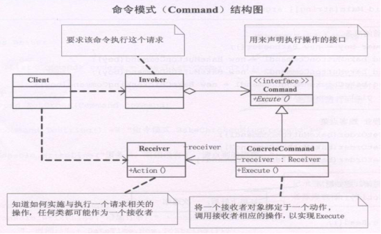
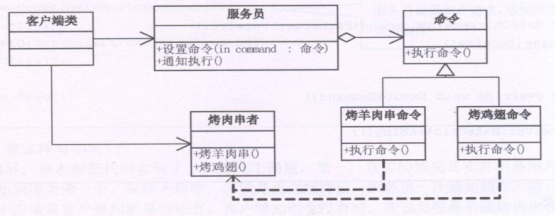

## 命令模式

Command模式也叫命令模式 ，是行为设计模式的一种。Command模式通过被称为Command的类封装了对目标对象的调用行为以及调用参数。

在面向对象的程序设计中，一个对象调用另一个对象，一般情况下的调用过程是：创建目标对象实例；设置调用参数；调用目标对象的方法。

但在有些情况下有必要使用一个专门的类对这种调用过程加以封装，我们把这种专门的类称作command类。

整个调用过程比较繁杂，或者存在多处这种调用。这时，使用Command类对该调用加以封装，便于功能的再利用。

调用前后需要对调用参数进行某些处理。调用前后需要进行某些额外处理，比如日志，缓存，记录历史操作等。 

命令模式：命令模式把一个请求或者操作封装到一个对象中。  

命令模式把发出命令的责任和执行命令的责任分割开，委派给不同的对象。  

命令模式允许请求的一方和发送的一方独立开来，使得请求的一方不必知道接收请求的一方的接口，更不必知道请求是怎么被接收，以及操作是否执行，何时被执行以及是怎么被执行的。  

系统支持命令的撤消。  

俺有一个MM家里管得特别严，没法见面，只好借助于她弟弟在我们俩之间传送信息，她对我有什么指示，就写一张纸条让她弟弟带给我。这不，她弟弟又传送过来一个COMMAND，为了感谢他，我请他吃了碗杂酱面，哪知道他说：“我同时给我姐姐三个男朋友送COMMAND，就数你最小气，才请我吃面。”

## 类图角色和职责





- Command：Command命令的抽象类。
- ConcreteCommand：Command的具体实现类。
- Receiver：需要被调用的目标对象。
- Invorker：通过Invorker执行Command对象。

适用于：是将一个请求封装为一个对象，从而使你可用不同的请求对客户端进行参数化；对请求排队或记录请求日志，以及支持可撤销的操作。 

## 示例代码

命令模式1

```C++
#include <iostream>
using namespace std;

class Doctor
{
public:
	void treat_eye()
	{
		cout << "医生 治疗 眼科病" << endl;
	}

	void treat_nose()
	{
		cout << "医生 治疗 鼻科病" << endl;
	}
};

class CommandTreatEye
{
public:
	CommandTreatEye(Doctor *doctor)
	{
		m_doctor = doctor;
	}
  
	void treat()
	{
		m_doctor->treat_eye();
	}
private:
	Doctor *m_doctor;
};

class CommandTreatNose
{
public:
	CommandTreatNose(Doctor *doctor)
	{
		m_doctor = doctor;
	}
  
	void treat()
	{
		m_doctor->treat_nose();
	}
private:
	Doctor *m_doctor;
};

void main2()
{
	//1 医生直接看病
	/*
	Doctor *doctor = new Doctor ;
	doctor->treat_eye();
	delete doctor;
	*/

	//2 通过一个命令，医生通过命令治疗治病
	Doctor *doctor = new Doctor ;
	CommandTreatEye * commandtreateye = new CommandTreatEye(doctor); 
	commandtreateye->treat();
	delete commandtreateye;
	delete doctor;
  
	return ;
}

void main()
{
	main2();
	system("pause");
	return ;
}
```

命令模式2

```C++
#include <iostream>
#include "list"
using namespace std;

class Doctor
{
public:
	void treat_eye()
	{
		cout << "医生 治疗 眼科病" << endl;
	}

	void treat_nose()
	{
		cout << "医生 治疗 鼻科病" << endl;
	}
};

class Command
{
public:
	virtual void treat() = 0;
};

class CommandTreatEye : public Command
{
public:
	CommandTreatEye(Doctor *doctor)
	{
		m_doctor = doctor;
	}
  
	void treat()
	{
		m_doctor->treat_eye();
	}
private:
	Doctor *m_doctor;
};

class CommandTreatNose : public Command
{
public:
	CommandTreatNose(Doctor *doctor)
	{
		m_doctor = doctor;
	}
  
	void treat()
	{
		m_doctor->treat_nose();
	}
private:
	Doctor *m_doctor;
};

class BeautyNurse
{
public:
	BeautyNurse(Command *command)
	{
		this->command = command;
	}
  
public:
	void SubmittedCase() //提交病例 下单命令
	{
		command->treat();
	}
  
private:
	Command *command;
};

//护士长
class HeadNurse 
{
public:
	HeadNurse()
	{
		m_list.clear();
	}
	
public:
	void setCommand(Command *command)
	{
		m_list.push_back(command);
	}
  
	void SubmittedCase() //提交病例下单命令
	{
		for (list<Command *>::iterator it=m_list.begin(); it!=m_list.end(); it++)
		{
			(*it)->treat();
		}
	}
private:
	list<Command *> m_list;
};

void main2()
{
	//1 医生直接看病
	/*
	Doctor *doctor = new Doctor ;
	doctor->treat_eye();
	delete doctor;
	*/

	//2 通过一个命令 医生通过 命令 治疗 治病
	Doctor *doctor = new Doctor ;
	Command * command = new CommandTreatEye(doctor);
	command->treat();
	delete command;
	delete doctor;
  
	return ;
}

void main3()
{
	//3 护士提交简历 给以上看病
	BeautyNurse		*beautynurse = NULL;
	Doctor			*doctor = NULL;
	Command			*command  = NULL;

	doctor = new Doctor ;

	//command = new CommandTreatEye(doctor);
	command = new CommandTreatNose(doctor);
	beautynurse = new BeautyNurse(command);
	beautynurse->SubmittedCase();
	
	delete doctor;
	delete command;
	delete beautynurse;
  
	return ;
}

//4 通过护士长批量的下单命令
void main4()
{
	//护士提交简历 给以上看病
	HeadNurse		*headnurse = NULL;
	Doctor			*doctor = NULL;
	Command			*command1  = NULL;
	Command			*command2  = NULL;

	doctor = new Doctor ;

	command1 = new CommandTreatEye(doctor); 
	command2 = new CommandTreatNose(doctor); 

	headnurse = new HeadNurse(); //new 护士长
	headnurse->setCommand(command1);
	headnurse->setCommand(command2);

	headnurse->SubmittedCase(); // 护士长批量下单命令

	delete doctor;
	delete command1;
	delete command2;
	delete headnurse;
  
	return ;
}

void main()
{
	//main2();
	//main3();
	main4();
	system("pause");
	return ;
}
```
示例代码3

```C++
#include <iostream>
#include "list"
using namespace std;

class Vendor
{
public:
	void sailbanana()
	{
		cout << "卖香蕉" << endl;
	}
  
	void sailapple()
	{
		cout << "卖苹果" << endl;
	}
};

class Command
{
public:
	virtual void sail() = 0;
};

class BananaCommand : public Command
{
public:
	BananaCommand(Vendor *v)
	{
		m_v = v;
	}
  
	Vendor *getV(Vendor *v)
	{
		return m_v;
	}

	void setV(Vendor *v)
	{
		m_v = v;
	}
  
	virtual void sail()
	{
		m_v->sailbanana();
	}
private:
	Vendor *m_v;
};

class AppleCommand : public Command
{
public:
	AppleCommand(Vendor *v)
	{
		m_v = v;
	}
  
	Vendor *getV(Vendor *v)
	{
		return m_v;
	}

	void setV(Vendor *v)
	{
		m_v = v;
	}
  
	virtual void sail()
	{
		m_v->sailapple();
	}

private:
	Vendor *m_v;
};

class Waiter
{
public:
	Command *getCommand()
	{
		return m_command;
	}
  
	void setCommand(Command *c)
	{
		m_command = c;
	}
  
	void sail()
	{
		m_command->sail();
	}

private:
	Command *m_command;
};

class AdvWaiter
{
public:
	AdvWaiter()
	{
		m_list = new list<Command *>;
		m_list->resize(0);
	}
  
	~AdvWaiter()
	{
		delete m_list;
	}
  
	void setCommands(Command *c)
	{
		m_list->push_back(c);
	}
  
	list<Command *> * getCommands()
	{
		return m_list;
	}
  
	void sail()
	{
		for (list<Command *>::iterator it=m_list->begin(); 
             it!=m_list->end(); it++ )
		{
			(*it)->sail();
		}
	}

private:
	list<Command *> *m_list;
};

//小商贩直接卖水果
void main1()
{
	Vendor *v = new Vendor;
	v->sailapple();
	v->sailbanana();

	delete v;
	return ;
}

//小商贩通过命令卖水果
void main2()
{
	Vendor *v = new Vendor;
	AppleCommand *ac = new AppleCommand(v);
	ac->sail();

	BananaCommand *bc = new BananaCommand(v);
	bc->sail();

	delete bc;
	delete ac;
	delete v;
}

//小商贩通过waiter卖水果
void main3()
{
	Vendor *v = new Vendor;
	AppleCommand *ac = new AppleCommand(v);
	BananaCommand *bc = new BananaCommand(v);

	Waiter *w = new Waiter;
	w->setCommand(ac);
	w->sail();

	w->setCommand(bc);
	w->sail();

	delete w;
	delete bc;
	delete ac;
	delete v;
}

//小商贩通过advwaiter批量下单卖水果
void main4()
{
	Vendor *v = new Vendor;
	AppleCommand *ac = new AppleCommand(v);
	BananaCommand *bc = new BananaCommand(v);

	AdvWaiter *w = new AdvWaiter;
	w->setCommands(ac);
	w->setCommands(bc);
	w->sail();

	delete w;
	delete bc;
	delete ac;
	delete v;
}

void main()
{
	//main1();
	//main2();
	//main3();
	main4();
	system("pause");
}
```

示例代码4



```C++
#include <iostream>  
#include <string>  
#include <list>  

using namespace std;  
  
class Barbecuer  //接收者执行命令  
{  
public:  
    void bakeMutton()  
    {  
        cout << "烤羊肉串" << endl;  
    }  
    void bakeChickenWing()  
    {  
        cout << "烤鸡翅" << endl;  
    }  
};  
  
class Command   //命令基类  
{  
protected:  
    Barbecuer *receiver;//类的包含  
public:  
    Command(Barbecuer *receiver)//命令接受  
    {  
        this->receiver = receiver;  
    }  
    virtual void executeCommand() = 0;  
};  
  
class BakeMuttonCommand :public Command  //命令传送着  
{  
public:  
    BakeMuttonCommand(Barbecuer *receiver) :Command(receiver)  
    {}  
    void executeCommand()  
    {  
        receiver->bakeMutton();  
    }  
};  
  
class BakeChikenWingCommand :public Command  //命令传送着  
{  
public:  
    BakeChikenWingCommand(Barbecuer *receiver) :Command(receiver)  
    {}  
    void executeCommand()  
    {  
        receiver->bakeChickenWing();  
    }  
};  
  
class Waiter        //服务员  
{  
private:  
    Command *command;  
public:  
    void setOrder(Command *command)  
    {  
        this->command = command;  
    }  
    void notify()  
    {  
        command->executeCommand();  
    }  
};  
  
class Waiter2   //gei多个对象下达命令  
{  
private:  
    list<Command*> orders;  
public:  
    void setOrder(Command *command)  
    {  
        orders.push_back(command);  
    }  
    void cancelOrder(Command *command)  
    {}  
    void notify()  
    {  
        list<Command*>::iterator iter = orders.begin();  
        while (iter != orders.end())  
        {  
            (*iter)->executeCommand();  
            iter++;  
        }  
    }  
};  

int main()  
{  
  
    Barbecuer *boy = new Barbecuer();  
    Command *bm1 = new BakeMuttonCommand(boy);  
    Command *bm2 = new BakeMuttonCommand(boy);  
    Command *bc1 = new BakeChikenWingCommand(boy);  
  
    Waiter2 *girl = new Waiter2();  
  
    girl->setOrder(bm1);  
    girl->setOrder(bm2);  
    girl->setOrder(bc1);  
  
    girl->notify();  

    return 0;  
} 
```