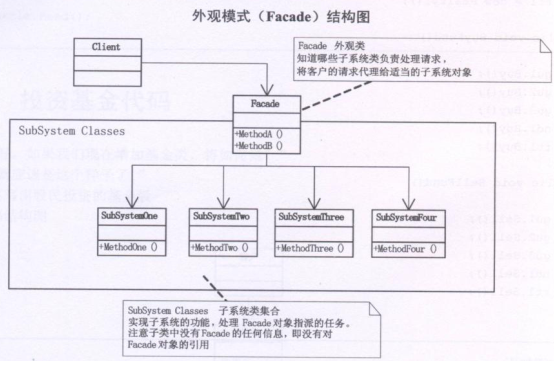

## 外观模式

Facade模式也叫外观模式，是由GoF提出的23种设计模式中的一种。Facade模式为一组具有类似功能的类群，比如类库，子系统等等，提供一个一致的简单的界面。这个一致的简单的界面被称作facade。

门面模式：外部与一个子系统的通信必须通过一个统一的门面对象进行。  

门面模式提供一个高层次的接口，使得子系统更易于使用。  

每一个子系统只有一个门面类，而且此门面类只有一个实例，也就是说它是一个单例模式。但整个系统可以有多个门面类。 

我有一个专业的Nikon相机，我就喜欢自己手动调光圈、快门，这样照出来的照片才专业，但MM可不懂这些，教了半天也不会。幸好相机有Facade设计模式，把相机调整到自动档，只要对准目标按快门就行了，一切由相机自动调整，这样MM也可以用这个相机给我拍张照片了。 

## 类图角色和职责




- Façade：为调用方, 定义简单的调用接口。
- Clients：调用者。通过Facade接口调用提供某功能的内部类群。
- Packages：功能提供者。指提供功能的类群（模块或子系统）

适用于：为子系统中统一一套接口，让子系统更加容易使用。

## 示例代码

```C++
#include <iostream>
using namespace std;

class SubSystemA
{
public:
	void doThing()
	{
		cout << "SubSystemA run" << endl;
	}
};

class SubSystemB
{
public:
	void doThing()
	{
		cout << "SubSystemB run" << endl;
	}
};

class SubSystemC
{
public:
	void doThing()
	{
		cout << "SubSystemC run" << endl;
	}
};

class Facade
{
public:
	Facade()
	{
		sysA = new SubSystemA;
		sysB = new SubSystemB;
		sysC = new SubSystemC;
	}
	~Facade()
	{
		delete sysA;
		delete sysB;
		delete sysC;
	}
public:
	void doThing()
	{
		sysA->doThing();
		sysB->doThing();
		sysC->doThing();
	}
private:
	SubSystemA *sysA;
	SubSystemB *sysB;
	SubSystemC *sysC;
};

void main1()
{
	SubSystemA *sysA = new SubSystemA;
	SubSystemB *sysB = new SubSystemB;
	SubSystemC *sysC = new SubSystemC;

	sysA->doThing();
	sysB->doThing();
	sysC->doThing();
	delete sysA;
	delete sysB;
	delete sysC;
	
	return ;
}

void main2()
{
	Facade *f = new Facade;
	f->doThing();
	delete f;
}

void main()
{
	//main1();
	main2();
	system("pause");
}
```

```C++
#include <iostream>  
#include <string>  
using namespace std; 
  
class Sub1  
{  
public:  
    void f1()  
    {  
        cout << "子系统的方法 1" << endl;  
    }  
};  
  
class Sub2  
{  
public:  
    void f2()  
    {  
        cout << "子系统的方法 2" << endl;  
    }  
};  
  
class Sub3  
{  
public:  
    void f3()  
    {  
        cout << "子系统的方法 3" << endl;  
    }  
};  
  
class Facade  
{  
private:  
    Sub1 *s1;  
    Sub2 *s2;  
    Sub3 *s3;  
public:  
    Facade()  
    {  
        s1 = new Sub1();  
        s2 = new Sub2();  
        s3 = new Sub3();  
    }  
    void method()  
    {  
        s1->f1();  
        s2->f2();  
        s3->f3();  
    }  
};  
  
int main()  
{  
    Facade *f = new Facade();  
    f->method();   
    cin.get();  
    return 0;  
}  
```