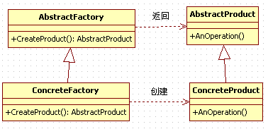

## 工厂方法模式

工厂方法模式同样属于类的创建型模式又被称为多态工厂模式 。工厂方法模式的意义是定义一个创建产品对象的工厂接口，将实际创建工作推迟到子类当中。

工厂方法模式：核心工厂类不再负责所有产品的创建，而是将具体创建的工作交给子类去做，成为一个抽象工厂角色，仅负责给出具体工厂类必须实现的接口，而不接触哪一个产品类应当被实例化这种细节。  

核心工厂类不再负责产品的创建，这样核心类成为一个抽象工厂角色，仅负责具体工厂子类必须实现的接口，这样进一步抽象化的好处是使得工厂方法模式可以使系统在不修改具体工厂角色的情况下引进新的产品。

请MM去麦当劳吃汉堡，不同的MM有不同的口味，要每个都记住是一件烦人的事情，我一般采用Factory Method模式，带着MM到服务员那儿，说“要一个汉堡”，具体要什么样的汉堡呢，让MM直接跟服务员说就行了。  

## 类图角色和职责

- 抽象工厂（Creator）角色

工厂方法模式的核心，任何工厂类都必须实现这个接口。

- 具体工厂（ Concrete  Creator）角色

具体工厂类是抽象工厂的一个实现，负责实例化产品对象。

- 抽象（Product）角色     

工厂方法模式所创建的所有对象的父类，它负责描述所有实例所共有的公共接口。

- 具体产品（Concrete Product）角色 

工厂方法模式所创建的具体实例对象




## 工厂方法模式和简单工厂模式比较

工厂方法模式与简单工厂模式在结构上的不同不是很明显。工厂方法类的核心是一个抽象工厂类，而简单工厂模式把核心放在一个具体类上。 

工厂方法模式之所以有一个别名叫多态性工厂模式是因为具体工厂类都有共同的接口，或者有共同的抽象父类。

当系统扩展需要添加新的产品对象时，仅仅需要添加一个具体对象以及一个具体工厂对象，原有工厂对象不需要进行任何修改，也不需要修改客户端，很好的符合了“开放－封闭”原则。而简单工厂模式在添加新产品对象后不得不修改工厂方法，扩展性不好。工厂方法模式退化后可以演变成简单工厂模式。 

“开放－封闭”通过添加代码的方式，不是通过修改代码的方式完成功能的增强。

## 实例代码

```C++
#include <iostream>
using namespace std;

class Fruit
{
public:
	virtual void  sayname()  = 0;
};

class  Banana : public Fruit
{
public:
	void  sayname()
	{
		cout << "我是香蕉" << endl;
	}
};

class  Apple : public Fruit
{
public:
	void  sayname()
	{
		cout << "我是苹果" << endl;
	} 
};

class  AbFactory 
{
public:
	virtual Fruit *CreateProduct() = 0;
};

class BananaFactory :public AbFactory
{
public:
	virtual Fruit *CreateProduct()
	{
		return new Banana;
	}
};

class AppleFactory :public AbFactory
{
public:
	virtual Fruit *CreateProduct()
	{
		return new Apple;
	}
};

//添加新的产品
class Pear : public Fruit
{
public:
	virtual void sayname()
	{
		cout << "我是梨" << endl;
	}
};

class PearFactory : public AbFactory
{
public:
	virtual Fruit *CreateProduct()
	{
		return new Pear;
	}
};

void main()
{
	AbFactory	*factory = NULL;
	Fruit		*fruit = NULL;

	//吃香蕉
	factory = new BananaFactory;
	fruit = factory->CreateProduct();
	fruit->sayname();

	delete fruit;
	delete factory;

	//Pear 
	factory = new PearFactory;
	fruit = factory->CreateProduct();
	fruit->sayname();

	delete fruit;
	delete factory;

	system("pause");
	return ;
}
```

```C++
#include <iostream>  
#include <string>  
using namespace std;
  
class Operation  
{  
public:  
    double numberA, numberB;  
    virtual double  getResult()
    {  
        return 0;  
    }  
};  
  
class addOperation :public Operation  
{  
    double getResult()  
    {  
        return numberA + numberB;  
    }  
};  
  
class subOperation :public Operation  
{  
    double getResult()  
    {  
        return numberA - numberB;  
    }  
};  
  
class mulOperation :public Operation  
{  
    double getResult()  
    {  
        return numberA*numberB;  
    }  
};  
  
class divOperation :public Operation  
{  
    double getResult()  
    {  
        return numberA / numberB;  
    }  
};  
  
class IFactory  
{  
public:  
    virtual Operation *createOperation() = 0;  
};  
  
  
class AddFactory :public IFactory  
{  
public:  
    static Operation *createOperation()  
    {  
        return new addOperation();  
    }  
};  
  
class SubFactory :public IFactory  
{  
public:  
    static Operation *createOperation()  
    {  
        return new subOperation();  
    }  
};  
  
class MulFactory :public IFactory  
{  
public:  
    static Operation *createOperation()  
    {  
        return new mulOperation();  
    }  
};  
  
class DivFactory :public IFactory  
{  
public:  
    static Operation *createOperation()  
    {  
        return new divOperation();  
    }  
};  
  
int main()  
{  
    Operation *oper = MulFactory::createOperation();  
    oper->numberA = 9;  
    oper->numberB = 99;  
    cout << oper->getResult() << endl;  
    cin.get();  
    return 0;  
}  
```