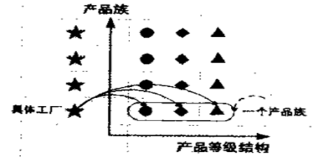
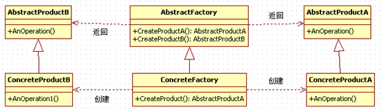
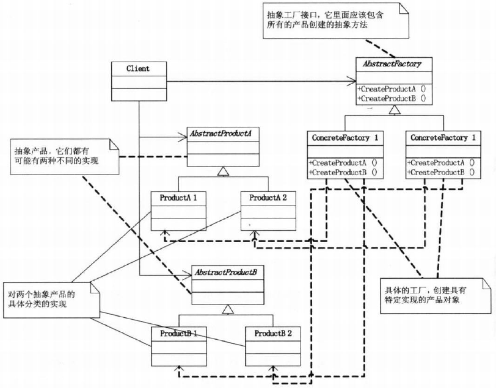

## 抽象工厂模式

抽象工厂模式是所有形态的工厂模式中最为抽象和最其一般性的。抽象工厂模式可以向客户端提供一个接口，使得客户端在不必指定产品的具体类型的情况下，能够创建多个产品族的产品对象。

工厂模式：客户类和工厂类分开。  

消费者任何时候需要某种产品，只需向工厂请求即可。  

消费者无须修改就可以接纳新产品。缺点是当产品修改时，工厂类也要做相应的修改。如：如何创建及如何向客户端提供。  

追MM少不了请吃饭了，麦当劳的鸡翅和肯德基的鸡翅都是MM爱吃的东西，虽然口味有所不同，但不管你带MM去麦当劳或肯德基，只管向服务员说“来四个鸡翅”就行了。麦当劳和肯德基就是生产鸡翅的Factory。  


消费者不固定，工厂者不固定，（工厂根据消费者的行为进行动作）  

实现消费者抽象基类，消费者派生类的实现，实例化就是消费者  

- 操作的抽象基类，实现派生类各种操作，实例化的操作  
- 工厂的抽象类，抽象类包含了两个抽象类的接口（消费者，操作）  
- 抽象类实现了工厂类的抽象，实例化的派生类，实现工厂，  
- 根据用户设置用户，根据操作设置操作 

## 产品族和产品等级结构



工厂模式：要么生产香蕉、要么生产苹果、要么生产西红柿；但是不能同时生产一个产品组。

抽象工厂：能同时生产一个产品族。

具体工厂在开闭原则下，能生产香蕉/苹果/梨子 (产品等级结构)

抽象工厂:在开闭原则下，能生产：南方香蕉/苹果/梨子，北方香蕉/苹果/梨子 (产品族)

工厂模式和抽象工厂的重要区别：

- 工厂模式只能生产一个产品。（要么香蕉、要么苹果）
- 抽象工厂可以一下生产一个产品族（里面有很多产品组成）

## 类图及职责

- 抽象工厂（Creator）角色 

抽象工厂模式的核心，包含对多个产品结构的声明，任何工厂类都必须实现这个接口。

- 具体工厂（ Concrete  Creator）角色

具体工厂类是抽象工厂的一个实现，负责实例化某个产品族中的产品对象。

- 抽象（Product）角色

抽象模式所创建的所有对象的父类，它负责描述所有实例所共有的公共接口。

- 具体产品（Concrete Product）角色

抽象模式所创建的具体实例对象





## 示例代码

```C++
#include <iostream>
using namespace std;

class Fruit
{
public:
	virtual void SayName() = 0;
};

class AbstractFactory
{
public:
	virtual Fruit* CreateBanana() = 0;
	virtual Fruit* CreateApple() = 0;
};

class NorthBanana : public Fruit
{
public:
	virtual void SayName()
	{
		cout << "我是北方香蕉" << endl;
	}
};

class NorthApple : public Fruit
{
public:
	virtual void SayName()
	{
		cout << "我是北方苹果" << endl;
	}
};

class SourthBanana : public Fruit
{
public:
	virtual void SayName()
	{
		cout << "我是南方香蕉" << endl;
	}
};

class SourthApple : public Fruit
{
public:
	virtual void SayName()
	{
		cout << "我是南方苹果" << endl;
	}
};

class NorthFacorty : public AbstractFactory
{
	virtual Fruit * CreateBanana()
	{
		return new NorthBanana;
	}
	virtual Fruit * CreateApple()
	{
		return new NorthApple;
	}
};

class SourthFacorty : public AbstractFactory
{
	virtual Fruit * CreateBanana()
	{
		return new SourthBanana;
	}
	virtual Fruit * CreateApple()
	{
		return new SourthApple;
	}
};

void main()
{
	Fruit			*fruit = NULL;
	AbstractFactory *af = NULL;

	af = new SourthFacorty;
	fruit = af->CreateApple();
	fruit->SayName();
	delete fruit;
	fruit = af->CreateBanana();
	fruit->SayName();
	delete fruit;

	af = new NorthFacorty;
	fruit = af->CreateApple();
	fruit->SayName();
	delete fruit;
	fruit = af->CreateBanana();
	fruit->SayName();
	delete fruit;
	delete af;
  
	system("pause");
	return ;
}
```

```C++
#include <iostream>  
#include <string>  
using namespace std; 
  
class IUser  
{  
public:  
    virtual void getUser() = 0;  //纯虚接口类，抽象类  
    virtual void setUser() = 0;  
};  
  
class SqlUser :public IUser   //继承抽象实现sql数据库使用者的实例化  
{  
public:  
    void getUser()  
    {  
        cout << "在sql中返回user" << endl;  
    }  
    void setUser()  
    {  
        cout << "在sql中设置user" << endl;  
    }  
};  
  
class AccessUser :public IUser //继承抽象实现access数据库使用者的实例化  
{  
public:  
    void getUser()  
    {  
        cout << "在Access中返回user" << endl;  
    }  
    void setUser()  
    {  
        cout << "在Access中设置user" << endl;  
    }  
};  
  
class IDepartment  //抽象类，提供接口  
{  
public:  
    virtual void getDepartment() = 0;  
    virtual void setDepartment() = 0;  
};  
  
class SqlDepartment :public IDepartment  //SQL操作的实现  
{  
public:  
    void getDepartment()  
    {  
        cout << "在sql中返回Department" << endl;  
    }  
    void setDepartment()  
    {  
        cout << "在sql中设置Department" << endl;  
    }  
};  
  
class AccessDepartment :public IDepartment //access操作的实现  
{  
public:  
    void getDepartment()  
    {  
        cout << "在Access中返回Department" << endl;  
    }  
    void setDepartment()  
    {  
        cout << "在Access中设置Department" << endl;  
    }  
};  
  
class IFactory     //抽象工厂  
{  
public:  
    virtual IUser *createUser() = 0;  
    virtual IDepartment *createDepartment() = 0;  
};  
  
class SqlFactory :public IFactory  //抽象工厂一个实现  
{  
public:  
    IUser *createUser()  
    {  
        return new SqlUser();  
    }  
    IDepartment *createDepartment()  
    {  
        return new SqlDepartment();  
    }  
};  
  
class AccessFactory :public IFactory // 抽象工厂一个实现  
{  
public:  
    IUser *createUser()  
    {  
        return new AccessUser();  
    }  
    IDepartment *createDepartment()  
    {  
        return new AccessDepartment();  
    }  
};  

//变相的实现了静态类  
class DataAccess  
{  
private:  
    static string db;  
    //string db="access";  
public:  
    static IUser *createUser()  
    {  
        if (db == "access")  
        {  
            return new AccessUser();  
        }  
        else if (db == "sql")  
        {  
            return new SqlUser();  
        }  
    }  
    static IDepartment *createDepartment()  
    {  
        if (db == "access")  
        {  
            return new AccessDepartment();  
        }  
        else if (db == "sql")  
        {  
            return new SqlDepartment();  
        }  
    }  
};  
  
string DataAccess::db = "sql";  
  
int main()  
{  
    //IFactory *factory=new SqlFactory();  
    IFactory *factory;//抽象工厂  
    IUser *user;//抽象消费者  
    IDepartment *department;//提供的操作  
  
    factory = new AccessFactory();//基类的指针指指向派生类的对象  
    user = factory->createUser();//基类的指针指向派生类的对象  
    department = factory->createDepartment();//基类的指针指向派生类的对象  
  
    user->getUser();  
    user->setUser();//访问acesss接口  
  
    department->getDepartment();  
    department->setDepartment();//接口  
  
    user = DataAccess::createUser();  
    department = DataAccess::createDepartment();  
  
    user->getUser();  
    user->setUser();  
    department->getDepartment();  
    department->setDepartment();  
  
    cin.get();  
    return 0;  
}  
```