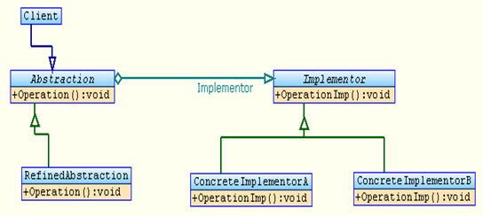
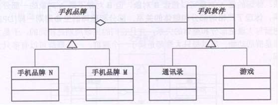

## 桥接模式

Bridge 模式又叫做桥接模式，是构造型的设计模式之一。Bridge模式基于类的最小设计原则，通过使用封装，聚合以及继承等行为来让不同的类承担不同的责任。它的主要特点是把抽象（abstraction）与行为实现（implementation）分离开来，从而可以保持各部分的独立性以及应对它们的功能扩展。

桥梁模式：将抽象化与实现化脱耦，使得二者可以独立的变化，也就是说将他们之间的强关联变成弱关联，也就是指在一个软件系统的抽象化和实现化之间使用组合   

聚合关系而不是继承关系，从而使两者可以独立的变化。  

早上碰到MM，要说早上好，晚上碰到MM，要说晚上好；碰到MM穿了件新衣服，要说你的衣服好漂亮哦，碰到MM新做的发型，要说你的头发好漂亮哦。不要问我“早上碰到MM新做了个发型怎么说”这种问题，自己用BRIDGE组合一下不就行了。

## 类图角色和职责



- Client：Bridge模式的使用者
- Abstraction：抽象类接口（接口或抽象类）维护对行为实现（Implementor）的引用
- Refined Abstraction：Abstraction子类
- Implementor：行为实现类接口 (Abstraction接口定义了基于Implementor接口的更高层次的操作)
- ConcreteImplementor：Implementor子类

适用于：桥接模式（Bridge Pattern）是将抽象部分与实现部分分离（解耦合），使它们都可以独立的变化。

车安装发动机，不同型号的车，安装不同型号的发动机。将“车安装发动机”这个抽象 和 实现进行分离；两个名字 就设计两个类。

图形填颜色，不同形状的图形，填充上不同的颜色。将“图形  颜色”这个抽象和实现进行分离，两个名字，就设计两个类。

## 示例代码

```C++
#include <iostream>
using namespace std;

class Engine
{
public:
	virtual void InstallEngine() = 0;
};

class Engine4400cc : public Engine
{
public:
	virtual void InstallEngine()
	{
		cout << "我是 4400cc 发动机 安装完毕 " << endl;
	}
};

class Engine4500cc : public Engine
{
public:
	virtual void InstallEngine()
	{
		cout << "我是 4500cc 发动机 安装完毕 " << endl;
	}
};

class Car
{
public:
	Car(Engine *engine)
	{
		this->m_engine = engine;
	}
	virtual void installEngine() = 0;

protected:
	Engine *m_engine;
};

class WBM5 : public Car
{
public:
	WBM5(Engine *engine) : Car(engine){}

	virtual void installEngine()
	{
		m_engine->InstallEngine();
	}
};

class WBM6 : public Car
{
public:
	WBM6(Engine *engine) : Car(engine){}

	virtual void installEngine()
	{
		cout << "我是 王保明 WBM6 " << endl;
		m_engine->InstallEngine();
	}
};

void main()
{
	Engine	*engine = NULL;
	WBM6	*wbm6 = NULL;

	engine = new Engine4400cc;
	wbm6 = new WBM6(engine);
	wbm6->installEngine();

	delete wbm6;
	delete engine;

	system("pause");
	return ;
}
```

```C++
#include <iostream>  
#include <string>  
using namespace std;  
  
class HandsetSoft  //手机软件
{  
public:  
    virtual void run() = 0;  
};  
  
class HandsetGame :public HandsetSoft  //游戏软件
{  
public:  
    void run()  
    {  
        cout << "运行手机游戏" << endl;  
    }  
};  
  
class HandsetAddressList :public HandsetSoft  //通讯录软件
{  
public:  
    void run()  
    {  
        cout << "运行手机通讯录" << endl;  
    }  
};  
  
class HandsetBrand  //手机品牌
{  
protected:  
    HandsetSoft *soft;  
public:  
    void setHandsetSoft(HandsetSoft *soft)  
    {  
        this->soft = soft;  
    }  
    virtual void run() = 0;  
};  
  
class HandsetBrandN :public HandsetBrand  //N品牌
{  
public:  
    void run()  
    {  
        soft->run();  
    }  
};  
  
class HandsetBrandM :public HandsetBrand  //M品牌
{  
public:  
    void run()  
    {  
        soft->run();  
    }  
};  
  
int main()  
{  
    HandsetBrand *hb;  
    hb = new HandsetBrandM();  
  
    hb->setHandsetSoft(new HandsetGame());  
    hb->run();  
    hb->setHandsetSoft(new HandsetAddressList());  
    hb->run();  
  
    cin.get();  
    return 0;  
}  
```