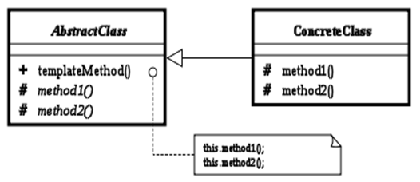
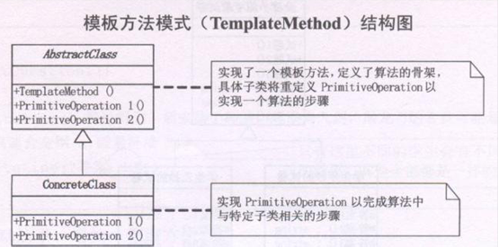

## 模板模式

Template Method模式也叫模板方法模式，是行为模式之一，它把具有特定步骤算法中的某些必要的处理委让给抽象方法，通过子类继承对抽象方法的不同实现改变整个算法的行为。

模板方法模式：模板方法模式准备一个抽象类，将部分逻辑以具体方法以及具体构造子的形式实现，然后声明一些抽象方法来迫使子类实现剩余的逻辑。 

不同的子类可以以不同的方式实现这些抽象方法，从而对剩余的逻辑有不同的实现。先制定一个顶级逻辑框架，而将逻辑的细节留给具体的子类去实现。 

女生从认识到得手的不变的步骤分为巧遇、打破僵局、展开追求、接吻、得手

但每个步骤针对不同的情况，都有不一样的做法，这就要看你随机应变啦(具体实现)

## 应用场景

Template Method模式一般应用在具有以下条件的应用中：

- 具有统一的操作步骤或操作过程
- 具有不同的操作细节
- 存在多个具有同样操作步骤的应用场景，但某些具体的操作细节却各不相同

总结：在抽象类中统一操作步骤，并规定好接口；让子类实现接口。这样可以把各个具体的子类和操作步骤接耦合

## 类图角色和职责





- AbstractClass：抽象类的父类
- ConcreteClass：具体的实现子类
- templateMethod()：模板方法
- method1()与method2()：具体步骤方法  

## 示例代码

```C++
#include <iostream>
using namespace std;

class MakeCar
{
public:
	virtual void MakeHead() = 0;
	virtual void MakeBody() = 0;
	virtual void MakeTail() = 0;

public:
	void Make() //模板函数 把业务逻辑给做好
	{
		MakeTail();
		MakeBody();
		MakeHead();
	}
};

class Jeep : public MakeCar
{
public:
	virtual void MakeHead()
	{
		cout << "jeep head" << endl;
	}

	virtual void MakeBody()
	{
		cout << "jeep body" << endl;
	}

	virtual void MakeTail()
	{
		cout << "jeep tail" << endl;
	}
};

class Bus : public MakeCar
{
public:
	virtual void MakeHead()
	{
		cout << "Bus head" << endl;
	}

	virtual void MakeBody()
	{
		cout << "Bus body" << endl;
	}

	virtual void MakeTail()
	{
		cout << "Bus tail" << endl;
	}
};

void main()
{
	MakeCar *car = new Bus;
	car->Make();
	delete car;

	MakeCar *car2 = new Jeep;
	car2->Make();
	delete car2;

	system("pause");
	return ;
}
```

```C++
#include<iostream>  
#include <vector>  
#include <string>  
using namespace std;
  
class AbstractClass  
{  
public:  
    void Show()  
    {  
        cout << "我是" << GetName() << endl;  
    }  
protected:  
    virtual string GetName() = 0;  
};  
  
class Naruto : public AbstractClass  
{  
protected:  
    virtual string GetName()  
    {  
        return "火影史上最帅的六代目---一鸣惊人naruto";  
    }  
};  
  
class OnePice : public AbstractClass  
{  
protected:  
    virtual string GetName()  
    {  
        return "我是无恶不做的大海贼---路飞";  
    }  
};  
  
//客户端  
int main()  
{  
    Naruto* man = new Naruto();  
    man->Show();  
  
    OnePice* man2 = new OnePice();  
    man2->Show();  
  
    cin.get();  
    return 0;  
}  
```