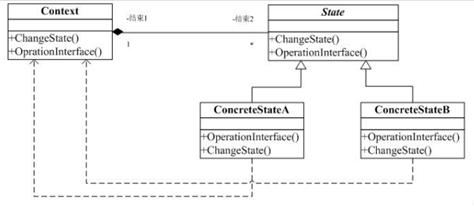
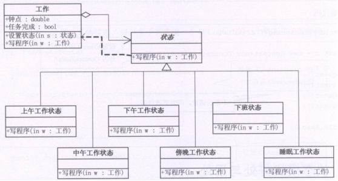

## 状态模式

State模式也叫状态模式，是行为设计模式的一种。State模式允许通过改变对象的内部状态而改变对象的行为，这个对象表现得就好像修改了它的类一样。 

状态模式主要解决的是当控制一个对象状态转换的条件表达式过于复杂时的情况。把状态的判断逻辑转译到表现不同状态的一系列类当中，可以把复杂的判断逻辑简化。

状态模式：状态模式允许一个对象在其内部状态改变的时候改变行为。  

这个对象看上去象是改变了它的类一样。状态模式把所研究的对象的行为包装在不同的状态对象里，每一个状态对象都属于一个抽象状态类的一个子类。状态模式的意图是让一个对象在其内部状态改变的时候，其行为也随之改变。状态模式需要对每一个系统可能取得的状态创立一个状态类的子类。当系统的状态变化时，系统便改变所选的子类。

跟MM交往时，一定要注意她的状态哦，在不同的状态时她的行为会有不同，比如你约她今天晚上去看电影，对你没兴趣的MM就会说“有事情啦”，对你不讨厌但还没喜欢上的MM就会说“好啊，不过可以带上我同事么？”，已经喜欢上你的MM就会说“几点钟？看完电影再去泡吧怎么样？”，当然你看电影过程中表现良好的话，也可以把MM的状态从不讨厌不喜欢变成喜欢哦。 

每个人、事物在不同的状态下会有不同表现（动作），而一个状态又会在不同的表现下转移到下一个不同的状态（State）。最简单的一个生活中的例子就是：地铁入口处，如果你放入正确的地铁票，门就会打开让你通过。在出口处也是验票，如果正确你就可以ok，否则就不让你通过（如果你动作野蛮，或许会有报警（Alarm））。

有限状态自动机（FSM）也是一个典型的状态不同，对输入有不同的响应（状态转移）。通常我们在实现这类系统会使用到很多的Switch/Case语句，Case某种状态，发生什么动作，Case另外一种状态，则发生另外一种状态。但是这种实现方式至少有以下两个问题：

1）当状态数目不是很多的时候，Switch/Case可能可以搞定。但是当状态数目很多的时候（实际系统中也正是如此），维护一大组的Switch/Case语句将是一件异常困难并且容易出错的事情。

2）状态逻辑和动作实现没有分离。在很多的系统实现中，动作的实现代码直接写在状态的逻辑当中。这带来的后果就是系统的扩展性和维护得不到保证。

## 类图角色和职责

State 模式就是被用来解决上的两个问题的，在 State 模式中我们将状态逻辑和动作实现分离。当一个操作中要维护大量的case分支语句，并且这些分支依赖于对象的状态。State 模式将每一个分支封装到一个独立的类中。State 模式的典型结构图为：



- Context：用户对象拥有一个State类型的成员，以标识对象的当前状态； 
- State：接口或基类封装与Context的特定状态相关的行为； 
- ConcreteState：接口实现类或子类实现了一个与Context某个状态相关的行为。 

适用于：对象的行为，依赖于它所处的当前状态。行为随状态改变而改变的场景。

适用于：通过用户的状态来改变对象的行为。

##  示例代码

```C++
#include <iostream>
using namespace std;

class Worker;

class State
{
public:
	virtual void doSomeThing(Worker *w) = 0;
};

class Worker
{
public:
	Worker();
  
	int getHour()
	{
		return m_hour;
	}
  
	void setHour(int hour) //改变状态 7 
	{
		m_hour = hour;
	}
  
	State* getCurrentState()
	{
		return m_currstate;
	}
  
	void setCurrentState(State* state)
	{
		m_currstate = state;
	}

	void doSomeThing()
	{
		m_currstate->doSomeThing(this);
	}
private:
	int		m_hour;
	State	*m_currstate; //对象的当前状态
};

class State1 : public State
{
public:
	void doSomeThing(Worker *w);
};

class State2  : public State
{
public:
	void doSomeThing(Worker *w);
};

void State1::doSomeThing(Worker *w)
{
	if (w->getHour() == 7 || w->getHour()==8)
	{
		cout << "吃早饭" << endl; 
	}
	else
	{ 
		delete w->getCurrentState();  //状态1不满足要转到状态2
		w->setCurrentState(new State2 );
		w->getCurrentState()->doSomeThing(w);
	}
}

void State2::doSomeThing(Worker *w)
{
	if (w->getHour() == 9 || w->getHour()==10)
	{
		cout << "工作" << endl; 
	}
	else
	{	//状态2不满足要转到状态3，后者恢复到初始化状态
		delete w->getCurrentState(); 
		w->setCurrentState(new State1); //恢复到当初状态
		cout << "当前时间点：" << w->getHour() << "未知状态" << endl;
	}
}

Worker::Worker()
{
	m_currstate = new State1;
}

void main()
{
	Worker *w1 = new Worker;
	w1->setHour(7);
	w1->doSomeThing();

	w1->setHour(9);
	w1->doSomeThing();

	delete w1;

	system("pause");
	return ;
}
```

```C++
#include <iostream>  
#include <string>  
using namespace std; 
  
class Work;  
class State;  
class ForenonnState;  
  
class State  
{  
public:  
    virtual void writeProgram(Work*) = 0;//准柜台的基类，抽象类  
};  
  
class Work   //实施工作的类，根据状态执行不同的操作  
{  
public:  
    int hour;  
    State *current;  
    Work();  
      
      
    void writeProgram()  
    {  
        current->writeProgram(this);  
    }  
};  
  
class EveningState :public State  //晚上状态  
{  
public:  
    void writeProgram(Work *w)  
    {  
        cout << "当前时间: " << w->hour << "心情很好，在看《明朝那些事儿》，收获很大！" << endl;  
    }  
};  
  
class AfternoonState :public State    
{  
public:  
    void writeProgram(Work *w)  
    {  
        if (w->hour < 19)  
        {  
            cout << "当前时间: " << w->hour << "下午午睡后，工作还是精神百倍!" << endl;  
        }  
        else  
        {  
            w->current = new EveningState();  
            w->writeProgram();  
        }  
    }  
};  
  
class ForenonnState :public State  
{  
public:  
    void writeProgram(Work *w)  
    {  
        if (w->hour < 12)  
        {  
            cout << "当前时间: " << w->hour << "上午工作精神百倍!" << endl;  
        }  
        else  
        {  
            w->current = new AfternoonState();  
            w->writeProgram();  
        }  
    }  
};  
  
Work::Work()  
{  
    current = new ForenonnState();  
}  

int main()  
{  
    Work *w = new Work();  
    w->hour = 21;  
    w->writeProgram();  
    cin.get();  
    return 0;  
} 
```