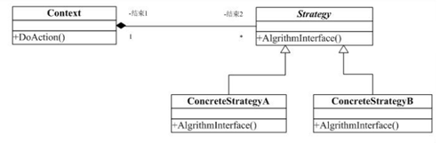

## 策略模式

Strategy模式也叫策略模式是行为模式之一，它对一系列的算法加以封装，为所有算法定义一个抽象的算法接口，并通过继承该抽象算法接口对所有的算法加以封装和实现，具体的算法选择交由客户端决定（策略）。Strategy模式主要用来平滑地处理算法的切换 。	

策略模式依赖于多态。

360服务端更新杀毒脚本进行客户端杀毒的操作。逻辑脚本存储在服务器，接口在客户端进行实现。

策略模式：策略模式针对一组算法，将每一个算法封装到具有共同接口的独立的类中，从而使得它们可以相互替换。策略模式使得算法可以在不影响到客户端的情况下发生变化。策略模把行为和环境分开。环境类负责维持和查询行为类，各种算法在具体的策略类中提供。由于算法和环境独立开来，算法的增减，修改都不会影响到环境和客户端。  

跟不同类型的MM约会，要用不同的策略，有的请电影比较好，有的则去吃小吃效果不错，有的去海边浪漫最合适，单目的都是为了得到MM的芳心，我的追MM锦囊中有好多Strategy哦。  

- 策略的抽象类，接口，抽象类的指针可以访问所有子类对象，（纯虚函数）  
- 实现的各种策略，各种策略的实现类，都必须继承抽象类  
- 策略的设置接口类，设置不同策略  

## 类图角色和职责



这里的关键就是将算法的逻辑接口（DoAction）封装到一个类中（Context），再通过委托的方式将具体的算法委托给算法的具体的Strategy类来实现（ConcreteStrategyA类）。

- Strategy：策略（算法）抽象。
- ConcreteStrategy：各种策略（算法）的具体实现。
- Context：策略的外部封装类，或者说策略的容器类。根据不同策略执行不同的行为。策略由外部环境决定。 

适用于：准备一组算法，并将每一个算法封装起来，使得它们可以互换。

## 策略模式优缺点

它的优点有：

- 策略模式提供了管理相关的算法族的办法。策略类的等级结构定义了一个算法或行为族。恰当使用继承可以把公共的代码移到父类里面，从而避免重复的代码。
- 策略模式提供了可以替换继承关系的办法。继承可以处理多种算法或行为。如果不是用策略模式，那么使用算法或行为的环境类就可能会有一些子类，每一个子类提供一个不同的算法或行为。但是，这样一来算法或行为的使用者就和算法或行为本身混在一起。决定使用哪一种算法或采取哪一种行为的逻辑就和算法或行为的逻辑混合在一起，从而不可能再独立演化。继承使得动态改变算法或行为变得不可能。
- 使用策略模式可以避免使用多重条件转移语句。多重转移语句不易维护，它把采取哪一种算法或采取哪一种行为的逻辑与算法或行为的逻辑混合在一起，统统列在一个多重转移语句里面，比使用继承的办法还要原始和落后。

策略模式的缺点有：
- 客户端必须知道所有的策略类，并自行决定使用哪一个策略类。这就意味着客户端必须理解这些算法的区别，以便适时选择恰当的算法类。换言之，策略模式只适用于客户端知道所有的算法或行为的情况。
- 策略模式造成很多的策略类。有时候可以通过把依赖于环境的状态保存到客户端里面，而将策略类设计成可共享的，这样策略类实例可以被不同客户端使用。换言之，可以使用享元模式来减少对象的数量。

## 示例代码

```C++
#include <iostream>
using namespace std;

class Strategy
{
public:
	virtual void crypt() = 0;
};

//对称加密：速度快，加密大数据块文件。特点:加密密钥和解密密钥是一样的
//非对称加密：加密速度慢，加密强度高，高安全性高;特点: 加密密钥和解密密钥不一样密钥对(公钥和私钥)

class AES :  public Strategy
{
public:
	virtual void crypt()
	{
		cout << "AES加密算法" << endl;
 	}
};

class DES :  public Strategy
{
public:
	virtual void crypt()
	{
		cout << "DES 加密算法" << endl;
	}
};

class Context
{
public:
	void setStrategy(Strategy *strategy)
	{
		this->strategy = strategy;
	}
  
	void myoperator()
	{
		strategy->crypt();
	}

private:
	Strategy *strategy;
};

// 算法的实现和客户端的使用解耦合
// 使得算法变化，不会影响客户端
void main()
{
	/*
	DES *des = new DES;
	des->crypt();
	delete des;
	*/

	Strategy *strategy = NULL;

	//strategy = new DES;
	strategy = new AES;
	Context *context = new Context;
	context->setStrategy(strategy);
	context->myoperator();
	
	delete  strategy;
	delete  context;
		 
	system("pause");
	return ;
}
```

```C++
#include <iostream>  
#include <cmath>  
#include <string>  
using namespace std;
  
class CashSuper  
{  
public:  
    virtual double acceptMoney(double money) = 0;//抽象类，收钱的纯虚函数  
};  
  
class CashNormal :public CashSuper  
{  
public:  
    double acceptMoney(double money)//正常收钱  
    {  
        return money;  
    }  
};  
  
class CashRebate :public CashSuper //打折  
{  
private:  
    double discount;  
public:  
    CashRebate(double dis) //折扣  
    {  
        discount = dis;  
    }  
    double acceptMoney(double money)//收钱  
    {  
        return money*discount;//折扣  
    }  
};  
  
class CashReturn :public CashSuper  
{  
private:  
    double moneyCondition;  
    double moneyReturn;  
public:  
    CashReturn(double mc, double mr)//花多少钱，返回多少钱  
    {  
        moneyCondition = mc;  
        moneyReturn = mr;  
    }  
    double acceptMoney(double money)//收钱，返款  
    {  
        double result = money;  
        if (money >= moneyCondition)  
        {  
            result = money - floor(money / moneyCondition)*moneyReturn;  
        }  
        return result;  
    }  
};  
  
class  CashContext  
{  
private:  
    CashSuper *cs;  
public:  
    CashContext(string str)//设置策略  
    {  
        if (str == "正常收费")  
        {  
            cs = new CashNormal();  
        }  
        else if (str == "打9折")  
        {  
            cs = new CashRebate(0.9);  
        }  
        else if (str == "满1000送200")  
        {  
            cs = new CashReturn(1000, 200);  
        }  
    }  
    double getResult(double money)  
    {  
        return cs->acceptMoney(money);  
    }  
};  
  
int main()  
{  
    double money = 1000;  
    CashContext *cc = new CashContext("正常收费");  
    cout << cc->getResult(money);  
    cin.get();  
    return 0;  
}  
```