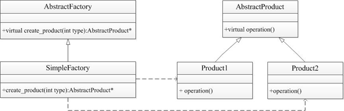
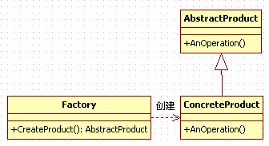
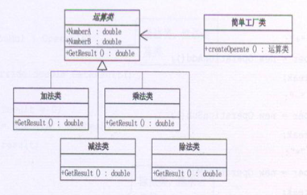

## 简单工厂模式

简单工厂模式定义了创建对象的接口，将创建对象的细节隐藏，产生具体对象时只需要向工厂提供产品类型，而无需根据每一个具体类依次调用各自的构造函数。

一个工厂生产多种产品，采购商只需要提供所需的产品名称，而无需了解产品是哪个车间生产的。

简单工厂模式属于类的创建型模式,又叫做静态工厂方法模式。通过专门定义一个类来负责创建其他类的实例，被创建的实例通常都具有共同的父类。

核心思想是用一个工厂来根据输入的条件产生不同的类，然后根据不同类的virtual函数得到不同的结果。

工厂模式：客户类和工厂类分开。  

消费者任何时候需要某种产品，只需向工厂请求即可。  

消费者无须修改就可以接纳新产品。缺点是当产品修改时，工厂类也要做相应的修改。如：如何创建及如何向客户端提供。 

追MM少不了请吃饭了，麦当劳的鸡翅和肯德基的鸡翅都是MM爱吃的东西，虽然口味有所不同，但不管你带MM去麦当劳或肯德基，只管向服务员说“来四个鸡翅”就行了。麦当劳和肯德基就是生产鸡翅的Factory。  

第一，基类存放数据  

第二，派生类有很多，派生类存放数据的操作  

第三实现接口类，用静态函数实现调用各种派生类 

## 模式中包含的角色及其职责



- 抽象工厂：工厂类的基类，提供工厂的公共操作接口
- 具体工厂：简单工厂模式的核心，用来生产具体产品
- 抽象产品：具体产品类的基类，负责提供产品操作的公共接口
- 具体产品：是抽象产品的具体实现，描述不同产品的具体信息



- 工厂（Creator）角色

简单工厂模式的核心，它负责实现创建所有实例的内部逻辑。工厂类可以被外界直接调用，创建所需的产品对象。

- 抽象（Product）角色

简单工厂模式所创建的所有对象的父类，它负责描述所有实例所共有的公共接口。

- 具体产品（Concrete Product）角色

简单工厂模式所创建的具体实例对象

依赖: 一个类的对象当另外一个类的函数参数或者是返回值

## 简单工厂模式的优缺点 

在这个模式中，工厂类是整个模式的关键所在。它包含必要的判断逻辑，能够根据外界给定的信息，决定究竟应该创建哪个具体类的对象。用户在使用时可以直接根据工厂类去创建所需的实例，而无需了解这些对象是如何创建以及如何组织的。有利于整个软件体系结构的优化。不难发现，简单工厂模式的缺点也正体现在其工厂类上，由于工厂类集中了所有实例的创建逻辑，所以“高内聚”方面做的并不好。另外，当系统中的具体产品类不断增多时，可能会出现要求工厂类也要做相应的修改，扩展性并不很好。

GOOD：适用于不同情况创建不同的类时		

BUG：客户端必须要知道基类和工厂类，耦合性差		

核心思想是用一个工厂来根据输入的条件产生不同的类，然后根据不同类的virtual函数得到不同的结果。

```C++
#include <iostream>
using namespace std;

class Fruit 
{
public:
	virtual void getFruit() = 0;
};

class Banana : public Fruit
{
public:
	virtual void getFruit()
	{
		cout << "我是香蕉..." << endl;
	}
};

class Apple : public Fruit
{
public:
	virtual void getFruit()
	{
		cout << "我是苹果..." << endl;
	}
};

class Factory
{
public:
	Fruit *create(char *p)
	{
		if (strcmp(p, "banana") == 0)
		{
			return new Banana;	 
		}
		else if (strcmp(p, "apple") == 0)
		{
			return new Apple;
		}
		else
		{
			printf("不支持\n" ) ;
			return NULL;
		}
	}
};

void main()
{
	Factory *f = new Factory;
	Fruit *fruit = NULL;

	//工厂生产 香蕉
	fruit = f->create("banana");
	fruit->getFruit();
	delete fruit;

	fruit = f->create("apple");
	fruit->getFruit();
	delete fruit;

	delete f;

	system("pause");
	return ;
}
```
## 示例代码

模拟四则运算



```C++
#include <iostream>  
#include <string>  
using namespace std; 
  
class Operation    //基类存放数据  
{  
public:  
    double numberA, numberB;//两个数  
    virtual double  getResult()//获取结果  
    {  
        return 0;  
    }  
};  
  
class addOperation :public Operation//派生类存放操作  
{  
    double getResult()  
    {  
        return numberA + numberB;  
    }  
};  
  
class subOperation :public Operation  
{  
    double getResult()  
    {  
        return numberA - numberB;  
    }  
};  
  
class mulOperation :public Operation  
{  
    double getResult()  
    {  
        return numberA*numberB;  
    }  
};  
  
class divOperation :public Operation  
{  
    double getResult()  
    {  
        return numberA / numberB;  
    }  
};  
  
class operFactory
{  
public:  
    static Operation *createOperation(char c)  
    {  
        switch (c)  
        {  
        case '+':  
            return new addOperation;  
            break;  
  
        case '-':  
            return new subOperation;  
            break;  
  
        case '*':  
            return new mulOperation;  
            break;  
  
        case '/':  
            return new divOperation;  
            break;  
        }  
    }  
};  
  
int main()  
{  
    Operation *oper = operFactory::createOperation('-');  
    oper->numberA = 9;  
    oper->numberB = 99;  
    cout << oper->getResult() << endl;  
  
    cin.get();  
    return 0;  
}  
```
示例代码2

- 定义抽象工厂类

```c++
//factory.h
#ifndef FACTORY_H
#define FACTORY_H
class AbstractProduct;

class AbstractFactory{ //定义抽象工厂类
public:
	virtual ~AbstractFactory();
	virtual AbstractProduct *create_product(int) = 0;
protected:
	AbstractFactory();
};
//定义简单工厂类，派生自抽象工厂类，主要功能是生产不同产品
class Factory :public AbstractFactory{
public:
	~Factory();
	Factory();
	AbstractProduct *create_product(int);//根据参数，产生不同产品对象
};
#endif
```

```c++
//factory.cpp
#include <iostream>
#include "factory.h"
#include "product.h"
using namespace std;

AbstractFactory::AbstractFactory()  //定义抽象工厂类构造函数
{
}
AbstractFactory::~AbstractFactory() //定义抽象工厂类析构函数
{
}
Factory::Factory()                  //定义简单工厂类构造函数
{
	cout << "factory constructor!" << endl;
}
Factory::~Factory()                  //定义简单工厂类析构函数
{
}
//定义create_product()函数，该函数根据参数创建不同产品对象
AbstractProduct *Factory::create_product(int type)
{
	switch (type){
	case 1:	return new Product1();
	case 2: return new Product2();
	}
}
```

- 定义抽象产品类，提供产品操作的接口

```c++
//product.h
#ifndef PRODUCT_H
#define PRODUCT_H

class AbstractProduct{//定义抽象产品类，提供产品操作的接口
public:
	virtual ~AbstractProduct();
	virtual void operation() = 0;
protected:
	AbstractProduct();
};
//定义类Product1，派生自抽象产品类
class Product1 :public AbstractProduct{
public:
	~Product1();
	Product1();
	void operation(); //定义属于本产品的操作函数
};
//定义Product2，派生自抽象产品类
class Product2 :public AbstractProduct{
public:
	~Product2();
	Product2();
	void operation();
};
#endif
```

```c++
//product.cpp
#include "product.h"
#include <iostream>
using namespace std;

//定义AbstractProduct构造函数
AbstractProduct::AbstractProduct(){}

//定义AbstractProduct析构函数
AbstractProduct::~AbstractProduct(){}

Product1::Product1()//定义Product1构造函数
{
	cout << "product1 constructor!" << endl;
}

//定义Product1析构函数
Product1::~Product1(){}

void Product1::operation()//定义Product1操作函数
{
	cout << "product1 operation!" << endl;
}

Product2::Product2()//定义Product2构造函数
{
	cout << "product2 constructor!" << endl;
}

//定义Product2析构函数
Product2::~Product2(){}    

void Product2::operation()//定义Product2操作函数
{
	cout << "product2 operation!" << endl;
}
```

- main.cpp

```c++
#include <iostream>
#include "product.h"
#include "factory.h"
using namespace std;

int main()
{
	AbstractFactory *fac = new Factory();          //创建简单工厂类
	AbstractProduct *p1 = fac->create_product(1);  //通过简单工厂生产产品1
	AbstractProduct *p2 = fac->create_product(2);  //通过简单工厂生产产品2
	p1->operation();                               //产品1执行相应操作
	p2->operation();                               //产品2执行相应操作
	delete fac;
	delete p1;
	delete p2;
	system("pause");
	return 0;
}
```