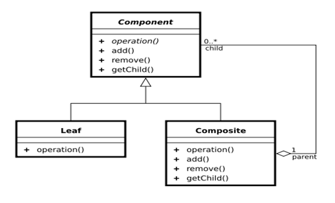
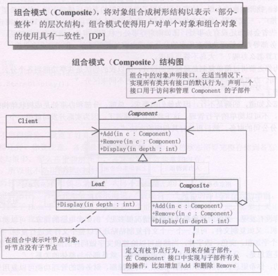
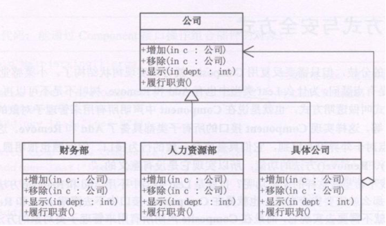

## 组合模式

Composite模式也叫组合模式，是构造型的设计模式之一。通过递归手段来构造树形的对象结构，并可以通过一个对象来访问整个对象树。

合成模式：合成模式将对象组织到树结构中，可以用来描述整体与部分的关系。  

合成模式就是一个处理对象的树结构的模式。合成模式把部分与整体的关系用树结构表示出来。  

合成模式使得客户端把一个个单独的成分对象和由他们复合而成的合成对象同等看待。  

- Mary今天过生日。“我过生日，你要送我一件礼物。”  
- 嗯，好吧，去商店，你自己挑。
- “这件T恤挺漂亮，买，这条裙子好看，买，这个包也不错，买  。”
- “喂，买了三件了呀，我只答应送一件礼物的。”
- 什么呀，T恤加裙子加包包，正好配成一套呀，小姐，麻烦你包起来。  
- “……”，MM都会用Composite模式了，你会了没有？  

## 类图角色和职责



Component （树形结构的节点抽象）

- 为所有的对象定义统一的接口（公共属性，行为等的定义）
- 提供管理子节点对象的接口方法
- [可选]提供管理父节点对象的接口方法

Leaf （树形结构的叶节点）：Component的实现子类

Composite（树形结构的枝节点）：Component的实现子类

适用于：单个对象和组合对象的使用具有一致性。将对象组合成树形结构以表示“部分--整体”

## 示例代码

```C++
#include <iostream>
#include "string"
#include "list"
using namespace std;

class IFile
{
public:
	virtual void display() = 0;
	virtual int add(IFile *ifile) = 0;
	virtual int remove(IFile *ifile) = 0;
	virtual list<IFile *>* getChild() = 0;
};

//文件结点 
class File : public IFile
{
public:
	File(string name)
	{
		m_name = name;
	}
  
	virtual void display()
	{
		cout << m_name << endl;
	}

	virtual int add(IFile *ifile)
	{
		return -1;
	}

	virtual int remove(IFile *ifile)
	{
		return -1;
	}

	virtual list<IFile *>*  getChild()
	{
		return NULL;
	}
private:
	string m_name;
};

//目录结点 
class Dir : public IFile
{
public:
	Dir(string name)
	{
		m_name = name;
		m_list = new list<IFile *>;
		m_list->clear();
	}
  
	virtual void display()
	{
		cout << m_name << endl;
	}

	virtual int add(IFile *ifile)
	{
		m_list->push_back(ifile);
		return 0;
	}

	virtual int remove(IFile *ifile)
	{
		m_list->remove(ifile);
		return 0;
	}

	virtual list<IFile *>*  getChild()
	{
		return m_list;
	}
private:
	string m_name;
	list<IFile *>  *m_list;
};

// 递归的显示树
void showTree(IFile *root, int level)
{
	int i = 0;
	if (root == NULL)
	{
		return ;
	}
	for (i=0; i<level; i++)
	{
		printf("\t");
	}
	//1 显示根 结点
	root->display();

	//2 若根结点有孩子 
	// 判读孩子是文件,显示名字
	// 判断孩子是目录,showTree(子目录)

	list<IFile *>  *mylist = root->getChild();
	if (mylist != NULL) //说明是一个目录
	{
		for (list<IFile *>::iterator it=mylist->begin(); it!=mylist->end(); it++)
		{
			if ( (*it)->getChild() == NULL )
			{
				for (i=0; i<=level; i++) //注意 <=
				{
					printf("\t");
				}
				(*it)->display();
			}
			else
			{
				showTree(*it, level+1);
			}
		}
	}
}

void main()
{
	Dir *root = new Dir("C");
	//root->display();

	Dir *dir1 = new Dir("111dir");
	File *aaafile = new File("aaa.txt");

	//获取root结点下的 孩子集合
	list<IFile *>  *mylist =  root->getChild();

	root->add(dir1);
	root->add(aaafile);

	for ( list<IFile *>::iterator it=mylist->begin(); it!=mylist->end(); it++ )
	{
		(*it)->display();
	}

	Dir *dir222 = new Dir("222dir");
	File *bbbfile = new File("bbb.txt");
	dir1->add(dir222);
	dir1->add(bbbfile);

	cout << "通过 showTree 方式显示 root 结点下的所有子结点" << endl;

	showTree(root, 0);

	system("pause");
	return ;
}
```

```C++
#include <iostream>  
#include <vector>  
#include <string>  
using namespace std;
  
class Component  
{  
public:  
    string name;  
    Component(string name)  
    {  
        this->name = name;  
    }  
    virtual void add(Component *) = 0;  
    virtual void remove(Component *) = 0;  
    virtual void display(int) = 0;  
};  
  
class Leaf :public Component  
{  
public:  
    Leaf(string name) :Component(name)  
    {}  
    void add(Component *c)  
    {  
        cout << "leaf cannot add" << endl;  
    }  
    void remove(Component *c)  
    {  
        cout << "leaf cannot remove" << endl;  
    }  
    void display(int depth)  
    {  
        string str(depth, '-');  
        str += name;  
        cout << str << endl;  
    }  
};  
  
class Composite :public Component  
{  
private:  
    vector<Component*> component;  
public:  
    Composite(string name) :Component(name)  
    {}  
    void add(Component *c)  
    {  
        component.push_back(c);  
    }  
    void remove(Component *c)  
    {  
        vector<Component*>::iterator iter = component.begin();  
        while (iter != component.end())  
        {  
            if (*iter == c)  
            {  
                component.erase(iter);  
            }  
            iter++;  
        }  
    }  
    void display(int depth)  
    {  
        string str(depth, '-');  
        str += name;  
        cout << str << endl;  
  
        vector<Component*>::iterator iter = component.begin();  
        while (iter != component.end())  
        {  
            (*iter)->display(depth + 2);  
            iter++;  
        }  
    }  
};  
  
  
int main()  
{  
    Component *p = new Composite("小李");  
    p->add(new Leaf("小王"));  
    p->add(new Leaf("小强"));  
  
    Component *sub = new Composite("小虎");  
    sub->add(new Leaf("小王"));  
    sub->add(new Leaf("小明"));  
    sub->add(new Leaf("小柳"));  
  
    p->add(sub);  
    p->display(0);  
  
    cout << "*******" << endl;  
    sub->display(2);  
  
    cin.get();  
  
    return 0;  
}
```


```c++
#include <iostream>
#include <string>
#include <vector>
using namespace std;

class Company
{
protected:
	string m_strName;
public:
	Company(string strName)
	{
		m_strName = strName;
	}

	virtual void Add(Company* c)=0;
	virtual void Display(int nDepth)=0;
	virtual void LineOfDuty()=0;
};

class ConcreteCompany: public Company
{
private:
	vector<Company*> m_company;
public:
	ConcreteCompany(string strName):Company(strName){}

	virtual void Add(Company* c)
	{
		m_company.push_back(c);
	}
	virtual void Display(int nDepth)
	{
		string strtemp;
		for(int i=0; i < nDepth; i++)
		{
			strtemp += "-";
		}
		strtemp +=m_strName;
		cout<<strtemp<<endl;

		vector<Company*>::iterator p=m_company.begin();
		while (p!=m_company.end())
		{
			(*p)->Display(nDepth+2);
			p++;
		}
	}
	virtual void LineOfDuty()
	{
		vector<Company*>::iterator p=m_company.begin();
		while (p!=m_company.end())
		{
			(*p)->LineOfDuty();
			p++;
		}
	}
};

class HrDepartment : public Company
{
public:

	HrDepartment(string strname) : Company(strname){}

	virtual void Display(int nDepth)
	{
		string strtemp;
		for(int i = 0; i < nDepth; i++)
		{
			strtemp += "-";
		}

		strtemp += m_strName;
		cout<<strtemp<<endl;
	}
	virtual void Add(Company* c)
	{
		cout<<"error"<<endl;
	}

	virtual void LineOfDuty()
	{
		cout<<m_strName<<":招聘人才"<<endl;
	}
};

//客户端：
int main()
{
	ConcreteCompany *p = new ConcreteCompany("清华大学");
	p->Add(new HrDepartment("清华大学人才部"));

	ConcreteCompany *p1 = new ConcreteCompany("数学系");
	p1->Add(new HrDepartment("数学系人才部"));

	ConcreteCompany *p2 = new ConcreteCompany("物理系");
	p2->Add(new HrDepartment("物理系人才部"));

	p->Add(p1);
	p->Add(p2);

	p->Display(1);
	p->LineOfDuty();
	return 0;
}
```