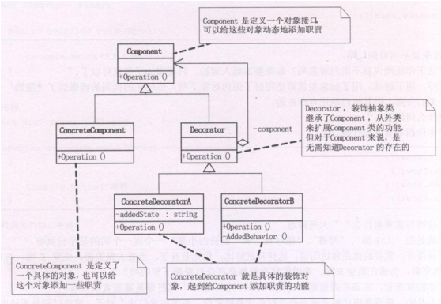

## 装饰者模式

装饰（ Decorator ）模式又叫做包装模式。通过一种对客户端透明的方式来扩展对象的功能，是继承关系的一个替换方案。

装饰模式就是把要添加的附加功能分别放在单独的类中，并让这个类包含它要装饰的对象，当需要执行时，客户端就可以有选择地、按顺序地使用装饰功能包装对象。

装饰模式：装饰模式以对客户端透明的方式扩展对象的功能，是继承关系的一个替代方案，提供比继承更多的灵活性。  

动态给一个对象增加功能，这些功能可以再动态的撤消。  

增加由一些基本功能的排列组合而产生的非常大量的功能。  

Mary过完轮到Sarly过生日，还是不要叫她自己挑了，不然这个月伙食费肯定玩完，拿出我去年在华山顶上照的照片，在背面写上“最好的的礼物，就是爱你的Fita”，再到街上礼品店买了个像框（卖礼品的MM也很漂亮哦），再找隔壁搞美术设计的Mike设计了一个漂亮的盒子装起来……，我们都是Decorator，最终都在修饰我这个人呀，怎么样，看懂了吗？ 

## 类图角色和职责

适用于：装饰者模式（Decorator Pattern）动态的给一个对象添加一些额外的职责。就增加功能来说，此模式比生成子类更为灵活。




## 示例代码

```C++
#include <iostream>
using namespace std;

class Car
{
public:
	virtual void show() = 0;
};

class RunCar : public Car 
{
public:
	virtual void show()
	{
		cout << "可以跑" << endl;
	}
};

class SwimCarDirector : public Car
{
public:
	SwimCarDirector(Car *car)
	{
		m_car = car;
	}
  
	void swim()
	{
		cout << "可以游" << endl;
	}
  
	virtual void show()
	{
		m_car->show();
		swim();
	}
private:
	Car *m_car;
};

class  FlyCarDirector : public Car
{
public:
	FlyCarDirector(Car *car)
	{
		m_car = car;
	}
  
	void fly()
	{
		cout << "可以飞" << endl;
	}
  
	virtual void show()
	{
		m_car->show();
		fly();
	}

private:
	Car *m_car;
};

void main()
{
	Car * mycar = NULL;
	mycar = new RunCar;
	printf("-----\n");
	mycar->show();

	printf("-----\n");

	FlyCarDirector *flycar = new FlyCarDirector(mycar);
	flycar->show();

	printf("-----\n");
	SwimCarDirector *swimcar = new SwimCarDirector(flycar);
	swimcar->show();
	
	delete swimcar;
	delete flycar;
	delete mycar;
  
	system("pause");
	return ;
}
```

```C++
#include <string>  
#include <iostream>  
using namespace std; 
  
class Person  
{  
private:  
    string m_strName;  
public:  
    Person(string strName)  
    {  
        m_strName = strName;  
    }  
    Person(){}  
    virtual void show()  
    {  
        cout << "装扮的是:" << m_strName << endl;  
    }  
};  
  
class Finery :public Person  
{  
protected:  
    Person *m_component;  
public:  
    void decorate(Person* component)  
    {  
        m_component = component;  
    }  
    virtual void show()  
    {  
        m_component->show();  
    }  
};  
  
class TShirts :public Finery  
{  
public:  
    virtual void show()  
    {  
        m_component->show();  
        cout << "T shirts" << endl;  
    }  
};  
  
class BigTrouser :public Finery  
{  
public:  
    virtual void show()  
    {  
        m_component->show();  
        cout << "Big Trouser" << endl;  
    }  
};  
  
int main()  
{  
    Person *p = new Person("小李");  
    BigTrouser *bt = new BigTrouser();  
    TShirts *ts = new TShirts();  
  
    bt->decorate(p);  
    ts->decorate(bt);  
    ts->show();  
    cin.get();  
    return 0;  
}  
```