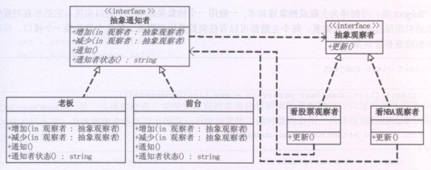
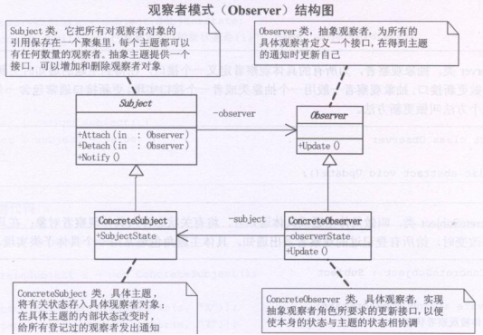

## 观察者模式

Observer模式是行为模式之一，它的作用是当一个对象的状态发生变化时，能够自动通知其他关联对象，自动刷新对象状态。

Observer模式提供给关联对象一种同步通信的手段，使某个对象与依赖它的其他对象之间保持状态同步。

观察者模式：观察者模式定义了一种一队多的依赖关系，让多个观察者对象同时监听某一个主题对象。这个主题对象在状态上发生变化时，会通知所有观察者对象，使他们能够自动更新自己。  

想知道咱们公司最新MM情报吗？加入公司的MM情报邮件组就行了，tom负责搜集情报，他发现的新情报不用一个一个通知我们，直接发布给邮件组，我们作为订阅者（观察者）就可以及时收到情报啦。

监视，观察者，都有一个基类，派生，实现不同的效果监视者的类，管理所有的观察者，增加或者删除，发出消息，让观察者处理观察者的类需要接受消息并处理。

## 类图角色和职责





- Subject（被观察者）

被观察的对象。当需要被观察的状态发生变化时，需要通知队列中所有观察者对象。Subject需要维持（添加，删除，通知）一个观察者对象的队列列表。

- ConcreteSubject

被观察者的具体实现。包含一些基本的属性状态及其他操作。

- Observer（观察者）

接口或抽象类。当Subject的状态发生变化时，Observer对象将通过一个callback函数得到通知。

- ConcreteObserver

观察者的具体实现。得到通知后将完成一些具体的业务逻辑处理。

## 典型应用

- 侦听事件驱动程序设计中的外部事件
- 侦听/监视某个对象的状态变化
- 发布者/订阅者(publisher/subscriber)模型中，当一个外部事件（新的产品，消息的出现等等）被触发时，通知邮件列表中的订阅者

适用于：定义对象间一种一对多的依赖关系，使得每一个对象改变状态，则所有依赖于他们的对象都会得到通知。

使用场景：定义了一种一对多的关系，让多个观察对象（公司员工）同时监听一个主题对象（秘书），主题对象状态发生变化时，会通知所有的观察者，使它们能够更新自己。

## 示例代码

```C++
#include <iostream>
#include "string"
#include "list"
using namespace std;

class Secretary;
 
class PlayserObserver //观察者
{
public:
	PlayserObserver(Secretary *secretary)
	{
		this->m_secretary = secretary;
	}
  
	void update(string action)
	{
		cout << "action:" << action << endl;
		cout << "老板来了 我很害怕啊..." << endl;	
	}
  
private:
	Secretary *m_secretary;
};

class Secretary
{
public:
	Secretary()
	{
		m_list.clear();
	}
  
	void Notify(string info)
	{
		//给所有的 观察者 发送 情报
		for ( list<PlayserObserver *>::iterator it=m_list.begin(); 
             it!=m_list.end(); it++)
		{
			(*it)->update(info);
		}
	}

	void setPlayserObserver(PlayserObserver *o)
	{
		m_list.push_back(o);
	}

private:
	list<PlayserObserver *> m_list;
};

void main()
{
	Secretary			*secretary = NULL;
	PlayserObserver		*po1 = NULL;
	PlayserObserver		*po2 = NULL;

	secretary = new Secretary;
	po1 = new PlayserObserver(secretary);
	po2 = new PlayserObserver(secretary);

	secretary->setPlayserObserver(po1);
	secretary->setPlayserObserver(po2);

	secretary->Notify("老板来了") ;
	secretary->Notify("老板走了");
	delete secretary ;
	delete po1 ;
	delete po2 ;

	system("pause");
	return ;
}
```

```C++
#include <iostream>  
#include <string>  
#include <list>  
using namespace std; 
  
class Subject; //可以使用subject  
  
class Observer  
{  
protected:  
    string name;  
    Subject *sub;  
public:  
    Observer(string name, Subject *sub)//观察者的名字， 监视与通知的类  
    {  
        this->name = name;//输入名字  
        this->sub = sub;//设置谁来通知我  
    }  
    virtual void update() = 0;//纯虚函数  
};  
  
class StockObserver :public Observer //继承，自己实现刷新函数  
{  
public:  
    StockObserver(string name, Subject *sub) :Observer(name, sub)  
    {  
    }  
    void update();  
};  
  
class NBAObserver :public Observer  
{  
public:  
    NBAObserver(string name, Subject *sub) :Observer(name, sub)  
    {  
    }  
    void update();  
};  
  
class Subject
{  
protected:  
    list<Observer*> observers;///存储观察者的指针，链表  
public:  
    string action;  
    virtual void attach(Observer*) = 0;  
    virtual void detach(Observer*) = 0;  
    virtual void notify() = 0;//实现监听的基类  
};  
  
class Secretary :public Subject     
{  
    void attach(Observer *observer)  //载入通知的列表  
    {  
        observers.push_back(observer);  
    }  
    void detach(Observer *observer)//删除  
    {  
        list<Observer *>::iterator iter = observers.begin();  
        while (iter != observers.end())  
        {  
            if ((*iter) == observer)  
            {  
                observers.erase(iter);  
            }  
            ++iter;  
        }  
    }  
    void notify()  //通知函数  
    {  
        list<Observer *>::iterator iter = observers.begin();  
        while (iter != observers.end())  
        {  
            (*iter)->update();  
            ++iter;  
        }  
    }  
};  
  
void StockObserver::update()  
{  
    cout << name << " 收到消息：" << sub->action << endl;  
    if (sub->action == "梁所长来了!")  
    {  
        cout << "我马上关闭股票，装做很认真工作的样子！" << endl;  
    }  
    if (sub->action == "去喝酒！")  
    {  
        cout << "我马上走" << endl;  
    }  
}  
  
void NBAObserver::update()  
{  
    cout << name << " 收到消息：" << sub->action << endl;  
    if (sub->action == "梁所长来了!")  
    {  
        cout << "我马上关闭NBA，装做很认真工作的样子！" << endl;  
    }  
  
   if (sub->action == "去喝酒！")  
   {  
    cout << "我马上拍" << endl;  
    }  
}  
  
int main()  
{  
    Subject *dwq = new Secretary();//消息监视，监视  
  
    Observer *xs = new NBAObserver("xiaoshuai", dwq);//订阅消息  
    Observer *zy = new NBAObserver("zouyue", dwq);  
    Observer *lm = new StockObserver("limin", dwq);  
  
    dwq->attach(xs);  
    dwq->attach(zy);  
    dwq->attach(lm);//增加到队列  
  
    dwq->action = "去吃饭了！";  
    dwq->notify();  
    dwq->action = "去喝酒！";  
    dwq->notify();  
    cout << endl;  
    dwq->action = "梁所长来了!";  
    dwq->notify();  
    cin.get();  
    return 0;  
}  
```