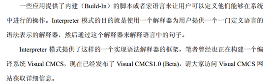

## 解析器模式



解释器模式：给定一个语言后，解释器模式可以定义出其文法的一种表示，并同时提供一个解释器。客户端可以使用这个解释器来解释这个语言中的句子。  

解释器模式将描述怎样在有了一个简单的文法后，使用模式设计解释这些语句。  

在解释器模式里面提到的语言是指任何解释器对象能够解释的任何组合。  

在解释器模式中需要定义一个代表文法的命令类的等级结构，也就是一系列的组合规则。每一个命令对象都有一个解释方法，代表对命令对象的解释。命令对象的等级结构中的对象的任何排列组合都是一个语言。  

俺有一个《泡MM真经》，上面有各种泡MM的攻略，比如说去吃西餐的步骤、去看电影的方法等等，跟MM约会时，只要做一个Interpreter，照着上面的脚本执行就可以了。 

## 类图角色和职责

- Context：解释器上下文环境类。用来存储解释器的上下文环境，比如需要解释的文法等
- AbstractExpression：解释器抽象类
- ConcreteExpression：解释器具体实现类


Interpreter 模式中，提供了 TerminalException 和 NonTerminalException 两种表达式的解释方式，Context 类用于为解释过程提供一些附加信息（例如全局的信息）。


## 示例代码

```C++
#include <iostream>
using namespace std;

class Context
{
public:
	Context(int num)
	{
		this->m_num = num;
	}
  
	int getNum()
	{
		return m_num;
	}
  
	int getRes()
	{
		return m_res;
	}

	void setNum(int num)
	{
		this->m_num = num;
	}
  
	void  setRes(int res)
	{
		this->m_res = res;
	}

private:
	int m_num;
	int m_res;
};

class Expression
{
public:
	virtual void  interpreter(Context *context) = 0;
private:
	Context		*m_context;
};

//加法
class PlusExpression : public Expression
{
public:
	PlusExpression()
	{
		this->context = NULL;
	}
  
	virtual void  interpreter(Context *context)
	{
		int num = context->getNum();
		num ++;
		context->setNum(num);
		context->setRes(num);
	}
  
private:
	Context *context;
};


// 减法
class MinusExpression : public Expression
{
public:
	MinusExpression()
	{
		this->context = NULL;
	}
  
	virtual void  interpreter(Context *context)
	{
		int num = context->getNum();
		num -- ;
		context->setNum(num);
		context->setRes(num);
	}
  
private:
	Context *context;
};

void main()
{
	
	Expression		*expression = NULL;
	Context			*context = NULL;

	Expression		*expression2 = NULL;

	context = new Context(10);
	cout << context->getNum() << endl;

	expression = new PlusExpression;
	expression->interpreter(context);

	cout << context->getRes() << endl;

	expression2 = new MinusExpression;
	expression2->interpreter(context);
	cout << context->getRes() << endl;

	system("pause");
	return ;
}
```

```C++
#include <iostream>  
#include <list>  
#include <string>  
using namespace std; 
  
class Context;  
  
class AbstractExpression  
{  
public:  
    virtual void interpret(Context *) = 0;  
};  
  
class TerminalExpression :public AbstractExpression  
{  
public:  
    void interpret(Context *context)  
    {  
        cout << "终端解释器" << endl;  
    }  
};  
  
class NonterminalExpression :public AbstractExpression  
{  
public:  
    void interpret(Context *context)  
    {  
        cout << "非终端解释器" << endl;  
    }  
};  
  
class Context  
{  
public:  
    string input, output;  
};  
  
int main()  
{  
    Context *context = new Context();  
    list<AbstractExpression*>  lt;  
    lt.push_back(new TerminalExpression());  
    lt.push_back(new NonterminalExpression());  
    lt.push_back(new TerminalExpression());  
    lt.push_back(new TerminalExpression());  
  
    for (list<AbstractExpression*>::iterator iter = lt.begin(); iter != lt.end(); iter++)  
    {  
        (*iter)->interpret(context);  
    }  
  
    cin.get();  
    return 0;  
} 
```