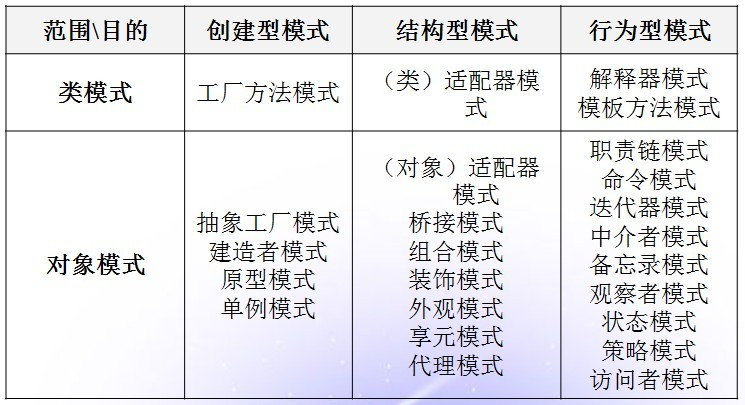

## 1. 设计模式

设计模式（Design pattern）是一套被反复使用、多数人知晓的、经过分类编目的、代码设计经验的总结。使用设计模式是为了可重用代码、让代码更容易被他人理解、保证代码可靠性。 毫无疑问，设计模式于己于他人于系统都是多赢的，设计模式使代码编制真正工程化，设计模式是软件工程的基石，如同大厦的一块块砖石一样。

模式的经典定义：每个模式都描述了一个在我们的环境中不断出现的问题，然后描述了该问题的解决方案的核心，通过这种方式，我们可以无数次地重用那些已有的解决方案，无需再重复相同的工作。即模式是在特定环境中解决问题的一种方案 

## 2. 设计模式 目的

其目的就是一方面教你如何利用真实可靠的设计来组织代码的模板。 简单地说，就是从前辈们在程序设计过程中总结、抽象出来的通用优秀经验。主要目的一方面是为了增加程序的灵活性、可重用性。  另一方面也有助于程序设计的标准化和提高系统开发进度。

也有人忠告：不要过于注重程序的“设计模式”。 有时候，写一个简单的[算法](http://lib.csdn.net/base/datastructure)，要比引入某种模式更容易。在多数情况下，程序代码应是简单易懂，甚至清洁工也能看懂。不过呢在大项目或者框架中，没有设计模式来组织代码，别人是不易理解的。

一个软件设计模型也仅仅只是一个引导。它必须根据程序设计语言和你的应用程序的特点和要求而特别的设计。

## 3. 设计模式历史

设计模式”这个术语最初被设计用于建筑学领域。Christopher Alexander 在他1977的著作“A Pattern Language :Towns/Building/Construction”里面描述了一些常见的建筑学设计问题，并解释了如何用这些已有的，著名的模式集合来开始全新 的有效的设计。Alexander的观点被很好的转化到软件开发上来，并且长期的合意的用原有的组件来构造新的解决方案。

## 4. 设计模式的四个基本要素

设计模式使人们可以更加简单方便地复用成功的设计和体系结构。将已证实的技术表述成设计模式也会使新系统开发者更加容易理解其设计思路。

所有的设计模式都有一些常用的特性：一个标识（a pattern name），一个问题陈述（a problem statement）和一个解决方案(a solution)，效果(consequences)

**模式名称（pattern name）： 描述模式的问题、解决方案和效果**

一个设计模式的标识（模式名称）是重要的，因为它会让其他的程序员不用进行太深入的学习就能立刻理解你的代码的目的（至少通过这个标识程序员会很熟悉这个模式）。没有这个模式名，我们便无法与其他人交流设计思想及设计结果。

**问题(problem)  ：描述是用来说明这个模式的应用的领域。**

描述了应该在何时使用模式。它解释了设计问题和问题存在的前因后果，它可能描述了特定的设计问题，如怎样用对象表示算法等。也可能描述了导致不灵活设计的类或对象结构。有时候，问题部分会包括使用模式必须满足的一系列先决条件。

**解决方案(solution) ： 描述了这个模型的执行。**

描述了设计的组成成分，它们之间的相互关系及各自的职责和协作方式。因为模式就像一个模板，可应用于多种不同场合，所以解决方案并不描述一个特定而具体的设计或实现，而是提供设计问题的抽象描述和怎样用一个具有一般意义的元素组合（类或对象组合）来解决这个问题。

**效果(consequences)**

描述了模式应用的效果及使用模式应权衡的问题。尽管我们描述设计决策时，并不总提到模式效果，但它们对于评价设计选择和理解使用模式的代价及好处具有重要意义。软件效果大多关注对时间和空间的衡量，它们也表述了语言和实现问题。因为复用是[面向对象设计](http://baike.baidu.com/view/2085197.htm)的要素之一，所以模式效果包括它对系统的灵活性、扩充性或可移植性的影响，显式地列出这些效果对理解和评价这些模式很有帮助。一个好的设计模式的论述应该覆盖使用这个模型的优点和缺点。

一个模式是解决特定问题的有效方法。一个设计模式不是一个库（能在你的项目中直接包含和使用的代码库）而是一个用来组织你的代码的模板（[Java ](http://lib.csdn.net/base/java)bean）。事实上，一个代码库和一个设计模式在应用上是有很多不同的。

比如，你从店铺里面买的一件衬衫是一个代码库，它的颜色，样式和大小都由设计师和厂商决定，但它满足了你的需求。 然而，如果店里面没有什么衣服适合你，那你就能自己创建自己的衬衫（设计它的形状，选择布料，然后裁缝在一起）。但是如果你不是一个裁缝，你可能会发现自 己很容易的去找一个合适的模式然后按着这个模式去设计自己的衬衫。使用一个模型，你可以在更少的时间内得到一个熟练设计的衬衫。

回到讨论软件上来，一个数据提取层或者一个CMS（content management system）就是一个库——它是先前设计好而且已经编码好了的，如果它能准确的满足你的需要那它就是一个好的选择。但如果你正在读这本书《设计模式》，可能你会发现 库存的（原有的）解决方案并不是总是对你有效。至今你知道什么是你所要的，而且你能够实现它，你仅仅需要一个模型来引导你。

最后一个想法：就象一个裁缝模型，一个设计本身而言是没有什么用处的。毕竟，你不可能穿一个服装模型——它仅仅是由很薄的纸拼凑起来的。类似的，一个软件设计模型也仅仅只是一个引导。它必须根据程序设计语言和你的应用程序的特点和要求而特别的设计。

## 3. 设计模式分类

1）根据其目的（模式是用来做什么的）可分为创建型(Creational)，结构型(Structural)和行为型(Behavioral)三种：

- 创建型模式主要用于创建对象。
- 结构型模式主要用于处理类或对象的组合。
- 行为型模式主要用于描述对类或对象怎样交互和怎样分配职责。

2）根据范围，即模式主要是用于处理类之间关系还是处理对象之间的关系，可分为类模式和对象模式两种：

- 类模式： 处理类和子类之间的关系，这些关系通过继承建立，在编译时刻就被确定下来，是属于静态的。

- 对象模式：处理对象间的关系，这些关系在运行时刻变化，更具动态性。 

## 4. 一些基本的设计模式 

- Abstract Factory 抽象工厂模式：提供一个创建一系列相关或相互依赖对象的接口，而无需指定它们具体的类。　

- Adapter适配器模式：将一个类的接口转换成客户希望的另外一个接口。Adapter模式使得原本由于接口不兼容而不能一起工作的那些类可以一起工作。　

- Bridge桥接模式：将抽象部分与它的实现部分分离，使它们都可以独立地变化。

- Builder建造者模式：将一个复杂对象的构建与它的表示分离，使得同样的构建过程可以创建不同的表示。　　

- Chain of Responsibility 职责链：为解除请求的发送者和接收者之间耦合，而使多个对象都有机会处理这个请求。将这些对象连成一条链，并沿着这条链传递该请求，直到有一个对象处理它。　

- Command命令模式：将一个请求封装为一个对象，从而使你可用不同的请求对客户进行参数化；对请求排队或记录请求日志，以及支持可取消的操作。

- Composite 组合模式：将对象组合成树形结构以表示“部分-整体”的层次结构。它使得客户对单个对象和复合对象的使用具有一致性。　

- Decorator 装饰器：动态地给一个对象添加一些额外的职责。就扩展功能而言， 它比生成子类方式更为灵活。　　

- Facade外观模式：为子系统中的一组接口提供一个一致的界面，Facade模式定义了一个高层接口，这个接口使得这一子系统更加容易使用。　　

- Factory Method 工厂方法：定义一个用于创建对象的接口，让子类决定将哪一个类实例化。Factory Method使一个类的实例化延迟到其子类。

- Flyweight享元模式：运用共享技术有效地支持大量细粒度的对象。　

- Interpreter模式：给定一个语言, 定义它的文法的一种表示，并定义一个解释器, 该解释器使用该表示来解释语言中的句子。　　

- Iterator 迭代器：提供一种方法顺序访问一个聚合对象中各个元素, 而又不需暴露该对象的内部表示。　

- Mediator 中介者：用一个中介对象来封装一系列的对象交互。中介者使各对象不需要显式地相互引用，从而使其耦合松散，而且可以独立地改变它们之间的交互。

- Memento备忘录模式：在不破坏封装性的前提下，捕获一个对象的内部状态，并在该对象之外保存这个状态。这样以后就可将该对象恢复到保存的状态。　

- Observer观察者模式：定义对象间的一种一对多的依赖关系,以便当一个对象的状态发生改变时,所有依赖于它的对象都得到通知并自动刷新。　

- Prototype原型模式：用原型实例指定创建对象的种类，并且通过拷贝这个原型来创建新的对象。　　

- Proxy 代理模式：为其他对象提供一个代理以控制对这个对象的访问。　　

- Singleton单例模式：保证一个类仅有一个实例，并提供一个访问它的全局访问点。

- State 状态：允许一个对象在其内部状态改变时改变它的行为。对象看起来似乎修改了它所属的类。　　

- Strategy 策略模式：定义一系列的算法,把它们一个个封装起来, 并且使它们可相互替换。本模式使得算法的变化可独立于使用它的客户。　

- Template Method 模板方法：定义一个操作中的算法的骨架，而将一些步骤延迟到子类中。Template Method使得子类可以不改变一个算法的结构即可重定义该算法的某些特定步骤。　

- Visitor 访问者模式：表示一个作用于某对象结构中的各元素的操作。它使你可以在不改变各元素的类的前提下定义作用于这些元素的新操作。

## 5. [设计模式六大原则](http://blog.csdn.net/zhengzhb/article/details/7289269)

**1）设计模式的核心原则是:"开-闭"原则(  Open - ClosedPrinciple 缩写:OCP  )：对扩展开放，对修改关闭**

意思是,在一个系统中,对于扩展是开放的,对于修改是关闭的,一个好的系统是在不修改源代码的情况下,可以扩展你的功能..而实现开闭原则的关键就是抽象化.

通过扩展已有软件系统，可以提供新的行为，以满足对软件的新的需求，使变化中的软件有一定的适应性和灵活性。已有软件模块，特别是最重要的抽象层模块不能再修改，这使变化中的软件系统有一定的稳定性和延续性。

在"开-闭"原则中,不允许修改的是抽象的类或者接口,允许扩展的是具体的实现类,抽象类和接口在"开-闭"原则中扮演着极其重要的角色..即要预知可能变化的需求.又预见所有可能已知的扩展..所以在这里"抽象化"是关键!!!

可变性的封闭原则:找到系统的可变因素,将它封装起来..这是对"开-闭"原则最好的实现..不要把你的可变因素放在多个类中,或者散落在程序的各个角落..你应该将可变的因素,封套起来..并且切忌不要把所用的可变因素封套在一起..最好的解决办法是,分块封套你的可变因素!!避免超大类,超长类,超长方法的出现!!给你的程序增加艺术气息,将程序艺术化是我们的目标!!

**2）里氏代换原则:任何基类可以出现的地方,子类也可以出现**

Liskov Substitution Principle（里氏代换原则）：子类能够必须能够替换基类能够从出现的地方。子类也能在基类 的基础上新增行为。这yi讲的是基类和子类的关系，只有这种关系存在时，里氏代换原则才存在。正方形是长方形是理解里氏代换原则的经典例子。

**3）依赖倒转原则:：要依赖抽象,而不要依赖具体的实现.**

依赖倒置（Dependence Inversion Principle）原则讲的是：要依赖于抽象，不要依赖于具体。简单的说，依赖倒置原则要求客户端依赖于抽象耦合。原则表述：

（1）抽象不应当依赖于细节；细节应当依赖于抽象；
（2）要针对接口编程，不针对实现编程。

如果说开闭原则是目标,依赖倒转原则是到达"开闭"原则的手段..如果要达到最好的"开闭"原则,就要尽量的遵守依赖倒转原则..可以说依赖倒转原则是对"抽象化"的最好规范!!我个人感觉,依赖倒转原则也是里氏代换原则的补充..你理解了里氏代换原则,再来理解依赖倒转原则应该是很容易的..

**4）合成/聚合复用原则（CARP）:要尽量使用合成/聚合原则,而不是继承关系达到软件复用的目的**

合成/聚合复用原则（Composite/Aggregate ReusePrinciple或CARP）经常又叫做合成复用原则（Composite ReusePrinciple或CRP），就是在一个新的对象里面使用一些已有的对象，使之成为新对象的一部分；新对象通过向这些对象的委派达到复用已有功能的目的。简而言之，要尽量使用合成/聚合，尽量不要使用继承。

**什么是合成?**

合成:是指一个整体对依托他而存在的关系,例如:一个人对他的房子和家具,其中他的房子和家具是不能被共享的,因为那些东西都是他自己的..并且人没了,这个也关系就没了..这个例子就好像,乌鸡百凤丸这个产品,它是有乌鸡和上等药材合成而来的一样..也比如网络游戏中的武器装备合成一样,多种东西合并为一种超强的东西一样

**什么是聚合?**

聚合:聚合是比合成关系的一种更强的依赖关系,聚合是一个整体对个体的部分,例如,一个奔驰S360汽车,对奔驰S360引擎,奔驰S360轮胎的关系..这些关系就是带有聚合性质的..因为奔驰S360引擎和奔驰S360轮胎他们只能被奔驰S360汽车所用,离开了奔驰S360汽车,它们就失去了存在的意义..在我们的设计中,这样的关系不应该频繁出现..这样会增大设计的耦合度..

明白了合成和聚合关系,再来理解合成/聚合原则应该就清楚了..要避免在系统设计中出现,一个类的继承层次超过3次..如果这样的话,可以考虑重构你的代码,或者重新设计结构..当然最好的办法就是考虑使用合成/聚合原则

**5）迪米特法则:系统中的类,尽量不要与其他类互相作用,减少类之间的耦合度**

迪米特法则（Law of Demeter或简写LoD）又叫最少知识原则（Least Knowledge Principle或简写为LKP），也就是说，一个对象应当对其它对象有尽可能少的了解。

其它表述：只与你直接的朋友们通信，不要跟"陌生人"说话。一个类应该对自己需要耦合或调用的类知道得最少，你（被耦合或调用的类）的内部是如何复杂都和我没关系，那是你的事情，我就知道你提供的public方法，我就调用这么多，其他的一概不关心。

迪米特法则与设计模式Facade模式、Mediator模式使民无知

系统中的类,尽量不要与其他类互相作用,减少类之间的耦合度,因为在你的系统中,扩展的时候,你可能需要修改这些类,而类与类之间的关系,决定了修改的复杂度,相互作用越多,则修改难度就越大,反之,如果相互作用的越小,则修改起来的难度就越小..例如A类依赖B类,则B类依赖C类,当你在修改A类的时候,你要考虑B类是否会受到影响,而B类的影响是否又会影响到C类..如果此时C类再依赖D类的话,呵呵,我想这样的修改有的受了..

**6）接口隔离法则:这个法则与迪米特法则是相通的**

接口隔离原则（Interface Segregation Principle）讲的是：使用多个专门的接口比使用单一的总接口总要好。换而言之，从一个客户类的角度来讲：一个类对另外一个类的依赖性应当是建立在最小接口上的。

过于臃肿的接口是对接口的污染。不应该强迫客户依赖于它们不用的方法。

迪米特法则是目的,而接口隔离法则是对迪米特法则的规范..为了做到尽可能小的耦合性,我们需要使用接口来规范类,用接口来约束类.要达到迪米特法则的要求,最好就是实现接口隔离法则,实现接口隔离法则,你也就满足了迪米特法则...

## 6. 总结

设计模式是从许多优秀的软件系统中总结出的成功的、能够实现可维护性复用的设计方案，使用这些方案将避免我们做一些重复性的工作，而且可以设计出高质量的软件系统。设计模式的主要优点如下：

1）设计模式融合了众多专家的经验，并以一种标准的形式供广大开发人员所用，它提供了一套通用的设计词汇和一种通用的语言以方便开发人员之间沟通和交流，使得设计方案更加通俗易懂。对于使用不同编程语言的开发和设计人员可以通过设计模式来交流系统设计方案，每一个模式都对应一个标准的解决方案，设计模式可以降低开发人员理解系统的复杂度。

2）设计模式使人们可以更加简单方便地复用成功的设计和体系结构，将已证实的技术表述成设计模式也会使新系统开发者更加容易理解其设计思路。设计模式使得重用成功的设计更加容易，并避免那些导致不可重用的设计方案。3）设计模式使得设计方案更加灵活，且易于修改。

4）设计模式的使用将提高软件系统的开发效率和软件质量，且在一定程度上节约设计成本。

5）设计模式有助于初学者更深入地理解面向对象思想，一方面可以帮助初学者更加方便地阅读和学习现有类库与其他系统中的源代码，另一方面还可以提高软件的设计水平和代码质量。设计模式不是学出来的，是用出来的。为了学习设计模式而学习，效果可能不是很好。一般框架都会使用设计模式。如PHP 的ZF用来很多设计模式，框架里面的类名或者目录名，都以某种设计模式的名称命名，这样大家一看到这个类名或者文件名，就知道它的代码组织结构了。如果精通了语言,剩下的编码自然是很简单,随着编码经验积累,对设计模式和原则的理解也就越透彻，其过程就是山穷水复疑无路，而结果柳暗花明又一村。另外需要注意，熟练模式后，切勿因模式二去模式。如果像著名数学家华罗庚谈到读书的三个境界所说，“读书是由薄到厚，再由厚到薄的过程”。说明你练到家了。

## 优秀程序设计的18大原则

良好的编程原则与良好的设计工程原则密切相关。本文总结的这些设计原则，帮助开发者更有效率的编写代码，并帮助成为一名优秀的程序员。作者Diggins是加拿大一位有25年编程经验的资深技术人员，曾效力于Microsoft和Autodesk，并创办过两家赢利的互联网公司。

1.避免重复原则(DRY - Don’t repeat yourself)

编程的最基本原则是避免重复。在程序代码中总会有很多结构体，如循环、函数、类等等。一旦你重复某个语句或概念，就会很容易形成一个抽象体。

2.抽象原则(Abstraction Principle )

与DRY原则相关。要记住，程序代码中每一个重要的功能，只能出现在源代码的一个位置。

3.简单原则(Keep It Simple and Stupid )

简单是软件设计的目标，简单的代码占用时间少，漏洞少，并且易于修改。

4.避免创建你不要的代码 Avoid Creating a YAGNI (You aren’t going to need it)

除非你需要它，否则别创建新功能。

5.尽可能做可运行的最简单的事(Do the simplest thing that could possibly work)

尽可能做可运行的最简单的事。在编程中，一定要保持简单原则。作为一名程序员不断的反思“如何在工作中做到简化呢?”这将有助于在设计中保持简单的路径。

6.别让我思考(Don’t make me think )

这是Steve Krug一本书的标题，同时也和编程有关。所编写的代码一定要易于读易于理解，这样别人才会欣赏，也能够给你提出合理化的建议。相反，若是繁杂难解的程序，其他人总是会避而远之的。

7.开闭原则(Open/Closed Principle)

你所编写的软件实体(类、模块、函数等)最好是开源的，这样别人可以拓展开发。不过，对于你的代码，得限定别人不得修改。换句话说，别人可以基于你的代码进行拓展编写，但却不能修改你的代码。

8.代码维护(Write Code for the Maintainer)

一个优秀的代码，应当使本人或是他人在将来都能够对它继续编写或维护。代码维护时，或许本人会比较容易，但对他人却比较麻烦。因此你写的代码要尽可能保证他人能够容易维护。用书中原话说“如果一个维护者不再继续维护你的代码，很可能他就有想杀了你的冲动。”

9.最小惊讶原则(Principle of least astonishment)

最小惊讶原则通常是在用户界面方面引用，但同样适用于编写的代码。代码应该尽可能减少让读者惊喜。也就是说，你编写的代码只需按照项目的要求来编写。其他华丽的功能就不必了，以免弄巧成拙。

10.单一责任原则(Single Responsibility Principle)

某个代码的功能，应该保证只有单一的明确的执行任务。

11.低耦合原则(Minimize Coupling)

代码的任何一个部分应该减少对其他区域代码的依赖关系。尽量不要使用共享参数。低耦合往往是完美结构系统和优秀设计的标志。

12.最大限度凝聚原则(Maximize Cohesion)

相似的功能代码应尽量放在一个部分。

13.隐藏实现细节(Hide Implementation Details)

隐藏实现细节原则，当其他功能部分发生变化时，能够尽可能降低对其他组件的影响。

14.迪米特法则又叫作最少知识原则(Law of Demeter)

该代码只和与其有直接关系的部分连接。(比如：该部分继承的类，包含的对象，参数传递的对象等)。

15.避免过早优化(Avoid Premature Optimization)

除非你的代码运行的比你想像中的要慢，否则别去优化。假如你真的想优化，就必须先想好如何用数据证明，它的速度变快了。

“过早的优化是一切罪恶的根源”——Donald Knuth

16.代码重用原则(Code Reuse is Good)

重用代码能提高代码的可读性，缩短开发时间。

17.关注点分离(Separation of Concerns)

不同领域的功能，应该由不同的代码和最小重迭的模块组成。

18.拥抱改变(Embrace Change)

这是Kent Beck一本书的标题，同时也被认为是极限编程和[敏捷](http://lib.csdn.net/base/agile)方法的宗旨。

许多其他原则都是基于这个概念的，即你应该积极面对变化。事实上，一些较老的编程原则如最小化耦合原则都是为了使代码能够容易变化。无论你是否是个极限编程者，基于这个原则去编写代码会让你的工作变得更有意义。