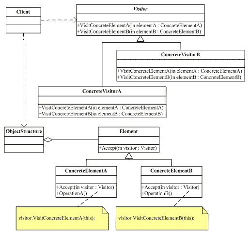
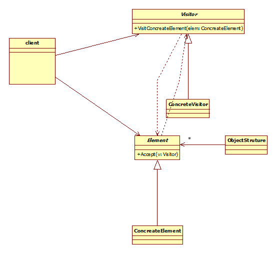

## 访问者模式

Visitor模式也叫访问者模式，是行为模式之一，它分离对象的数据和行为，使用Visitor模式，可以不修改已有类的情况下，增加新的操作角色和职责。

访问者模式：访问者模式的目的是封装一些施加于某种数据结构元素之上的操作。  一旦这些操作需要修改的话，接受这个操作的数据结构可以保持不变。  

访问者模式适用于数据结构相对未定的系统，它把数据结构和作用于结构上的操作之间的耦合解脱开，使得操作集合可以相对自由的演化。访问者模式使得增加新的操作变的很容易，就是增加一个新的访问者类。  

访问者模式将有关的行为集中到一个访问者对象中，而不是分散到一个个的节点类中。当使用访问者模式时，要将尽可能多的对象浏览逻辑放在访问者类中，而不是放到它的子类中。  

访问者模式可以跨过几个类的等级结构访问属于不同的等级结构的成员类。  

情人节到了，要给每个MM送一束鲜花和一张卡片，可是每个MM送的花都要针对她个人的特点，每张卡片也要根据个人的特点来挑，我一个人哪搞得清楚，还是找花店老板和礼品店老板做一下Visitor，让花店老板根据MM的特点选一束花，让礼品店老板也根据每个人特点选一张卡，这样就轻松多了。  

访问者模式不需要改变基类，不依赖虚函数，

## 类图角色和职责





抽象访问者（Visitor）角色：声明了一个或者多个访问操作，形成所有的具体元素角色必须实现的接口。

具体访问者（ConcreteVisitor）角色：实现抽象访问者角色所声明的接口，也就是抽象访问者所声明的各个访问操作。

抽象节点（Element）角色：声明一个接受操作，接受一个访问者对象作为一个参量。

具体节点（ConcreteElement）角色：实现了抽象元素所规定的接受操作。

结构对象（ObiectStructure）角色：有如下的一些责任，可以遍历结构中的所有元素；如果需要，提供一个高层次的接口让访问者对象可以访问每一个元素；如果需要，可以设计成一个复合对象或者一个聚集，如列（List）或集合（Set）。

适用于：把数据结构 和 作用于数据结构上的操作 进行解耦合;适用于数据结构比较稳定的场合。

访问者模式总结：

访问者模式优点是增加新的操作很容易，因为增加新的操作就意味着增加一个新的访问者。访问者模式将有关的行为集中到一个访问者对象中。

那访问者模式的缺点是是增加新的数据结构变得困难了

## 优缺点

访问者模式有如下的优点：

1，访问者模式使得增加新的操作变得很容易。如果一些操作依赖于一个复杂的结构对象的话，那么一般而言，增加新的操作会很复杂。而使用访问者模式，增加新的操作就意味着增加一个新的访问者类，因此，变得很容易。

2，访问者模式将有关的行为集中到一个访问者对象中，而不是分散到一个个的节点类中。

3，访问者模式可以跨过几个类的等级结构访问属于不同的等级结构的成员类。迭代子只能访问属于同一个类型等级结构的成员对象，而不能访问属于不同等级结构的对象。访问者模式可以做到这一点。

4，积累状态。每一个单独的访问者对象都集中了相关的行为，从而也就可以在访问的过程中将执行操作的状态积累在自己内部，而不是分散到很多的节点对象中。这是有益于系统维护的优点。

访问者模式有如下的缺点：

1，增加新的节点类变得很困难。每增加一个新的节点都意味着要在抽象访问者角色中增加一个新的抽象操作，并在每一个具体访问者类中增加相应的具体操作。

2，破坏封装。访问者模式要求访问者对象访问并调用每一个节点对象的操作，这隐含了一个对所有节点对象的要求：它们必须暴露一些自己的操作和内部状态。不然，访问者的访问就变得没有意义。由于访问者对象自己会积累访问操作所需的状态，从而使这些状态不再存储在节点对象中，这也是破坏封装的。

## 案例

案例需求：比如有一个公园，有一到多个不同的组成部分；该公园存在多个访问者：清洁工A负责打扫公园的A部分，清洁工B负责打扫公园的B部分，公园的管理者负责检点各项事务是否完成，上级领导可以视察公园等等。也就是说，对于同一个公园，不同的访问者有不同的行为操作，而且访问者的种类也可能需要根据时间的推移而变化（行为的扩展性）。

根据软件设计的开闭原则（对修改关闭，对扩展开放），我们怎么样实现这种需求呢？

```C++
#include <iostream>
#include "list"
using namespace std;

class ParkElement;

class Visitor
{
public:
	virtual void visit(ParkElement *parkelement) = 0;
};

class ParkElement
{
public:
	virtual void accept(Visitor *visit) = 0;
};

class  ParkA : public ParkElement
{
public:
	virtual void accept(Visitor *v)
	{
		v->visit(this); //公园接受访问者访问 让访问者做操作
	}
};

class  ParkB : public ParkElement
{
public:
	virtual void accept(Visitor *v)
	{
		v->visit(this); //公园接受访问者访问 让访问者做操作
	}
};

//整个公园 
class Park : public ParkElement
{
public:
	Park()
	{
		m_list.clear();
	}
  
	void setParkElement(ParkElement *pe)
	{
		m_list.push_back(pe);
	}

public:
	virtual void accept(Visitor *v)
	{
		//v->visit(this); //公园接受访问者访问 让访问者做操作
		for (list<ParkElement *>::iterator it = m_list.begin(); it!=m_list.end(); it++ )
		{
			(*it)->accept(v);  //公园A 公园B 接受 管理者v访问
		}
	}

private:
	list<ParkElement *> m_list; //公园的每一部分，应该让公园的每一个部分都让管理者访问
};

class VisitorA : public Visitor
{
public:
	virtual void visit(ParkElement *parkelement)
	{	//parkelement->getName();
		cout << "清洁工A 完成 公园A部分的 打扫 " << endl; 
	}
};

class VisitorB : public Visitor
{
public:
	virtual void visit(ParkElement *parkelement)
	{	//parkelement->getName();
		cout << "清洁工B 完成 公园B部分的 打扫 " << endl; 
	}
};

class ManagerVisitor : public Visitor
{
public:
	virtual void visit(ParkElement *parkelement)
	{	//parkelement->getName();
		cout << "管理者 访问公园 的 各个部分 " << endl; 
	}
};

void main1()
{
	Visitor *vA = new  VisitorA;
	Visitor *vB = new  VisitorB;

	ParkA *parkA = new ParkA;
	ParkB *parkB = new ParkB;

	parkA->accept(vA);
	parkB->accept(vB);

	delete vA;
	delete vB;
	delete parkA;
	delete parkB;
}

void main2()
{
	Visitor *vManager = new  ManagerVisitor ;
	Park *park = new Park;

	ParkElement *parkA = new ParkA;
	ParkElement *parkB = new ParkB;

	park->setParkElement(parkA);
	park->setParkElement(parkB);
	
	//整个公园 接受 管理者访问
	park->accept(vManager);
	
	delete parkA;
	delete parkB;
	delete park;
	delete vManager;
}

void main()
{
	//main1();
	main2();

	system("pause");
	return ;
}
```
示例代码

```C++
#include <iostream>
#include "string"
#include "list"
using namespace std;

//客户去银行办理业务
//m个客户
//n个柜员 

//将要对象和要处理的操作分开，不同的柜员可以办理不同来访者的业务

class Element;

//访问者访问柜员 
class Visitor
{
public:
	virtual void visit(Element *element) = 0;
};

//柜员接受客户访问
class Element
{
public:
	virtual void accept(Visitor *v) = 0;
	virtual string getName() = 0;
};

//柜员A员工
class EmployeeA : public Element
{
public:
	EmployeeA(string name)
	{
		m_name = name;
	}
  
	virtual void accept(Visitor *v)
	{
		v->visit(this); 
	}
  
	virtual string getName()
	{
		return m_name;
	}
private:
	string m_name;
};

//柜员B员工
class EmployeeB : public Element
{
public:
	EmployeeB(string name)
	{
		m_name = name;
	}
  
	virtual void accept(Visitor *v)
	{
		v->visit(this);
	}
  
	string getName()
	{
		return m_name;
	}
private:
	string m_name;
};

class VisitorA : public Visitor
{
public:
	virtual void visit(Element *element)
	{
		cout << "通过" << element->getName() << "做A业务" << endl;
	}
};

class VisitorB : public Visitor
{
public:
	virtual void visit(Element *element)
	{
		cout << "通过" << element->getName() << "做B业务" << endl;
	}
};

void main1()
{
	EmployeeA *eA = new EmployeeA("柜员A");

	VisitorA *vA = new VisitorA;
	VisitorB *vB = new VisitorB;

	eA->accept(vA);
	eA->accept(vB);

	delete eA;
	delete vA;
	delete vB;
	return ;
}

//柜员B员工
class Employees : public Element
{
public:
	Employees()
	{
		m_list = new list<Element *>;
	}
	virtual void accept(Visitor *v)
	{
		for (list<Element *>::iterator it = m_list->begin(); 
             it != m_list->end(); it++  )
		{
			(*it)->accept(v);
		}
	}
  
	string getName()
	{
		return m_name;
	}
public:
	void addElement(Element *e)
	{
		m_list->push_back(e);
	}
  
	void removeElement(Element *e)
	{
		m_list->remove(e);
	}
private:
	list<Element *> *m_list;
	string m_name;
};

void main2()
{
	EmployeeA *eA = new EmployeeA("柜员A");
	EmployeeA *eB= new EmployeeA("柜员B");

	Employees *es = new Employees;
	es->addElement(eA);
	es->addElement(eB);
	VisitorA *vA = new VisitorA;
	VisitorB *vB = new VisitorB;

	es->accept(vA);
	cout << "-------------" << endl;
	es->accept(vB);

	delete eA;
	delete eB;
	delete vA;
	delete vB;

	return ;
}

void main()
{
	//main1();
	main2();
	system("pause");
}
```

```C++
#include <iostream>  
#include <list>  
#include <string>  
using namespace std;
  
class Person  
{  
public:  
    char * action;  
  
    virtual void getConclusion()  
    {  
  
    };  
};  
  
class Man :public Person  
{  
public:  
  
    void getConclusion()  
    {  
        if (action == "成功")  
        {  
            cout << "男人成功时，背后多半有一个伟大的女人。" << endl;  
        }  
        else if (action == "恋爱")  
        {  
            cout << "男人恋爱时，凡事不懂装懂。" << endl;  
        }  
    }  
};  
  
class Woman :public Person  
{  
public:  
  
    void getConclusion()  
    {  
        if (action == "成功")  
        {  
            cout << "女人成功时，背后多半有失败的男人。" << endl;  
        }  
        else if (action == "恋爱")  
        {  
            cout << "女人恋爱时，遇到事懂也装不懂。" << endl;  
        }  
    }  
};  
  
int main132123()  
{  
    list<Person*> persons;  
  
    Person *man1 = new Man();  
    man1->action = "成功";  
    persons.push_back(man1);  
  
    Person *woman1 = new Woman();  
    woman1->action = "成功";  
    persons.push_back(woman1);  
  
    Person *man2 = new Man();  
    man2->action = "恋爱";  
    persons.push_back(man2);  
  
    Person *woman2 = new Woman();  
    woman2->action = "恋爱";  
    persons.push_back(woman2);  
  
    list<Person*>::iterator iter = persons.begin();  
    while (iter != persons.end())  
    {  
        (*iter)->getConclusion();  
        ++iter;  
    }  
  
    cin.get();  
    return 0;  
}  
```