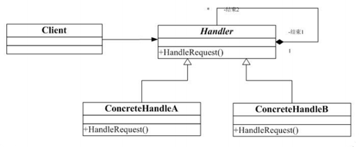

## 责任链模式

Chain of Responsibility（CoR）模式也叫职责链模式或者职责连锁模式，是行为模式之一，该模式构造一系列分别担当不同的职责的类的对象来共同完成一个任务，这些类的对象之间像链条一样紧密相连，所以被称作职责链模式。

例1：比如客户Client要完成一个任务，这个任务包括a,b,c,d四个部分。 

首先客户Client把任务交给A，A完成a部分之后，把任务交给B，B完成b部分，...，直到D完成d部分。

例2：比如政府部分的某项工作，县政府先完成自己能处理的部分，不能处理的部分交给省政府，省政府再完成自己职责范围内的部分，不能处理的部分交给中央政府，中央政府最后完成该项工作。

例3：软件窗口的消息传播。	

例4：SERVLET容器的过滤器（Filter）框架实现。

责任链模式：在责任链模式中，很多对象由每一个对象对其下家的引用而接起来形成一条链。请求在这个链上传递，直到链上的某一个对象决定处理此请求。 

客户并不知道链上的哪一个对象最终处理这个请求，系统可以在不影响客户端的情况下动态的重新组织链和分配责任。处理者有两个选择：承担责任或者把责任推给下家。一个请求可以最终不被任何接收端对象所接受。 

晚上去上英语课，为了好开溜坐到了最后一排，哇，前面坐了好几个漂亮的MM哎，找张纸条，写上“Hi, 可以做我的女朋友吗？如果不愿意请向前传”，纸条就一个接一个的传上去了，糟糕，传到第一排的MM把纸条传给老师了，听说是个老处女呀，快跑!  

## 类图角色和职责

Handler ：处理类的抽象父类		
concreteHandler ：具体的处理类



## 优缺点

优点：

- 责任的分担。每个类只需要处理自己该处理的工作（不该处理的传递给下一个对象完成），明确各类的责任范围，符合类的最小封装原则。
- 可以根据需要自由组合工作流程。如工作流程发生变化，可以通过重新分配对象链便可适应新的工作流程。
- 类与类之间可以以松耦合的形式加以组织。

缺点：因为处理时以链的形式在对象间传递消息，根据实现方式不同，有可能会影响处理的速度。

适用于：链条式处理事情。工作流程化、消息处理流程化、事物流程化。

## 示例代码

问题抛出

```C++
#include <iostream>
using namespace std;

class CarHandle
{
public:
	virtual void HandleCar() = 0;
};

class HeadCarHandle : public CarHandle
{
public:
	virtual void HandleCar()
	{
		cout << "造车头" << endl;
	}
};

class BodyCarHandle : public CarHandle
{
public:
	virtual void HandleCar()
	{
		cout << "造车身" << endl;
	}
};

class TailCarHandle : public CarHandle
{
public:
	virtual void HandleCar()
	{
		cout << "造 车 尾" << endl;
	}
};

void main()
{
	CarHandle *headHandle = new HeadCarHandle;
	CarHandle *bodyHandle = new BodyCarHandle;
	CarHandle *tailHandle = new TailCarHandle;

	//业务逻辑写死在客户端了
	headHandle->HandleCar();
	bodyHandle->HandleCar();
	tailHandle->HandleCar();

	delete headHandle;
	delete bodyHandle;
	delete tailHandle;

	system("pause");
	return ;
}
```

责任链模式

```C++
#include <iostream>
using namespace std;

//造完车以后,需要把任务传递下去
class CarHandle
{
public:
	virtual void HandleCar() = 0;
  
	CarHandle *setNextHandle(CarHandle *handle)
	{
		m_handle = handle;
		return m_handle;
	}
	
protected:
	CarHandle *m_handle; //下一个处理单元
};

class HeadCarHandle : public CarHandle
{
public:
	virtual void HandleCar()
	{
		cout << "造车头" << endl;
		//造玩车头以后把任务递交给下一个处理者
		if (m_handle != NULL) 
		{
			m_handle->HandleCar();
		}
	}
};

class BodyCarHandle : public CarHandle
{
public:
	virtual void HandleCar()
	{
		cout << "造 车身" << endl;
		//造造车身以后把任务递交给下一个处理者
		if (m_handle != NULL) 
		{
			m_handle->HandleCar();
		}
	}
};

class TailCarHandle : public CarHandle
{
public:
	virtual void HandleCar()
	{
		cout << "造车尾" << endl;
		//造造车尾以后把任务递交给下一个处理者
		if (m_handle != NULL) 
		{
			m_handle->HandleCar();
		}
	}
};


void main()
{
	CarHandle *headHandle = new HeadCarHandle;
	CarHandle *bodyHandle = new BodyCarHandle;
	CarHandle *tailHandle = new TailCarHandle;

	//任务的处理关系
	/*
	headHandle->setNextHandle(bodyHandle);
	bodyHandle->setNextHandle(tailHandle);
	tailHandle->setNextHandle(NULL);
	*/

	headHandle->setNextHandle(tailHandle);
	tailHandle->setNextHandle(bodyHandle);
	bodyHandle->setNextHandle(NULL);
	
	headHandle->HandleCar();

	/*
	//业务逻辑 写死在客户端了
	headHandle->HandleCar();
	bodyHandle->HandleCar();
	tailHandle->HandleCar();
	*/

	delete headHandle;
	delete bodyHandle;
	delete tailHandle;

	system("pause");
	return ;
}
```

```C++
#include<iostream>  
#include <string>  
using namespace std;
  
class Request  //请求  
{  
public:  
    string requestType;  
    string requestContent;  
    int number;  
};  
  
class Manager  ///管理者  
{  
protected:  
    string name;  
    Manager *superior;  
public:  
    Manager(string name)  
    {  
        this->name = name;  
    }  
    void setSuperior(Manager *superior)  
    {  
        this->superior = superior;  
    }  
    virtual void requestApplications(Request *request) = 0;  
};  
  
class CommonManager :public Manager  //经理  
{  
public:  
    CommonManager(string name) :Manager(name)  
    {}  
    void requestApplications(Request *request)  
    {  
        if (request->requestType == "请假" && request->number <= 2)  
        {  
            cout << name << " " << request->requestContent << " 数量: " 
              << request->number << "被批准" << endl;  
        }  
        else  
        {  
            if (superior != NULL)  
            {  
                superior->requestApplications(request);  
            }  
        }  
    }  
};  
  
class Majordomo :public Manager  //总监  
{  
public:  
    Majordomo(string name) :Manager(name)  
    {}  
    void requestApplications(Request *request)  
    {  
        if (request->requestType == "请假" && request->number <= 5)  
        {  
            cout << name << " " << request->requestContent << " 数量: " 
              << request->number << "被批准" << endl;  
        }  
        else  
        {  
            if (superior != NULL)  
            {  
                superior->requestApplications(request);  
            }  
        }  
    }  
};  
  
  
class GeneralManager :public Manager //总经理  
{  
public:  
    GeneralManager(string name) :Manager(name)  
    {}  
    void requestApplications(Request *request)  
    {  
        if (request->requestType == "请假")  
        {  
            cout << name << " " << request->requestContent << " 数量: " 
              << request->number << "被批准" << endl;  
        }  
    }  
};  
  
  
int main123213123213()  
{  
    CommonManager *jinli = new CommonManager("经理");  
    Majordomo *zongjian = new Majordomo("总监");  
    GeneralManager *zhongjingli = new GeneralManager("总经理");  
  
    jinli->setSuperior(zongjian);  
    zongjian->setSuperior(zhongjingli);  
  
    Request *request = new Request();  
  
    request->requestType = "请假";  
    request->requestContent = "李俊宏请假";  
    request->number = 1;  
    jinli->requestApplications(request);  
  
  
    request->requestType = "请假";  
    request->requestContent = "李俊宏请假";  
    request->number = 4;  
    jinli->requestApplications(request);  
  
  
    request->requestType = "请假";  
    request->requestContent = "李俊宏请假";  
    request->number = 10;  
    jinli->requestApplications(request);  
  
    cin.get();  
    return 0;  
}  
```