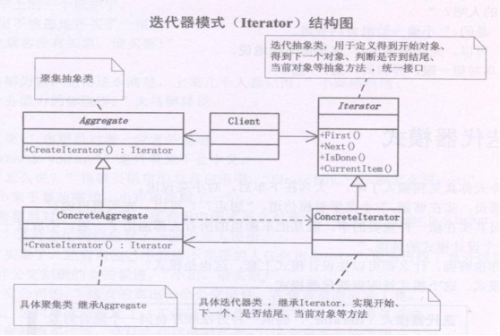
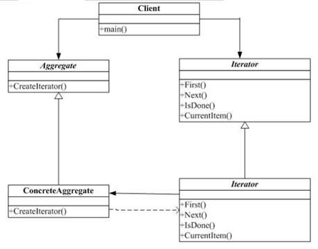
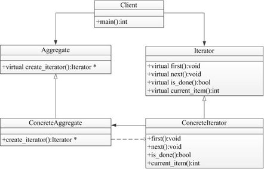

## 迭代器模式

迭代器模式提供了一种顺序访问聚合对象中各个元素的方法，隐藏了对象的内部结构，为遍历不同聚合结构提供了如“开始”、“下一个”、“是否遍历结束”、“当前是哪个元素”等统一的操作接口。

Iterator模式也叫迭代模式，是行为模式之一，它把对容器中包含的内部对象的访问委让给外部类，使用Iterator（遍历）按顺序进行遍历访问的设计模式。

在应用Iterator模式之前，首先应该明白Iterator模式用来解决什么问题。或者说，如果不使用Iterator模式，会存在什么问题。

- 由容器自己实现顺序遍历。直接在容器类里直接添加顺序遍历方法 
- 让调用者自己实现遍历。直接暴露数据细节给外部。

以上方法1与方法2都可以实现对遍历，这样有问题呢？

- 容器类承担了太多功能：一方面需要提供添加删除等本身应有的功能；一方面还需要提供遍历访问功能。
- 往往容器在实现遍历的过程中，需要保存遍历状态，当跟元素的添加删除等功能夹杂在一起，很容易引起混乱和程序运行错误等。

Iterator模式就是为了有效地处理按顺序进行遍历访问的一种设计模式，简单地说，Iterator模式提供一种有效的方法，可以屏蔽聚集对象集合的容器类的实现细节，而能对容器内包含的对象元素按顺序进行有效的遍历访问。所以，Iterator模式的应用场景可以归纳为满足以下几个条件：

- 访问容器中包含的内部对象 
- 按顺序访问

迭代子模式：迭代子模式可以顺序访问一个聚集中的元素而不必暴露聚集的内部表象。  

多个对象聚在一起形成的总体称之为聚集，聚集对象是能够包容一组对象的容器对象。  

迭代子模式将迭代逻辑封装到一个独立的子对象中，从而与聚集本身隔开。  

迭代子模式简化了聚集的界面。  

每一个聚集对象都可以有一个或一个以上的迭代子对象，每一个迭代子的迭代状态可以是彼此独立的。迭代算法可以独立于聚集角色变化。  

- 我爱上了Mary，不顾一切的向她求婚。
- Mary：  “想要我跟你结婚，得答应我的条件” 
- 我：“什么条件我都答应，你说吧”  
- Mary：“我看上了那个一克拉的钻石” 我：“我买，我买，还有吗？”  
- Mary：“我看上了湖边的那栋别墅” 我：“我买，我买，还有吗？”  
- Mary：“我看上那辆法拉利跑车” 
- 我脑袋嗡的一声，坐在椅子上，一咬牙：  “我买，我买，还有吗？” ……  

## 类图角色和职责

GOOD：提供一种方法顺序访问一个聚敛对象的各个元素，而又不暴露该对象的内部表示。

为遍历不同的聚集结构提供如开始，下一个，是否结束，当前一项等统一接口。





Iterator（迭代器接口）：该接口必须定义实现迭代功能的最小定义方法集，比如提供hasNext()和next()方法。

ConcreteIterator（迭代器实现类）：迭代器接口Iterator的实现类。可以根据具体情况加以实现。

Aggregate（容器接口）：定义基本功能以及提供类似Iterator iterator()的方法。

concreteAggregate（容器实现类）：容器接口的实现类。必须实现Iterator iterator()方法。

在迭代器中 持有 一个集合的 引用；所以通过迭代器，就可以访问集合 

## 示例代码

```C++
#include <iostream>
using namespace std;
typedef int Object ;
#define SIZE 5 

class MyIterator
{
public:
	virtual void First() = 0;
	virtual void Next() = 0;
	virtual bool IsDone() = 0;
	virtual Object CurrentItem() = 0;
};

class Aggregate
{
public:
	virtual MyIterator *CreateIterator() = 0;
	virtual Object getItem(int index) = 0;
	virtual int getSize() = 0;
};

class ContreteIterator : public MyIterator
{
public:
	ContreteIterator(Aggregate *ag)
	{
		_ag = ag;
		_current_index = 0;
	}
  
	virtual void First()
	{
		_current_index = 0;  //让当前 游标 回到位置0
	}
  
	virtual void Next()
	{
		if (_current_index < _ag->getSize())
		{
			_current_index ++;
		}
	}
  
	virtual bool IsDone()
	{
		return  (_current_index ==  _ag->getSize());
	}
  
	virtual Object CurrentItem()
	{
		return _ag->getItem(_current_index);
	}
private:
	int			_current_index;
	Aggregate	*_ag;
};

class ConcreteAggregate : public Aggregate
{
public:
	ConcreteAggregate()
	{
		for (int i=0; i<SIZE; i++)
		{
			object[i] = i + 100;
		}
	}
  
	virtual MyIterator *CreateIterator()
	{
		return new ContreteIterator(this); //让迭代器 持有一个 集合的 引用 
	}
  
	virtual Object getItem(int index)
	{
		return object[index];
	}
  
	virtual int getSize()
	{
		return SIZE;
	}
private:
	Object object[SIZE]; 
};

void main()
{
	Aggregate * ag = new ConcreteAggregate;

	MyIterator *it = ag->CreateIterator();

	for (; !(it->IsDone()); it->Next() )
	{
		cout << it->CurrentItem() << " ";
	}

	delete it;
	delete ag;

	system("pause");
	return ;
}
```

```C++
#include <iostream>  
#include <string>  
using namespace std;  

class Iterator;  
  
class Aggregate  
{  
public:  
    virtual Iterator *createIterator() = 0;  
};  
  
class Iterator  
{  
public:  
    virtual void first() = 0;  
    virtual void next() = 0;  
    virtual bool isDone() = 0;  
    virtual bool isDoneA() = 0;  
    //virtual bool isDoneA() = 0;  
};  
  
class ConcreteAggregate :public Iterator  
{  
public:  
    void first(){}
  
    void next(){}
 
    bool isDone(){}
 
    virtual bool isDoneA(){}

};  
  
int main()  
{  
    cin.get();  
    return 0;  
}
```


- 抽象聚合类型：负责提供创建具体迭代器角色的接口
- 具体聚合类型：实现创建具体迭代器
- 抽象迭代器：负责定义访问和遍历元素的接口
- 具体迭代器角色：实现了迭代器接口

```c++
//iterator.h
#ifndef ITERATOR_H
#define ITERATOR_H
class Aggregate;
typedef int Object;
class Iterator{//定义抽象迭代器类
public:
	virtual ~Iterator();
	virtual void first() = 0;
	virtual void next() = 0;
	virtual bool is_done() = 0;
	virtual Object current_item() = 0;
protected:
	Iterator();
};
//定义抽象迭代器的派生类，表示一个实际可操作的迭代器
class ConcreteIterator :public Iterator{
public:
	//声明迭代器的构造函数，首参数为要进行迭代的聚合类型指针
	ConcreteIterator(Aggregate *ag, int idx = 0);
	~ConcreteIterator();
	void first();
	void next();
	bool is_done();
	Object current_item();
private:
	Aggregate *m_ag;
	int m_idx;
};
#endif
```

```c++
//iterator.cpp
#include <iostream>
#include "aggregate.h"
#include "iterator.h"
using namespace std;

Iterator::Iterator() //定义抽象迭代器的构造函数
{
}
Iterator::~Iterator() //定义抽象迭代器的析构函数
{
}
//定义具体迭代器类的构造函数，首参数表示对哪个聚合类型数据进行迭代，第二个参数表示从哪里开始迭代
ConcreteIterator::ConcreteIterator(Aggregate *ag, int idx)
{
	m_ag = ag;
	m_idx = idx;
}
ConcreteIterator::~ConcreteIterator() //定义具体迭代器的析构函数
{
}
Object ConcreteIterator::current_item() //定义获取聚合数据中当前对象的函数
{
	return m_ag->get_item(m_idx);
}
//定义设置聚合数据首位置的函数
void ConcreteIterator::first()
{
	m_idx = 0;
}
//定义设置聚合数据中下一个位置的函数
void ConcreteIterator::next()
{
	if (m_idx < m_ag->get_size())
		m_idx++;
}
//定义判断是否迭代完毕的函数
bool ConcreteIterator::is_done()
{
	return (m_idx == m_ag->get_size());
}
```

```c++
//aggregate.h
#ifndef AGGREGATE_H
#define AGGREGATE_H
//把int类型更名为Object，本聚合类型中的对象为int类型
typedef int Object;
class Iterator;  //声明迭代器类型
class Aggregate{ //定义抽象聚合类型
public:
	virtual ~Aggregate();
	virtual Iterator *create_iterator() = 0; //声明生成迭代器的接口
	virtual Object get_item(int idx) = 0;
	virtual int get_size() = 0;
protected:
	Aggregate();
};
//定义抽象聚合类的派生类，表示具体的某个聚合类型
class ConcreteAggregate :public Aggregate{
public:
	//定义枚举数据，表示聚合中有效数据的个数
	enum{ SIZE = 5 };
	ConcreteAggregate();
	~ConcreteAggregate();
	Iterator *create_iterator();
	Object get_item(int idx);
	int get_size();
private:
	Object m_objs[SIZE]; //聚合类型中的具体数据
};
#endif
```

```c++
//aggregate.cpp
#include <iostream>
#include "aggregate.h"
#include "iterator.h"
using namespace std;

Aggregate::Aggregate()                 //定义抽象聚合类型的构造函数
{
}
Aggregate::~Aggregate()                //定义抽象聚合类型的析构函数
{
}
ConcreteAggregate::ConcreteAggregate() //定义具体聚合类型的构造函数
{
	//向聚合类型中填充具体数据，数量为SIZE（5）个，保存在int类型的数组中
	for (int i = 0; i < SIZE; i++)
		m_objs[i] = i;
}
ConcreteAggregate::~ConcreteAggregate()//定义具体聚合类型的析构函数
{
}
//定义生成迭代器的函数
Iterator *ConcreteAggregate::create_iterator()
{
	return new ConcreteIterator(this);
}
//定义从聚合类型中获取具体元素的函数
Object ConcreteAggregate::get_item(int idx)
{
	if (idx < this->get_size())
		return m_objs[idx];
	return -1;
}
int ConcreteAggregate::get_size()//定义获取聚合中有效数据个数的函数
{
	return SIZE;
}
```

```c++
#include <iostream>
#include "aggregate.h"
#include "iterator.h"
using namespace std;

int main()
{
	//定义一个具体的聚合类型，由ag指向
	Aggregate *ag = new ConcreteAggregate();
	//定义迭代器it，操作ag指向的聚合类型数据
	Iterator *it = new ConcreteIterator(ag);
	//使用迭代器依次操作聚合类型中的对象
	for (; !(it->is_done()); it->next()){
		cout << it->current_item() << endl;
	}
	system("pause");
	return 0;
}
```