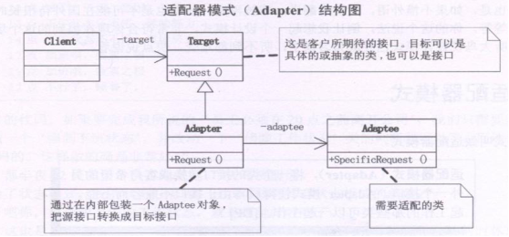

## 适配器模式

Adapter模式也叫适配器模式，是构造型模式之一，通过Adapter模式可以改变已有类（或外部类）的接口形式。

适配器（变压器）模式：把一个类的接口变换成客户端所期待的另一种接口，从而使原本因接口原因不匹配而无法一起工作的两个类能够一起工作。 

适配类可以根据参数返还一个合适的实例给客户端。 

在朋友聚会上碰到了一个美女Sarah，从香港来的，可我不会说粤语，她不会说普通话，只好求助于我的朋友kent了，他作为我和Sarah之间的Adapter，让我和Sarah可以相互交谈了(也不知道他会不会耍我)。

## 类图角色和职责

适用于：是将一个类的接口转换成客户希望的另外一个接口。使得原本由于接口不兼容而不能一起工作的那些类可以一起工作。



## 示例代码

```C++
#include <iostream>
using namespace std;

// Current18 
// Current220
// Adapter 

class  Current18v
{
public:
	virtual void useCurrent18v() = 0;
};

class  Current220v
{
public:
	void useCurrent220v()
	{
		cout << "我是220v 欢迎使用" << endl;
	}
};

class Adapter : public Current18v
{
public:
	Adapter(Current220v *current)
	{
		m_current = current;
	}
  
	virtual void useCurrent18v()
	{
		cout << "适配器 适配 220v " ;
		m_current->useCurrent220v();
	}
private:
	Current220v *m_current;
};

void main()
{
	Current220v		*current220v = NULL;
	Adapter			*adapter = NULL;

	current220v = new Current220v;
	adapter = new Adapter(current220v);
	adapter->useCurrent18v();

	delete current220v ;
	delete adapter;

	system("pause");
	return ;
}
```
足球比赛中，中场球员可进攻和防守，教练通过翻译告诉中场球员，要进攻。

- Player：抽象的球员 （Attack、 Defense）
- class TransLater: public Player：适配器 
- class Center : public Player：被适配的对象

```C++
#include <iostream>  
#include <string>  
using namespace std;  
  
class Player  
{  
public:  
    string name;  
    Player(string name)  
    {  
        this->name = name;  
    }  
    virtual void attack() = 0;  
    virtual void defence() = 0;  
};  
  
class Forwards :public Player  
{  
public:  
    Forwards(string name) :Player(name){}  
    void attack()  
    {  
        cout << name << " 前锋进攻" << endl;  
    }  
    void defence()  
    {  
        cout << name << " 前锋防守" << endl;  
    }  
};  
  
class Center :public Player  
{  
public:  
    Center(string name) :Player(name){}  
    void attack()  
    {  
        cout << name << " 中锋进攻" << endl;  
    }  
    void defence()  
    {  
        cout << name << " 中锋防守" << endl;  
    }  
};  
  
class Backwards :public Player  
{  
public:  
    Backwards(string name) :Player(name){}  
    void attack()  
    {  
        cout << name << " 后卫进攻" << endl;  
    }  
    void defence()  
    {  
        cout << name << " 后卫防守" << endl;  
    }  
};  

class ForeignCenter  
{  
public:  
    string name;  
    ForeignCenter(string name)  
    {  
        this->name = name;  
    }  
    void myAttack()  
    {  
        cout << name << " 外籍中锋进攻" << endl;  
    }  
    void myDefence()  
    {  
        cout << name << " 外籍后卫防守" << endl;  
    }  
};  

class Translator :public Player  
{  
private:  
    ForeignCenter *fc;  
public:  
    Translator(string name) :Player(name)  
    {  
        fc = new ForeignCenter(name);  
    }  
    void attack()  
    {  
        fc->myAttack();  
    }  
    void defence()  
    {  
        fc->myDefence();  
    }  
};  

int main()  
{  
    Player *p1 = new Center("李俊宏");  
    p1->attack();  
    p1->defence();  
  
    Translator *tl = new Translator("姚明");  
    tl->attack();  
    tl->defence();  
    cin.get();  
    return 0;  
} 
```