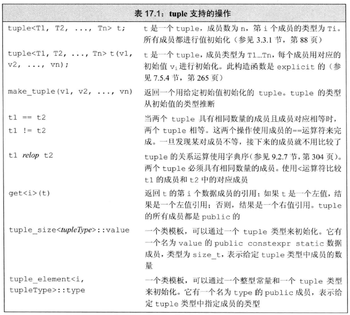

## 右值引用

新标准中引入了新的引用类型-右值引用（rvalue reference），以便对将要销毁的对象信息进行保留。所谓右值引用，就是应该绑定到右值的引用，使用“&&”定义右值引用：

```c++
int i = 10;
int &r = i;       //正确，左值引用
int &&rr = i;     //错误，定义了右值引用，但初值是左值

int &r2 = i * 42; //错误，定义了左值引用，但初值是右值
const int &r3 = i * 42;//正确，可以将一个const引用绑定到右值上
int &&rr2 = i * 42; 
```

## 委托构造函数

C++11新标准定义了委托构造函数，扩展了构造函数对数据成员初始化的方法。

所谓委托构造就是让类中的某个构造函数去委托另一个构造函数执行构造操作的机制。一个委托构造函数使用它所属类的其他构造函数执行自己的初始化过程。

## 继承构造函数

在继承结构中，派生类构造函数需要调用基类构造函数完成基类数据成员的初始化，即使派生类中没有数据需要初始化仍然需要定义构造函数用于向基类构造函数传递数据。

C++11新标准中提供了继承构造函数，使得派生类中可以直接使用基类的构造函数。

## override关键字

C++11新标准中可以使用override关键字来说明派生类中的虚函数，借助于编译器检查派生类是否覆盖基类的同名虚函数。

## final关键字

除了override，C++11新标准还增加了防止基类被继承和防止派生类重写函数的功能。这是由特殊的标识符final来完成的，其方法是在类名后或函数参数后添加关键字final。

## 静态断言

C++11中引入了static_assert关键字，用来实现编译时断言，称为静态断言。静态断言的语法格式如下所示：

```
static_assert(常量表达式， 提示字符串);
```

编译时首先检测“常量表达式”的值，若为真，则static_assert()不做任何操作，程序继续完成编译，若为假，产生一条编译错误，错误提示为静态断言中第二个参数给出的字符串信息。

## 多元数组 tuple



```C++
#include<iostream>  
#include<map>  
//多元数组  
//tuple必须是一个静态数组
//配合vector, array  
  
void main()
{  
    int int1 = 10;  
    double double1 = 99.8;  
    char ch = 'A';  
    char *str = "hellochina";  
    std::tuple<int, double, char, const char *> mytuple(int1, double1, ch, str);  
    const int num = 3;  
    auto data0 = std::get<0>(mytuple);  
    auto data1 = std::get<1>(mytuple);  
    auto data2 = std::get<2>(mytuple);  
    auto data3 = std::get<num>(mytuple);//下标只能是常量  
    std::cout <<typeid( data3).name()  << std::endl;  
    decltype(data0) dataA;//获取数据类型再次创建  
    //mytuple.swap(mytuple);array.vetor都有交换的公能  
    std::cout << data0 <<"  " << data1 <<"  "<< data2 << "   " <<data3 << std::endl;  
  
    std::cin.get();  
}  
```

## bitset

## 智能指针

```C++
#include <iostream>  
  
void main1()  
{  
    //auto_ptr;  
    for (int i = 0; i < 10000000; i++)  
    {  
        double *p = new double;//为指针分配内存  
        std::auto_ptr<double> autop(p);  
        //创建智能指针管理指针p指向内存  
        //智能指针
        //delete p;  
    }  
  
    std::cin.get();  
}
```

### C++11智能指针

```C++
#include<iostream>  
#include<memory>//内存  
  
void main()  
{  
    for (int i = 0; i < 10000000;i++)  
    {  
        //新型指针，新型的数组          
        std::unique_ptr<double> pdb(new double);  
        //double *p = new double;  
    }  
  
    std::cin.get();  
}
```