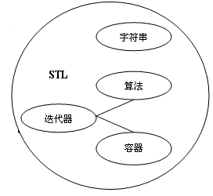
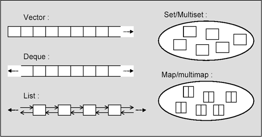

# STL实用技术专题

## STL(标准模板库)理论基础

### 基本概念

STL（Standard Template Library，标准模板库)是惠普实验室开发的一系列软件的统称。现然主要出现在C++中，但在被引入C++之前该技术就已经存在了很长的一段时间。

STL的从广义上讲分为三类：algorithm（算法）、container（容器）和iterator（迭代器），容器和算法通过迭代器可以进行无缝地连接。几乎所有的代码都采 用了模板类和模板函数的方式，这相比于传统的由函数和类组成的库来说提供了更好的代码重用机会。在C++标准中，STL被组织为下面的13个头文 件：&lt;algorithm>、&lt;deque>、&lt;functional>、&lt;iterator>、&lt;vector>、&lt;list>、&lt;map>、&lt;memory>、&lt;numeric>、&lt;queue>、&lt;set>、&lt;stack> 和&lt;utility>。



STL详细的说六大组件

- 容器（Container）
- 算法（Algorithm）
- 迭代器（Iterator）
- 仿函数（Function object）
- 适配器（Adaptor）
- 空间配制器（allocator）

使用STL的好处

1）STL是C++的一部分，因此不用额外安装什么，它被内建在你的编译器之内。

2）STL的一个重要特点是数据结构和算法的分离。尽管这是个简单的概念，但是这种分离确实使得STL变得非常通用。

例如，在STL的vector容器中，可以放入元素、基础数据类型变量、元素的地址；
STL的sort()函数可以用来操作vector,list等容器。

1）程序员可以不用思考STL具体的实现过程，只要能够熟练使用STL就OK了。这样他们就可以把精力放在程序开发的别的方面。

2）STL具有高可重用性，高性能，高移植性，跨平台的优点。
高可重用性：STL中几乎所有的代码都采用了模板类和模版函数的方式实现，这相比于传统的由函数和类组成的库来说提供了更好的代码重用机会。关于模板的知识，已经给大家介绍了。

高性能：如map可以高效地从十万条记录里面查找出指定的记录，因为map是采用红黑树的变体实现的。(红黑树是平衡二叉树的一种)

高移植性：如在项目A上用STL编写的模块，可以直接移植到项目B上。

跨平台：如用windows的VisualStudio编写的代码可以在Mac OS的XCode上直接编译。

3）程序员可以不用思考STL具体的实现过程，只要能够熟练使用STL就OK了。这样他们就可以把精力放在程序开发的别的方面。

4）了解到STL的这些好处，我们知道STL无疑是最值得C++程序员骄傲的一部分。每一个C＋＋程序员都应该好好学习STL。只有能够熟练使用STL的程序员，才是好的C++程序员。

5）总之：招聘工作中，经常遇到C++程序员对STL不是非常了解。大多是有一个大致的映像，而对于在什么情况下应该使用哪个容器和算法都感到比较茫然。STL是C++程序员的一项不可或缺的基本技能，掌握它对提升C++编程大有裨益。

### 容器

在实际的开发过程中，数据结构本身的重要性不会逊于操作于数据结构的算法的重要性，当程序中存在着对时间要求很高的部分时，数据结构的选择就显得更加重要。

经典的数据结构数量有限，但是我们常常重复着一些为了实现向量、链表等结构而编写的代码，这些代码都十分相似，只是为了适应不同数据的变化而在细节上有所出入。STL容器就为我们提供了这样的方便，它允许我们重复利用已有的实现构造自己的特定类型下的数据结构，通过设置一些模板，STL容器对最常用的数据结构提供了支持，这些模板的参数允许我们指定容器中元素的数据类型，可以将我们许多重复而乏味的工作简化。

容器部分主要由头文 件&lt;vector>,&lt;list>,&lt;deque>,&lt;set>,&lt;map>,&lt;stack>和&lt;queue>组成。对于常用的一些容器和容器适配器（可以看作由其它容器实现的容器），可以通过下表总结一下它们和相应头文件的对应关系。

#### 容器的概念

用来管理一组元素 



#### 容器的分类

序列式容器（Sequence containers）
每个元素都有固定位置－－取决于插入时机和地点，和元素值无关。
vector、deque、list 
关联式容器（Associated containers）
元素位置取决于特定的排序准则，和插入顺序无关 
set、multiset、map、multimap

| 数据结构                 | 描述                                       | 实现头文件       |
| -------------------- | ---------------------------------------- | ----------- |
| 向量(vector)           | 连续存储的元素                                  | &lt;vector> |
| 列表(list)             | 由节点组成的双向链表，每个结点包含着一个元素                   | &lt;list>   |
| 双队列(deque)           | 连续存储的指向不同元素的指针所组成的数组                     | &lt;deque>  |
| 集合(set)              | 由节点组成的红黑树，每个节点都包含着一个元素，节点之间以某种作用于元素对的谓词排列，没有两个不同的元素能够拥有相同的次序 | &lt;set>    |
| 多重集合(multiset)       | 允许存在两个次序相等的元素的集合                         | &lt;set>    |
| 栈(stack)             | 后进先出的值的排列                                | &lt;stack>  |
| 队列(queue)            | 先进先出的执的排列                                | &lt;queue>  |
| 优先队列(priority_queue) | 元素的次序是由作用于所存储的值对上的某种谓词决定的的一种队列           | &lt;queue>  |
| 映射(map)              | 由{键，值}对组成的集合，以某种作用于键对上的谓词排列              | &lt;map>    |
| 多重映射(multimap)       | 允许键对有相等的次序的映射                            | &lt;map>    |

### 迭代器

迭代器从作用上来说是最基本的部分，可是理解起来比前两者都要费力一些。软件设计有一个基本原则，所有的问题都可以通过引进一个间接层来简化，这种简化在STL中就是用迭代器来完成的。概括来说，迭代器在STL中用来将算法和容器联系起来，起着一种黏和剂的作用。几乎STL提供的所有算法都是通过迭代器存取元素序列进行工作的，每一个容器都定义了其本身所专有的迭代器，用以存取容器中的元素。

迭代器部分主要由头文件&lt;utility>,&lt;iterator>和&lt;memory>组 成。&lt;utility>是一个很小的头文件，它包括了贯穿使用在STL中的几个模板的声明，&lt;iterator>中提供了迭代器使用的许多方法，而对于&lt;memory>的描述则十分的困难，它以不同寻常的方式为容器中的元素分配存储空间，同时也为某些算法执行期间产生的临时对象提供机制,&lt;memory>中的主要部分是模板类allocator，它负责产生所有容器中的默认分配器。

### 算法

函数库对数据类型的选择对其可重用性起着至关重要的作用。举例来说，一个求方根的函数，在使用浮点数作为其参数类型的情况下的可重用性肯定比使用整型作为它的参数类性要高。而C++通过模板的机制允许推迟对某些类型的选择，直到真正想使用模板或者说对模板进行特化的时候，STL就利用了这一点提供了相当多的有用算法。它是在一个有效的框架中完成这些算法的——可以将所有的类型划分为少数的几类，然后就可以在模版的参数中使用一种类型替换掉同一种类中的其他类型。

STL提供了大约100个实现算法的模版函数，比如算法for_each将为指定序列中的每一个元素调用指定的函数，stable_sort以你所指定的规则对序列进行稳定性排序等等。这样一来，只要熟悉了STL之后，许多代码可以被大大的化简，只需要通过调用一两个算法模板，就可以完成所需要的功能并大大地提升效率。

算法部分主要由头文件&lt;algorithm>，&lt;numeric>和&lt;functional>组 成。&lt;algorithm>是所有STL头文件中最大的一个（尽管它很好理解），它是由一大堆模版函数组成的，可以认为每个函数在很大程度上都是独立的，其中常用到的功能范围涉及到比较、交换、查找、遍历操作、复制、修改、移除、反转、排序、合并等等。&lt;numeric>体积很小，只包括几个在序列上面进行简单数学运算的模板函数，包括加法和乘法在序列上的一些操作。&lt;functional>中则定义了一些模板类，用以声明函数对象。

### C++标准库

C++强大的功能来源于其丰富的类库及库函数资源。C++标准库的内容总共在50个标准头文件中定义。在C++开发中，要尽可能地利用标准库完成。这样做的直接好处包括：

（1）成本：已经作为标准提供，何苦再花费时间、人力重新开发呢；
（2）质量：标准库的都是经过严格测试的，正确性有保证；
（3）效率：关于人的效率已经体现在成本中了，关于代码的执行效率要相信实现标准库的大牛们的水平；
（4）良好的编程风格：采用行业中普遍的做法进行开发。

在C++程序设计课程中，尤其是作为第一门程序设计课程，我们注重了语法、语言的机制等方面的内容。程序设计能力的培养有个过程，跨过基本的原理性知识直接进入到工程中的普遍做法，由于跨度决定了其难度。再者，在掌握了基本原理的基础上，在认识标准库的问题上完全可以凭借实践，逐步地掌握。标准库的学习不需要认认真真地读书，需要的是在了解概貌的情况下，在实践中深入。

这个任务就是要知道C++程序设计课程中不讲的，但对程序设计又很重要的这部分内容。至少我们要能先回答出“有什么”的问题。

C++标准库的内容分为10类，分别是（建议在阅读中，将你已经用过或听说过的头文件划出来）：　　

C1. 标准库中与语言支持功能相关的头文件

| 头文件            | 描        述                               |
| -------------- | ---------------------------------------- |
| &lt;cstddef>   | 定义宏NULL和offsetof，以及其他标准类型size_t和ptrdiff_t。与对应的标准C头文件的区别是，NULL是C++空指针常量的补充定义，宏offsetof接受结构或者联合类型参数，只要他们没有成员指针类型的非静态成员即可。 |
| &lt;limits>    | 提供与基本数据类型相关的定义。例如，对于每个数值数据类型，它定义了可以表示出来的最大值和最小值以及二进制数字的位数。 |
| &lt;climits>   | 提供与基本整数数据类型相关的C样式定义。这些信息的C++样式定义在&lt;limits>中 |
| &lt;cfloat>    | 提供与基本浮点型数据类型相关的C样式定义。这些信息的C++样式定义在&lt;limits>中 |
| &lt;cstdlib>   | 提供支持程序启动和终止的宏和函数。这个头文件还声明了许多其他杂项函数，例如搜索和排序函数，从字符串转换为数值等函数。它与对应的标准C头文件 stdlib.h不同，定义了abort(void)。abort()函数还有额外的功能，它不为静态或自动对象调用析构函数，也不调用传给 atexit()函数的函数。它还定义了exit()函数的额外功能，可以释放静态对象，以注册的逆序调用用atexit()注册的函数。清除并关闭所有 打开的C流，把控制权返回给主机环境。 |
| &lt;new>       | 支持动态内存分配                                 |
| &lt;typeinfo>  | 支持变量在运行期间的类型标识                           |
| &lt;exception> | 支持异常处理，这是处理程序中可能发生的错误的一种方式               |
| &lt;cstdarg>   | 支持接受数量可变的参数的函数。即在调用函数时，可以给函数传送数量不等的数据项。它定义了宏va_arg、va_end、va_start以及va_list类型 |
| &lt;csetjmp>   | 为C样式的非本地跳跃提供函数。这些函数在C++中不常用              |
| &lt;csignal>   | 为中断处理提供C样式支持                             |

C2. 支持流输入/输出的头文件 

| 头文件            | 描        述                               |
| -------------- | ---------------------------------------- |
| &lt;iostream>  | 支持标准流cin、cout、cerr和clog的输入和输出，它还支持多字节字符标准流wcin、wcout、wcerr和wclog。 |
| &lt;iomanip>   | 提供操纵程序，允许改变流的状态，从而改变输出的格式。               |
| &lt;ios>       | 定义iostream的基类                            |
| &lt;istream>   | 为管理输出流缓存区的输入定义模板类                        |
| &lt;ostream>   | 为管理输出流缓存区的输出定义模板类                        |
| &lt;sstream>   | 支持字符串的流输入输出                              |
| &lt;fstream>   | 支持文件的流输入输出                               |
| &lt;iosfwd>    | 为输入输出对象提供向前的声明                           |
| &lt;streambuf> | 支持流输入和输出的缓存                              |
| &lt;cstdio>    | 为标准流提供C样式的输入和输出                          |
| &lt;cwchar>    | 支持多字节字符的C样式输入输出                          |

C3. 与诊断功能相关的头文件 

| 头文件            | 描        述        |
| -------------- | ----------------- |
| &lt;stdexcept> | 定义标准异常。异常是处理错误的方式 |
| &lt;cassert>   | 定义断言宏，用于检查运行期间的情形 |
| &lt;cerrno>    | 支持C样式的错误信息        |

C4. 定义工具函数的头文件 

| 头文件             | 描        述                               |
| --------------- | ---------------------------------------- |
| &lt;utility>    | 定义重载的关系运算符，简化关系运算符的写入，它还定义了pair类型，该类型是一种模板类型，可以存储一对值。这些功能在库的其他地方使用 |
| &lt;functional> | 定义了许多函数对象类型和支持函数对象的功能，函数对象是支持operator()()函数调用运算符的任意对象 |
| &lt;memory>     | 给容器、管理内存的函数和auto_ptr模板类定义标准内存分配器         |
| &lt;ctime>      | 支持系统时钟函数                                 |

C5. 支持字符串处理的头文件   

| 头文件          | 描        述                               |
| ------------ | ---------------------------------------- |
| &lt;string>  | 为字符串类型提供支持和定义，包括单字节字符串(由char组成)的string和多字节字符串(由wchar_t组成) |
| &lt;cctype>  | 单字节字符类别                                  |
| &lt;cwctype> | 多字节字符类别                                  |
| &lt;cstring> | 为处理非空字节序列和内存块提供函数。这不同于对应的标准C库头文件，几个C样式字符串的一般C库函数被返回值为const和非const的函数对替代了 |
| &lt;cwchar>  | 为处理、执行I/O和转换多字节字符序列提供函数，这不同于对应的标准C库头文件，几个多字节C样式字符串操作的一般C库函数被返回值为const和非const的函数对替代了。 |
| &lt;cstdlib> | 为把单字节字符串转换为数值、在多字节字符和多字节字符串之间转换提供函数      |

C6. 定义容器类的模板的头文件  

| &lt;vector> | 定义vector序列模板，这是一个大小可以重新设置的数组类型，比普通数组更安全、更灵活 |
| ----------- | ---------------------------------------- |
| &lt;list>   | 定义list序列模板，这是一个序列的链表，常常在任意位置插入和删除元素      |
| &lt;deque>  | 定义deque序列模板，支持在开始和结尾的高效插入和删除操作           |
| &lt;queue>  | 为队列(先进先出)数据结构定义序列适配器queue和priority_queue |
| &lt;stack>  | 为堆栈(后进先出)数据结构定义序列适配器stack                |
| &lt;map>    | map是一个关联容器类型，允许根据键值是唯一的，且按照升序存储。multimap类似于map，但键不是唯一的。 |
| &lt;set>    | set是一个关联容器类型，用于以升序方式存储唯一值。multiset类似于set，但是值不必是唯一的。 |
| &lt;bitset> | 为固定长度的位序列定义bitset模板，它可以看作固定长度的紧凑型bool数组  |

C7. 支持迭代器的头文件  

| 头文件           | 描        述  |
| ------------- | ----------- |
| &lt;iterator> | 给迭代器提供定义和支持 |

C8. 有关算法的头文件  

| 头文件            | 描        述                        |
| -------------- | --------------------------------- |
| &lt;algorithm> | 提供一组基于算法的函数，包括置换、排序、合并和搜索         |
| &lt;cstdlib>   | 声明C标准库函数bsearch()和qsort()，进行搜索和排序 |
| &lt;ciso646>   | 允许在代码中使用and代替&&                   |

C9. 有关数值操作的头文件  

| 头文件           | 描        述                               |
| ------------- | ---------------------------------------- |
| &lt;complex>  | 支持复杂数值的定义和操作                             |
| &lt;valarray> | 支持数值矢量的操作                                |
| &lt;numeric>  | 在数值序列上定义一组一般数学操作，例如accumulate和inner_product |
| &lt;cmath>    | 这是C数学库，其中还附加了重载函数，以支持C++约定               |
| &lt;cstdlib>  | 提供的函数可以提取整数的绝对值，对整数进行取余数操作               |

C10. 有关本地化的头文件  

| 头文件          | 描        述                  |
| ------------ | --------------------------- |
| &lt;locale>  | 提供的本地化包括字符类别、排序序列以及货币和日期表示。 |
| &lt;clocale> | 对本地化提供C样式支持                 |

C++标准库的所有头文件都没有扩展名。C++标准库以&lt;cname>形式的标准头文件提供。在 &lt;cname>形式标准的头文件中，与宏相关的名称在全局作用域中定义，其他名称在std命名空间中声明。在C++中还可以使用name.h 形式的标准C库头文件名 

### 模板简要回顾

模板是实现代码重用机制的一种工具，实质就是实现类型参数化，即把类型定义为参数。
C++提供两种模板：函数模板，类模板

函数模板的简介

- 函数模板就是建立一个通用的函数，其函数返回类型和形参类型不具体指定，而是用虚拟的类型来代表。
- 凡是函数体相同的函数都可以用函数模板来代替，不必定义多个函数，只需在模板中定义一次即可。
- 在调用函数时系统会根据实参的类型来取代模板中的虚拟类型，从而实现了不同函数的功能。

类模板的简介

- 我们先来看一下下面这个类，求最大值的类
- 和函数模板一样，类模板就是建立一个通用类，其数据成员的类型、成员函数的返回类型和参数类形都可以不具体指定，而用虚拟的类型来代表。
- 当使用类模板建立对象时，系统会根据实参的类型取代类模板中的虚拟类型，从而实现不同类的功能。

## 容器

### STL的string

#### string概念

string是STL的字符串类型，通常用来表示字符串。而在使用string之前，字符串通常是用char*表示的。string与char*都可以用来表示字符串，那么二者有什么区别呢。

string和char*的比较

- string是一个类, char*是一个指向字符的指针。

string封装了char\*，管理这个字符串，是一个char*型的容器。

- string不用考虑内存释放和越界。

string管理char*所分配的内存。每一次string的复制，取值都由string类负责维护，不用担心复制越界和取值越界等。

- string提供了一系列的字符串操作函数（这个等下会详讲）
  查找find，拷贝copy，删除erase，替换replace，插入insert

#### string的构造函数

```c++
// 默认构造函数
string();//构造一个空的字符串string s1

// 拷贝构造函数
string(const string &str); //构造一个与str一样的string。如strings1(s2)

// 带参数的构造函数
string(const char *s);    //用字符串s初始化
string(int n,char c);    //用n个字符c初始化
```
#### string的存取字符操作
- string类的字符操作：
```c++
const char &operator[] (int n) const;
const char &at(int n) const;
char &operator[] (int n);
char &at(int n);
```
- operator[]和at()均返回当前字符串中第n个字符，但二者是有区别的。
  主要区别在于at()在越界时会抛出异常，[]在刚好越界时会返回(char)0，再继续越界时，编译器直接出错。如果你的程序希望可以通过try,catch捕获异常，建议采用at()。

#### 从string取得const char*的操作

```c++
const char *c_str() const;  //返回一个以'\0'结尾的字符串的首地址
```
#### 把string拷贝到char*指向的内存空间的操作
```c++
int copy(char *s, int n, int pos=0) const;  
```
把当前串中以pos开始的n个字符拷贝到以s为起始位置的字符数组中，返回实际拷贝的数目。注意要保证s所指向的空间足够大以容纳当前字符串，不然会越界。
#### string的长度
```c++
int length() const;   //返回当前字符串的长度。长度不包括字符串结尾的'\0'。
bool empty() const;     //当前字符串是否为空
```
#### string的赋值
```c++
string &operator=(const string&s);//把字符串s赋给当前的字符串
string &assign(const char *s); //把字符串s赋给当前的字符串
string &assign(const char *s, int n);//把字符串s的前n个字符赋给当前的字符串
string &assign(const string&s);  //把字符串s赋给当前字符串
string &assign(int n,char c);  //用n个字符c赋给当前字符串
string &assign(const string &s,intstart, int n);  //把字符串s中从start开始的n个字符赋给当前字符串
```

#### string字符串连接

```c++
//把字符串s连接到当前字符串结尾
string &operator+=(const string&s);  
//把字符串s连接到当前字符串结尾
string &operator+=(const char *s);
//把字符串s连接到当前字符串结尾
string &append(const char *s);    
//把字符串s的前n个字符连接到当前字符串结尾
string &append(const char *s,intn);  
//同operator+=()
string &append(const string&s);   
//把字符串s中从pos开始的n个字符连接到当前字符串结尾
string &append(const string &s,intpos, int n);
//在当前字符串结尾添加n个字符c
string &append(int n, char c);   
```

#### string的比较

```c++
int compare(const string &s)const;  //与字符串s比较
int compare(const char *s) const;   //与字符串s比较
```
compare函数在>时返回 1，<时返回 -1，==时返回 0。比较区分大小写，比较时参考字典顺序，排越前面的越小。大写的A比小写的a小。

#### string的子串

```c++
string substr(int pos=0, int n=npos)const;    //返回由pos开始的n个字符组成的子字符串
```

#### string的查找和 替换

查找
```c++
//从pos开始查找字符c在当前字符串的位置
int find(char c,int pos=0) const;   
//从pos开始查找字符串s在当前字符串的位置
int find(const char *s, int pos=0)const;  
//从pos开始查找字符串s在当前字符串中的位置
int find(const string &s, int pos=0)const;  
// find函数如果查找不到，就返回-1
//从pos开始从后向前查找字符c在当前字符串中的位置
int rfind(char c, int pos=npos) const;    
int rfind(const char *s, int pos=npos)const;
int rfind(const string &s, intpos=npos) const;
//rfind是反向查找的意思，如果查找不到， 返回-1
```
替换
```c++
string &replace(int pos, int n, constchar *s);//删除从pos开始的n个字符，然后在pos处插入串s
string &replace(int pos, int n, conststring &s);  //删除从pos开始的n个字符，然后在pos处插入串s
void swap(string &s2);    //交换当前字符串与s2的值
```
```c++
//4 字符串的查找和替换
void main25()
{
         strings1 = "wbm hello wbm 111 wbm 222 wbm 333";
         size_tindex = s1.find("wbm", 0);
         cout<< "index: " << index; 
         //求itcast出现的次数
         size_toffindex = s1.find("wbm", 0);
         while(offindex != string::npos)
         {
               cout<< "在下标index: " << offindex << "找到wbm\n";
               offindex= offindex + 1;
               offindex= s1.find("wbm", offindex);
         }
         //替换 
         strings2 = "wbm hello wbm 111 wbm 222 wbm 333";
         s2.replace(0,3, "wbm");
         cout<< s2 << endl;
         //求itcast出现的次数
         offindex= s2.find("wbm", 0);
         while(offindex != string::npos)
         {
              cout<< "在下标index: " << offindex << "找到wbm\n";
              s2.replace(offindex,3, "WBM");
              offindex= offindex + 1;
              offindex= s1.find("wbm", offindex);
         }
         cout<< "替换以后的s2：" << s2 << endl; 
}
```

#### String的区间删除和插入

```c++
string &insert(int pos, const char *s);
string &insert(int pos, const string&s);
//前两个函数在pos位置插入字符串s
string &insert(int pos, int n, charc);  //在pos位置 插入n个字符c
string &erase(int pos=0, intn=npos);  //删除pos开始的n个字符，返回修改后的字符串
```

#### string算法相关

```c++
void main27()
{
   strings2 = "AAAbbb";
   transform(s2.begin(),s2.end(), s2.begin(), toupper);
   cout<< s2 << endl;
   strings3 = "AAAbbb";
   transform(s3.begin(),s3.end(), s3.begin(), tolower);
   cout<< s3 << endl;
}
```

### Vector容器

#### Vector容器简介

- vector是将元素置于一个动态数组中加以管理的容器。
- vector可以随机存取元素（支持索引值直接存取，用[]操作符或at()方法，这个等下会详讲）。
  vector尾部添加或移除元素非常快速。但是在中部或头部插入元素或移除元素比较费时

#### vector对象的默认构造

vector采用模板类实现，vector对象的默认构造形式

```c++
vector<T> vecT; 
vector<int> vecInt;          //一个存放int的vector容器。
vector<float> vecFloat;      //一个存放float的vector容器。
vector<string> vecString;     //一个存放string的vector容器。
...   //尖括号内还可以设置指针类型或自定义类型。
Class CA{};
vector<CA*> vecpCA; //用于存放CA对象的指针的vector容器。
vector<CA> vecCA; //用于存放CA对象的vector容器。由于容器元素的存放是按值复制的方式进行的，所以此时CA必须提供CA的拷贝构造函数，以保证CA对象间拷贝正常。
```

#### vector对象的带参数构造

理论知识

- vector(beg,end); //构造函数将[beg,end)区间中的元素拷贝给本身。注意该区间是左闭右开的区间。
- vector(n,elem); //构造函数将n个elem拷贝给本身。
- vector(const vector &vec); //拷贝构造函数

```c++
int iArray[] = {0,1,2,3,4};
vector<int>  vecIntA( iArray,  iArray+5 );
vector<int> vecIntB (  vecIntA.begin() , vecIntA.end()  );   //用构造函数初始化容器vecIntB
vector<int> vecIntB (  vecIntA.begin() , vecIntA.begin()+3  );  
vector<int> vecIntC(3,9); //此代码运行后，容器vecIntB就存放3个元素，每个元素的值是9。
vector<int> vecIntD(vecIntA);
```
#### vector的赋值
理论知识

- vector.assign(beg,end);    //将[beg, end)区间中的数据拷贝赋值给本身。注意该区间是左闭右开的区间。
- vector.assign(n,elem);  //将n个elem拷贝赋值给本身。
- vector& operator=(const vector &vec); //重载等号操作符
- vector.swap(vec);  // 将vec与本身的元素互换。
```c++
vector<int> vecIntA, vecIntB, vecIntC,vecIntD;
int iArray[] = {0,1,2,3,4};
vecIntA.assign(iArray,iArray+5);
vecIntB.assign( vecIntA.begin(),  vecIntA.end() );    //用其它容器的迭代器作参数。
vecIntC.assign(3,9);
vector<int> vecIntD;
vecIntD = vecIntA;
vecIntA.swap(vecIntD);
```

#### vector的大小

理论知识

- vector.size();  //返回容器中元素的个数
- vector.empty(); //判断容器是否为空
- vector.resize(num); //重新指定容器的长度为num，若容器变长，则以默认值填充新位置。如果容器变短，则末尾超出容器长度的元素被删除。
- vector.resize(num, elem);  //重新指定容器的长度为num，若容器变长，则以elem值填充新位置。如果容器变短，则末尾超出容器长度的元素被删除。
  例如  

```c++
vecInt是vector<int>  声明的容器，现已包含1,2,3元素。
int iSize = vecInt.size();              //iSize == 3;
bool bEmpty = vecInt.empty();        // bEmpty == false;
执行vecInt.resize(5);  //此时里面包含1,2,3,0,0元素。
再执行vecInt.resize(8,3);  //此时里面包含1,2,3,0,0,3,3,3元素。
再执行vecInt.resize(2);  //此时里面包含1,2元素。
```

#### vector末尾的添加移除操作  

```c++
vector<int> vecInt;
vecInt.push_back(1);  //在容器尾部加入一个元素
vecInt.push_back(3);  //移除容器中最后一个元素
vecInt.push_back(5);  
vecInt.push_back(7); 
vecInt.push_back(9); 
vecInt.pop_back();    
vecInt.pop_back();
//{5 ,7 ,9} 
```

#### vector的数据存取

理论知识

```c++
vec.at(idx); //返回索引idx所指的数据，如果idx越界，抛出out_of_range异常。
vec[idx]; //返回索引idx所指的数据，越界时，运行直接报错
vector<int> vecInt;    //假设包含1 ,3 ,5 ,7 ,9
vecInt.at(2) == vecInt[2]  ;                 //5
vecInt.at(2) = 8;  或  vecInt[2] = 8;
vecInt 就包含 1, 3, 8, 7, 9值
int iF = vector.front();       //iF==1
int iB = vector.back();       //iB==9
vector.front() = 11;  //vecInt包含{11,3,8,7,9}
vector.back() = 19;   //vecInt包含{11,3,8,7,19}
```

#### 迭代器基本原理

- 迭代器是一个“可遍历STL容器内全部或部分元素”的对象。
- 迭代器指出容器中的一个特定位置。
- 迭代器就如同一个指针。
- 迭代器提供对一个容器中的对象的访问方法，并且可以定义了容器中对象的范围。
- 这里大概介绍一下迭代器的类别。

**输入迭代器**：也有叫法称之为“只读迭代器”，它从容器中读取元素，只能一次读入一个元素向前移动，只支持一遍算法，同一个输入迭代器不能两遍遍历一个序列。
**输出迭代器**：也有叫法称之为“只写迭代器”，它往容器中写入元素，只能一次写入一个元素向前移动，只支持一遍算法，同一个输出迭代器不能两遍遍历一个序列。
**正向迭代器**：组合输入迭代器和输出迭代器的功能，还可以多次解析一个迭代器指定的位置，可以对一个值进行多次读/写。
**双向迭代器**：组合正向迭代器的功能，还可以通过--操作符向后移动位置。
随机访问迭代器：组合双向迭代器的功能，还可以向前向后跳过任意个位置，可以直接访问容器中任何位置的元素。

- 目前本系列教程所用到的容器，都支持双向迭代器或随机访问迭代器，下面将会详细介绍这两个类别的迭代器。

#### 双向迭代器与随机访问迭代器

双向迭代器支持的操作：
it++, ++it, it--, --it，*it, itA = itB, itA == itB, itA != itB
其中list,set,multiset,map,multimap支持双向迭代器。

随机访问迭代器支持的操作：
在双向迭代器的操作基础上添加
it+=i， it-=i， it+i(或it=it+i)，it[i],
itA&lt;itB, itA<=itB, itA>itB,  itA>=itB  的功能。

其中vector，deque支持随机访问迭代器。

#### 0vector与迭代器的配合使用

```c++
vector<int>  vecInt; //假设包含1,3,5,7,9元素
vector<int>::iterator it; //声明容器vector<int>的迭代器。
it = vecInt.begin(); // *it == 1
++it; //或者it++;  *it == 3 ，前++的效率比后++的效率高，前++返回引用，后++返回值。
it += 2; //*it== 7
it = it+1; //*it== 9
++it;  //it == vecInt.end();  此时不能再执行*it,会出错!
```
正向遍历：
```c++
for(vector<int>::iteratorit=vecInt.begin(); it!=vecInt.end(); ++it)
{
     int iItem = *it; 
     cout << iItem;    //或直接使用  cout << *it;
}
```
这样子便打印出1 3 5 7 9
逆向遍历：
```c++
//注意，小括号内仍是++rit
for(vector<int>::reverse_iteratorrit=vecInt.rbegin(); rit!=vecInt.rend(); ++rit)    
{
    intiItem  = *rit;
     cout << iItem;      //或直接使用cout<< *rit;
}
```
此时将打印出9,7,5,3,1
注意，这里迭代器的声明采用vector<int>::reverse_iterator，而非vector<int>::iterator。
迭代器还有其它两种声明方法：

```c++
vector<int>::const_iterator 与 vector<int>::const_reverse_iterator
```
以上两种分别是vector<int>::iterator 与vector<int>::reverse_iterator的只读形式，使用这两种迭代器时，不会修改到容器中的值。
备注：不过容器中的insert和erase方法仅接受这四种类型中的iterator，其它三种不支持。《Effective STL》建议我们尽量使用iterator取代const_iterator、reverse_iterator和const_reverse_iterator。

#### 1vector的插入

理论知识

- vector.insert(pos,elem);   //在pos位置插入一个elem元素的拷贝，返回新数据的位置。
- vector.insert(pos,n,elem);  //在pos位置插入n个elem数据，无返回值。
- vector.insert(pos,beg,end);  //在pos位置插入[beg,end)区间的数据，无返回值
  简单案例
```c++
vector<int>vecA;
vector<int>vecB;
vecA.push_back(1);
vecA.push_back(3);
vecA.push_back(5);
vecA.push_back(7);
vecA.push_back(9);
vecB.push_back(2);
vecB.push_back(4);
vecB.push_back(6);
vecB.push_back(8);
vecA.insert(vecA.begin(),11); //{11, 1, 3, 5, 7, 9}
vecA.insert(vecA.begin()+1,2,33);  //{11,33,33,1,3,5,7,9}
//{2,4,6,8,11,33,33,1,3,5,7,9}
vecA.insert(vecA.begin(), vecB.begin() , vecB.end() ); 
```

#### 2vector的删除

理论知识

- vector.clear(); //移除容器的所有数据
- vec.erase(beg,end);  //删除[beg,end)区间的数据，返回下一个数据的位置。
- vec.erase(pos);    //删除pos位置的数据，返回下一个数据的位置。

简单案例:删除区间内的元素

```c++
vecInt是用vector<int>声明的容器，现已包含按顺序的1,3,5,6,9元素。
vector<int>::iteratoritBegin=vecInt.begin()+1;
vector<int>::iteratoritEnd=vecInt.begin()+2;
vecInt.erase(itBegin,itEnd);
//此时容器vecInt包含按顺序的1,6,9三个元素。
```
假设 vecInt 包含1,3,2,3,3,3,4,3,5,3，删除容器中等于3的元素
```c++
for(vector<int>::iteratorit=vecInt.being(); it!=vecInt.end(); )   //小括号里不需写  ++it
{
  if(*it == 3)
   {
       it  =  vecInt.erase(it);       //以迭代器为参数，删除元素3，并把数据删除后的下一个元素位置返回给迭代器。
        //此时，不执行  ++it；  
   }
  else
   {
      ++it;
   }
}
//删除vecInt的所有元素
vecInt.clear(); //容器为空
```
#### 3vector小结

这一讲，主要讲解如下要点：
容器的简介，容器的分类，各个容器的数据结构
vector,deque,list,set,multiset,map,multimap
容器vector的具体用法（包括迭代器的具体用法）。
vertor简介，vector使用之前的准备，vector对象的默认构造，vector末尾的添加移除操作，vector的数据存取，迭代器的简介，双向迭代器与随机访问迭代器
vector与迭代器的配合使用，vector对象的带参数构造，vector的赋值，vector的大小，vector的插入，vector的删除。

| 方法声明        | 功能描述    |
| ----------- | ------- |
| capacity()  | 容量      |
| size()      | 大小      |
| assign()    | 赋值      |
| at()        | 访问元素    |
| push_back() | 尾部插入    |
| pop_back()  | 尾部删除    |
| front()     | 获取头部元素  |
| back()      | 获取尾部元素  |
| begin()     | 获取头部迭代器 |
| end()       | 获取尾部迭代器 |
| insert()    | 插入元素    |
| erase()     | 删除元素    |

### Deque容器

#### Deque简介

- deque是“double-ended queue”的缩写，和vector一样都是STL的容器，deque是双端数组，而vector是单端的。
- deque在接口上和vector非常相似，在许多操作的地方可以直接替换。
- deque可以随机存取元素（支持索引值直接存取，用[]操作符或at()方法，这个等下会详讲）。
- deque头部和尾部添加或移除元素都非常快速。但是在中部安插元素或移除元素比较费时。
- #include &lt;deque>  

#### deque对象的默认构造

deque采用模板类实现，deque对象的默认构造形式：deque<T>deqT;  

```c++
deque <int> deqInt; //一个存放int的deque容器。
deque <float> deq Float;     //一个存放float的deque容器。
deque <string> deq String;     //一个存放string的deque容器。
...                                    
//尖括号内还可以设置指针类型或自定义类型。 
```

#### deque末尾的添加移除操作

理论知识:

- deque.push_back(elem);   //在容器尾部添加一个数据
- deque.push_front(elem);   //在容器头部插入一个数据
- deque.pop_back(); //删除容器最后一个数据
- deque.pop_front(); //删除容器第一个数据

```c++
deque<int>deqInt;
deqInt.push_back(1);
deqInt.push_back(3);
deqInt.push_back(5);
deqInt.push_back(7);
deqInt.push_back(9);
deqInt.pop_front();
deqInt.pop_front();
deqInt.push_front(11);
deqInt.push_front(13);
deqInt.pop_back();
deqInt.pop_back();
//deqInt { 13,11,5}
```

#### deque的数据存取

理论知识:

- deque.at(idx);  //返回索引idx所指的数据，如果idx越界，抛出out_of_range。
- deque[idx];  //返回索引idx所指的数据，如果idx越界，不抛出异常，直接出错。
- deque.front();   //返回第一个数据。
- deque.back();  //返回最后一个数据
```c++
deque<int>deqInt;
deqInt.push_back(1);
deqInt.push_back(3);
deqInt.push_back(5);
deqInt.push_back(7);
deqInt.push_back(9);
intiA = deqInt.at(0);                  //1
intiB = deqInt[1];                       //3
deqInt.at(0)= 99;                       //99
deqInt[1]= 88;                   //88
intiFront = deqInt.front();        //99
intiBack = deqInt.back();         //9
deqInt.front()= 77;                    //77
deqInt.back()= 66;                    //66
```

#### deque与迭代器

理论知识

- deque.begin();  //返回容器中第一个元素的迭代器。
- deque.end();  //返回容器中最后一个元素之后的迭代器。
- deque.rbegin();  //返回容器中倒数第一个元素的迭代器。
- deque.rend();   //返回容器中倒数最后一个元素之后的迭代器。

```c++
deque<int> deqInt;
deqInt.push_back(1);
deqInt.push_back(3);
deqInt.push_back(5);
deqInt.push_back(7);
deqInt.push_back(9);
for(deque<int>::iterator it=deqInt.begin(); it!=deqInt.end(); ++it)
{
         cout<< *it;
         cout<< "";
}
//1 3 5 7 9
for(deque<int>::reverse_iterator rit=deqInt.rbegin(); rit!=deqInt.rend();++rit)
{
         cout<< *rit;
         cout<< "";
}
//97 5 3 1
```

#### deque对象的带参数构造

理论知识

- deque(beg,end);    //构造函数将[beg,end)区间中的元素拷贝给本身。注意该区间是左闭右开的区间。
- deque(n,elem);   //构造函数将n个elem拷贝给本身。
- deque(const deque &deq);  //拷贝构造函数。

```c++
deque<int> deqIntA;
deqIntA.push_back(1);
deqIntA.push_back(3);
deqIntA.push_back(5);
deqIntA.push_back(7);
deqIntA.push_back(9);
deque<int>deqIntB(deqIntA.begin(),deqIntA.end()); //13 5 7 9
deque<int>deqIntC(5,8);                                                                 //88 8 8 8
deque<int>deqIntD(deqIntA);//13 5 7 9
```

#### deque的赋值

理论知识

- deque.assign(beg,end);    //将[beg, end)区间中的数据拷贝赋值给本身。注意该区间是左闭右开的区间。
- deque.assign(n,elem);  //将n个elem拷贝赋值给本身。
- deque& operator=(const deque &deq);    //重载等号操作符
- deque.swap(deq);  // 将vec与本身的元素互换

```c++
deque<int> deqIntA,deqIntB,deqIntC,deqIntD;
deqIntA.push_back(1);
deqIntA.push_back(3);
deqIntA.push_back(5);
deqIntA.push_back(7);
deqIntA.push_back(9);
deqIntB.assign(deqIntA.begin(),deqIntA.end());     // 1 3 5 7 9
                   
deqIntC.assign(5,8);                                                        //88 8 8 8
deqIntD= deqIntA;                                                         //13 5 7 9
deqIntC.swap(deqIntD);                                                //互换
```

#### deque的大小

理论知识

- deque.size();          //返回容器中元素的个数
- deque.empty();     //判断容器是否为空
- deque.resize(num);   //重新指定容器的长度为num，若容器变长，则以默认值填充新位置。如果容器变短，则末尾超出容器长度的元素被删除。
- deque.resize(num, elem);  //重新指定容器的长度为num，若容器变长，则以elem值填充新位置。如果容器变短，则末尾超出容器长度的元素被删除。

```c++
deque<int>deqIntA;
deqIntA.push_back(1);
deqIntA.push_back(3);
deqIntA.push_back(5);
intiSize = deqIntA.size();  //3
if(!deqIntA.empty())
{
deqIntA.resize(5);             //1 3 5 0 0
deqIntA.resize(7,1); //1 3 5 0 0 1 1
deqIntA.resize(2);             //1 3
}
```

#### deque的插入

理论知识

- deque.insert(pos,elem);   //在pos位置插入一个elem元素的拷贝，返回新数据的位置。
- deque.insert(pos,n,elem);   //在pos位置插入n个elem数据，无返回值。
- deque.insert(pos,beg,end);  //在pos位置插入[beg,end)区间的数据，无返回值。

```c++
deque<int>deqA;
deque<int>deqB;
deqA.push_back(1);
deqA.push_back(3);
deqA.push_back(5);
deqA.push_back(7);
deqA.push_back(9);
deqB.push_back(2);
deqB.push_back(4);
deqB.push_back(6);
deqB.push_back(8);

deqA.insert(deqA.begin(),11);                 //{11, 1, 3, 5, 7, 9}
deqA.insert(deqA.begin()+1,2,33);           //{11,33,33,1,3,5,7,9}
deqA.insert(deqA.begin(), deqB.begin() , deqB.end() );         //{2,4,6,8,11,33,33,1,3,5,7,9}
```
#### deque的删除

理论知识

- deque.clear();    //移除容器的所有数据
- deque.erase(beg,end);  //删除[beg,end)区间的数据，返回下一个数据的位置。
- deque.erase(pos);    //删除pos位置的数据，返回下一个数据的位置。
  删除区间内的元素
```c++
deqInt是用deque<int>声明的容器，现已包含按顺序的1,3,5,6,9元素。
deque<int>::iteratoritBegin=deqInt.begin()+1;
deque<int>::iteratoritEnd=deqInt.begin()+3;
deqInt.erase(itBegin,itEnd);
//此时容器deqInt包含按顺序的1,6,9三个元素。
假设 deqInt 包含1,3,2,3,3,3,4,3,5,3，删除容器中等于3的元素
for(deque<int>::iterator it=deqInt.being();it!=deqInt.end(); )    //小括号里不需写  ++it
{
  if(*it == 3)
   {
       it  =  deqInt.erase(it);       //以迭代器为参数，删除元素3，并把数据删除后的下一个元素位置返回给迭代器。
        //此时，不执行  ++it；  
   }
  else
   {
      ++it;
   }
}
//删除deqInt的所有元素
deqInt.clear();                    //容器为空
```
| 方法声明         | 功能描述 |
| ------------ | ---- |
| assign()     |      |
| at()         |      |
| front()      |      |
| back()       |      |
| begin()      |      |
| end()        |      |
| insert()     |      |
| push_front() |      |
| push_back()  |      |
| erase()      |      |
| pop_front()  |      |
| pop_back()   |      |

### stack容器

Stack简介

- stack是堆栈容器，是一种“先进后出”的容器。
- stack是简单地装饰deque容器而成为另外的一种容器。
- #include <stack>  

#### stack对象的默认构造

stack采用模板类实现， stack对象的默认构造形式：stack <T> stkT;  

```c++
stack <int> stkInt;            //一个存放int的stack容器。
stack <float> stkFloat;     //一个存放float的stack容器。
stack <string> stkString;     //一个存放string的stack容器。
...                                     
//尖括号内还可以设置指针类型或自定义类型。
```
#### stack的push()与pop()方法

```c++
stack.push(elem);   //往栈头添加元素
stack.pop();   //从栈头移除第一个元素
stack<int> stkInt;   
stkInt.push(1);stkInt.push(3);stkInt.pop();   
stkInt.push(5);stkInt.push(7);  
stkInt.push(9);stkInt.pop();           
stkInt.pop();  
```
此时stkInt存放的元素是1,5  

#### stack对象的拷贝构造与赋值
```c++
stack(const stack &stk);                //拷贝构造函数
stack& operator=(const stack &stk);       //重载等号操作符
stack<int>stkIntA;
stkIntA.push(1);
stkIntA.push(3);
stkIntA.push(5);
stkIntA.push(7);
stkIntA.push(9);
stack<int>stkIntB(stkIntA);              //拷贝构造
stack<int>stkIntC;
stkIntC= stkIntA;                                 //赋值
```
#### stack的数据存取

```c++
- stack.top();   //返回最后一个压入栈元素
stack<int>stkIntA;
stkIntA.push(1);
stkIntA.push(3);
stkIntA.push(5);
stkIntA.push(7);
stkIntA.push(9);
intiTop = stkIntA.top();             //9
stkIntA.top()= 19;                      //19
```

#### stack的大小

```c++
- stack.empty();   //判断堆栈是否为空
- stack.size();             //返回堆栈的大小
stack<int>stkIntA;
stkIntA.push(1);
stkIntA.push(3);
stkIntA.push(5);
stkIntA.push(7);
stkIntA.push(9);
if(!stkIntA.empty())
{
                            intiSize = stkIntA.size();            //5
}
```

### Queue容器
#### Queue简介

- queue是队列容器，是一种“先进先出”的容器。
- queue是简单地装饰deque容器而成为另外的一种容器。
- #include <queue>  

#### queue对象的默认构造

```c++
queue采用模板类实现，queue对象的默认构造形式：queue<T>queT;  如：
queue<int> queInt;            //一个存放int的queue容器。
queue<float> queFloat;     //一个存放float的queue容器。
queue<string> queString;     //一个存放string的queue容器。
...                                     
//尖括号内还可以设置指针类型或自定义类型。
```

#### queue的push()与pop()方法

```c++
queue.push(elem);   //往队尾添加元素
queue.pop();   //从队头移除第一个元素
queue<int> queInt;
queInt.push(1);queInt.push(3);
queInt.push(5);queInt.push(7);
queInt.push(9);queInt.pop();
queInt.pop();
此时queInt存放的元素是5,7,9
```

#### queue对象的拷贝构造与赋值

```c++
queue(const queue &que);                    //拷贝构造函数
queue& operator=(const queue &que); //重载等号操作符
queue<int>queIntA;
queIntA.push(1);
queIntA.push(3);
queIntA.push(5);
queIntA.push(7);
queIntA.push(9);
queue<int>queIntB(queIntA);         //拷贝构造
queue<int>queIntC;
queIntC= queIntA;                              //赋值
```

#### queue的数据存取

```c++
- queue.back();   //返回最后一个元素
- queue.front();   //返回第一个元素
queue<int>queIntA;
queIntA.push(1);
queIntA.push(3);
queIntA.push(5);
queIntA.push(7);
queIntA.push(9);
intiFront = queIntA.front();              //1
intiBack = queIntA.back();                //9
queIntA.front()= 11;                           //11
queIntA.back()= 19;                           //19
```

#### queue的大小

```c++
- queue.empty();   //判断队列是否为空
- queue.size();          //返回队列的大小
queue<int>queIntA;      
queIntA.push(1);           
queIntA.push(3);            
queIntA.push(5);               
queIntA.push(7);               
queIntA.push(9);               
if(!queIntA.empty())
{
intiSize = queIntA.size();          //5
}
```

### List容器
#### List简介
- list是一个**双向链表容器**，可高效地进行插入删除元素。
- list不可以随机存取元素，所以不支持at.(pos)函数与[]操作符。It++(ok) it+5(err)
- #include <list>  

#### list对象的默认构造

list采用采用模板类实现,对象的默认构造形式：list<T>lstT;  如：
list<int> lstInt;            //定义一个存放int的list容器。
list<float> lstFloat;     //定义一个存放float的list容器。
list<string> lstString;     //定义一个存放string的list容器。
...                                     
//尖括号内还可以设置指针类型或自定义类型。

#### list头尾的添加移除操作

```c++
- list.push_back(elem);             //在容器尾部加入一个元素
- list.pop_back();              //删除容器中最后一个元素
- list.push_front(elem);     //在容器开头插入一个元素
- list.pop_front();             //从容器开头移除第一个元素
list<int>lstInt;
lstInt.push_back(1);
lstInt.push_back(3);
lstInt.push_back(5);
lstInt.push_back(7);
lstInt.push_back(9);
lstInt.pop_front();
lstInt.pop_front();
lstInt.push_front(11);
lstInt.push_front(13);
lstInt.pop_back();
lstInt.pop_back();
// lstInt   {13,11,5}
```

#### list的数据存取
- list.front();   //返回第一个元素。
- list.back();  //返回最后一个元素。
  list<int>lstInt;
  lstInt.push_back(1);
  lstInt.push_back(3);
  lstInt.push_back(5);
  lstInt.push_back(7);
  lstInt.push_back(9);
  intiFront = lstInt.front(); //1
  intiBack = lstInt.back();            //9
  lstInt.front()= 11;                       //11
  lstInt.back()= 19;                       //19
#### list与迭代器
- list.begin();                    //返回容器中第一个元素的迭代器。
- list.end();                      //返回容器中最后一个元素之后的迭代器。
- list.rbegin();         //返回容器中倒数第一个元素的迭代器。
- list.rend();         //返回容器中倒数最后一个元素的后面的迭代器。
  list<int>lstInt;
  lstInt.push_back(1);
  lstInt.push_back(3);
  lstInt.push_back(5);
  lstInt.push_back(7);
  lstInt.push_back(9);
  for(list<int>::iterator it=lstInt.begin(); it!=lstInt.end(); ++it)
  {
  cout<< *it;
  cout<< " ";
  }
  for(list<int>::reverse_iterator rit=lstInt.rbegin(); rit!=lstInt.rend();++rit)
         {
                   cout<< *rit;
                   cout<< " ";
         }
#### list对象的带参数构造
- list(beg,end);    //构造函数将[beg,end)区间中的元素拷贝给本身。注意该区间是左闭右开的区间。
- list(n,elem);   //构造函数将n个elem拷贝给本身。
- list(const list &lst);  //拷贝构造函数。
  list<int>lstIntA;
  lstIntA.push_back(1);
  lstIntA.push_back(3);
  lstIntA.push_back(5);
  lstIntA.push_back(7);
  lstIntA.push_back(9);
  list<int>lstIntB(lstIntA.begin(),lstIntA.end());          //13 5 7 9
  list<int>lstIntC(5,8);                                                                 //88 8 8 8 
  list<int>lstIntD(lstIntA);                                                //13 5 7 9
#### list的赋值
- list.assign(beg,end);    //将[beg, end)区间中的数据拷贝赋值给本身。注意该区间是左闭右开的区间。
- list.assign(n,elem);  //将n个elem拷贝赋值给本身。
- list& operator=(const list &lst); //重载等号操作符
- list.swap(lst);  // 将lst与本身的元素互换。
  list<int>lstIntA,lstIntB,lstIntC,lstIntD;
  lstIntA.push_back(1);
  lstIntA.push_back(3);
  lstIntA.push_back(5);
  lstIntA.push_back(7);
  lstIntA.push_back(9);
  lstIntB.assign(lstIntA.begin(),lstIntA.end());             //1 3 5 7 9
  lstIntC.assign(5,8);                                                           //88 8 8 8
  lstIntD= lstIntA;                                                               //13 5 7 9
  lstIntC.swap(lstIntD);                                                      //互换
#### list的大小
- list.size();       //返回容器中元素的个数
- list.empty();           //判断容器是否为空
- list.resize(num);   //重新指定容器的长度为num，若容器变长，则以默认值填充新位置。如果容器变短，则末尾超出容器长度的元素被删除。
- list.resize(num, elem);  //重新指定容器的长度为num，若容器变长，则以elem值填充新位置。如果容器变短，则末尾超出容器长度的元素被删除。
  list<int>lstIntA;
  lstIntA.push_back(1);
  lstIntA.push_back(3);
  lstIntA.push_back(5);
  if(!lstIntA.empty())
  {
  intiSize = lstIntA.size();             //3
  lstIntA.resize(5);                         //1 3 5 0 0
  lstIntA.resize(7,1);                      //1 3 5 0 0 1 1
  lstIntA.resize(2);                         //1 3
  }
#### list的插入
- list.insert(pos,elem);   //在pos位置插入一个elem元素的拷贝，返回新数据的位置。
- list.insert(pos,n,elem);   //在pos位置插入n个elem数据，无返回值。
- list.insert(pos,beg,end);   //在pos位置插入[beg,end)区间的数据，无返回值。
  list<int>lstA;
  list<int>lstB;
  lstA.push_back(1);
  lstA.push_back(3);
  lstA.push_back(5);
  lstA.push_back(7);
  lstA.push_back(9);
  lstB.push_back(2);
  lstB.push_back(4);
  lstB.push_back(6);
  lstB.push_back(8);
  lstA.insert(lstA.begin(),11);              //{11, 1, 3, 5, 7, 9}
  lstA.insert(++lstA.begin(),2,33);                 //{11,33,33,1,3,5,7,9}
  lstA.insert(lstA.begin(), lstB.begin() , lstB.end() ); //{2,4,6,8,11,33,33,1,3,5,7,9}
#### list的删除
- list.clear();           //移除容器的所有数据
- list.erase(beg,end);  //**删除[beg,end)**区间的数据，返回下一个数据的位置。
- list.erase(pos);    //删除pos位置的数据，返回下一个数据的位置。
- lst.remove(elem);   //删除容器中所有与elem值匹配的元素。
  删除区间内的元素
  lstInt是用list<int>声明的容器，现已包含按顺序的1,3,5,6,9元素。
  list<int>::iteratoritBegin=lstInt.begin();
  ++ itBegin;
  list<int>::iteratoritEnd=lstInt.begin();
  ++ itEnd;
  ++ itEnd;
  ++ itEnd;
  lstInt.erase(itBegin,itEnd);
  //此时容器lstInt包含按顺序的1,6,9三个元素。
  假设 lstInt 包含1,3,2,3,3,3,4,3,5,3，删除容器中等于3的元素的方法一
  for(list<int>::iteratorit=lstInt.being(); it!=lstInt.end(); )   //小括号里不需写  ++it
  {
  if(*it == 3)
  {
       it  =  lstInt.erase(it);       //以迭代器为参数，删除元素3，并把数据删除后的下一个元素位置返回给迭代器。
        //此时，不执行  ++it；  
   }
  else
   {
      ++it;
   }
  }
  删除容器中等于3的元素的方法二
  lstInt.remove(3);
  删除lstInt的所有元素
  lstInt.clear();                      //容器为空
#### list的反序排列
- lst.reverse();     //反转链表，比如lst包含1,3,5元素，运行此方法后，lst就包含5,3,1元素。
         list<int>lstA;
     ​         
     lstA.push_back(1);
     lstA.push_back(3);
     lstA.push_back(5);
     lstA.push_back(7);
     lstA.push_back(9);
     lstA.reverse();                    //9 7 5 3 1
#### 小结:
- 一、容器deque的使用方法
  适合         在头尾添加移除元素。使用方法与vector类似。
- 二、容器queue,stack的使用方法
  适合队列，堆栈的操作方式。
- 三、容器list的使用方法
  适合在任意位置快速插入移除元素
| 方法声明         | 功能描述 |
| ------------ | ---- |
| assign()     |      |
| front()      |      |
| back()       |      |
| begin()      |      |
| end()        |      |
| insert()     |      |
| push_front() |      |
| push_back()  |      |
| pop_front()  |      |
| pop_back()   |      |
| erase()      |      |
| remove()     |      |
| merge()      |      |
| sort()       |      |
| splice()     |      |

### 优先级队列priority_queue
v  最大值优先级队列、最小值优先级队列
v  优先级队列适配器 STLpriority_queue
v  用来开发一些特殊的应用,请对stl的类库,多做扩展性学习
priority_queue<int,deque<int>>  pq;
priority_queue<int,vector<int>>  pq;
pq.empty()
pq.size()
pq.top()
pq.pop()
pq.push(item)
#include <iostream>
using namespace std;
#include "queue" 
void main81()
{
priority_queue<int> p1; //默认是 最大值优先级队列 
**//priority_queue<int,vector<int>, less<int> > p1**; //相当于这样写
priority_queue<int,vector<int>, greater<int>> p2; //最小值优先级队列
p1.push(33);
p1.push(11);
p1.push(55);
p1.push(22);
cout<<"队列大小" << p1.size() << endl;
cout<<"队头" << p1.top() << endl;
while(p1.size() > 0)
{
                   cout<< p1.top() << " ";
                   p1.pop();
         }
         cout<< endl;
         cout<< "测试最小值优先级队列" << endl;
         p2.push(33);
         p2.push(11);
         p2.push(55);
         p2.push(22);
         while(p2.size() > 0)
         {
                   cout<< p2.top() << " ";
                   p2.pop();
         }
}
### Set和multiset容器
#### set/multiset的简介
- set是一个**集合**容器，其中所包含的元素是**唯一**的，**集合中的元素按一定的顺序排列**。**元素插入过程是按排序规则插入**，所以不能指定插入位置。
- set采用**红黑树**变体的数据结构实现，红黑树属于平衡二叉树。在插入操作和删除操作上比vector快。
- set不可以直接存取元素。（不可以使用at.(pos)与[]操作符）。
- multiset与set的区别：set支持唯一键值，每个元素值只能出现一次；而multiset中**同一值可以出现多次**。
- 不可以直接修改set或multiset容器中的元素值，因为该类容器是自动排序的。如果希望修改一个元素值，必须先删除原有的元素，再插入新的元素。
- #include <set>  
#### set/multiset对象的默认构造
```c++
set<int> setInt;            //一个存放int的set容器。
set<float> setFloat;     //一个存放float的set容器。
set<string> setString;     //一个存放string的set容器。
multiset<int> mulsetInt;            //一个存放int的multi set容器。
multi set<float> multisetFloat;     //一个存放float的multi set容器。
multi set<string>multisetString;     //一个存放string的multi set容器。
```
#### set的插入与迭代器
- set.insert(elem);     //在容器中插入元素。
- set.begin();  //返回容器中第一个数据的迭代器。
- set.end();  //返回容器中最后一个数据之后的迭代器。
- set.rbegin();  //返回容器中倒数第一个元素的迭代器。
- set.rend();   //返回容器中倒数最后一个元素的后面的迭代器。
  set<int> setInt;
  setInt.insert(3);setInt.insert(1);setInt.insert(5);setInt.insert(2);
  for(set<int>::iteratorit=setInt.begin(); it!=setInt.end(); ++it)
  {
     int iItem = *it;
     cout << iItem;    //或直接使用cout<< *it
  }
  //这样子便顺序输出  1 2 3 5。
  set.rbegin()与set.rend()。略。
#### Set集合的元素排序
- set&lt;int,less&lt;int> > setIntA;  //该容器是按升序方式排列元素。
- set&lt;int,greater&lt;int>> setIntB;   //该容器是按降序方式排列元素。
- set&lt;int> 相当于 set&lt;int,less&lt;int>>。
- less&lt;int>与greater&lt;int>中的int可以改成其它类型，该类型主要要跟set容纳的数据类型一致。
- 疑问1：less&lt;>与greater&lt;>是什么？
- 疑问2：如果set&lt;>不包含int类型，而是包含自定义类型，set容器如何排序？
- 要解决如上两个问题，需要了解容器的函数对象，也叫伪函数，英文名叫functor。
- 下面将讲解什么是functor，functor的用法。
  使用stl提供的函数对象
  set<int,greater<int>>setIntB;   
  setIntB.insert(3);
  setIntB.insert(1);
  setIntB.insert(5);
  setIntB.insert(2);
  此时容器setIntB就包含了按顺序的5,3,2,1元素
#### 函数对象functor的用法
- 尽管函数指针被广泛用于实现函数回调，但C++还提供了一个重要的实现回调函数的方法，那就是函数对象。
- functor，翻译成函数对象，伪函数，算符，是重载了“()”操作符的普通类对象。从语法上讲，它与普通函数行为类似。
- greater&lt;>与less&lt;>就是函数对象。
- 下面举出greater&lt;int>的简易实现原理。
  下面举出greater&lt;int>的简易实现原理。
  struct greater
  {
  bool operator()(const int& iLeft, const int& iRight)
  {
      return (iLeft>iRight);    //如果是实现less<int>的话，这边是写return(iLeft<iRight);
  }
  }
  容器就是调用函数对象的operator()方法去比较两个值的大小。
  题目：学生包含学号，姓名属性，现要求任意插入几个学生对象到set容器中，使得容器中的学生按学号的升序排序。
  解：
  //学生类
  class CStudent
  {
         public:
                   CStudent(intiID, string strName)
                   {
                            m_iID= iID;
                            m_strName= strName;
                   }
    int m_iID;                //学号
    string m_strName;        //姓名
  }
  //为保持主题鲜明，本类不写拷贝构造函数，不类也不需要写拷贝构造函数。但大家仍要有考虑拷贝构造函数的习惯。
  //函数对象
  struct StuFunctor
  {
                   booloperator()  (const CStudent &stu1,const CStudent &stu2)
                   {
                            return(stu1.m_iID<stu2.m_iID);
                   }
  }
  //main函数
  void main()
  {
                   set<CStudent,StuFunctor> setStu;
                   setStu.insert(CStudent(3,"小张"));
                   setStu.insert(CStudent(1,"小李"));
                   setStu.insert(CStudent(5,"小王"));
                   setStu.insert(CStudent(2,"小刘"));
                   //此时容器setStu包含了四个学生对象，分别是按姓名顺序的“小李”，“小刘”，“小张”，“小王”
  }
#### set对象的拷贝构造与赋值
set(const set &st);                //拷贝构造函数
set& operator=(const set &st);        //重载等号操作符
set.swap(st);                                //交换两个集合容器
set<int>setIntA;
setIntA.insert(3);
setIntA.insert(1);
setIntA.insert(7);
setIntA.insert(5);
setIntA.insert(9);
set<int>setIntB(setIntA);  //1 3 5 7 9
​         
set<int>setIntC;
setIntC= setIntA;              //1 3 5 7 9
setIntC.insert(6);
setIntC.swap(setIntA);       //交换
#### set的大小
- set.size();    //返回容器中元素的数目
- set.empty();//判断容器是否为空
  set<int>setIntA;
  setIntA.insert(3);
  setIntA.insert(1);
  setIntA.insert(7);
  setIntA.insert(5);
  setIntA.insert(9);
  if(!setIntA.empty())
         {
                   intiSize = setIntA.size();            //5
         }
#### set的删除
- set.clear();          //清除所有元素
- set.erase(pos);   //删除pos迭代器所指的元素，返回下一个元素的迭代器。
- set.erase(beg,end);        //删除区间[beg,end)的所有元素  ，返回下一个元素的迭代器。
- set.erase(elem);     //删除容器中值为elem的元素。
  删除区间内的元素
  setInt是用set<int>声明的容器，现已包含按顺序的1,3,5,6,9,11元素。
  set<int>::iteratoritBegin=setInt.begin();
  ++ itBegin;
  set<int>::iteratoritEnd=setInt.begin();
  ++ itEnd;
  ++ itEnd;
  ++ itEnd;
  setInt.erase(itBegin,itEnd);
  //此时容器setInt包含按顺序的1,6,9,11四个元素。
  删除容器中第一个元素
  setInt.erase(setInt.begin());             //6,9,11
  删除容器中值为9的元素
  set.erase(9);    
  删除setInt的所有元素
  setInt.clear();                     //容器为空
#### set的查找
- set.find(elem);   //查找elem元素，返回指向elem元素的迭代器。
- set.count(elem);   //返回容器中值为elem的元素个数。对set来说，要么是0，要么是1。对multiset来说，值可能大于1。
- set.lower_bound(elem);  //返回第一个>=elem元素的迭代器。
- set.upper_bound(elem);       //  返回第一个>elem元素的迭代器。
- set.equal_range(elem);               //返回容器中与elem相等的上下限的两个迭代器。上限是闭区间，下限是开区间，如[beg,end)。
- ​
- 以上函数返回两个迭代器，而这两个迭代器被封装在pair中。
- 以下讲解pair的含义与使用方法。
- 
  set<int>setInt;
  setInt.insert(3);
  setInt.insert(1);
  setInt.insert(7);
  setInt.insert(5);
  setInt.insert(9);
  set<int>::iteratoritA = setInt.find(5);
  intiA = *itA;              //iA == 5
  intiCount = setInt.count(5);    //iCount == 1
  set<int>::iteratoritB = setInt.lower_bound(5);
  set<int>::iteratoritC = setInt.upper_bound(5);
  intiB = *itB;     //iB == 5
         intiC = *itC; //iC == 7
  pair<set<int>::iterator, set<int>::iterator > pairIt =setInt.equal_range(5);  //pair是什么？
#### pair的使用
- pair译为对组，可以将两个值视为一个单元。
- pair<T1,T2>存放的两个值的类型，可以不一样，如T1为int，T2为float。T1,T2也可以是自定义类型。
  ² pair.first是pair里面的第一个值，是T1类型。
  ² pair.second是pair里面的第二个值，是T2类型。
  set<int> setInt;
  ... //往setInt容器插入元素1,3,5,7,9
  pair< set<int>::iterator ,set<int>::iterator > pairIt = setInt.equal_range(5);
  set<int>::iteratoritBeg = pairIt.first;
  set<int>::iteratoritEnd = pairIt.second;
  //此时 *itBeg==5  而  *itEnd == 7
#### 小结
- 一、容器set/multiset的使用方法；
  红黑树的变体，查找效率高，插入不能指定位置，插入时自动排序。

- 二、functor的使用方法；
  类似于函数的功能，可用来自定义一些规则，如元素比较规则。

- 三、pair的使用方法。
  对组，一个整体的单元，存放两个类型(T1,T2，T1可与T2一样)的两个元素。
  案例:
  int x;
    scanf("%ld",&x);
    multiset<int>h;//建立一个multiset类型，变量名是h，h序列里面存的是int类型,初始h为空
    while(x!=0){
        h.insert(x);//将x插入h中
        scanf("%ld",&x);
    }    
       pair< multiset<int>::iterator , multiset<int>::iterator > pairIt = h.equal_range(22);
       multiset<int>::iteratoritBeg = pairIt.first;
       multiset<int>::iteratoritEnd = pairIt.second;
       int nBeg= *itBeg;
       int nEnd= *itEnd;
    while(!h.empty()){// 序列非空h.empty()==true时表示h已经空了
              multiset<int>::iterator c = h.begin();//c指向h序列中第一个元素的地址，第一个元素是最小的元素
        printf("%ld",*c);//将地址c存的数据输出
        h.erase(c);//从h序列中将c指向的元素删除
    }     

  | 方法声明       | 功能说明 |
  | ---------- | ---- |
  | size()     |      |
  | max_size() |      |
  | empty()    |      |
  | find()     |      |
  | count()    |      |
  | begin()    |      |
  | end()      |      |
  | insert()   |      |
  | erase()    |      |
### Map和multimap容器
#### map/multimap的简介
- map是标准的**关联式**容器，一个map是一个键值对序列，即(key,value)对。它提供基于key的快速检索能力。
- map中**key****值是唯一的**。集合中的元素按一定的**顺序**排列。元素插入过程是按排序规则插入，所以不能指定插入位置。
- map的具体实现采用红黑树变体的平衡二叉树的数据结构。在插入操作和删除操作上比vector快。
- map可以直接存取key所对应的value，支持[]操作符，如map[key]=value。
- multimap与map的区别：map支持唯一键值，每个键只能出现一次；而multimap中相同键可以出现多次。multimap不支持[]操作符。
- #include <map>  
  **map/multimap****对象的默认构造******
  map/multimap采用模板类实现，对象的默认构造形式：
  map<T1,T2> mapTT; 
  multimap<T1,T2>  multimapTT; 
  如：
  map<int, char> mapA;
  map<string,float> mapB;
  //其中T1,T2还可以用各种指针类型或自定义类型
  **map****的插入与迭代器******
- map.insert(...);    //往容器插入元素，返回pair<iterator,bool>
- 在map中插入元素的三种方式：
  假设  map<int, string> mapStu;
- 一、通过pair的方式插入对象
  mapStu.insert(  pair<int,string>(3,"小张")  );
- 二、通过pair的方式插入对象
  mapStu.inset(make_pair(-1,“校长-1”));
- 三、通过value_type的方式插入对象
  mapStu.insert(  map<int,string>::value_type(1,"小李")  );
- 四、通过数组的方式插入值
  mapStu[3] = “小刘";
  mapStu[5] = “小王"；
  ​         
- 前三种方法，采用的是insert()方法，该方法**返回值为****pair<iterator,bool> **
- 第四种方法非常直观，但存在一个性能的问题。插入3时，先在mapStu中查找主键为3的项，若没发现，则将一个键为3，值为初始化值的对组插入到mapStu中，然后再将值**修改**成“小刘”。若发现已存在3这个键，则修改这个键对应的value。
- string strName = mapStu[2];  //取操作或插入操作
- 只有当mapStu存在2这个键时才是正确的取操作，否则会自动插入一个实例，键为2，值为初始化值。
  假设  map<int, string> mapA;
  pair< map<int,string>::iterator,bool > pairResult = mapA.insert(pair<int,string>(3,"小张"));                         //插入方式一
  int iFirstFirst =(pairResult.first)->first;              //iFirst== 3;
  string strFirstSecond =(pairResult.first)->second;            //strFirstSecond为"小张"
  bool bSecond = pairResult.second;                                                         //bSecond== true;
  ​                   
  mapA.insert(map<int,string>::value_type(1,"小李"));                      //插入方式二
  mapA[3] = "小刘";                     //修改value
  mapA[5] = "小王";                     //插入方式三
  string str1 = mapA[2];                         //执行插入 string()操作，返回的str1的字符串内容为空。
  string str2 = mapA[3];                         //取得value，str2为"小刘"
  //迭代器遍历
         for(map<int,string>::iterator it=mapA.begin(); it!=mapA.end(); ++it)
         {
                   pair<int,string> pr = *it;
                   intiKey = pr.first;
                   stringstrValue = pr.second;
         }
  map.rbegin()与map.rend()  略。
- map<T1,T2,less<T1> > mapA;  //该容器是按键的升序方式排列元素。未指定函数对象，默认采用less<T1>函数对象。
- map<T1,T2,greater<T1>> mapB;   //该容器是按键的降序方式排列元素。
- less<T1>与greater<T1>  可以替换成其它的函数对象functor。
- 可编写自定义函数对象以进行自定义类型的比较，使用方法与set构造时所用的函数对象一样。
- map.begin();  //返回容器中第一个数据的迭代器。
- map.end();  //返回容器中最后一个数据之后的迭代器。
- map.rbegin();  //返回容器中倒数第一个元素的迭代器。
- map.rend();   //返回容器中倒数最后一个元素的后面的迭代器。
#### map对象的拷贝构造与赋值
map(const map &mp);                 //拷贝构造函数
map& operator=(const map &mp);         //重载等号操作符
map.swap(mp);                                    //交换两个集合容器
例如:
map<int,string> mapA;
mapA.insert(pair<int,string>(3,"小张"));         
mapA.insert(pair<int,string>(1,"小杨"));         
mapA.insert(pair<int,string>(7,"小赵"));         
mapA.insert(pair<int,string>(5,"小王"));         
map<int,string> mapB(mapA);                          //拷贝构造
​                   
map<int,string> mapC;
mapC= mapA;                                                                  //赋值
mapC[3]= "老张";
mapC.swap(mapA);                   //交换
#### map的大小
- map.size(); //返回容器中元素的数目
- map.empty();//判断容器是否为空
  map<int,string> mapA;
  mapA.insert(pair<int,string>(3,"小张"));         
  mapA.insert(pair<int,string>(1,"小杨"));         
  mapA.insert(pair<int,string>(7,"小赵"));         
  mapA.insert(pair<int,string>(5,"小王"));         
                   if(mapA.empty())
                   {
                            intiSize = mapA.size();              //iSize== 4
                   }
#### map的删除
- map.clear();                 //删除所有元素
- map.erase(pos); //删除pos迭代器所指的元素，返回下一个元素的迭代器。
- map.erase(beg,end);     //删除区间[beg,end)的所有元素  ，返回下一个元素的迭代器。
- map.erase(keyElem);     //删除容器中key为keyElem的对组。
  map<int, string> mapA;
  mapA.insert(pair<int,string>(3,"小张"));         
  mapA.insert(pair<int,string>(1,"小杨"));         
  mapA.insert(pair<int,string>(7,"小赵"));         
  mapA.insert(pair<int,string>(5,"小王"));         
  //删除区间内的元素
  map<int,string>::iteratoritBegin=mapA.begin();
  ++itBegin;
  ++itBegin;
  map<int,string>::iteratoritEnd=mapA.end();
  mapA.erase(itBegin,itEnd);                        //此时容器mapA包含按顺序的{1,"小杨"}{3,"小张"}两个元素。
  mapA.insert(pair<int,string>(7,"小赵"));         
  mapA.insert(pair<int,string>(5,"小王"));         
  //删除容器中第一个元素
  mapA.erase(mapA.begin());             //此时容器mapA包含了按顺序的{3,"小张"}{5,"小王"}{7,"小赵"}三个元素
  //删除容器中key为5的元素
  mapA.erase(5);    
  //删除mapA的所有元素
  mapA.clear();                     //容器为空
#### map的查找
- map.find(key);   查找键key是否存在，若存在，返回该键的元素的迭代器；若不存在，返回map.end();
- map.count(keyElem);   //返回容器中key为keyElem的对组个数。对map来说，要么是0，要么是1。对multimap来说，值可能大于1。
### 容器共性机制研究
#### 容器的共通能力
C++模板是容器的概念。
**理论提高：**所有容器提供的都是值（value）语意，而非引用（reference）语意。**容器执行插入元素的操作时，内部实施拷贝动作。**所以STL容器内存储的元素必须**能够被拷贝**（必须提供拷贝构造函数）。
- 除了queue与stack外，每个容器都提供可返回迭代器的函数，运用返回的迭代器就可以访问元素。
- 通常STL不会丢出异常。要求使用者确保传入正确的参数。
- 每个容器都提供了一个默认构造函数跟一个默认拷贝构造函数。
- 如已有容器vecIntA。 
- vector<int> vecIntB(vecIntA); //调用拷贝构造函数，复制vecIntA到vecIntB中。
- 与大小相关的操作方法(c代表容器)：
  c.size();   //返回容器中元素的个数
  c.empty();   //判断容器是否为空
- 比较操作(c1,c2代表容器)：
  c1 == c2     判断c1是否等于c2
  c1 != c2      判断c1是否不等于c2
  c1 = c2        把c2的所有元素指派给c1
####  10.2.9.2各个容器的使用时机
- Vector的使用场景：比如软件历史操作记录的存储，我们经常要**查看历史记录**，比如上一次的记录，上上次的记录，但却不会去删除记录，因为记录是事实的描述。
- deque的使用场景：比如排队购票系统，对排队者的存储可以采用deque，支持头端的快速移除，尾端的快速添加。如果采用vector，则头端移除时，会移动大量的数据，速度慢。
- vector与deque的比较：
- 一：vector.at()比deque.at()效率高，比如vector.at(0)是固定的，deque的开始位置却是不固定的。
- 二：如果有大量释放操作的话，vector花的时间更少，这跟二者的内部实现有关。
- 三：deque支持头部的快速插入与快速移除，这是deque的优点。
- list的使用场景：比如公交车乘客的存储，随时可能有乘客下车，支持频繁的不确实位置元素的移除插入。
- set的使用场景：比如对手机游戏的个人得分记录的存储，存储要求从高分到低分的顺序排列。 
- map的使用场景：比如按ID号存储十万个用户，想要快速要通过ID查找对应的用户。二叉树的查找效率，这时就体现出来了。如果是vector容器，最坏的情况下可能要遍历完整个容器才能找到该用户。
### 其他
## 算法  
### 算法基础
#### 算法概述
- 算法部分主要由头文件<algorithm>，<numeric>和<functional>组成。
- <algorithm>是所有STL头文件中最大的一个，其中常用到的功能范围涉及到比较、交换、查找、遍历操作、复制、修改、反转、排序、合并等等。
- <numeric>体积很小，只包括几个在序列上面进行简单数学运算的模板函数，包括加法和乘法在序列上的一些操作。
- <functional>中则定义了一些模板类，用以声明函数对象。
- STL提供了大量实现算法的模版函数，只要我们熟悉了STL之后，许多代码可以被大大的化简，只需要通过调用一两个算法模板，就可以完成所需要的功能，从而大大地提升效率。
- #include <algorithm>
- #include <numeric>
- #include <functional>
#### STL中算法分类
- 操作对象 
- - 直接改变容器的内容
- 将原容器的内容复制一份,修改其副本,然后传回该副本
- 功能: 
- - 非可变序列算法 指不直接修改其所操作的容器内容的算法
  - - 计数算法         count、count_if
    - 搜索算法         search、find、find_if、find_first_of、…
    - 比较算法         equal、mismatch、lexicographical_compare
  - 可变序列算法 指可以修改它们所操作的容器内容的算法
  - - 删除算法         remove、remove_if、remove_copy、…
    - 修改算法         for_each、transform
    - 排序算法         sort、stable_sort、partial_sort、
  - 排序算法 包括对序列进行排序和合并的算法、搜索算法以及有序序列上的集合操作
  - 数值算法 对容器内容进行数值计算
#### 查找算法(13个)：判断容器中是否包含某个值
| 函数名                                      | 头文件                                      | 函数功能                                     |
| ---------------------------------------- | ---------------------------------------- | ---------------------------------------- |
| adjacent_find                            | <algorithm>                              | 在iterator对标识元素范围内,查找一对相邻重复元素,找到则返回指向这对元素的第一个元素的ForwardIterator .否则返回last.重载版本使用输入的二元操作符代替相等的判断 |
| 函数原形                                     | template<class FwdIt>  FwdIt adjacent_find(FwdIt first, FwdIt last); |                                          |
| template<class FwdIt, class Pred>  FwdIt adjacent_find(FwdIt first, FwdIt last, Pred pr); |                                          |                                          |
| binary_search                            | <algorithm>                              | 在有序序列中查找value,找到返回true.重载的版本实用指定的比较函数对象或函数指针来判断相等 |
| 函数原形                                     | template<class FwdIt, class T>  bool binary_search(FwdIt first, FwdIt last, const T& val); |                                          |
| template<class FwdIt, class T, class Pred>  bool binary_search(FwdIt first, FwdIt last, const T& val,Pred pr); |                                          |                                          |
| count                                    | <algorithm>                              | 利用等于操作符,把标志范围内的元素与输入值比较,返回相等元素个数         |
| 函数原形                                     | template<class InIt, class Dist>  size_t count(InIt first, InIt last,const T& val, Dist& n); |                                          |
| count_if                                 | <algorithm>                              | 利用输入的操作符,对标志范围内的元素进行操作,返回结果为true的个数      |
| 函数原形                                     | template<class InIt, class Pred, class Dist>  size_t count_if(InIt first, InIt last, Pred pr); |                                          |
| equal_range                              | <algorithm>                              | 功能类似equal，返回一对iterator，第一个表示lower_bound，第二个表示upper_bound |
| 函数原形                                     | template<class FwdIt, class T>  pair<FwdIt, FwdIt> equal_range(FwdIt first, FwdIt last,const T& val); |                                          |
| template<class FwdIt, class T, class Pred>  pair<FwdIt, FwdIt> equal_range(FwdIt first, FwdIt last,const T& val, Pred pr); |                                          |                                          |
| find                                     | <algorithm>                              | 利用底层元素的等于操作符,对指定范围内的元素与输入值进行比较.当匹配时,结束搜索,返回该元素的一个InputIterator |
| 函数原形                                     | template<class InIt, class T>  InIt find(InIt first, InIt last, const T& val); |                                          |
| find_end                                 | <algorithm>                              | 在指定范围内查找"由输入的另外一对iterator标志的第二个序列"的最后一次出现.找到则返回最后一对的第一个ForwardIterator,否则返回输入的"另外一对"的第一个ForwardIterator.重载版本使用用户输入的操作符代替等于操作 |
| 函数原形                                     | template<class FwdIt1, class FwdIt2>  FwdIt1 find_end(FwdIt1 first1, FwdIt1 last1,FwdIt2 first2, FwdIt2 last2); |                                          |
| template<class FwdIt1, class FwdIt2, class Pred>  FwdIt1 find_end(FwdIt1 first1, FwdIt1 last1,FwdIt2 first2, FwdIt2 last2, Pred pr); |                                          |                                          |
| find_first_of                            | <algorithm>                              | 在指定范围内查找"由输入的另外一对iterator标志的第二个序列"中任意一个元素的第一次出现。重载版本中使用了用户自定义操作符 |
| 函数原形                                     | template<class FwdIt1, class FwdIt2>  FwdIt1 find_first_of(FwdIt1 first1, FwdIt1 last1,FwdIt2 first2, FwdIt2 last2); |                                          |
| template<class FwdIt1, class FwdIt2, class Pred>  FwdIt1 find_first_of(FwdIt1 first1, FwdIt1 last1,FwdIt2 first2, FwdIt2 last2, Pred pr); |                                          |                                          |
| find_if                                  | <algorithm>                              | 使用输入的函数代替等于操作符执行find                     |
|                                          | template<class InIt, class Pred>  InIt find_if(InIt first, InIt last, Pred pr); |                                          |
| lower_bound                              | <algorithm>                              | 返回一个ForwardIterator，指向在有序序列范围内的可以插入指定值而不破坏容器顺序的第一个位置.重载函数使用自定义比较操作 |
| 函数原形                                     | template<class FwdIt, class T>  FwdIt lower_bound(FwdIt first, FwdIt last, const T& val); |                                          |
| template<class FwdIt, class T, class Pred>  FwdIt lower_bound(FwdIt first, FwdIt last, const T& val, Pred pr); |                                          |                                          |
| upper_bound                              | <algorithm>                              | 返回一个ForwardIterator,指向在有序序列范围内插入value而不破坏容器顺序的最后一个位置，该位置标志一个大于value的值.重载函数使用自定义比较操作 |
| 函数原形                                     | template<class FwdIt, class T>  FwdIt upper_bound(FwdIt first, FwdIt last, const T& val); |                                          |
| template<class FwdIt, class T, class Pred>  FwdIt upper_bound(FwdIt first, FwdIt last, const T& val, Pred pr); |                                          |                                          |
| search                                   | <algorithm>                              | 给出两个范围，返回一个ForwardIterator,查找成功指向第一个范围内第一次出现子序列(第二个范围)的位置，查找失败指向last1,重载版本使用自定义的比较操作 |
| 函数原形                                     | template<class FwdIt1, class FwdIt2>  FwdIt1 search(FwdIt1 first1, FwdIt1 last1,FwdIt2 first2, FwdIt2 last2); |                                          |
| template<class FwdIt1, class FwdIt2, class Pred>  FwdIt1 search(FwdIt1 first1, FwdIt1 last1, FwdIt2 first2, FwdIt2 last2, Pred pr); |                                          |                                          |
| search_n                                 | <algorithm>                              | 在指定范围内查找val出现n次的子序列。重载版本使用自定义的比较操作       |
| 函数原形                                     | template<class FwdIt, class Dist, class T>  FwdIt search_n(FwdIt first, FwdIt last,Dist n, const T& val); |                                          |
| template<class FwdIt, class Dist, class T, class Pred>  FwdIt search_n(FwdIt first, FwdIt last,Dist n, const T& val, Pred pr); |                                          |                                          |
#### 堆算法(4个)
| 函数名                                      | 头文件                                      | 函数功能                                     |
| ---------------------------------------- | ---------------------------------------- | ---------------------------------------- |
| make_heap                                | <algorithm>                              | 把指定范围内的元素生成一个堆。重载版本使用自定义比较操作             |
| 函数原形                                     | template<class RanIt>  void make_heap(RanIt first, RanIt last); |                                          |
| template<class RanIt, class Pred>  void make_heap(RanIt first, RanIt last, Pred pr); |                                          |                                          |
| pop_heap                                 | <algorithm>                              | 并不真正把最大元素从堆中弹出，而是重新排序堆。它把first和last-1交换，然后重新生成一个堆。可使用容器的back来访问被"弹出"的元素或者使用pop_back进行真正的删除。重载版本使用自定义的比较操作 |
| 函数原形                                     | template<class RanIt>  void pop_heap(RanIt first, RanIt last); |                                          |
| template<class RanIt, class Pred>  void pop_heap(RanIt first, RanIt last, Pred pr); |                                          |                                          |
| push_heap                                | <algorithm>                              | 假设first到last-1是一个有效堆，要被加入到堆的元素存放在位置last-1，重新生成堆。在指向该函数前，必须先把元素插入容器后。重载版本使用指定的比较操作 |
| 函数原形                                     | template<class RanIt>void push_heap(RanIt first, RanIt last); |                                          |
| template<class RanIt, class Pred>  void push_heap(RanIt first, RanIt last, Pred pr); |                                          |                                          |
| sort_heap                                | <algorithm>                              | 对指定范围内的序列重新排序，它假设该序列是个有序堆。重载版本使用自定义比较操作  |
| 函数原形                                     | template<class RanIt>  void sort_heap(RanIt first, RanIt last); |                                          |
| template<class RanIt, class Pred>  void sort_heap(RanIt first, RanIt last, Pred pr); |                                          |                                          |
#### 关系算法(8个)
| 函数名                                      | 头文件                                      | 函数功能                                     |
| ---------------------------------------- | ---------------------------------------- | ---------------------------------------- |
| equal                                    | <algorithm>                              | 如果两个序列在标志范围内元素都相等，返回true。重载版本使用输入的操作符代替默认的等于操作符 |
| 函数原形                                     | template<class InIt1, class InIt2>  bool equal(InIt1 first, InIt1 last, InIt2 x); |                                          |
| template<class InIt1, class InIt2, class Pred>  bool equal(InIt1 first, InIt1 last, InIt2 x, Pred pr); |                                          |                                          |
| includes                                 | <algorithm>                              | 判断第一个指定范围内的所有元素是否都被第二个范围包含，使用底层元素的<操作符，成功返回true。重载版本使用用户输入的函数 |
| 函数原形                                     | template<class InIt1, class InIt2>  bool includes(InIt1 first1, InIt1 last1,InIt2 first2, InIt2 last2); |                                          |
| template<class InIt1, class InIt2, class Pred>  bool includes(InIt1 first1, InIt1 last1,InIt2 first2, InIt2 last2, Pred pr); |                                          |                                          |
| lexicographical_compare                  | <algorithm>                              | 比较两个序列。重载版本使用用户自定义比较操作                   |
| 函数原形                                     | template<class InIt1, class InIt2>  bool lexicographical_compare(InIt1 first1, InIt1 last1,InIt2 first2, InIt2 last2); |                                          |
| template<class InIt1, class InIt2, class Pred>  bool lexicographical_compare(InIt1 first1, InIt1 last1,InIt2 first2,  InIt2 last2, Pred pr); |                                          |                                          |
| max                                      | <algorithm>                              | 返回两个元素中较大一个。重载版本使用自定义比较操作                |
| 函数原形                                     | template<class T>  const T& max(const T& x, const T& y); |                                          |
| template<class T, class Pred>  const T& max(const T&  x, const T& y, Pred pr); |                                          |                                          |
| max_element                              | <algorithm>                              | 返回一个ForwardIterator，指出序列中最大的元素。重载版本使用自定义比较操作 |
| 函数原形                                     | template<class FwdIt>  FwdIt max_element(FwdIt first, FwdIt last); |                                          |
| template<class FwdIt, class Pred>  FwdIt max_element(FwdIt first, FwdIt last, Pred pr); |                                          |                                          |
| min                                      | <algorithm>                              | 返回两个元素中较小一个。重载版本使用自定义比较操作                |
| 函数原形                                     | template<class T>  const T& min(const T& x, const T& y); |                                          |
| template<class T, class Pred>  const T& min(const T& x, const T& y, Pred pr); |                                          |                                          |
| min_element                              | <algorithm>                              | 返回一个ForwardIterator，指出序列中最小的元素。重载版本使用自定义比较操作 |
| 函数原形                                     | template<class FwdIt>  FwdIt min_element(FwdIt first, FwdIt last); |                                          |
| template<class FwdIt, class Pred>  FwdIt min_element(FwdIt first, FwdIt last, Pred pr); |                                          |                                          |
| mismatch                                 | <algorithm>                              | 并行比较两个序列，指出第一个不匹配的位置，返回一对iterator，标志第一个不匹配元素位置。如果都匹配，返回每个容器的last。重载版本使用自定义的比较操作 |
| 函数原形                                     | template<class InIt1, class InIt2>  pair<InIt1, InIt2> mismatch(InIt1 first, InIt1 last, InIt2 x); |                                          |
| template<class InIt1, class InIt2, class Pred>  pair<InIt1, InIt2> mismatch(InIt1 first, InIt1 last, InIt2 x, Pred pr); |                                          |                                          |
#### 集合算法(4个)
| 函数名                                      | 头文件                                      | 函数功能                                     |
| ---------------------------------------- | ---------------------------------------- | ---------------------------------------- |
| set_union                                | <algorithm>                              | 构造一个有序序列，包含两个序列中所有的不重复元素。重载版本使用自定义的比较操作  |
| 函数原形                                     | template<class InIt1, class InIt2, class OutIt>  OutIt set_union(InIt1 first1, InIt1 last1, InIt2 first2, InIt2 last2, OutIt x); |                                          |
| template<class InIt1, class InIt2, class OutIt, class Pred>  OutIt set_union(InIt1 first1, InIt1 last1,InIt2 first2, InIt2 last2,OutIt x, Pred pr); |                                          |                                          |
| set_intersection                         | <algorithm>                              | 构造一个有序序列，其中元素在两个序列中都存在。重载版本使用自定义的比较操作    |
| 函数原形                                     | template<class InIt1, class InIt2, class OutIt>  OutIt set_intersection(InIt1 first1, InIt1 last1,InIt2 first2, InIt2 last2, OutIt x); |                                          |
| template<class InIt1, class InIt2, class OutIt, class Pred>  OutIt set_intersection(InIt1 first1, InIt1 last1,InIt2 first2,InIt2 last2, OutIt x, Pred pr); |                                          |                                          |
| set_difference                           | <algorithm>                              | 构造一个有序序列，该序列仅保留第一个序列中存在的而第二个中不存在的元素。重载版本使用自定义的比较操作 |
| 函数原形                                     | template<class InIt1, class InIt2, class OutIt>  OutIt set_difference(InIt1 first1, InIt1 last1,InIt2 first2, InIt2 last2, OutIt x); |                                          |
| template<class InIt1, class InIt2, class OutIt, class Pred>  OutIt set_difference(InIt1 first1, InIt1 last1,  InIt2 first2, InIt2 last2, OutIt x, Pred pr); |                                          |                                          |
| set_symmetric_difference                 | <algorithm>                              | 构造一个有序序列，该序列取两个序列的对称差集(并集-交集)            |
| 函数原形                                     | template<class InIt1, class InIt2, class OutIt>  OutIt set_symmetric_difference(InIt1 first1, InIt1 last1,  InIt2 first2, InIt2 last2, OutIt x); |                                          |
| template<class InIt1, class InIt2, class OutIt, class Pred>  OutIt set_symmetric_difference(InIt1 first1, InIt1 last1, InIt2 first2,  InIt2 last2, OutIt x, Pred pr); |                                          |                                          |
#### 列组合算法(2个)
提供计算给定集合按一定顺序的所有可能排列组合
| 函数名                                      | 头文件                                      | 函数功能                                     |
| ---------------------------------------- | ---------------------------------------- | ---------------------------------------- |
| next_permutation                         | <algorithm>                              | 取出当前范围内的排列，并重新排序为下一个排列。重载版本使用自定义的比较操作    |
| 函数原形                                     | template<class BidIt>  bool next_permutation(BidIt first, BidIt last); |                                          |
| template<class BidIt, class Pred>  bool next_permutation(BidIt first, BidIt last, Pred pr); |                                          |                                          |
| prev_permutation                         | <algorithm>                              | 取出指定范围内的序列并将它重新排序为上一个序列。如果不存在上一个序列则返回false。重载版本使用自定义的比较操作 |
| 函数原形                                     | template<class BidIt>  bool prev_permutation(BidIt first, BidIt last); |                                          |
| template<class BidIt, class Pred>  bool prev_permutation(BidIt first, BidIt last, Pred pr); |                                          |                                          |
#### 排序和通用算法(14个)：提供元素排序策略
| 函数名                                      | 头文件                                      | 函数功能                                     |
| ---------------------------------------- | ---------------------------------------- | ---------------------------------------- |
| inplace_merge                            | <algorithm>                              | 合并两个有序序列，结果序列覆盖两端范围。重载版本使用输入的操作进行排序      |
| 函数原形                                     | template<class BidIt>  void inplace_merge(BidIt first, BidIt middle, BidIt last); |                                          |
| template<class BidIt, class Pred>  void inplace_merge(BidIt first, BidIt middle, BidIt last, Pred pr); |                                          |                                          |
| merge                                    | <algorithm>                              | 合并两个有序序列，存放到另一个序列。重载版本使用自定义的比较           |
| 函数原形                                     | template<class InIt1, class InIt2, class OutIt>  OutIt merge(InIt1 first1, InIt1 last1,InIt2 first2, InIt2 last2, OutIt x); |                                          |
| template<class InIt1, class InIt2, class OutIt, class Pred>  OutIt merge(InIt1 first1, InIt1 last1,InIt2 first2, InIt2 last2, OutIt x, Pred pr); |                                          |                                          |
| nth_element                              | <algorithm>                              | 将范围内的序列重新排序，使所有小于第n个元素的元素都出现在它前面，而大于它的都出现在后面。重载版本使用自定义的比较操作 |
| 函数原形                                     | template<class RanIt>  void nth_element(RanIt first, RanIt nth, RanIt last); |                                          |
| template<class RanIt, class Pred>  void nth_element(RanIt first, RanIt nth, RanIt last, Pred pr); |                                          |                                          |
| partial_sort                             | <algorithm>                              | 对序列做部分排序，被排序元素个数正好可以被放到范围内。重载版本使用自定义的比较操作 |
| 函数原形                                     | template<class RanIt>  void partial_sort(RanIt first, RanIt middle, RanIt last); |                                          |
| template<class RanIt, class Pred>  void partial_sort(RanIt first, RanIt middle, RanIt last, Pred pr); |                                          |                                          |
| partial_sort_copy                        | <algorithm>                              | 与partial_sort类似，不过将经过排序的序列复制到另一个容器       |
| 函数原形                                     | template<class InIt, class RanIt>  RanIt partial_sort_copy(InIt first1, InIt last1,RanIt first2, RanIt last2); |                                          |
| template<class InIt, class RanIt, class Pred>  RanIt partial_sort_copy(InIt first1, InIt last1,RanIt first2, RanIt last2, Pred pr); |                                          |                                          |
| partition                                | <algorithm>                              | 对指定范围内元素重新排序，使用输入的函数，把结果为true的元素放在结果为false的元素之前 |
| 函数原形                                     | template<class BidIt, class Pred>  BidIt partition(BidIt first, BidIt last, Pred pr); |                                          |
| random_shuffle                           | <algorithm>                              | 对指定范围内的元素随机调整次序。重载版本输入一个随机数产生操作          |
| 函数原形                                     | template<class RanIt>  void random_shuffle(RanIt first, RanIt last); |                                          |
| template<class RanIt, class Fun>  void random_shuffle(RanIt first, RanIt last, Fun& f); |                                          |                                          |
| reverse                                  | <algorithm>                              | 将指定范围内元素重新反序排序                           |
| 函数原形                                     | template<class BidIt>  void reverse(BidIt first, BidIt last); |                                          |
| reverse_copy                             | <algorithm>                              | 与reverse类似，不过将结果写入另一个容器                  |
| 函数原形                                     | template<class BidIt, class OutIt>  OutIt reverse_copy(BidIt first, BidIt last, OutIt x); |                                          |
| rotate                                   | <algorithm>                              | 将指定范围内元素移到容器末尾，由middle指向的元素成为容器第一个元素     |
| 函数原形                                     | template<class FwdIt>  void rotate(FwdIt first, FwdIt middle, FwdIt last); |                                          |
| rotate_copy                              | <algorithm>                              | 与rotate类似，不过将结果写入另一个容器                   |
| 函数原形                                     | template<class FwdIt, class OutIt>  OutIt rotate_copy(FwdIt first, FwdIt middle, FwdIt last, OutIt x); |                                          |
| sort                                     | <algorithm>                              | 以升序重新排列指定范围内的元素。重载版本使用自定义的比较操作           |
| 函数原形                                     | template<class RanIt>  void sort(RanIt first, RanIt last); |                                          |
| template<class RanIt, class Pred>  void sort(RanIt first, RanIt last, Pred pr); |                                          |                                          |
| stable_sort                              | <algorithm>                              | 与sort类似，不过保留相等元素之间的顺序关系                  |
| 函数原形                                     | template<class BidIt>  void stable_sort(BidIt first, BidIt last); |                                          |
| template<class BidIt, class Pred>  void stable_sort(BidIt first, BidIt last, Pred pr); |                                          |                                          |
| stable_partition                         | <algorithm>                              | 与partition类似，不过不保证保留容器中的相对顺序             |
| 函数原形                                     | template<class FwdIt, class Pred>  FwdIt stable_partition(FwdIt first, FwdIt last, Pred pr); |                                          |
#### 删除和替换算法(15个)
| 函数名                                      | 头文件                                      | 函数功能                                     |
| ---------------------------------------- | ---------------------------------------- | ---------------------------------------- |
| copy                                     | <algorithm>                              | 复制序列                                     |
| 函数原形                                     | template<class InIt, class OutIt>  OutIt copy(InIt first, InIt last, OutIt x); |                                          |
| copy_backward                            | <algorithm>                              | 与copy相同，不过元素是以相反顺序被拷贝                    |
| 函数原形                                     | template<class BidIt1, class BidIt2>  BidIt2 copy_backward(BidIt1 first, BidIt1 last, BidIt2 x); |                                          |
| iter_swap                                | <algorithm>                              | 交换两个ForwardIterator的值                    |
| 函数原形                                     | template<class FwdIt1, class FwdIt2>  void iter_swap(FwdIt1 x, FwdIt2 y); |                                          |
| remove                                   | <algorithm>                              | 删除指定范围内所有等于指定元素的元素。注意，该函数不是真正删除函数。内置函数不适合使用remove和remove_if函数 |
| 函数原形                                     | template<class FwdIt, class T>  FwdIt remove(FwdIt first, FwdIt last, const T& val); |                                          |
| remove_copy                              | <algorithm>                              | 将所有不匹配元素复制到一个制定容器，返回OutputIterator指向被拷贝的末元素的下一个位置 |
| 函数原形                                     | template<class InIt, class OutIt, class T>  OutIt remove_copy(InIt first, InIt last, OutIt x, const T& val); |                                          |
| remove_if                                | <algorithm>                              | 删除指定范围内输入操作结果为true的所有元素                  |
| 函数原形                                     | template<class FwdIt, class Pred>  FwdIt remove_if(FwdIt first, FwdIt last, Pred pr); |                                          |
| remove_copy_if                           | <algorithm>                              | 将所有不匹配元素拷贝到一个指定容器                        |
| 函数原形                                     | template<class InIt, class OutIt, class Pred>  OutIt remove_copy_if(InIt first, InIt last, OutIt x, Pred pr); |                                          |
| replace                                  | <algorithm>                              | 将指定范围内所有等于vold的元素都用vnew代替                |
| 函数原形                                     | template<class FwdIt, class T>  void replace(FwdIt first, FwdIt last,const T& vold, const T& vnew); |                                          |
| replace_copy                             | <algorithm>                              | 与replace类似，不过将结果写入另一个容器                  |
| 函数原形                                     | template<class InIt, class OutIt, class T>  OutIt replace_copy(InIt first, InIt last, OutIt x,const T& vold, const T& vnew); |                                          |
| replace_if                               | <algorithm>                              | 将指定范围内所有操作结果为true的元素用新值代替                |
| 函数原形                                     | template<class FwdIt, class Pred, class T>  void replace_if(FwdIt first, FwdIt last,Pred pr, const T& val); |                                          |
| replace_copy_if                          | <algorithm>                              | 与replace_if，不过将结果写入另一个容器                 |
| 函数原形                                     | template<class InIt, class OutIt, class Pred, class T>  OutIt replace_copy_if(InIt first, InIt last, OutIt x, Pred pr, const T& val); |                                          |
| swap                                     | <algorithm>                              | 交换存储在两个对象中的值                             |
| 函数原形                                     | template<class T>  void swap(T& x, T& y); |                                          |
| swap_range                               | <algorithm>                              | 将指定范围内的元素与另一个序列元素值进行交换                   |
| 函数原形                                     | template<class FwdIt1, class FwdIt2>  FwdIt2 swap_ranges(FwdIt1 first, FwdIt1 last, FwdIt2 x); |                                          |
| unique                                   | <algorithm>                              | 清除序列中重复元素，和remove类似，它也不能真正删除元素。重载版本使用自定义比较操作 |
| 函数原形                                     | template<class FwdIt>  FwdIt unique(FwdIt first, FwdIt last); |                                          |
| template<class FwdIt, class Pred>  FwdIt unique(FwdIt first, FwdIt last, Pred pr); |                                          |                                          |
| unique_copy                              | <algorithm>                              | 与unique类似，不过把结果输出到另一个容器                  |
| 函数原形                                     | template<class InIt, class OutIt>  OutIt unique_copy(InIt first, InIt last, OutIt x); |                                          |
| template<class InIt, class OutIt, class Pred>  OutIt unique_copy(InIt first, InIt last, OutIt x, Pred pr); |                                          |                                          |
#### 生成和变异算法(6个)
| 函数名                                      | 头文件                                      | 函数功能                                     |
| ---------------------------------------- | ---------------------------------------- | ---------------------------------------- |
| fill                                     | <algorithm>                              | 将输入值赋给标志范围内的所有元素                         |
| 函数原形                                     | template<class FwdIt, class T>  void fill(FwdIt first, FwdIt last, const T& x); |                                          |
| fill_n                                   | <algorithm>                              | 将输入值赋给first到first+n范围内的所有元素              |
| 函数原形                                     | template<class OutIt, class Size, class T>  void fill_n(OutIt first, Size n, const T& x); |                                          |
| for_each                                 | <algorithm>                              | 用指定函数依次对指定范围内所有元素进行迭代访问，返回所指定的函数类型。该函数不得修改序列中的元素 |
| 函数原形                                     | template<class InIt, class Fun>  Fun for_each(InIt first, InIt last, Fun f); |                                          |
| generate                                 | <algorithm>                              | 连续调用输入的函数来填充指定的范围                        |
| 函数原形                                     | template<class FwdIt, class Gen>  void generate(FwdIt first, FwdIt last, Gen g); |                                          |
| generate_n                               | <algorithm>                              | 与generate函数类似，填充从指定iterator开始的n个元素       |
| 函数原形                                     | template<class OutIt, class Pred, class Gen>  void generate_n(OutIt first, Dist n, Gen g); |                                          |
| transform                                | <algorithm>                              | 将输入的操作作用与指定范围内的每个元素，并产生一个新的序列。重载版本将操作作用在一对元素上，另外一个元素来自输入的另外一个序列。结果输出到指定容器 |
| 函数原形                                     | template<class InIt, class OutIt, class Unop>  OutIt transform(InIt first, InIt last, OutIt x, Unop uop); |                                          |
| template<class InIt1, class InIt2, class OutIt, class Binop>  OutIt transform(InIt1 first1, InIt1 last1, InIt2 first2,OutIt x, Binop bop); |                                          |                                          |
#### 0算数算法(4个)
| 函数名                                      | 头文件                                      | 函数功能                                     |
| ---------------------------------------- | ---------------------------------------- | ---------------------------------------- |
| accumulate                               | <numeric>                                | iterator对标识的序列段元素之和，加到一个由val指定的初始值上。重载版本不再做加法，而是传进来的二元操作符被应用到元素上 |
| 函数原形                                     | template<class InIt, class T>  T accumulate(InIt first, InIt last, T val); |                                          |
| template<class InIt, class T, class Pred>  T accumulate(InIt first, InIt last, T val, Pred pr); |                                          |                                          |
| partial_sum                              | <numeric>                                | 创建一个新序列，其中每个元素值代表指定范围内该位置前所有元素之和。重载版本使用自定义操作代替加法 |
| 函数原形                                     | template<class InIt, class OutIt>  OutIt partial_sum(InIt first, InIt last,OutIt result); |                                          |
| template<class InIt, class OutIt, class Pred>  OutIt partial_sum(InIt first, InIt last,OutIt result, Pred pr); |                                          |                                          |
| product                                  | <numeric>                                | 对两个序列做内积(对应元素相乘，再求和)并将内积加到一个输入的初始值上。重载版本使用用户定义的操作 |
| 函数原形                                     | template<class InIt1, class InIt2, class T>  T product(InIt1 first1, InIt1 last1,Init2 first2, T val); |                                          |
| template<class InIt1, class InIt2, class T,class Pred1, class Pred2>  T product(InIt1 first1, InIt1 last1,Init2 first2, T val, Pred1 pr1, Pred2 pr2); |                                          |                                          |
| adjacent_difference                      | <numeric>                                | 创建一个新序列，新序列中每个新值代表当前元素与上一个元素的差。重载版本用指定二元操作计算相邻元素的差 |
| 函数原形                                     | template<class InIt, class OutIt>  OutIt adjacent_difference(InIt first, InIt last,OutIt result); |                                          |
| template<class InIt, class OutIt, class Pred>  OutIt adjacent_difference(InIt first, InIt last,OutIt result, Pred pr); |                                          |                                          |
#### 1常用算法汇总
- 常用的查找算法：
  adjacent_find()（ adjacent 是邻近的意思）,binary_search(),count(),
  count_if(),equal_range(),find(),find_if()。
- 常用的排序算法：
  merge(),sort(),random_shuffle()（shuffle是洗牌的意思）,reverse()。
- 常用的拷贝和替换算法：
  copy(), replace(),
  replace_if(),swap()
- 常用的算术和生成算法：
  accumulate()（ accumulate 是求和的意思）,fill(),。
- 常用的集合算法：
  set_union(),set_intersection(),
  set_difference()。
- 常用的遍历算法：
  for_each(), transform()（ transform 是变换的意思）
### STL算法中函数对象和谓词
#### 函数对象和谓词定义
**函数对象： **
重载函数调用操作符的类，其对象常称为函数对象（functionobject），即它们是行为类似函数的对象。一个类对象，表现出一个函数的特征，就是通过“对象名+([参数列表](http://baike.baidu.com/view/8423750.htm))”的方式使用一个类对象，如果没有上下文，完全可以把它看作一个函数对待。
这是通过[重载](http://baike.baidu.com/view/126530.htm)类的operator()来实现的。
“在标准库中，函数对象被广泛地使用以获得弹性”，标准库中的很多算法都可以使用函数对象或者函数来作为自定的回调行为；
**谓词：**
一元函数对象：函数参数1个；
二元函数对象：函数参数2个；
一元谓词函数参数1个，函数返回值是bool类型，可以作为一个判断式
                            谓词可以使一个仿函数，也可以是一个回调函数。
二元谓词函数参数2个，函数返回值是bool类型
一元谓词函数举例如下
1，判断给出的string对象的长度是否小于6
bool GT6(const string &s)
{
return s.size()>= 6;
}
2,判断给出的int是否在3到8之间
bool Compare( int i )
{
return ( i >=3 && i <= 8 );
}
二元谓词举例如下
1，比较两个string对象，返回一个bool值，指出第一个string是否比第二个短
bool isShorter(const string &s1, conststring &s2)
{
return s1.size()< s2.size();
}
#### 一元函数对象案例
//1普通类 重载 函数调用操作符
template <typename T>
void FuncShowElemt(T &t)  //普通函数 不能像 仿函数那样记录状态
{
         cout<< t << " ";
};
void showChar(char &t)
{
         cout<< t << " ";
}
//函数模板 重载 函数调用操作符
template <typename T>
class ShowElemt
{
public:
         ShowElemt()
         {
                   n= 0;
         }
         voidoperator()(T &t)
         {
                   n++;
                   cout<< t << " ";
         }
         voidprintCount()
         {
                   cout<< n << endl;
         }
public:
         intn;
};
//1 函数对象 基本使用
void main11()
{
         inta = 100;
         FuncShowElemt<int>(a);//普通的函数调用
         ShowElemt<int>showElemt; //函数对象
         showElemt(a);//函数对象调用 
}
#### 一元谓词案例
//1元谓词 例子
template <typename T>
class Isdiv
{
public:
         Isdiv(constT &divisor) //
         {
                   this->divisor= divisor;
         }
         booloperator()(T &t)
         {
                   return(t%divisor == 0);
         }
protected:
private:
         Tdivisor;
};
void main13()
{
         vector<int>v2;
         for(int i=10; i<33; i++)
         {
                   v2.push_back(i);
         }
         vector<int>::iteratorit;
         inta = 4;
         Isdiv<int>mydiv(a);
         //_InIt find_if(_InIt _First, _InIt _Last, _Pr _Pred)   //返回的是迭代器
         it= find_if(v2.begin(), v2.end(), Isdiv<int>(4));
         if(it != v2.end())
         {
                   cout<< "第一个被4整除的数是：" << *it << endl;
         }
}
#### 二元函数对象案例
template <typename T>
struct SumAdd
{
         Toperator()(T &t1, T &t2)
         {
                   returnt1 + t2;
         }
};
template <typename T>
void printE(T &t)
{
         for(vector<int>::iterator it = t.begin(); it!=t.end(); it++ )
         {
                   cout<< *it << " ";
         }
}
void printVector(vector<int> &v)
{
         for(vector<int>::iterator it = v.begin(); it!=v.end(); it++ )
         {
                   cout<< *it << " ";
         }
}
void main14()
{
         vector<int>v1, v2 ;
         vector<int>v3;
         v1.push_back(1);
         v1.push_back(2);
         v1.push_back(3);
         v2.push_back(4);
         v2.push_back(5);
         v2.push_back(6);
         v3.resize(10);
         //transform(v1.begin(),v1.end(), v2.begin(),v3.begin(), SumAdd<int>());
         /*
         template<class_InIt1,
         class_InIt2,
         class_OutIt,
         class_Fn2> inline
                   _OutIttransform(_InIt1 _First1, _InIt1 _Last1,
                   _InIt2_First2, _OutIt _Dest, _Fn2 _Func)
         */
         vector<int>::iteratorit = transform(v1.begin(), v1.end(), v2.begin(),v3.begin(),SumAdd<int>());
         cout<< *it << endl;
         printE(v3);        
}
#### 二元谓词案例
void current(int &v)
{
         cout<< v << " ";
}
bool MyCompare(const int &a, const int&b)
{
         returna < b;
}
void main15()
{
         vector<int>v(10);
         for(int i=0; i<10; i++)
         {
                   v[i]= rand() % 100;
         }
         for_each(v.begin(),v.end(), current);
         printf("\n");
         sort(v.begin(),v.end(), MyCompare );
         printf("\n");
         for(int i=0; i<10; i++)
         {
                   printf("%d", v[i]);
         }
         printf("\n");
}
#### 预定义函数对象和函数适配器
**1****）预定义函数对象基本概念：标准模板库STL****提前定义了很多预定义函数对象，**#include <functional> 必须包含。
//1使用预定义函数对象：
//类模板plus<> 的实现了： 不同类型的数据进行加法运算
void main41()
{
         plus<int>intAdd;
         intx = 10;
         inty = 20;
         intz = intAdd(x, y); //等价于 x + y 
         cout<< z << endl;
         plus<string>stringAdd;
         stringmyc = stringAdd("aaa", "bbb");
         cout<< myc << endl;
         vector<string>v1;
         v1.push_back("bbb");
         v1.push_back("aaa");
         v1.push_back("ccc");
         v1.push_back("zzzz");
         //缺省情况下，sort()用底层元素类型的小于操作符以升序排列容器的元素。
         //为了降序，可以传递预定义的类模板greater,它调用底层元素类型的大于操作符：
         cout<< "sort()函数排序" << endl;;
         sort(v1.begin(),v1.end(), greater<string>() ); //从大到小
         for(vector<string>::iterator it=v1.begin(); it!=v1.end(); it++ )
         {
                   cout<< *it << endl;
         }
}
**2****）算术函数对象**
预定义的函数对象支持加、减、乘、除、求余和取反。调用的操作符是与type相关联的实例
加法：plus<Types>
plus<string> stringAdd;
sres = stringAdd(sva1,sva2);
减法：minus<Types>
乘法：multiplies<Types>
除法divides<Tpye>
求余：modulus<Tpye>
取反：negate<Type>
negate<int> intNegate;
ires = intNegate(ires);
Ires= UnaryFunc(negate<int>(),Ival1);
**3****）关系函数对象**
等于equal_to<Tpye>
equal_to<string> stringEqual;
sres = stringEqual(sval1,sval2);
不等于not_equal_to<Type>
大于 greater<Type>
大于等于greater_equal<Type>
小于 less<Type>
小于等于less_equal<Type>
void main42()
{
         vector<string>v1;
         v1.push_back("bbb");
         v1.push_back("aaa");
         v1.push_back("ccc");
         v1.push_back("zzzz");
         v1.push_back("ccc");
         strings1 = "ccc";
         //intnum = count_if(v1.begin(),v1.end(), equal_to<string>(),s1);
         intnum = count_if(v1.begin(),v1.end(),bind2nd(equal_to<string>(), s1));
         cout<< num << endl;
} 
**4****）逻辑函数对象**
逻辑与 logical_and<Type>
logical_and<int> indAnd;
ires = intAnd(ival1,ival2);
dres=BinaryFunc( logical_and<double>(),dval1,dval2);
逻辑或logical_or<Type>
逻辑非logical_not<Type>
logical_not<int> IntNot;
Ires = IntNot(ival1);
Dres=UnaryFunc( logical_not<double>,dval1);
#### 函数适配器
**1****）函数适配器的理论知识**
**2****）常用函数函数适配器**
标准库提供一组函数适配器，用来特殊化或者扩展一元和二元函数对象。常用适配器是：
1绑定器（binder）: binder通过把二元函数对象的一个实参绑定到一个特殊的值上，将其转换成一元函数对象。C＋＋标准库提供两种预定义的binder适配器：bind1st和bind2nd，前者把值绑定到二元函数对象的第一个实参上，后者绑定在第二个实参上。
2取反器(negator) :negator是一个将函数对象的值翻转的函数适配器。标准库提供两个预定义的ngeator适配器：not1翻转一元预定义函数对象的真值,而not2翻转二元谓词函数的真值。
常用函数适配器列表如下：
bind1st(op, value)
bind2nd(op, value)
not1(op)
not2(op)
mem_fun_ref(op)
mem_fun(op)
ptr_fun(op)
**3****）常用函数适配器案例**
//////////////////////////////////////////////////////////////////////////
class IsGreat
{
public:
         IsGreat(inti)
         {
                   m_num= i;
         }
         booloperator()(int &num)
         {
                   if(num > m_num)
                   {
                            returntrue;
                   }
                   returnfalse;
         }
protected:
private:
         intm_num;
};
void main43()
{
         vector<int>  v1;
         for(int i=0; i<5; i++)
         {
                   v1.push_back(i+1);
         }
         for(vector<int>::iterator it = v1.begin(); it!=v1.end(); it ++)
         {
                   cout<< *it << " " ;
         }
         intnum1 = count(v1.begin(), v1.end(), 3);
         cout<< "num1:" << num1 << endl;
         //通过谓词求大于2的个数
         intnum2 = count_if(v1.begin(), v1.end(), IsGreat(2)); 
         cout<< "num2:" << num2 << endl;
         //通过预定义函数对象求大于2的个数   greater<int>() 有2个参数 
         //                                                                                                             param> 2
         intnum3 = count_if(v1.begin(), v1.end(), bind2nd(greater<int>(), 2 ) );
         cout<< "num3:" << num3 << endl;
         //取模 能被2整除的数 求奇数
         intnum4 = count_if(v1.begin(), v1.end(), bind2nd(modulus <int>(), 2 ) ); 
         cout<< "奇数num4:" << num4 << endl;
         intnum5 = count_if(v1.begin(), v1.end(), not1( bind2nd(modulus <int>(), 2 )) ); 
         cout<< "偶数num5:" << num5 << endl;
         return;
}
#### STL的容器算法迭代器的设计理念
1）  STL的容器通过**类模板**技术，实现数据类型和容器模型的分离
2）  STL的迭代器技术实现了遍历容器的统一方法；也为STL的算法提供了统一性奠定了基础
3）  STL的算法，通过函数对象实现了自定义数据类型的算法运算；所以说：STL的算法也提供了统一性。
核心思想：其实函数对象本质就是回调函数，回调函数的思想：就是任务的编写者和任务的调用者有效解耦合。函数指针做函数参数。
4）  具体例子：transform算法的输入，通过迭代器first和last指向的元算作为输入；通过result作为输出；通过函数对象来做自定义数据类型的运算。、
### 常用的遍历算法  
#### for_each() 
- for_each:  用指定函数依次对指定范围内所有元素进行迭代访问。该函数不得修改序列中的元素。
- 函数定义。For_each(begin,end, func);
  template<class _InIt,
    class _Fn1> inline
    _Fn1for_each(_InIt _First, _InIt _Last, _Fn1 _Func)
    {   // perform functionfor each element
    _DEBUG_RANGE(_First,_Last);
    _DEBUG_POINTER(_Func);
    return (_For_each(_Unchecked(_First),_Unchecked(_Last), _Func));
    }
- 注意for_each的第三个参数 函数对象做函数参数，函数对象做返回值
  class CMyShow
  {
  public:
         CMyShow()
         {
                   num= 0;
         }
         voidoperator()(const int &iItem)
         {
                   num++;
                   cout<< iItem;
         }
         voidprintCount()
         {
                   cout<< "num:" << num << endl;
         }
  private:
         intnum;
  };
  void show(const int &iItem)
  {
         cout<< iItem;
  }
  main()
  {
         intiArray[] = {0,1,2,3,4};
         vector<int>vecInt(iArray,iArray+sizeof(iArray)/sizeof(iArray[0]));
   for_each(vecInt.begin(), vecInt.end(), show);
  //结果打印出0 1 2 3 4
  CMyShow show1 = for_each(vecInt.begin(), vecInt.end(), CMyShow());
  cout << endl;
  show1.printCount(); //显示对象被调用的次数
  }
#### transform() 
- transform:   与for_each类似，遍历所有元素，但可对容器的元素进行修改
- transform()算法有两种形式:  
- transform(b1, e1, b2, op)   
- transform(b1, e1, b2, b3, op)
  template<class_InIt,
  class _OutIt,
     class _Fn1> inline
     _OutIt transform(_InIt _First, _InIt _Last,_OutIt _Dest, _Fn1 _Func)
- transform()的作用
  例如：可以一个容器的元素，通过op，变换到另一个容器中（同一个容器中）        
                   也可以把两个容器的元素，通过op，变换到另一个容器中
- 注意：       1.如果目标与源相同，transform()就和for_each()一样。
  2.如果想以某值替换符合规则的元素，应使用replace()算法
  int increase (int i)  
  {  
         return i+1;   
  }  
  main()
                   {
                            vector<int>vecIntA;
                            vecIntA.push_back(1);
                            vecIntA.push_back(3);
                            vecIntA.push_back(5);
                            vecIntA.push_back(7);
                            vecIntA.push_back(9);
                            transform(vecIntA.begin(),vecIntA.end(),vecIntA.begin(),increase);                //vecIntA : {2,4,6,8,10}
                            transform(vecIntA.begin(),vecIntA.end(),vecIntA.begin(),negate<int>() );
                   }
#### for_each()和transform（）算法比较
1）STL 算法 – 修改性算法
v  for_each() 
v  copy()
v  copy_backward()
v  transform()
v  merge()
v  swap_ranges()
v  fill()
v  fill_n()
v  generate()
v  generate_n()
v  replace
v  replace_if()
v  replace_copy()
v  replace_copy_if()
2）
v  for_each()           速度快              不灵活
v  transform()         速度慢              非常灵活
//一般情况下：for_each所使用的函数对象，参数是引用，没有返回值 
void mysquare(int &num)
{
         num= num * num;
}
//transform所使用的函数对象，参数一般不使用引用，而是还有返回值
int mysquare2(int num) //结果的传出，必须是通过返回值
{
         returnnum = num * num;
}
void main_foreach_pk_tranform()
{
         vector<int>  v1;
         v1.push_back(1);
         v1.push_back(3);
         v1.push_back(5);
         vector<int>v2= v1;
         for_each(v1.begin(),v1.end(), mysquare);
         printAA(v1);
         cout<< endl;
         transform(v2.begin(),v2.end(), v2.begin(), mysquare2);
         printAA(v2);
         cout<< endl;
}
### 常用的查找算法
#### adjacent_find()
在iterator对标识元素范围内，查找一对相邻重复元素，找到则返回指向这对元素的第一个元素的迭代器。否则返回past-the-end。
vector<int>vecInt;
         vecInt.push_back(1);
         vecInt.push_back(2);
         vecInt.push_back(2);
         vecInt.push_back(4);
         vecInt.push_back(5);
vecInt.push_back(5);
         vector<int>::iteratorit = adjacent_find(vecInt.begin(), vecInt.end());             //*it == 2
#### binary_search
在有序序列中查找value,找到则返回true。注意：在无序序列中，不可使用。
                   set<int>setInt;
                   setInt.insert(3);
                   setInt.insert(1);
                   setInt.insert(7);
                   setInt.insert(5);
                   setInt.insert(9);
                   boolbFind = binary_search(setInt.begin(),setInt.end(),5);
#### count()  
利用等于操作符，把标志范围内的元素与输入值比较，返回相等的个数。
vector<int> vecInt;
                   vecInt.push_back(1);
                   vecInt.push_back(2);
                   vecInt.push_back(2);
                   vecInt.push_back(4);
                  vecInt.push_back(2);
                   vecInt.push_back(5);
                   intiCount = count(vecInt.begin(),vecInt.end(),2);   //iCount==3
​         
#### count_if() 
假设vector<int> vecIntA，vecIntA包含1,3,5,7,9元素
//先定义比较函数
bool GreaterThree(int iNum)
{
                   if(iNum>=3)
                   {
                            returntrue;
                   }
                   else
                   {
                            returnfalse;
                   }
}
int iCount = count_if(vecIntA.begin(),vecIntA.end(), GreaterThree);
//此时iCount == 4
#### find() 
- find:  利用底层元素的等于操作符，对指定范围内的元素与输入值进行比较。当匹配时，结束搜索，返回该元素的迭代器。
- equal_range:    返回一对iterator，第一个表示lower_bound,第二个表示upper_bound。
  vector<int> vecInt;
                   vecInt.push_back(1);
                   vecInt.push_back(3);
                   vecInt.push_back(5);
                   vecInt.push_back(7);
                   vecInt.push_back(9);
  vector<int>::iterator it = find(vecInt.begin(), vecInt.end(),5);                 //*it == 5
#### find_if() 
find_if:  使用输入的函数代替等于操作符执行find。返回被找到的元素的迭代器。
假设vector<int> vecIntA，vecIntA包含1,3,5,3,9元素 
vector<int>::it =find_if(vecInt.begin(),vecInt.end(),GreaterThree);
此时 *it==3, *(it+1)==5, *(it+2)==3, *(it+3)==9
### 常用的排序算法
#### merge() 
- 以下是排序和通用算法：提供元素排序策略
- merge:    合并两个有序序列，存放到另一个序列。
  例如：vecIntA,vecIntB,vecIntC是用vector<int>声明的容器，vecIntA已包含1,3,5,7,9元素，vecIntB已包含2,4,6,8元素
  vecIntC.resize(9);  //扩大容量
  merge(vecIntA.begin(),vecIntA.end(),vecIntB.begin(),vecIntB.end(),vecIntC.begin());
  此时vecIntC就存放了按顺序的1,2,3,4,5,6,7,8,9九个元素
#### sort() 
- sort:  以默认升序的方式重新排列指定范围内的元素。若要改排序规则，可以输入比较函数。
  //学生类
  Class CStudent:
  {
  public:
       CStudent(int iID, string strName)
                   {
  m_iID=iID;  
  m_strName=strName; 
  }
  public:            
         intm_iID;
         stringm_strName;
  }
  //学号比较函数
  bool Compare(const CStudent &stuA,constCStudent &stuB)
  {
                  return (stuA.m_iID<strB.m_iID);
  }
  void main()
  {
      vector<CStudent> vecStu;
      vecStu.push_back(CStudent(2,"老二"));
  vecStu.push_back(CStudent(1,"老大"));
  vecStu.push_back(CStudent(3,"老三"));
  vecStu.push_back(CStudent(4,"老四"));
     sort(vecStu.begin(),vecStu.end(),Compare);
  //  此时，vecStu容器包含了按顺序的"老大对象","老二对象","老三对象","老四对象"
  }
#### random_shuffle() 
- random_shuffle:     对指定范围内的元素随机调整次序。
         srand(time(0));                            //设置随机种子
                   vector<int>vecInt;
                   vecInt.push_back(1);
                   vecInt.push_back(3);
                   vecInt.push_back(5);
                   vecInt.push_back(7);
                   vecInt.push_back(9);
                   stringstr("itcastitcast ");
     ​         
                   random_shuffle(vecInt.begin(),vecInt.end());   //随机排序，结果比如：9,7,1,5,3
                   random_shuffle(str.begin(),str.end());                //随机排序，结果比如：" itstcasticat"
#### reverse() 
                   vector<int>vecInt;
                   vecInt.push_back(1);
                   vecInt.push_back(3);
                   vecInt.push_back(5);
                   vecInt.push_back(7);
                   vecInt.push_back(9);
                   reverse(vecInt.begin(),vecInt.end());               //{9,7,5,3,1}
### 常用的拷贝和替换算法
#### copy() 
vector<int> vecIntA;
vecIntA.push_back(1);
vecIntA.push_back(3);
vecIntA.push_back(5);
vecIntA.push_back(7);
vecIntA.push_back(9);
vector<int>vecIntB;
vecIntB.resize(5);                       //扩大空间
copy(vecIntA.begin(),vecIntA.end(), vecIntB.begin());  //vecIntB:{1,3,5,7,9}
#### replace() 
- replace(beg,end,oldValue,newValue):    将指定范围内的所有等于oldValue的元素替换成newValue。
  vector<int>vecIntA;
  vecIntA.push_back(1);
  vecIntA.push_back(3);
  vecIntA.push_back(5);
  vecIntA.push_back(3);
  vecIntA.push_back(9);
  replace(vecIntA.begin(),vecIntA.end(), 3, 8);          //{1,8,5,8,9}
#### replace_if() 
- replace_if : 将指定范围内所有操作结果为true的元素用新值替换。
  用法举例：
  replace_if(vecIntA.begin(),vecIntA.end(),GreaterThree,newVal)
  其中vecIntA是用vector<int>声明的容器
  GreaterThree 函数的原型是 boolGreaterThree(int iNum)
  //把大于等于3的元素替换成8
  vector<int>vecIntA;
  vecIntA.push_back(1);
  vecIntA.push_back(3);
  vecIntA.push_back(5);
  vecIntA.push_back(3);
  vecIntA.push_back(9);
  replace_if(vecIntA.begin(),vecIntA.end(), GreaterThree, 8);          //GreaterThree的定义在上面。
#### swap() 
- swap:   交换两个容器的元素
  vector<int> vecIntA;
  vecIntA.push_back(1);
  vecIntA.push_back(3);
  vecIntA.push_back(5);
  vector<int>vecIntB;
  vecIntB.push_back(2);
  vecIntB.push_back(4);
  swap(vecIntA,vecIntB);  //交换
### 常用的算术和生成算法
#### accumulate() 
- accumulate:  对指定范围内的元素求和，然后结果再加上一个由val指定的初始值。
  ² #include<numeric>
  vector<int>vecIntA;
  vecIntA.push_back(1);
  vecIntA.push_back(3);
  vecIntA.push_back(5);
  vecIntA.push_back(7);
  vecIntA.push_back(9);
  intiSum = accumulate(vecIntA.begin(), vecIntA.end(), 100);          //iSum==125
#### fill() 
- fill:   将输入值赋给标志范围内的所有元素。
  vector<int>vecIntA;
  vecIntA.push_back(1);
  vecIntA.push_back(3);
  vecIntA.push_back(5);
  vecIntA.push_back(7);
  vecIntA.push_back(9);
  fill(vecIntA.begin(),vecIntA.end(), 8);              //8, 8, 8,8, 8
### 常用的集合算法
#### set_union(),set_intersection(),set_difference()
- set_union:  构造一个有序序列，包含两个有序序列的并集。
- set_intersection:  构造一个有序序列，包含两个有序序列的交集。
- set_difference:  构造一个有序序列，该序列保留第一个有序序列中存在而第二个有序序列中不存在的元素。
  vector<int> vecIntA;
  vecIntA.push_back(1);
  vecIntA.push_back(3);
  vecIntA.push_back(5);
  vecIntA.push_back(7);
  vecIntA.push_back(9);
  vector<int>vecIntB;
  vecIntB.push_back(1);
  vecIntB.push_back(3);
  vecIntB.push_back(5);
  vecIntB.push_back(6);
  vecIntB.push_back(8);
  vector<int>vecIntC;
  vecIntC.resize(10);
  //并集
  set_union(vecIntA.begin(),vecIntA.end(), vecIntB.begin(), vecIntB.end(), vecIntC.begin());                   //vecIntC :{1,3,5,6,7,8,9,0,0,0}
  //交集
  fill(vecIntC.begin(),vecIntC.end(),0);
  set_intersection(vecIntA.begin(),vecIntA.end(), vecIntB.begin(), vecIntB.end(), vecIntC.begin());                //vecIntC: {1,3,5,0,0,0,0,0,0,0}
  //差集
  fill(vecIntC.begin(),vecIntC.end(),0);
  set_difference(vecIntA.begin(),vecIntA.end(), vecIntB.begin(), vecIntB.end(), vecIntC.begin());                    //vecIntC: {7,9,0,0,0,0,0,0,0,0}
## STL综合案例
### 案例学校演讲比赛
#### 学校演讲比赛介绍
1）某市举行一场演讲比赛（ speech_contest），共有24个人参加。比赛共三轮，前两轮为淘汰赛，第三轮为决赛。
2）比赛方式：分组比赛，每组6个人；选手每次要随机分组，进行比赛；
第一轮分为4个小组，每组6个人。比如100-105为一组，106-111为第二组，依次类推，
每人分别按照抽签（draw）顺序演讲。当小组演讲完后，淘汰组内排名最后的三个选手，然后继续下一个小组的比赛。
第二轮分为2个小组，每组6人。比赛完毕，淘汰组内排名最后的三个选手，然后继续下一个小组的比赛。
第三轮只剩下6个人，本轮为决赛，选出前三名。
​         
4）比赛评分：10个评委打分，去除最低、最高分，求平均分
每个选手演讲完由10个评委分别打分。该选手的最终得分是去掉一个最高分和一个最低分，求得剩下的8个成绩的平均分。
选手的名次按得分降序排列，若得分一样，按参赛号升序排名。
用STL编程，求解这个问题
1）  请打印出所有选手的名字与参赛号，并以参赛号的升序排列。
2）  打印每一轮比赛后，小组比赛成绩和小组晋级名单
3）  打印决赛前三名，选手名称、成绩。
#### 需求分析
//产生选手 （ ABCDEFGHIJKLMNOPQRSTUVWXYZ） 姓名、得分；选手编号
//第1轮  选手抽签选手比赛 查看比赛结果 
//第2轮  选手抽签选手比赛 查看比赛结果
//第3轮  选手抽签选手比赛 查看比赛结果
#### 实现思路
需要把选手信息、选手得分信息、选手比赛抽签信息、选手的晋级信息保存在容器中，需要涉及到各个容器的选型。（相当于信息的数据库E-R图设计）
选手可以设计一个类Speaker（姓名和得分）
所有选手编号和选手信息，可以放在容器内：map<int, Speaker> 
所有选手的编号信息，可以放在容器：vecter<int> v1中
第1轮晋级名单，可以放在容器vecter<int>v2中 
第2轮晋级名单，可以放在容器vecter<int>v3中
第3轮前三名名单，可以放在容器vecter<int>v4中
​         
每个小组的比赛得分信息，按照从小到大的顺序放在 
multimap<成绩, 编号, greater<int>>  multmapGroup            
也就是：multimap<int,int, greater<int> > multmapGroup; 
每个选手的得分，可以放在容器deque<int> dscore; 方便去除最低最高分
#### 实现细节
1）  搭建框架
2）  完善业务函数
random_shuffle
3）  测试
void main()
{
//定义数据结构 所有选手放到容器中
map<int,Speaker>  mapSpeaker;
vector<int>                         v1; //第1轮演讲比赛 名单
vector<int>                         v2; //第2轮演讲比赛 名单
vector<int>                         v3; //第3轮演讲比赛 名单
vector<int>                         v4; //最后 演讲比赛 名单
//产生选手
GenSpeaker(mapSpeaker,v1);
//第1轮  选手抽签选手比赛 查看比赛结果(晋级名单 得分情况)
cout<< "\n\n\n任意键,开始第一轮比赛" << endl;
cin.get();
speech_contest_draw(v1);
speech_contest(0,  v1, mapSpeaker, v2);
speech_contest_print(0,v2, mapSpeaker);
//第2轮 选手抽签 选手比赛 查看比赛结果
cout<< "\n\n\n任意键,开始第二轮比赛" << endl;
cin.get();
speech_contest_draw(v2);
speech_contest(1,  v2, mapSpeaker, v3);
speech_contest_print(1,v3, mapSpeaker);
//第3轮 选手抽签 选手比赛 查看比赛结果
cout<< "\n\n\n任意键,开始第三轮比赛" << endl;
cin.get();
speech_contest_draw(v3);
speech_contest(2,  v3, mapSpeaker, v4);
speech_contest_print(2,v4, mapSpeaker);
system("pause");
}
//产生选手
int GenSpeaker(map<int, Speaker>&mapSpeaker, vector<int> &v1)
//选手抽签
int speech_contest_draw(vector<int>    &v)
//选手比赛
int speech_contest(int index,  vector<int> &v1, map<int,Speaker> &mapSpeaker, vector<int> &v2)
//打印选手比赛晋级名单
int speech_contest_print(int index,vector<int> v, map<int, Speaker> & mapSpeaker)
### 案例：足球比赛
作业
: 
市区中学
,
足球比赛