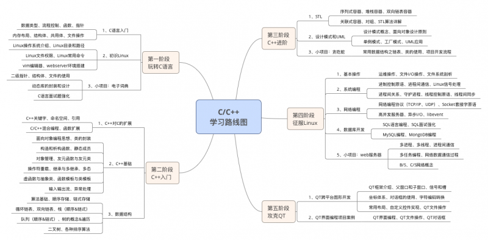
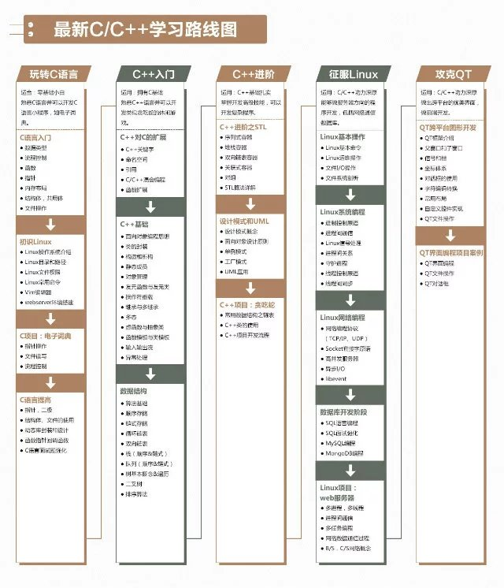
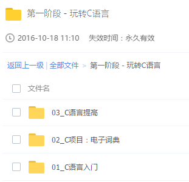
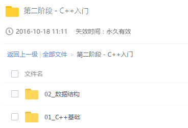
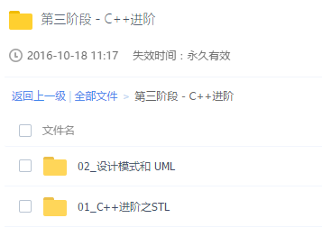
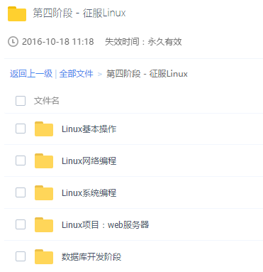
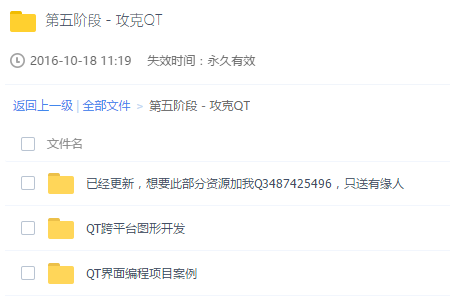
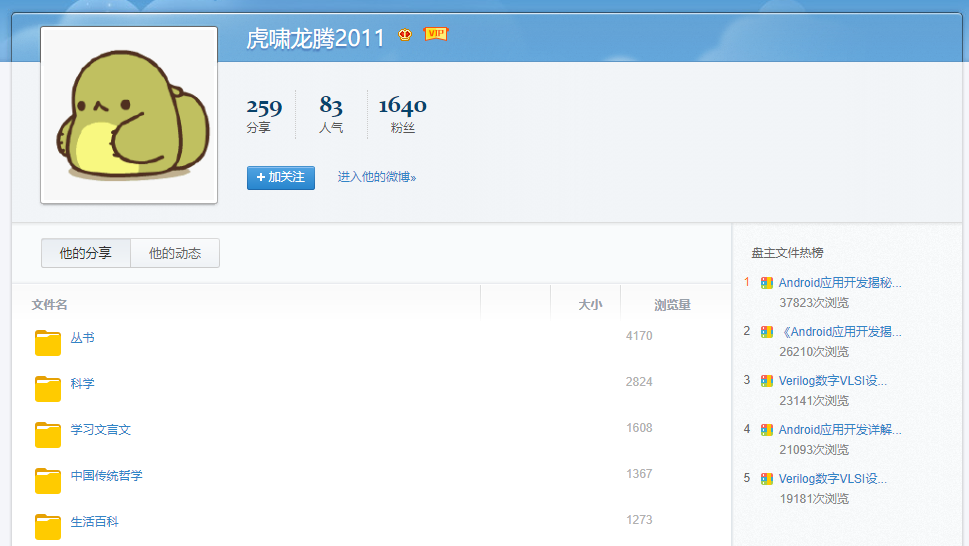

[2016年最新C/C++学习路线图（附完整视频资源）](http://www.itheima.com/news/20170414/182102.html)

http://c.itheima.com/?v2

http://www.itheima.com/course/ctext.html?xy

http://bbs.itheima.com/thread-338418-1-1.html

http://bbs.itheima.com/thread-328197-1-1.html

[IT教程网--中国高清视频教程下载第一门户站](http://www.itjiaocheng.com/)

传智播客C++第五期，链接: http://pan.baidu.com/s/1jGgiZgM 密码: r04s，解压密码：www.lthack.com

传智播客C++第五期无加密版，链接: http://pan.baidu.com/s/1miRGsLa 密码: x6e2

2015智锋互联---尹成c、c++ 第一期培训视频课程（一共214G）

链接：http://pan.baidu.com/s/1hsx7O5u 密码：9cey

2015智锋互联C C++ 一期培训，http://pan.baidu.com/s/1i399aiL 密码：niie

IT教程（260G）：https://pan.baidu.com/s/1miwEqTU

## C/C++学习路线图—视频篇

[第一阶段 源码和资料](https://pan.baidu.com/s/1c23hRLu#list/path=%2F) 

第二阶段 C++入门等 https://pan.baidu.com/s/1mix0qI8#list/path=%2F

第四阶段 https://pan.baidu.com/s/1bO9jye#list/path=%2F

### [第一阶段-玩转C语言](https://pan.baidu.com/s/1gf6vHOB?cazn#list/path=%2F)

知识点:
**1）C语言入门**数据类型、流程控制、函数、指针、内存布局、结构体、共用体、文件操作

**2）Linux系统编程基础**Linux操作系统介绍、Linux目录和路径、Linux文件权限、Linux下常用命令、Vim编辑器、webserver环境搭建

**3）C项目：电子词典**指针操作、文件读写、流程控制

**4）C语言提高**指针操作、文件读写、流程控制

### [第二阶段-C++入门](https://pan.baidu.com/s/1geCRcVh?cazn#list/path=%2F)

知识点

**1）C++对C的扩展**

C++关键字、命名空间、引用、C/C++混合编程、函数扩展

**2）C++基础**

面向对象编程思想、类的封装、构造和析构、静态成员、对象管理、友元函数，友元类、操作符重载、类的继承，多继承及其二义性、多态、虚函数，纯虚函数，抽象类、函数模板，类模板、C++输入输出流、C++异常处理

**3）数据结构**

算法基础、顺序存储、链式存储、循环链表、双向链表、栈（顺序和链式）、队列（顺序和链式）、树基本概念及遍历、二叉树、排序算法

### [第三阶段-C++进阶](https://pan.baidu.com/s/1eRXlUeu?cazn#list/path=%2F)

**2、知识点:**
**1）C++进阶之STL**序列式容器vector，deque、堆栈容器stack、双向链表容器list、关联式容器set，multiset、关联式容器map，multimap、对组pair、STL算法详解**2）设计模式与UML**设计模式概念、面向对象设计原则、单例模式、工厂模式、UML应用**3）C++项目：贪吃蛇**C++常用的数据结构链表、C++类的应用、C++项目开发流程

### [第四阶段-征服Linux](https://pan.baidu.com/s/1gfkbhyb?cazn#list/path=%2F)

https://pan.baidu.com/s/1nvGx5aT#list/path=%2F

**2、知识点:**
**1）Linux基本操作**Linux基本命令、Linux运维操作、文件I/O操作、文件系统剖析**2）Linux系统编程**进程控制原语、进程间通信、Linux信号处理、进程间关系、守护进程、线程控制原语、线程间同步**3）Linux网络编程**网络编程协议（TCP/IP、UDP）、Socket套接字原语、高并发服务器、异步I/O、libevent**4）数据库开发阶段**SQL语言编程、SQL面试强化、MySQL编程、MongoDB编程**5）Linux项目：web服务器**多进程，多线程、进程间通信、多任务编程、网络数据通信过程、B/S，C/S网络概念

### [第五阶段-攻克QT](https://pan.baidu.com/s/1dFeF4lz?cazn#list/path=%2F)

https://pan.baidu.com/s/1nvGx5aT#list/path=%2F

**2、知识点:**
**1）Linux基本操作**Linux基本命令、Linux运维操作、文件I/O操作、文件系统剖析**2）Linux系统编程**进程控制原语、进程间通信、Linux信号处理、进程间关系、守护进程、线程控制原语、线程间同步**3）Linux网络编程**网络编程协议（TCP/IP、UDP）、Socket套接字原语、高并发服务器、异步I/O、libevent**4）数据库开发阶段**SQL语言编程、SQL面试强化、MySQL编程、MongoDB编程**5）Linux项目：web服务器**多进程，多线程、进程间通信、多任务编程、网络数据通信过程、B/S，C/S网络概念

## C语言基础

| 主要内容              | 主要技术点                                    |
| :---------------- | :--------------------------------------- |
| 1.Unix/Linux实战    | 用户查询和切换命令；用户管理命令；文件权限管理命令；进程管理命令；系统管理命令(关机重启、网络连通性)；vi编辑器；远程操作；webserver服务器搭建过程 |
| 2.Unix/Linux服务器配置 | Unix/Linux操作系统；类Unix系统目录结构；查询命令；目录管理命令；文件管理命令；压缩解压命令 |
| 3.C语言概述           | 第一个C语言程序；C语言程序代码的含义；printf函数；gcc编译器对C代码进行编译；system函数；集成开发环境(vs、qt) |
| 4.数据类型与运算符        | 常量与变量；进制；计算机内存数值存储方式；整型int；字符类型char；实型(浮点型)float、double；字符串格式化输出和输入 |
| 5.条件判断与循环语句       | 运算符；条件控制语句；循环控制语句(while、do-while)；循环控制语句(for)；条件、循环语句的嵌套使用；跳转语句 |
| 6.数组与字符串          | 一维数组；一维数组的案例；二维数组；字符数组；srand()函数和rand()函数产生随机数 |
| 7.函数              | 字符串输入输出函数；字符串长度获取函数；字符串拷贝、连接、比较函数；字符串格式化函数(sprintf、sscanf)；字符串查询、切割函数；自定义函数 |
| 8.指针              | 指针变量的定义；指针基本使用；const修饰的指针；一级指针；指针和数组名的关系；指针法操作数组元素；指针作为函数的参数；数组作为函数的参数；指针做函数的返回值；指针处理字符串；字符指针做函数参数；项目开发常用字符串应用模型(两头堵、字符串翻转) |
| 9.内存管理            | 局部变量的作用域和生命周期；静态局部变量的作用域和生命周期；全局变量的作用域和生命周期；静态全局变量的作用域和生命周期；静态函数和非静态函数的区别；内存分区；堆区内存的分配(malloc)和释放(free) |
| 10.复合类型           | 结构体的基本用法；结构体嵌套指针和数组；结构体作为函数参数；union联合体类型；enum枚举类型；typedef声明类型 |
| 11.文件操作           | 文件的分类(文本、二进制)；文件的打开和关闭；fgetc()函数和fputc()函数；feof()函数；fgets()函数和fputs()函数；文件相关案例一；fprintf()函数和fscanf()函数；fread()函数和fwrite()函数；fseek()函数和ftell()函数；文件相关案例二；文件读写缓冲区的概念 |
| 12.项目实战           | 创建Qt应用程序；IDE案例ui界面的设计；IDE案例打开文本文件功能；IDE案例另存为功能；IDE案例编译代码功能；IDE案例字符编码选择功能；一级指针做函数参数；二级指针做函数参数；快译通核心代码的含义；快译通分文件(多文件)编程；Qt版快译通 |

## C提高

| 主要内容               | 主要技术点                                    |
| :----------------- | :--------------------------------------- |
| 1.数据类型、内存分区、函数调用模型 | 数据类型、变量的含义；全局、静态区；栈区的特点；堆区的特点；函数的调用模型；realoc、calloc |
| 2.一级指针的概念和使用       | 指针基本使用；指针的步长的概念；间接赋值是指针存在的最大意义；一级指针做函数参数；通过指针操作字符串；const类型修饰符 |
| 3.二级指针作为函数参数、位运算   | 二级指针的基本使用；二级指针做参数输出特性的使用；二级指针做参数输入特性的使用；多级指针作为函数参数；位的逻辑运算符；移位运算符 |
| 4.指针与数组、结构体的关系     | 数组指针；指针数组；多维数组做函数参数；结构体嵌套一级指针；结构体嵌套二级指针；结构体的浅拷贝深拷贝 |
| 5.函数指针             | 基本功能模块的封装和设计的思想；函数指针定义的三种方式；函数指针数组的定义和使用；函数指针做函数参数(回调函数) |
| 6.链表的操作、宏定义        | 链表的基本概念；单向链表初始化操作；遍历链表的操作；插入节点操作；删除指定节点的操作；链表释放节点操作；预处理带参数和不参数宏 |
| 7.递归函数、案例          | 递归函数的使用；C提高案例                            |

## C/C++学习路线图——面试篇

| 面试篇            | 链接地址                                     |
| -------------- | ---------------------------------------- |
| 你学历低，为什么要录用你？  | http://bbs.itheima.com/thread-329299-1-1.html |
| 如何介绍简历中的项目？    | [http://bbs.itheima.com/thread-329305-1-1.html](http://bbs.itheima.com/thread-329305-1-1.html?cazn) |
| 你有什么优劣势？       | [http://bbs.itheima.com/thread-329314-1-1.html](http://bbs.itheima.com/thread-329314-1-1.html?cazn) |
| 如何进行自我介绍？      | [http://bbs.itheima.com/thread-329306-1-1.html](http://bbs.itheima.com/thread-329306-1-1.html?cazn) |
| 你为什么选择我们的公司？   | [http://bbs.itheima.com/thread-329313-1-1.html](http://bbs.itheima.com/thread-329313-1-1.html?cazn) |
| 面试官如何评判应聘者的工资? | [http://bbs.itheima.com/thread-329310-1-1.html](http://bbs.itheima.com/thread-329310-1-1.html?cazn) |
| 如何才能打动面试官？     | [http://bbs.itheima.com/thread-329309-1-1.html](http://bbs.itheima.com/thread-329309-1-1.html?cazn) |
| 如何介绍简历中的项目？    | [http://bbs.itheima.com/thread-329305-1-1.html](http://bbs.itheima.com/thread-329305-1-1.html?cazn) |
| HR贬低项目时你该怎么办？  | [http://bbs.itheima.com/thread-329304-1-1.html](http://bbs.itheima.com/thread-329304-1-1.html?cazn) |
| HR指责要薪太高怎么办？   | [http://bbs.itheima.com/thread-329303-1-1.html](http://bbs.itheima.com/thread-329303-1-1.html?cazn) |
| 你会在我们这家单位呆多久？  | [http://bbs.itheima.com/thread-329302-1-1.html](http://bbs.itheima.com/thread-329302-1-1.html?cazn) |
| 如何做才能在面试中不紧张？  | [http://bbs.itheima.com/thread-329307-1-1.html](http://bbs.itheima.com/thread-329307-1-1.html?cazn) |
| 你是如何学的C/C++？   | [http://bbs.itheima.com/thread-329301-1-1.html](http://bbs.itheima.com/thread-329301-1-1.html?cazn) |
| 未来五年的规划是怎样的？   | [http://bbs.itheima.com/thread-329300-1-1.html](http://bbs.itheima.com/thread-329300-1-1.html?cazn) |
| 以上全部面试资源合并下载   | [https://pan.baidu.com/s/1bpj3v6B](https://pan.baidu.com/s/1bpj3v6B?cazn) |

数据结构：https://pan.baidu.com/s/1mhKjwZQ#list/path=%2F

传智扫地僧王保明

## 网盘资料

最适合自学的C语言基础视频配套资料
http://pan.baidu.com/s/1slrKjJB
链接：http://pan.baidu.com/s/1geEjZsZ 密码：vius
最适合自学的C++基础视频_深入浅出版全套资料
视频链接  http://pan.baidu.com/s/1skNXZnZ
链接：http://pan.baidu.com/s/1eRZQFmU 密码：c1tp

指针标准和知识体系搭建 
<http://pan.baidu.com/s/1kV6SoIz>
链接：http://pan.baidu.com/s/1kUKjpkz 密码：pbrh
指针和链表在项目开发中的实战应用    
<http://pan.baidu.com/s/1sl0Az7Z>   
链接：http://pan.baidu.com/s/1c2IBO56 密码：7twl

http://vdisk.weibo.com/u/1740385352?page=1

## 经典书籍

- Stan Lippman《C++ Primer》
- C++之父Bjarne Stroustrup的代表作《The C++ Programming Language》
- Effective C++：改善程序与设计的55个具体做法
- More Effective C++：35个改善编程与设计的有效方法
- Effective Modern C++：改善C++11和C++14的42个具体做法
- 泛型编程与STL
- C++编程规范
- c primer plus 第6版
- C语言深度解剖 解开程序员面试笔记的秘密
- 嵌入式Linux与物联网软件开发 C语言内核深度解析
- C语言接口与实现

## 优秀博客

- http://zhedahht.blog.163.com

本博客讨论程序员面试题，并主要集中在C/C++、数据结构算法和算法上。

微软、Google等面试题，剑指Offer：名企面试官精讲典型编程题

- http://saturnman.blog.163.com

saturnman大牛的博客

- [陈皓的酷壳 coolshell](http://coolshell.cn/)
- [陈硕的blog](http://blog.csdn.net/Solstice)
- [刘未鹏 | Mind Hacks](http://mindhacks.cn/)
- [胖子](http://88154873.qzone.qq.com)                
- [bluewanderer](http://hi.baidu.com/bluewanderer)   
- [saturnman](http://saturnman.blog.163.com)       
- [July](http://blog.sina.com.cn/shitou009)                
- [锦衣卫青龙](http://blog.sina.com.cn/zhijun0926)       
- [我的新浪博客]( http://blog.sina.com.cn/rollenholt )             
- [门徒](http://blog.sina.com.cn/cenaczx)                   
- [Ambition](http://blog.sina.com.cn/whitedream0109) 

amb教主,我只能仰望，再给我半年时间，才有希望平视

[MiYu](http://www.baiyun.me/)：和哥是一个等级的…最近被赶超了，追赶中

[大帅](http://www.cnblogs.com/newwy/)：大帅，你暂时在YM哥吗？

[rakerichard](http://www.cppblog.com/rakerichard)：小神牛，很有思想

[Roowe](http://www.iroowe.com/)：人称萝莉….喜欢流口水

[chinazhangjie](http://www.cnblogs.com/chinazhangjie/)：C++学的很好，也给了我很多建议，先感谢，后Orz

[愤怒的脚毛](http://www.hantayi.com/)：Windows API 小神，致敬。

[小球球](http://www.loveqiuqiu.com/)：ACM大神兼小美女。球教主V5。

[汇编高手](http://blog.csdn.net/paullbm) 

几位神牛：

- [Matrix67大牛](http://www.matrix67.com/blog/)  给我的感觉就是诗意的数学家
- [Pongba 大牛](http://mindhacks.cn/)  哲学大牛和编程大牛的集合体
- [Notonlysuccess大牛](http://www.notonlysuccess.com/)  杭电的队长，无限Orz
- [云风大牛](http://blog.codingnow.com/)  网易开发游戏的第一大将

## 项目展示

传智播客 C/C++学院项目展示，智播客学院

- [C 学院项目展示——传智学员开发的QQ十亿数据索引](http://v.youku.com/v_show/id_XNzkzMzY1OTg0.html)
- [C 学院项目展示——王宁老师的人脸系别系统](http://v.youku.com/v_show/id_XNzkzMzU4OTcy.html )
- [C 学院项目展示——薛国良老师教你如何劫持百度](http://v.youku.com/v_show/id_XNzkzMzUxNTky.html)
- [C 学院项目展示——朱景尧老师叫你如何快速查询开房记录](http://v.youku.com/v_show/id_XNzkzMzUxNTc2.html)
- [C 学院项目展示——王桂林老师教你制作妹纸的3D桌面](http://v.youku.com/v_show/id_XNzkzMzUxNTQ4.html)

项目实战-中国象棋：http://pan.baidu.com/s/1bpHPEk3，fgq4