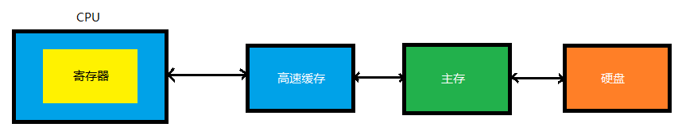

程序 = 指令 = 地址码 + 操作码

## 计算机硬件组成

中央处理器（CPU，控制器，运算器）、存储器、输入输出设备

### 存储器

- 主存储器
  - RAM
  - ROM
- 辅助存储器：硬盘，光盘，软盘

动态随机存储器（DRAM）

主存储器的核心是存储体，程序和数据都存放在存储体中。存储体是由若干存储单元组成的，存储单元的编号称为地址，地址和存储单元之间有一对一的对应关系。这就像一座大楼有许多房间，而每个房间都有其惟一的房间号一样。

存储单元是CPU 对主存可访问操作的最小存储单位，根据存储单元的地址可以找到相应存储单元的内容。

半导体存储器包括半导体随机存储器（RAM ）和半导体只读存储器（ROM）

RAM 是可读、可写的存储器，CPU 可以对RAM 的内容随机地读写访问。SRAM 的存取速度快，但集成度低，功耗也较大，所以一般用来组成高速缓冲存储器和小容量主存系统；DRAM 集成度高，功耗小，但存取速度慢，一般用来组成大容量主存系统。

ROM 是只能随机读出而不能写入的存储器，用来存放那些不需要改变的信息。ROM 的结构比RAM 简单，集成度高，功耗低，可靠性高。

主存储器是整个存储系统的核心，通常分为随机存储器（RAM ）和只读存储器（ROM）两大部分，RAM 和ROM 在主存中是统一编址的。RAM 用来存放供用户随机读写的用户程序和数据，也可以作为系统程序的工作区；ROM 用来存放系统程序。不管是RAM 还是ROM ，通常都是由许多个不同容量的芯片组成的，其芯片的数量取决于各个存储区域的容量和每个芯片容量的大小。

### 寄存器

寄存器：用于暂存数据和指令

通用寄存器、专用寄存器