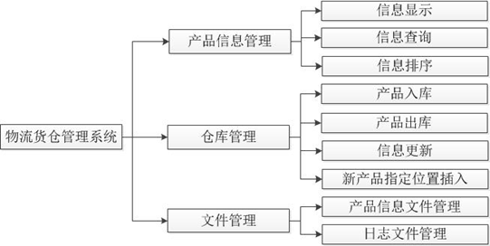

## 项目分析

### 功能描述

本项目将实现一个简单的物流货仓管理系统，系统具有三大功能模块，用以实现产品信息的显示、查询、排序、入库、出库、修改等操作。



各模块的主要功能：

产品信息管理：系统中可以显示产品信息，并能够根据产品型号、名称、品牌、单价、数量这些属性进行信息查询及排序。

仓库管理：实现产品的出库、入库登记及产品信息的更新。

系统管理：系统中将操作两个文件，分别为产品信息文件和日志文件。其中，产品信息文件用于保存产品信息；日志文件用于记录用户操作。系统中通过操作产品信息文件，对产品记录进行显示、查询、修改等操作。

## 项目实现

### 项目创建

首先在VS中创建一个项目并添加相应的文件。系统功能通过多个类实现，类的定义及实现由各个文件给出，文件的功能描述如下：

- menu.h，menu.cpp

menu.h头文件定义了menu类，用于描述系统界面。menu.cpp源文件是menu类的实现，类的成员函数用于显示系统界面。

- control.h，control.cpp

control.h给出Control类的定义。control.cpp实现了Control类，该类给出了操作系统功能的方法。

- manager.h，manager.cpp

实现了文件读取、文件备份等操作，并为操作链表提供了方法。

- productlist.h，productlist.cpp

提供了向链表插入节点、删除节点以及节点排序等方法。


### 项目设计

系统中定义了4个类用来描述、操作产品信息，实现查询、进货、出货、修改信息等功能。此外，还定义了Menu类用于显示系统界面。

- menu.h

```c++
#pragma once

class Menu{
public:
	static void MainMenu();//静态成员函数，显示系统主界面
	static void SubMenu();//显示系统子界面，即系统功能选项
};
```

- menu.cpp

```c++
#include "menu.h"
#include <iostream>

using namespace std;

static const int MAX_LEN = 80;

#define OUTPUT_CONTENT(content) \
do \
{ \
	int len = strlen(content); \
	if (len > 0) \
			{ \
		len = (MAX_LEN - len) / 2; \
		cout << "#"; \
		for (auto i = 1; i < len; i++) \
			cout << " "; \
		cout << content; \
		for (auto i = 1; i < len; i++) \
			cout << " "; \
		cout << "#"; \
	} \
	else \
	{ \
		for (auto i = 0; i < 80; i++) \
			cout << "#"; \
	} \
} \
while (0)

void Menu::MainMenu()
{
	OUTPUT_CONTENT("");
	OUTPUT_CONTENT("欢迎使用物流管理系统");
	OUTPUT_CONTENT("1.开始营业");
	OUTPUT_CONTENT("2.退    出");
	OUTPUT_CONTENT("");
}

void Menu::SubMenu()
{
	OUTPUT_CONTENT("");
	OUTPUT_CONTENT("***物流管理系统***");
	OUTPUT_CONTENT("1.显示产品列表");
	OUTPUT_CONTENT("2.按条件查询");
	OUTPUT_CONTENT("3.按条件排序");
	OUTPUT_CONTENT("4.进      货");
	OUTPUT_CONTENT("5.出      货");
	OUTPUT_CONTENT("6.修      改");
	OUTPUT_CONTENT("7.插      入");
	OUTPUT_CONTENT("8.存      盘");
	OUTPUT_CONTENT("9.退      出");
	OUTPUT_CONTENT("");
}
```

产品类Product：本类中描述了产品属性：型号、名称、价格、品牌、数量

```c++
#pragma once
#include <string>

#define OFFSET_OF(__TYPE__, __MEMBER__) \
(size_t)(&((static_cast<__TYPE__*>(0))->__MEMBER__))

enum EType
{
	TYPE_SERIAL,              //产品型号
	TYPE_NAME,                //产品名称
	TYPE_BRAND,               //产品品牌
	TYPE_PRICE,               //产品价格
	TYPE_COUNT                //产品数量
};

// 产品
struct Product
{
	std::string sSerial;	// 产品型号
	std::string sName;		// 产品名称
	std::string sBrand;		// 产品品牌
	int iPrice;				// 产品价格
	int iCount;				// 产品数量
};
```

产品列表类ProductList：系统中将使用链表管理产品信息，本类对链表节点进行管理及操作。


- productList.h

```c++
#pragma once
#include "product.h"

// 产品列表
class ProductList{
public:
	enum ESelect                        //定义枚举类型，说明操作链表的方式
	{
		SELECT_ALL = -1,			 // 全选，表示对链表的所有节点进行操作
		SELECT_FIRST = 1,			 // 仅选择满足条件的第一个节点进行操作
	};
	enum ECondition                    //对于系统中的查询要求，将使用本枚举类作为查询条件
	{
		ON_NONE = 0,
		ON_EQUAL = 0x01,           //查找相同内容
		ON_LESS = 0x02,           //查找小于条件值的内容
		ON_GREATER = 0x03            //查找大于条件值的内容
	};
private:
	Product* m_product;							// Product指针，指向产品信息
	ProductList* m_pProductNext;				// 指向后继节点
private:
	static ProductList* s_pProductHead;			// 静态数据成员，链表头指针
	static ProductList* s_pProductTail;			// 静态数据成员，链表尾指针
public:
	static void DeleteProductList(ProductList*& p);//删除链表
	static const Product* GetProduct(ProductList*& p);//获取产品信息
	static bool IsSame(const Product* pro1, const Product& pro2);//比较两个产品
	static ProductList *GetListHead();//获取链表头指针
public:
	ProductList();								// 构造函数
	~ProductList();								// 析构函数
private:
	// 内部接口
	void Swap(ProductList* ptr1, ProductList* ptr2); //交换节点中的产品信息
	//按属性完成产品信息比较
	int CompareByEType(EType t, const ProductList* ptr1, const ProductList* ptr2);
	//判断指定产品信息是否存在于链表中
	ProductList* IsSameProduct(const Product& pro) const;
	//获取当前节点的前驱
	ProductList* GetFrontProduct(const ProductList* product);
	//判断指定产品信息在链表中是否存在
	ProductList* IsProductExist(const ProductList* product, int num);
public:
	void AddProduct(const Product* ptr = nullptr);	// 添加产品
	// 在指定产品后插入新产品信息
	void InsertProduct(const ProductList* product, int num = SELECT_FIRST);
	// 出货
	void SellProduct(const ProductList* product, int num = SELECT_FIRST);
	// 删除产品信息原始列表中某产品信息
	void DeleteProduct(const ProductList* product, int num = SELECT_FIRST);
	// 查询产品
	ProductList* SearchProduct(EType t, ECondition c, std::string str) const;
	void ShowAllProduct(ProductList *head = s_pProductHead) const;	// 显示所有产品
	// 排序并显示
	void SortProductByEType(EType type);
	// 编辑指定产品的信息
	void EditProduct(const ProductList* product, int num = SELECT_FIRST);
	// 显示指定产品的信息
	void ShowProduct(const ProductList* product, int num = SELECT_FIRST);
};

#pragma region

#define COMPARE_BY(ptr1, ptr2, member) \
do \
{ \
if (ptr1->m_product->member < ptr2->m_product->member) \
	return -1; \
	else if (ptr1->m_product->member == ptr2->m_product->member) \
	return 0; \
	else \
	return 1; \
} \
while (0)

#define COMPARE_WITH(ptr, member, val, res) \
do \
{ \
if (ptr->m_product->member < val) \
	res = ECondition::ON_LESS; \
	else if (ptr->m_product->member == val) \
	res = ECondition::ON_EQUAL; \
	else \
	res = ECondition::ON_GREATER; \
} \
while (0)

#define OUTPUT_HEAD(out) \
do \
{ \
	out << "型号" << "\t\t" \
	<< "名称" << "\t\t" \
	<< "品牌" << "\t\t" \
	<< "单价" << "\t\t" \
	<< "数量" << endl; \
	out << "--------------------------------------------------------------------" << endl;\
} \
while (0)

#define INPUT_PRODUCT(in, pro) \
in >> pro.sSerial \
	>> pro.sName \
	>> pro.sBrand \
	>> pro.iPrice \
	>> pro.iCount

#define OUTPUT_PRODUCT(out, ptr) \
out << ptr->sSerial << "\t\t" \
	<< ptr->sName << "\t" \
	<< ptr->sBrand << "\t\t" \
	<< ptr->iPrice << "\t\t" \
	<< ptr->iCount << endl

#define COPY_PRODUCT(ptr, pro) \
do \
{ \
	ptr->sSerial = pro.sSerial; \
	ptr->sName = pro.sName; \
	ptr->sBrand = pro.sBrand; \
	ptr->iPrice = pro.iPrice; \
	ptr->iCount = pro.iCount; \
} while (0)

#pragma endregion
```

- productList.cpp

```c++
#define _CRT_SECURE_NO_WARNINGS
#include <iostream>
#include "productList.h"

using namespace std;

ProductList* ProductList::s_pProductHead = nullptr;
ProductList* ProductList::s_pProductTail = nullptr;

void ProductList::DeleteProductList(ProductList*& p)
{
	auto pTmp = p, pList = p;
	auto& pHead = p;
	while (pTmp && pTmp->m_pProductNext)
	{
		pTmp = pTmp->m_pProductNext;
		if (pList == s_pProductHead)
			delete p->m_product;
		delete p;
		p = pTmp;
	}
	delete pTmp;
	pHead = nullptr;
}

const Product* ProductList::GetProduct(ProductList*& p)
{
	if (!p->m_product)
		return nullptr;

	const auto ptr = p->m_product;
	p = p->m_pProductNext;
	return ptr;
}

bool ProductList::IsSame(const Product* pro1, const Product& pro2)
{
	if (pro1->sSerial == pro2.sSerial
		&& pro1->sName == pro2.sName
		&& pro1->sBrand == pro2.sBrand)
		return true;

	return false;
}

ProductList::ProductList() :m_product(nullptr), m_pProductNext(nullptr)
{
	//s_pProducHead和s_pProductTail两个静态数据成员是产品信息链表的头指针、尾指针
	//链表刚创建时，只存在一个节点，内容无效，头尾指针均指向该节点
	if (!(s_pProductHead || s_pProductTail))
	{
		s_pProductHead = this;
		s_pProductTail = this;
	}
}


ProductList::~ProductList()
{
	//cout << "productlist destructor!" << endl;
	//s_pProductTail = nullptr;
}

void ProductList::Swap(ProductList* ptr1, ProductList* ptr2)
{
	Product *tmp;
	tmp = ptr1->m_product;
	ptr1->m_product = ptr2->m_product;
	ptr2->m_product = tmp;
}

int ProductList::CompareByEType(EType t, const ProductList* ptr1, const ProductList* ptr2)
{
	switch (t)
	{
	case TYPE_SERIAL:
		COMPARE_BY(ptr1, ptr2, sSerial);
	case TYPE_NAME:
		COMPARE_BY(ptr1, ptr2, sName);
	case TYPE_BRAND:
		COMPARE_BY(ptr1, ptr2, sBrand);
	case TYPE_PRICE:
		COMPARE_BY(ptr1, ptr2, iPrice);
	case TYPE_COUNT:
		COMPARE_BY(ptr1, ptr2, iCount);
	}
	return 0;
}

ProductList* ProductList::IsSameProduct(const Product& pro) const
{
	auto p = s_pProductHead;

	while (p->m_product)
	{
		if (IsSame(p->m_product, pro))
			return p;
		p = p->m_pProductNext;
	}

	return nullptr;
}

ProductList* ProductList::GetFrontProduct(const ProductList* product)
{
	if (!product)
	{
		cout << "Invalid param: product == nullptr!\n";
		return nullptr;
	}

	auto pThis = s_pProductHead;
	while (pThis->m_pProductNext)
	{
		if (pThis->m_pProductNext->m_product == product->m_product)
			break;
		pThis = pThis->m_pProductNext;
	}

	if (!pThis->m_pProductNext)
		return nullptr;
	return pThis;
}

ProductList* ProductList::IsProductExist(const ProductList* product, int num)
{
	if (!product)
	{
		cout << "Invalid param: product == nullptr!\n";
		return nullptr;
	}

	if (num < 1)
	{
		cout << "Invalid count: num == " << num << ", num < 1\n";
		return nullptr;
	}

	auto pThis = s_pProductHead;
	while (pThis)
	{
		if (pThis->m_product == product->m_product)
			break;
		pThis = pThis->m_pProductNext;
	}

	return pThis;
}

//函数参数为待插入的产品对象地址，ptr值有两种：
//1、若产品信息从product.txt文件获得，则ptr为非nullptr值
//2、若产品信息需要用户输入，ptr值为nullptr
void ProductList::AddProduct(const Product* ptr)
{
	Product pro;
	if (!ptr){                              //ptr为nullptr时，需要用户输入产品信息
		cout << "请按以下格式输入产品信息：\n";
		OUTPUT_HEAD(cout);
		INPUT_PRODUCT(cin, pro);        //从键盘获取产品信息，存入pro中
	}
	else{
		pro = *ptr;                       //将待插节点的有效内容存入pro中
	}
	//将待插节点的产品型号、名称、品牌同链表现有节点进行比较
	//若存在内容相同的节点，用p记录链表节点地址，否则p为nullptr
	auto p = IsSameProduct(pro);
	if (p)
	{
		cout << "您输入的产品名称在系统中已存在，现将信息进行合并！" << endl;
		cout << "\n原有信息如下：" << endl;
		OUTPUT_HEAD(cout);
		OUTPUT_PRODUCT(cout, p->m_product);
		//若链表中存在与待插节点信息相同节点，将待插节点的价格、数量与现有链表节点相应内容合并
		int total = p->m_product->iPrice * p->m_product->iCount + pro.iPrice * pro.iCount;
		p->m_product->iCount += pro.iCount;
		p->m_product->iPrice = total / p->m_product->iCount;

		cout << "合并后，信息如下：" << endl;
		OUTPUT_PRODUCT(cout, p->m_product);
		cout << endl;
		return;
	}
	//若链表已存在，在链表尾部插入新节点
	if (s_pProductTail)
	{
		//让尾指针的m_product保存新产品对象地址
		s_pProductTail->m_product = new Product(pro);
		//创建新的尾节点
		s_pProductTail->m_pProductNext = new ProductList();
		//尾指针指向新创建的尾节点
		s_pProductTail = s_pProductTail->m_pProductNext;
	}
}


//在链表中product节点后插入num个新节点
void ProductList::InsertProduct(const ProductList* product, int num)
{
	//在链表中寻找插入位置，比如product为产品型号值等于“PRO001”的节点指针
	//则本函数将在该节点后插入num个新节点。 pThis指针记录插入位置
	ProductList* pThis = IsProductExist(product, num);
	if (!pThis)                             //若插入位置不存在，则结束操作
		return;

	int i = 0;
	Product pro;
	//pThis后将插入新节点，pNext记录当前pThis的后继节点
	auto pNext = pThis->m_pProductNext;
	while (i++ < num)                     //插入num个新节点
	{
		cout << "输入新产品内容：" << endl;
		OUTPUT_HEAD(cout);
		INPUT_PRODUCT(cin, pro);
		//若输入的产品型号、名称、品牌与链表中某节点相同，则认为是同一个产品，只修改产品数量
		auto p = IsSameProduct(pro);
		if (p)
		{
			p->m_product->iCount += pro.iCount;
			continue;
		}
		//输入的是新产品信息，则建立新节点，插入合适的位置
		pThis->m_pProductNext = new ProductList();
		pThis = pThis->m_pProductNext;
		pThis->m_product = new Product(pro);
		pThis->m_pProductNext = pNext;
	}
	return;
}


void ProductList::SellProduct(const ProductList* product, int num)
{
	//在链表中寻找待出货的产品节点，查找结果记录在p中
	auto p = IsProductExist(product, ESelect::SELECT_FIRST);
	//若p为非nullptr，则找到要出货的产品节点
	if (p)
	{
		//显示要出货的产品信息
		cout << "要出货的产品信息：" << endl;
		OUTPUT_HEAD(cout);
		OUTPUT_PRODUCT(cout, p->m_product);
		//根据出货数量，减少节点中相应的产品数量值
		p->m_product->iCount -= num;
		//若出货量大于等于库存量，则删除链表中对应节点
		if (p->m_product->iCount <= 0){
			cout << "**********出货量为：" << p->m_product->iCount + num
				<< ", 该货物已出清！**********" << endl;
			DeleteProduct(p);
		}
	}
}


//参数product指明待删节点
//numm默认值为SELECT_FIRST（1），表示删除链表中匹配的第一个节点，即当前节点
void ProductList::DeleteProduct(const ProductList* product, int num)
{
	int i = 0;
	auto p = product;
	ProductList* pThis;
	ProductList* pNext;
	ProductList* pFront;
	//若待删节点是链表的首节点，则销毁首节点，并修改s_pProductHead
	if (product == s_pProductHead){
		delete product->m_product;
		s_pProductHead = s_pProductHead->m_pProductNext;
		delete product;
		return;
	}
	while (i++ < num)
	{
		if (!p->m_product)
		{
			cout << "Warning: param product == nullptr!\n";
			return;
		}
		//寻找待删节点的前驱
		pFront = GetFrontProduct(p);
		//确定待删节点
		pThis = IsProductExist(p, num);
		if (!pThis)
		{
			cout << "Warning: param pThis == nullptr!\n";
			return;
		}
		//将待删节点的前驱和后继相连，删除指定节点
		p = p->m_pProductNext;
		pNext = pThis->m_pProductNext;
		delete pThis->m_product;
		delete pThis;
		if (pFront)
			pFront->m_pProductNext = pThis = pNext;
	}
	return;
}


//参数说明：
//EType t:表示产品属性编号，例如，若想按照产品型号进行查询，则t为0，按名称查，t为1
//ECondition c:表示查询条件，例如，若查询条件为“相等”，则c为1
//std::string str：表示具体的产品属性值
//当t为0， c为1， str为PRO001时，表示查询产品型号等于“PRO001”的节点信息
ProductList* ProductList::SearchProduct(EType t, ECondition c, std::string str) const
{
	int val;
	ECondition res;
	const char* s = str.c_str();
	auto p = s_pProductHead;            //用p记录待查询的链表头指针
	//pList为查询结果链表的头节点地址
	//若从产品信息链表中查找到符合条件的节点，则依次插入pList指向的链表中
	auto pList = new ProductList();
	auto pHead = pList;
	sscanf(s, "%d", &val);
	//查找产品信息链表
	while (p->m_product)
	{
		//确定查找条件
		switch (t)
		{
		case TYPE_SERIAL:
			//按产品型号进行查询，在res中记录查询比较条件
			//若当前节点中的产品型号值小于str指定的查询值则查询条件res被设定为ON_LESS
			//若相等则res被设定为ON_EQUAL，若大于则res被设置为ON_GREATER
			COMPARE_WITH(p, sSerial, str, res);
			break;
		case TYPE_NAME:
			COMPARE_WITH(p, sName, str, res);
			break;
		case TYPE_BRAND:
			COMPARE_WITH(p, sBrand, str, res);
			break;
		case TYPE_PRICE:
			COMPARE_WITH(p, iPrice, val, res);
			break;
		case TYPE_COUNT:
			COMPARE_WITH(p, iCount, val, res);
			break;
		}
		//比较查询条件与本节点产品属性值的关系，若匹配说明查询成功
		//将查询到的产品信息存入pList指向的链表中
		if (c == res)
		{
			pList->m_product = p->m_product;
			pList->m_pProductNext = new ProductList();
			pList = pList->m_pProductNext;
		}
		p = p->m_pProductNext;
	}
	//若查找到有效信息则返回查询结果链表头指针，否则返回nullptr
	return pHead->m_product ? pHead : nullptr;
}


void ProductList::ShowAllProduct(ProductList *head) const
{
	OUTPUT_HEAD(cout);                                //显示产品属性名称
	auto p = head;
	//循环访问链表节点，完成信息显示
	while (p->m_product)
	{
		OUTPUT_PRODUCT(cout, p->m_product);
		p = p->m_pProductNext;
	}
}


//按指定属性完成链表升序排列
void ProductList::SortProductByEType(EType type)
{
	auto p = s_pProductHead;                   //让p记录头节点地址
	//若链表只有一个节点，直接显示该节点信息,无需排序
	if (!p->m_pProductNext)
	{
		ShowAllProduct();
		return;
	}

	ProductList* pTmp;
	//按照选择排序思想，对链表节点进行升序排序
	for (auto i = p; i->m_pProductNext->m_product;)
	{
		//i节点位置为链表中最前位置，最前位置应该存放属性值最小的节点信息
		pTmp = i;
		//从i节点之后的节点中寻找属性值最小的节点，并将节点地址记录在pTmp指针中
		auto j = i->m_pProductNext;
		while (j->m_product)
		{
			if (CompareByEType(type, pTmp, j) > 0)
				pTmp = j;
			j = j->m_pProductNext;
		}
		//若属性值最小的节点（由pTmp指向）没有出现在链表最前位置i上，则交换产品信息
		Swap(i, pTmp);
		i = i->m_pProductNext;
	}
}

//参数为一个链表头指针，该链表描述满足修改条件的所有产品， num始终为真，表示修改该节点信息
void ProductList::EditProduct(const ProductList* product, int num)
{
	Product pro;
	auto p = product;
	ProductList *pSame;
	ProductList* pThis;
	//通过循环，操作每个需要进行修改的节点
	while (p->m_product)
	{
		//判断产品信息链表中是否存在待修改的节点信息，若存在则进行修改
		pThis = IsProductExist(p, ProductList::ESelect::SELECT_FIRST);
		if (pThis)
		{
			//修改前先显示目前信息
			cout << "该物品原有信息如下：\n";
			OUTPUT_PRODUCT(cout, pThis->m_product);
			//输入新信息
			cout << "请输入修改后的信息：\n";
			INPUT_PRODUCT(cin, pro);
			//在现有产品信息链表中查找新输入的信息是否存在
			pSame = IsSameProduct(pro);
			//修改本节点，或者若新输入的信息与产品信息链表中现有信息均不相同，
			//则将新信息复制到待修改节点中。
			if (!pSame || pSame->m_product == p->m_product){
				COPY_PRODUCT(pThis->m_product, pro);
			}
			//若新输入的信息与链表中除本节点外的某个节点相同，则删除本节点，
			//并将新信息与原有信息合并
			else
			{
				DeleteProduct(pThis);
				pSame->m_product->iCount += pro.iCount;
			}
			cout << "修改成功，请按回车键继续修改。\n";
			cin.get();
			cin.get();
		}
		else
			break;
		p = p->m_pProductNext;
	}
	cout << "修改完毕！\n";
}


void ProductList::ShowProduct(const ProductList* product, int num)
{
	OUTPUT_HEAD(cout);

	int i = 0;
	auto p = product;
	auto pThis = s_pProductHead;
	while (i++ < num)
	{
		pThis = IsProductExist(p, num);
		if (pThis)
			OUTPUT_PRODUCT(cout, pThis->m_product);
		p = p->m_pProductNext;
	}
}
ProductList *ProductList::GetListHead()
{
	return s_pProductHead;
}
```

管理类Manager：本类提供操作产品信息文件、日志文件的方法，通过读取、写入文件实现链表结构的创建以及链表信息向文件的保存。

- Manager.h

```c++
#pragma once

#include <fstream>
#include "productList.h"

// 管理
class Manager{
private:
	std::ifstream m_finRecord;			// 操作库存文件的对象
	std::ofstream m_foutLogFile;		// 操作日志文件的对象
	std::string m_strRecordFile;		// 库存文件名
	std::string m_strLogFileName;		// 日志文件名
	ProductList* m_productHead;			// 产品链表头
public:
	//声明带参数默认值的构造函数，日志文件名默认为”info.log”
	Manager(std::string fileName, std::string logFile = "info.log");
	~Manager();
public:
	void ReadRecord();                   //实现产品信息文件读取，每条记录对应一个链表节点
	void UpdateRecord();                 //文件内容更新
	void BackupRecord(std::string file);//实现“存盘”操作
	void LogoutInfo();                   //向日志文件写入信息
	void Logout(std::string content, bool bHasInfo = true);
	//系统功能入口函数
	void InventoryManager(std::string sChoice, int iExtra = ProductList::ECondition::ON_NONE, int iKeyword = -1, std::string sExtra = nullptr);
};
```

- Manager.cpp

```c++
#include "manager.h"
#include "productList.h"
#include <iostream>

using namespace std;

Manager::Manager(std::string fileName, std::string logFile)
: m_strRecordFile(fileName)//初始化为存放产品信息的文件名称product.txt
, m_strLogFileName(logFile)//初始化为日志文件名称info.log
, m_productHead(new ProductList())//初始化为ProductList对象地址
{
	// 打开日志文件
	m_foutLogFile.open(m_strLogFileName, ios_base::out | ios_base::app);
	m_foutLogFile.clear();
	m_foutLogFile.seekp(0, ios_base::beg);
	Logout("成功打开日志文件，开始营业");               //向日志文件保存相应操作信息
	system("pause");
	system("cls");
}


Manager::~Manager()
{
	m_foutLogFile.close();
	cout << "manager destructor!" << endl;
	
	ProductList::DeleteProductList(m_productHead);
	system("pause");
}


void Manager::ReadRecord()
{
	// 打开并载入产品信息记录文件（product.txt）
	m_finRecord.open(m_strRecordFile, ios_base::in);
	m_finRecord.clear();
	m_finRecord.seekg(0, ios_base::beg);

	//在日志文件中记录用户执行的操作
	OUTPUT_HEAD(m_foutLogFile);
	Product pro;
	//读取产品信息文件，将每条记录作为节点，插入链表
	while (INPUT_PRODUCT(m_finRecord, pro))
		m_productHead->AddProduct(&pro);         //向链表中插入新节点
	m_finRecord.close();                            //关闭产品信息文件
}


void Manager::UpdateRecord()
{
	auto str = m_strRecordFile + ".bak";//构造一个名称为“product.txt.bak”的字符串
	BackupRecord(str);                      //向名为“product.txt.bak”的文件存入链表信息
	remove(m_strRecordFile.c_str());     //删除原有的product.txt文件
	//将product.txt.bak更名为product.txt
	rename(str.c_str(), m_strRecordFile.c_str());
}


//函数参数指出文件名称
void Manager::BackupRecord(std::string file)
{
	Logout("正在创建副本");              //在日志文件中记录用户操作
	ofstream fout(file);
	auto p = m_productHead;           //p保存链表头指针
	auto ptr = ProductList::GetProduct(p);//获取链表首节点
	while (ptr)
	{
		OUTPUT_PRODUCT(fout, ptr);//将节点对应的产品信息存入文件
		ptr = ProductList::GetProduct(p);//获取下一个节点
	}
	fout.close();                      //关闭文件
	Logout("副本创建成功");
	system("pause");
}


void Manager::LogoutInfo()
{
	cout << __DATE__ << ", " << __TIME__ << ": ";
	m_foutLogFile << __DATE__ << ", " << __TIME__ << ": ";
}

void Manager::Logout(std::string content, bool bHasInfo)
{
	if (bHasInfo)
		LogoutInfo();

	cout << content << endl;
	m_foutLogFile << content << endl;
}

//参数说明：
//1、sChoice：用户输入的功能选项
//2、iExtra：操作条件
//3、iKeyword：属性选项
//4、sExtra：与iKeyword匹配的属性值
//例如四个参数为：2, 3（iExtra：表示查询条件， 3表示“大于”）, 
//3（iKeyword：表示属性编号， 3表示“产品价格”）, 20（sExtra），则表示用户要执行查询操作，
//则执行的操作为：查询价格高于20元的产品
void Manager::InventoryManager(std::string sChoice, int iExtra, int iKeyword, std::string sExtra)
{
	//获取产品信息链表头指针
	m_productHead = ProductList::GetListHead();
	if (sChoice == "1")             //功能1：产品信息显示
	{
		Logout("显示产品列表");
		//产品信息已保存在链表中，显示链表节点信息
		m_productHead->ShowAllProduct();
		Logout("显示完成");
	}
	else if (sChoice == "2")       //功能2：产品信息查询
	{
		Logout("按条件查询");        //在日志文件中记录用户操作
		//查找满足条件的节点信息，并将这些节点构成一个查询结果链表
		auto p = m_productHead->SearchProduct(static_cast<EType>(iKeyword), static_cast<ProductList::ECondition>(iExtra), sExtra);
		//若p为nullptr，表示未查找到满足条件的记录
		if (!p){
			cout << "************您查询的信息在系统中不存在*************" << endl;
			return;
		}
		//若查找到相应记录，显示查询结果
		p->ShowAllProduct(p);
		Logout("查询完成");
		ProductList::DeleteProductList(p);//删除查询结果链表
	}
	else if (sChoice == "3")        //功能3：产品信息排序
	{
		Logout("按条件排序");         //在日志文件中记录用户操作
		//通过SortProductByEType()函数按指定属性完成链表排序
		m_productHead->SortProductByEType(static_cast<EType>(iKeyword));
		//显示排序结果
		m_productHead->ShowAllProduct();
		Logout("排序完成");
	}
	else if (sChoice == "4")        //功能4：进货
	{
		Logout("进货");
		//按进货品种，完成进货操作，即向链表插入若干新节点
		for (auto i = 0; i < iExtra; i++){
			cout << "请输入第" << i + 1 << "个品种信息(共" << iExtra << "个）：" << endl;
			m_productHead->AddProduct();
		}
		Logout("进货完成");
	}
	else if (sChoice == "5")       //功能5：出货
	{
		Logout("按条件出货");
		//寻找待出货的节点信息，用p记录
		auto p = m_productHead->SearchProduct(static_cast<EType>(iKeyword), ProductList::ECondition::ON_EQUAL, sExtra);
		//若没找到待出货的产品节点，则给出用户提示
		if (!p){
			cout << "该货物不存在！" << endl;
			return;
		}
		//调用SellProduct()函数完成出货操作
		m_productHead->SellProduct(p, iExtra);
		Logout("出货完成");
		//销毁p指向的空间
		ProductList::DeleteProductList(p);
	}
	else if (sChoice == "6")           //功能6：修改产品信息
	{
		Logout("修改");
		//寻找待修改的节点信息，可以修改多个产品信息，将待修改的多个产品信息构成链表，由p指向
		auto p = m_productHead->SearchProduct(static_cast<EType>(iKeyword), static_cast<ProductList::ECondition>(iExtra), sExtra);
		if (!p){
			cout << "************要修改的信息不存在*************" << endl;
			return;
		}
		//通过EditProduct()函数完成信息修改
		m_productHead->EditProduct(p, ProductList::ESelect::SELECT_FIRST);
		Logout("修改完成");
		//销毁p指向的链表
		ProductList::DeleteProductList(p);
	}
	else if (sChoice == "7")           //功能7：在指定位置插入新信息
	{
		Logout("按条件插入");
		//寻找插入位置
		auto p = m_productHead->SearchProduct(static_cast<EType>(iKeyword), ProductList::ECondition::ON_EQUAL, sExtra);
		if (!p){
			cout << "没有找到插入位置！" << endl;
			return;
		}
		//在指定位置后插入新节点
		m_productHead->InsertProduct(p, iExtra);
		Logout("插入完成");
	}
	else if (sChoice == "8")         //功能8：信息保存
	{
		Logout("存盘");
		UpdateRecord();
		Logout("存盘完成");
	}
	else if (sChoice == "9")         //功能9：退出系统
	{
		Logout("谢谢使用!");
		system("pause");
		return;
	}
}
```

控制类Control：本类用于实现总体控制，提供项目功能入口。

- Control.h

```c++
#pragma once
#include "manager.h"

class Control{
private:
	Manager m_manager; //Manager对象，用于实现系统功能
	std::string m_strChoice; //功能选项值
public:
	Control();
	~Control();
	void MainControl(); //系统功能入口函数
};
```

- Control.cpp

```c++
#include "menu.h"
#include "control.h"
#include <iostream>

using namespace std;
#if 1
#define OUTPUT_INFO(out, content, isNum) \
do \
{ \
	out << "请分别输入：\n一、" << content << "的关键字索引：\n"; \
if (content != "按条件出货")\
	out << "(0.产品型号; 1.产品名称; 2.产品品牌; 3.产品价格; 4.产品数量)\n"; \
	else\
	out << "(0.产品型号; 1.产品名称)\n"; \
if (isNum) \
	out << "二、" << content << "的数目：\n"; \
	else \
	out << "二、" << "比较条件：" \
	<< "(1.相等; 2.小于; 3.大于)\n"; \
	out << "三、" << content << "的对象：\n"; \
} \
while (0)
#endif

#define OUTPUT_ATTRIBUTE_CHOICE(out, content) \
do \
{ \
	out << "请输入：\n" << content << "的关键字索引：\n" \
	<< "(0.产品型号; 1.产品名称; 2.产品品牌; 3.产品价格; 4.产品数量)\n"; \
} \
while (0)

#define OUTPUT_CONDITION_INFO(out, content, isStrAttribute, isNum) \
do \
{ \
if (isNum) \
	out << content << "的数目：\n"; \
	else if (isStrAttribute > 2){\
	out << "请输入比较条件" \
	<< "(1.相等; 2.小于; 3.大于)："; \
	cin >> iExtra; \
}else\
	iExtra = 1;\
	out << "请输入" << content << "的对象："; \
} \
while (0)

Control::Control() :m_manager("product.txt") //初始化m_manager对象
{
	Menu::MainMenu();                           //显示系统主界面
	cout << "请选择：";
	cin >> m_strChoice;                        //读取用户输入
	if (m_strChoice == "2")                   //若用户选择”2”，则退出系统
		exit(EXIT_SUCCESS);
	else if (m_strChoice == "1")             //若选择”1”，则进入系统执行相应功能
	{
		system("pause");
		system("cls");
		//载入产品信息文件（product.txt），创建链表结构，每条记录是一个节点
		m_manager.ReadRecord();
		//执行MainControl()函数，根据用户输入，执行相应功能
		MainControl();
	}
}

Control::~Control()
{

}

void Control::MainControl()
{
	int iExtra = 0;
	int iKeyword = -1;
	std::string sExtra;
	while (true)
	{
		Menu::SubMenu();                            //显示功能选项界面
		cout << "请选择：";
		cin >> m_strChoice;                        //输入功能选项
		if (m_strChoice == "2")                   //选择”2”，进行信息查询
		{
			//输出提示信息，让用户选择属性编号，按指定属性进行查询
			//属性编号由枚举类型EType描述
			OUTPUT_ATTRIBUTE_CHOICE(cout, "按条件查询");
			cin >> iKeyword;                      //获取属性编号
			//输出提示，若用户要求按价格或数量查询信息，则需要向iExtra输入查询条件
			OUTPUT_CONDITION_INFO(cout, "按条件查询", iKeyword, false);
			cin >> sExtra;                        //获取属性内容
			//例如用户输入的查询条件为：产品价格高于10
			//则iKeyword为“产品价格”，iExtra为“大于”, sExtra为10
		}
		else if (m_strChoice == "3")              //选择”3”，进行产品排序
		{
			cout << "请分别输入按条件排序的关键字索引：\n";
			cout << "(0.产品编号; 1.产品名称; 2.产品牌子; 3.产品价格; 4.产品数量)\n";
			cin >> iKeyword;
		}
		else if (m_strChoice == "4")             //选择”4”，实现产品入库
		{
			cout << "请输入进货品种：";             //输入进货品种
			cin >> iExtra;
		}
		else if (m_strChoice == "5")             //选择”5”，实现产品出库
		{
			OUTPUT_INFO(cout, "按条件出货", true);
			cin >> iKeyword >> iExtra >> sExtra;
		}
		else if (m_strChoice == "6")             //选择”6”，实现产品信息修改
		{
			OUTPUT_INFO(cout, "按条件修改", false);
			cin >> iKeyword >> iExtra >> sExtra;
		}
		else if (m_strChoice == "7")             //选择”7”，在指定位置插入新信息
		{
			OUTPUT_INFO(cout, "按条件插入", true);
			cin >> iKeyword >> iExtra >> sExtra;
		}
		//通过Manager类成员函数InventoryManager()实现用户指定功能
		//参数的含义分别为：
		//1、m_strChoice：用户的功能选项
		//2、iKeyword：执行子功能时按哪个产品属性进行操作，
		//              如iKeyword为0，按“产品型号”操作
		//3、iExtra：执行子功能时对iKeyword对应的属性按哪种方法进行操作
		//4、sExtra：根据iKeyword，输入具体的属性内容
		//例如：iKeyword为0（“产品型号”）， iExtra为2（小于）， sExtra为“PRO001”时
		//表示对产品型号值小于“PRO001”的产品执行相应操作
		m_manager.InventoryManager(m_strChoice, iExtra, iKeyword, sExtra);
		if (m_strChoice == "9")
			return;
		system("pause");
		system("cls");
	}
}
```

- main.cpp

```c++
// 物流管理系统
// Logistics management system

#include "control.h"

int main()
{
	Control c;
	return 0;
}
```